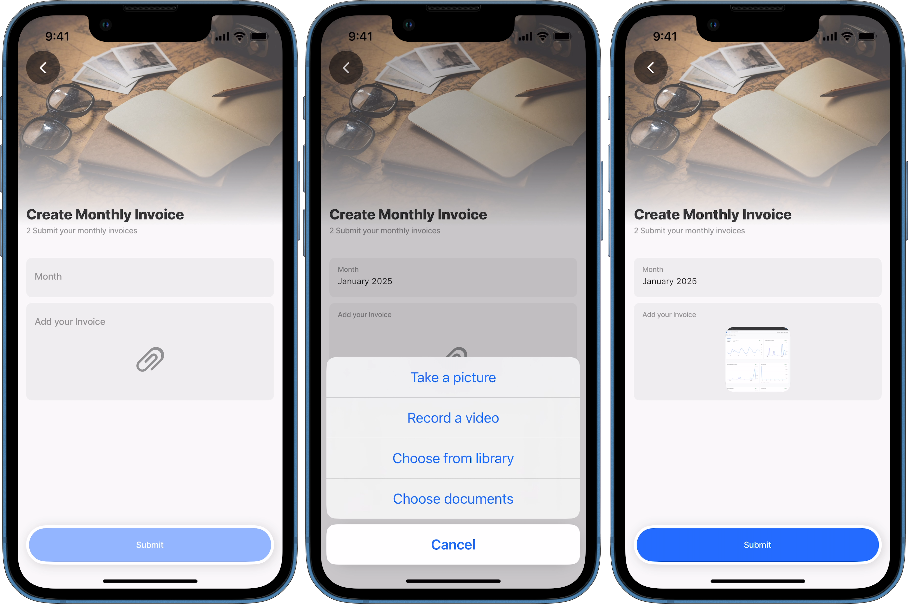

# Create a file

You can create a file in OneDrive from a solution in the Jigx App. Use the [media-field](../../Components/form/media-field.md) component in a form to upload a file or image, then use the OneDrive Data Provider, its create method. and required properties for successful file creation.

<figure><figcaption><p>Create a file in OneDrive</p></figcaption></figure>

## Properties

The following properties are required in the YAML:

* `file` - reference the physical file
* `fileName` - add the file name with the extension, e.g. Invoice.pdf
* `entity` - file path in OneDrive
* `tokenType` - OAuth token credentials name
* `method: create`

## Component

To create a file use the `media-field` component to select the file. Use the `image`, or `any` property in the `media-field` component to specify the `mediaType`.

## Considerations

* The create method does not allow you to create a file with a filename that already exists and an error will occur. To ensure the cause of the error is understood Jigx recommends you build in logic using a `modal` to show a message that the filename is already in use.
* A new file is created even when an `id` is specified.
* Using the `method: save` will create a new file if the filename does not exist, otherwise the save will function as an update method.
* A delay or time lag of several minutes could be experienced when files are syncing between the device and OneDrive.

## Code example

The code below provides an example for creating an invoice in the `myfiles` directory of OneDrive.


```yaml
title: Create Monthly Invoice
description: 2 Submit your monthly invoices
type: jig.default

header:
  type: component.jig-header
  options:
    height: medium
    children:
      type: component.image
      options:
        source:
          uri: https://builder.jigx.com/assets/images/header.jpg

children:
  - type: component.form
    instanceId: Invoices
    options:
      children:
        # reference the fileName required property as the instanceId
        - type: component.text-field
          instanceId: fileName
          options:
            label: Month
        # reference the file required property as the instanceId and use the media 
        # field to add the physical file, use any mediaType to allow files of 
        # different formats to be selected.
        - type: component.media-field
          instanceId: file
          options:
            label: Add your Invoice
            mediaType: any
actions:
  - children:
      - type: action.action-list
        options:
          title: Submit
          isSequential: true
          actions:
            - type: action.submit-form
              options:
                formId: Invoices
                provider: DATA_PROVIDER_ONEDRIVE
                entity: myfiles
                method: create
                data:
                  file: =@ctx.components.file.state.value
                  fileName: =@ctx.components.fileName.state.value
                  tokenType: jigx.graph.oauth
                onSuccess:
                  title: Successfully created
            - type: action.go-back
```


Example of a `modal` message that can be displayed when creating a file with an existing file name. The full code snippet is shown:


```yaml
title: Create Invoice
description: Create monthly invoices
type: jig.default

header:
  type: component.jig-header
  options:
    height: medium
    children:
      type: component.image
      options:
        source:
          uri: https://builder.jigx.com/assets/images/header.jpg
onFocus:
  type: action.sync-entities
  options:
    #use the OneDrive provider to sync the file metadata to the local provider
    provider: DATA_PROVIDER_ONEDRIVE
    entities:
      - entity: myfiles
        data:
          tokenType: jigx.graph.oauth

datasources:
  file-data-root:
    type: datasource.sqlite
    options:
      provider: DATA_PROVIDER_LOCAL
      entities:
        - entity: myfiles
      query: SELECT id, '$.name' FROM [myfiles] WHERE '$.name' = @fileName ORDER BY '$.name' DESC
      queryParameters:
        fileName: =@ctx.components.New-file-Name.state.value

children:
  - type: component.form
    instanceId: Invoice
    options:
      children:
        # reference the fileName required property as the instanceId
        - type: component.text-field
          instanceId: New-file-Name
          options:
            label: Month

        # reference the file required property as the instanceId and use the media 
        # field to add the physical file, use any mediaType to allow files of 
        # different formats to be selected
        - type: component.media-field
          instanceId: file
          options:
            label: Add your Invoice
            mediaType: any

actions:
  - children:
      - type: action.confirm
        options:
          title: Submit
          # check if the filename exist
          isConfirmedAutomatically: =$exists(@ctx.datasources.file-data-root.name) ? false:true
          onConfirmed:
            type: action.submit-form
            options:
              formId: Invoice
              provider: DATA_PROVIDER_ONEDRIVE
              entity: myfiles
              method: create
              data:
                file: =@ctx.components.file.state.value
                fileName: =@ctx.components.New-file-Name.state.value
                tokenType: jigx.graph.oauth
              onSuccess:
                title: Successfully created
          # show message if filename exists
          modal:
            title: File name already exists. Continuing will result in an error.
            cancel: Cancel
            confirm: Continue
```


### See also

* [Microsoft OneDrive](https://docs.jigx.com/building-apps-with-jigx/data/data-providers/microsoft-onedrive)
* [Update/Save a file](<Update_Save a file.md>)
* [Delete a file](<Delete a file.md>)
* [List files](<List files.md>)
* [Download a file](<Download a file.md>)
