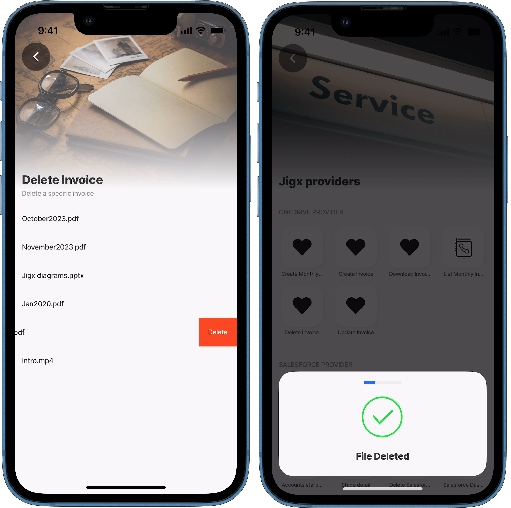

# Delete a file

You can delete existing files in OneDrive from a solution in the Jigx App. This can be used to remove incorrect files or files that are no longer required. First, you must return the files available in OneDrive, for example, in a list, select the file to be deleted by configuring a button or swipeable element, then use the OneDrive Data Provider, its delete method, and required properties.

<figure><figcaption><p>Delete file n OneDrive"</p></figcaption></figure>

## Properties

The following properties are required in the YAML:

* `entity`- file path in OneDrive
* `id` - reference the physical file by its `id`
* `tokenType` - OAuth token credentials name
* `method: delete`

## Considerations

* The path `entity` is not used in the deletion process
* Files are deleted in all folders as expected, even when the incorrect folder is specified as the delete method uses `id`
* A delay or time lag of several minutes could be experienced when files are syncing between the device and OneDrive

## Code Example

The code example below provides an example of a list of invoices in the `myfiles` directory of OneDrive. When swiping left and pressing the _Delete_ button deletes the file on OneDrive.


```yaml
title: Delete Invoice
description: Delete a specific invoice
type: jig.list

header:
  type: component.jig-header
  options:
    height: medium
    children:
      type: component.image
      options:
        source:
          uri: https://builder.jigx.com/assets/images/header.jpg

onFocus:
  type: action.sync-entities
  options:
    # reference the OneDrive provider to sync the folder meta data to the local data
    # provider.
    provider: DATA_PROVIDER_ONEDRIVE
    entities:
      - entity: myfiles
        data:
          tokenType: jigx.graph.oauth

datasources:
  file-data-myfiles:
    type: datasource.sqlite
    options:
      # store the files metadata from OneDrive using local data provider
      provider: DATA_PROVIDER_LOCAL
      # reference the path on OneDrive where the files are located
      entities:
        - myfiles
      # use the name and id to return in the list
      query: SELECT id, '$.name' as name FROM [myfiles] ORDER BY '$.name' DESC

data: =@ctx.datasources.file-data-myfiles
item:
  type: component.list-item
  instanceId: =@ctx.current.item.id
  options:
    title: =@ctx.current.item.name
    swipeable:
      left:
        - label: Delete
          color: negative
          onPress:
            type: action.confirm
            options:
              isConfirmedAutomatically: false
              onConfirmed:
                type: action.execute-entity
                options:
                  # reference the OneDrive data provider
                  provider: DATA_PROVIDER_ONEDRIVE
                  entity: myfiles
                  method: delete
                  data:
                    tokenType: jigx.graph.oauth
                    id: =@ctx.current.item.id
                  onSuccess:
                    title: File Deleted
              # confirm that file must be deleted using a modal
              modal:
                title: Are you sure you want to delete this file?
```


### See also

* [Microsoft OneDrive](https://docs.jigx.com/building-apps-with-jigx/data/data-providers/microsoft-onedrive)
* [Create a file](<Create a file.md>)
* [Update/Save a file](<Update_Save a file.md>)
* [List files](<List files.md>)
* [Download a file](<Download a file.md>)
