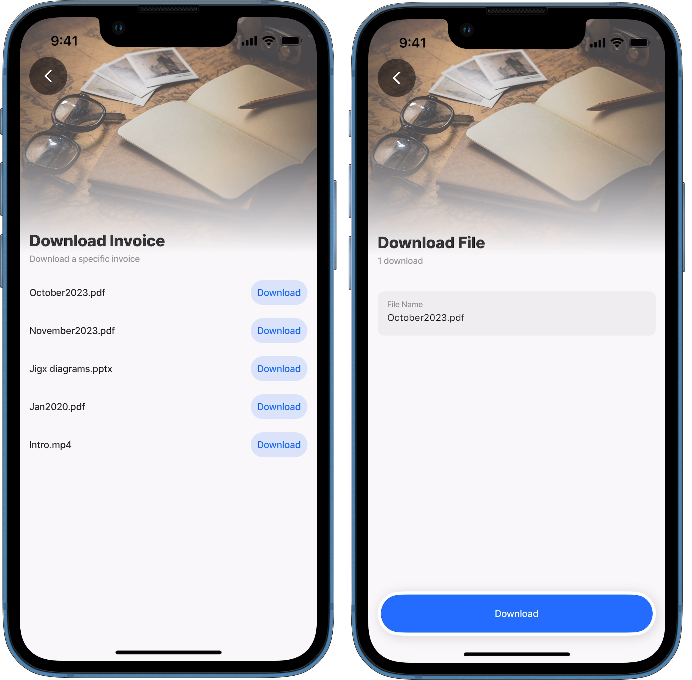

# Download a file

In a Jigx you can download a file from a specific location in OneDrive to your mobile device. This is useful when your device is offline, and you want to view the document or file. Use the OneDrive Data Provider with the download method. The file is downloaded to the mobile device's storage.

<figure><figcaption><p>Download a file from OneDrive</p></figcaption></figure>

## Device storage location

OneDrive downloads are stored in the following location depending on the device's operating system.

* **Android** - File apps/Internal Storage/Documents
* **iOS** - File apps/On My iPhone/Jigx/

## Properties

The following properties are required in the YAML to successfully download a file:

* `fileName` - Add the file name with the extension, e.g. Invoice.pdf
* `entity` - file path in OneDrive
* `tokenType` - OAuth token credentials name
* `method: download`

## Considerations

* Downloading a file that already exists in the device's storage will overwrite the existing file based on the file name.
* Downloading large files will impact the storage on the device.
* A delay or time lag of several minutes could be experienced when files are syncing between the device and OneDrive.

## Code Example

The code example below provides an example of a list of invoices in the `myfiles` directory of OneDrive. To download a file from the list to your mobile device, swipe left and press the _Download_ button.




```yaml
title: Download Invoice
description: Download a specific invoice
type: jig.list

header:
  type: component.jig-header
  options:
    height: medium
    children:
      type: component.image
      options:
        source:
          uri: https://builder.jigx.com/assets/images/header.jpg

onFocus:
  type: action.sync-entities
  options:
    # reference the OneDrive provider to sync the files metadata to the app
    # local provider.
    provider: DATA_PROVIDER_ONEDRIVE
    entities:
      - entity: myfiles
        data:
          # reference the required OneDrive tokenType property.
          tokenType: jigx.graph.oauth

datasources:
  file-data-root:
    type: datasource.sqlite
    options:
      # use the local data provider to store the OneDrive files metadata.
      provider: DATA_PROVIDER_LOCAL
      # specify the OneDrive path to the files.
      entities:
        - myfiles
      # use a query to define what metadata must be returned to the jig.
      query: SELECT id, '$.name' as name FROM [myfiles] ORDER BY name DESC

data: =@ctx.datasources.file-data-root
item:
  type: component.list-item
  options:
    title: =@ctx.current.item.name
    rightElement:
      element: button
      title: Download
      onPress:
        # go to a default jig to use the submit-form action.
        # to download the selected file.
        type: action.go-to
        options:
          linkTo: download-file
          # In the inputs use the OneDrive required properties.
          # of the selected file from the list to pass to the default jig.
          inputs:
            fileName: =@ctx.current.item.name
            id: =@ctx.current.item.id
            entity: myfiles
```





```yaml
title: Download File
description: 1 download
type: jig.default

header:
  type: component.jig-header
  options:
    children:
      options:
        source:
          uri: https://builder.jigx.com/assets/images/header.jpg
      type: component.image
    height: medium

children:
  - type: component.form
    instanceId: fileDownload
    options:
      children:
        - type: component.text-field
          instanceId: fileName
          options:
            label: File Name
            initialValue: =@ctx.jig.inputs.fileName
        - type: component.text-field
          instanceId: id
          options:
            initialValue: =@ctx.jig.inputs.id
            isHidden: true
            label: id

actions:
  - children:
      - type: action.submit-form
        options:
          provider: DATA_PROVIDER_ONEDRIVE
          entity: myfiles
          data:
            fileName: =@ctx.components.fileName.state.value
            tokenType: jigx.graph.oauth
            id: =@ctx.components.id.state.value
          title: Download
          formId: fileDownload
          goBack: previous
          method: download
```




### See also

* [Microsoft OneDrive](https://docs.jigx.com/microsoft-onedrive)
* [Create a file](<Create a file.md>)
* [Update/Save a file](<Update_Save a file.md>)
* [Delete a file](<Delete a file.md>)
* [List files](<List files.md>)
