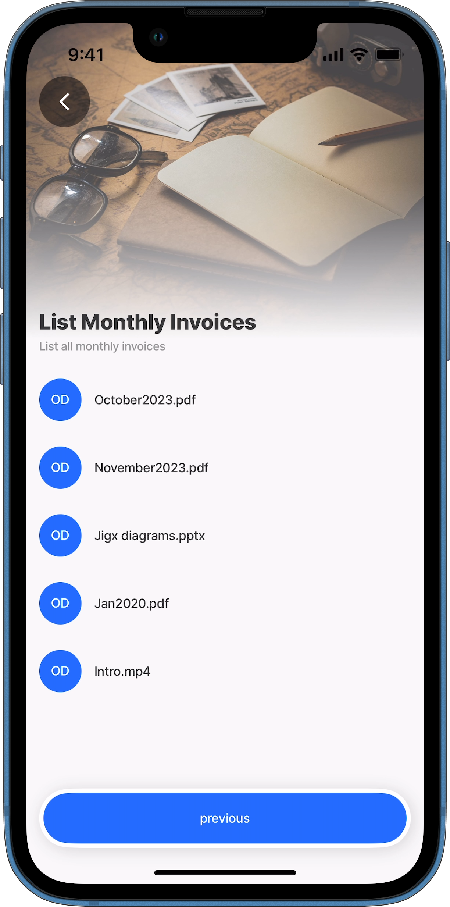

# List files

Often there is a requirement to list files or get one specific file from OneDrive and then interact with that file(s), whether for viewing, updating, deleting, or even downloading. The file's details are pulled to the device using the local data provider, after which you can work with the file, showing it in a list.

<figure><figcaption><p>List OneDrive files</p></figcaption></figure>

## Properties

The following properties are required in the YAML:

* `entity` - path in OneDrive
* `tokenType` - OAuth token credentials name

## Component

There are a number of elements that can be used to display the file(s), for example, `component.list`, `component.form` with a dropdown, or `jig.list`.

## Considerations

* Getting or listing files from OneDrive does not download the file it just displays the details of the file from the path (`entity`) specified
* All files in a OneDrive directory can be listed and some directories may have many files. Consider the amount of items you want returned when creating the query for the local data provider.
* A delay or time lag of several minutes could be experienced when files are syncing between the device and OneDrive

## Code Example

The code example below provides an example of a list of invoices in the `myfiles` directory of OneDrive.


```yaml
title: List Monthly Invoices
description: List all monthly invoices
type: jig.list
icon: contact

header:
  type: component.jig-header
  options:
    height: medium
    children:
      type: component.image
      options:
        source:
          uri: https://builder.jigx.com/assets/images/header.jpg

# Connection to OneDrive files in myfiles directory
onFocus:
  type: action.sync-entities
  options:
    provider: DATA_PROVIDER_ONEDRIVE
    entities:
      - entity: myfiles
        data:
          tokenType: jigx.graph.oauth
# Hold the OneDrive file details on local device
datasources:
  file-data-myfiles:
    type: datasource.sqlite
    options:
      provider: DATA_PROVIDER_LOCAL
      entities:
        - myfiles
      query: SELECT id, '$.name' as name FROM [myfiles] ORDER BY '$.name' DESC

data: =@ctx.datasources.file-data-myfiles
item:
  type: component.list-item
  options:
    leftElement:
      element: avatar
      text: OD
    title: =@ctx.current.item.name

actions:
  - children:
      - type: action.go-back
        options:
          title: previous
```


### See also

* [Microsoft OneDrive](https://docs.jigx.com/building-apps-with-jigx/data/data-providers/microsoft-onedrive)
* [Create a file](<Create a file.md>)
* [Update/Save a file](<Update_Save a file.md>)
* [Delete a file](<Delete a file.md>)
* [Download a file](<Download a file.md>)
