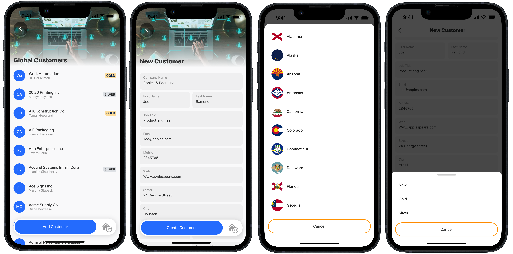

# Create customer (POST)

### Scenario

Press the _Add Customer_ button in the customer list to create a customer. Complete the new customer form and press the _Create_ button.

<figure><figcaption><p>Add new customer</p></figcaption></figure>

### How does this work

A function to call the REST API's POST operation is configured, allowing the record to be created in the backend. The function is referenced in the `execute-entity` action on the form. The customer is created using the REST data provider with a create method which creates the record in the local data provider with a temp\_id, calling the rest-create-customer function and providing the parameters for the data values to be created in the REST service. Specifying the id in the `ouputTransform` in the function enables the local data provider temp\_id to be automatically updated with the REST id once it is created in the datastore.


This code sample builds upon the previous [List customers (GET)](<List customers _GET_.md>) step, to develop a complete and functional solution.


### REST API

<table><thead><tr><th width="162.53515625">REST</th><th>Detail</th></tr></thead><tbody><tr><td>URL</td><td>https://[your_rest_service]/api/customers</td></tr><tr><td>URL</td><td>https://[your_rest_service]/api/us_states (To get a list of states for selection in the form)</td></tr><tr><td>Operation/Method</td><td>POST</td></tr></tbody></table>

### Function

The REST APIs POST operator is used in a Jigx function with body parameters to specify the exact columns to be created for the record. The `inputTransform` specifies how the data should be structured or formatted when being sent to the REST service. This transformation process ensures that the data adheres to the expected schema or format required by the REST service for processing the request. In the `outputTransform` the id and status are configured to ensure that the properties are automatically returned once the record is created and the local provider's temp\_id is updated with the actual id and status.

Making the form completion easier the REST API GET opertaion is used on the us\_states table to return the state name, region and abbreviation in the dropdown field.



```yaml
provider: DATA_PROVIDER_REST
# Creates new record in the backend.
method: POST 
# Use your REST service URL. 
url: https://[your_rest_service]/api/customers 
# Direct the function call to use local execution between the device 
# and the REST service.
useLocalCall: true 
parameters:
  accessToken:
    location: header
    required: true
    type: string
    # Use manage.jigx.com to define credentials for your solution.
  firstName:
    value: service.oauth 
    type: string
    location: body
    required: true
  lastName:
    type: string
    location: body
    required: true
  companyName:
    type: string
    location: body
    required: true
  address:
    type: string
    location: body
    required: false
  city:
    type: string
    location: body
    required: false
  state:
    type: string
    location: body
    required: false
  zip:
    type: string
    location: body
    required: false
  phone1:
    type: string
    location: body
    required: false
  phone2:
    type: string
    location: body
    required: false
  email:
    type: string
    location: body
    required: false
  web:
    type: string
    location: body
    required: false
  region:
    type: string
    location: body
    required: false
  customerType:
    type: string
    location: body
    required: false
  jobTitle:
    type: string
    location: body
    required: false
# Define the customer data to be created in the record in the REST service.       
inputTransform: |
  {
    "firstName": firstName,
    "lastName": lastName,
    "companyName": companyName,
    "address": address,
    "city": city,
    "state": state, 
    "zip": zip,
    "phone1": phone1,
    "phone2": phone2,
    "email": email,
    "web": web,
    "region": region,
    "customerType": customerType,
    "jobTitle": jobTitle
  }
# Specifiying an outputTransform for the ID ensure that the ID and status 
# created by the REST API is automatically synced back to the Jigx local 
# datasource replacing the temp ID.  
outputTransform: |
  {
    "id": custId,
    "status": status
  }
```



```yaml
provider: DATA_PROVIDER_REST
method: GET
# Use your REST service URL.
url: https://[your_rest_service]/api/us_states  
forRowsWithMatchingIds: true
# Direct the function call to use local execution between the
# device and the REST service.
useLocalCall: true 

parameters:
  parameters:
  accessToken:
    location: header
    required: true
    type: string
    # Use manage.jigx.com to define credentials for your solution.
    value: service.oauth 
# $ returns all records from the REST service.
outputTransform: |
  $
```



### Action (global)

Create a load-data.jigx file under the actions folder. This file is configured with an action that syncs the data from the REST service, by calling the function, to the local Sqlite table. The action file is referenced in the index.jigx file to load the data when the app is opened or is in focus on the device.


```yaml
# The sync-entities action is used to get the data from the REST data 
# provider using the function.The global action can be referenced throughout
# the solution for effieicency and performance.The data is synced from the 
# REST data provider to a local data provider on the device.
action: 
  type: action.sync-entities
  options:
    provider: DATA_PROVIDER_REST
    entities:
      - entity: us-states
        function: rest-get-usStates  
```


### Datasource

Add a file under the datasource folder to configure the local data provider with the data to return from the us-states table.


```yaml
# Define a global datasource for the local data provider containing
# the State data synced from the REST service with the global action. 
type: datasource.sqlite
options:
  provider: DATA_PROVIDER_LOCAL
  entities:
    - entity: us-states
  query: |
    SELECT 
      id, 
      '$.state', 
      '$.abbreviation',
      '$.stateCapital',
      '$.region',
      '$.flag'
    FROM 
      [us-states]
    ORDER BY
      '$.state'
```


### Jig (screen)

* On the list of customers jig configure a `go-to` action that adds the _Add Customer_ button to the list and links to the create-customer jig.
* In a default jig add a local data provider datasource with a query to get the us\_states data. Add a query parameter to set the state of the region field once the state field is selected.
* Add a form component to capture the customer details with each field's instanceId containing the same name as the body parameters in the function.
* For the state field configure a dropdrown with an expression to get the list of states for selection.
* For the region use an expression that uses the datasource `queryParameters` value. This allows the region to auto populate on the form on the state is selected in the dropdown.
* Add an `execute-entity` action to call the function that will create the customer record in the local table (using `method: create`) and in the REST service (`function: rest-create-customer`). Use an expression to specify the value for each of the function's parameters. The `parameters` create the record in the REST service, while the `data` property creates the record in the local database.



```yaml
title: New Customer
type: jig.default
icon: global-collaboration-handshake

header:
  type: component.jig-header
  options:
    height: small
    children:
      type: component.image
      options:
        source:
          uri: https://www.dropbox.com/scl/fi/ha9zh6wnixblrbubrfg3e/business-5475661_640.jpg?rlkey=anemjh5c9qsspvzt5ri0i9hva&raw=1
# add the reset-state to clear the data in the form for the state dropdown.
onFocus: 
  type: action.reset-state
  options:
    state: =@ctx.jig.components.customerForm.state.data
# Define the data to use in the jig, the data has been synced by the global
# action to the local data provider from the REST Service.    
datasources:
  region:
    type: datasource.sqlite
    options:
      provider: DATA_PROVIDER_LOCAL
      entities:
        - entity: us-states
      query: |
        SELECT 
          uss.id AS id, 
          json_extract(uss.data, '$.state') AS state, 
          json_extract(uss.data, '$.abbreviation') AS abbreviation,
          json_extract(uss.data, '$.stateCapital') AS stateCapital,
          json_extract(uss.data, '$.region') AS region,
          json_extract(uss.data, '$.flag') AS flag
        FROM 
          [us-states] AS uss
        WHERE  
          json_extract(uss.data, '$.abbreviation') = @selectedState        
      queryParameters:
        selectedState: =@ctx.components.usState.state.value
# Use static datasource as the data is predefined and will not change.
  customerType:
    type: datasource.static
    options:
      data:
        - id: 1
          type: New
          value: new
        - id: 2
          type: Gold
          value: Gold
        - id: 3
          type: Silver
          value: Silver
children:
  - type: component.form
    instanceId: customerForm
    options:
      isDiscardChangesAlertEnabled: false
      children:
        - type: component.text-field
          instanceId: companyName
          options:
            label: Company Name
        - type: component.field-row
          options:
            children:
              - type: component.text-field
                instanceId: firstName
                options:
                  label: First Name
              - type: component.text-field
                instanceId: lastName
                options: 
                  label: Last Name
        - type: component.text-field
          instanceId: jobTitle
          options:
            label: Job Title
        - type: component.text-field
          instanceId: email
          options:
            label: Email
        - type: component.text-field
          instanceId: phone1
          options:
            label: Mobile
        - type: component.text-field
          instanceId: web
          options:
            label: Web
        - type: component.text-field
          instanceId: address
          options:
            label: Street
        - type: component.text-field
          instanceId: city
          options:
            label: City
        - type: component.field-row
          options:
            children:
              - type: component.dropdown
                instanceId: usState
                options:
                  label: State
                  data: =@ctx.datasources.us-states
                  item:
                    type: component.dropdown-item
                    options:
                      title: =@ctx.current.item.state
                      value: =@ctx.current.item.abbreviation
                      leftElement: 
                        element: avatar
                        text: =@ctx.current.item.abbreviation
                        uri: =@ctx.current.item.flag
              - type: component.text-field
                instanceId: zip
                options:
                  label: ZIP
        - type: component.field-row
          options:
            children:
              - type: component.text-field
                instanceId: region
                options:
                  label: Region
                  value: =@ctx.datasources.region.region
              - type: component.dropdown
                instanceId: customerType
                options:
                  label: Customer Type
                  data: =@ctx.datasources.customerType
                  item:
                    type: component.dropdown-item
                    options:
                      title: =@ctx.current.item.type
                      value: =@ctx.current.item.value

actions:
  - children:
        # Action to create the record.
      - type: action.execute-entity 
        options:
          title: Create Customer
          provider: DATA_PROVIDER_REST
          entity: customers
          # Create the record in the local SQLite table.
          method: create  
          # Create the record in the REST service.
          function: rest-create-customer 
          # Define the record's data to be updated in the REST service. 
          parameters: 
            firstName: =@ctx.components.firstName.state.value
            lastName: =@ctx.components.lastName.state.value
            companyName: =@ctx.components.companyName.state.value
            address: =@ctx.components.address.state.value
            city: =@ctx.components.city.state.value
            customerType: =@ctx.components.customerType.state.value
            email: =$lowercase(@ctx.components.email.state.value)
            jobTitle: =@ctx.components.jobTitle.state.value
            phone1: =@ctx.components.phone1.state.value
            phone2: =@ctx.components.phone1.state.value
            region: =@ctx.components.region.state.value
            state: =@ctx.components.usState.state.value
            web: =$lowercase(@ctx.components.web.state.value)
            zip: =@ctx.components.zip.state.value
          # Define the record's data to be updated in the local SQLite table.  
          data: 
            firstName: =@ctx.components.firstName.state.value
            lastName: =@ctx.components.lastName.state.value
            companyName: =@ctx.components.companyName.state.value
            address: =@ctx.components.address.state.value
            city: =@ctx.components.city.state.value
            customerType: =@ctx.components.customerType.state.value
            email: =$lowercase(@ctx.components.email.state.value)
            jobTitle: =@ctx.components.jobTitle.state.value
            phone1: =@ctx.components.phone1.state.value
            phone2: =@ctx.components.phone1.state.value
            region: =@ctx.components.region.state.value
            state: =@ctx.components.usState.state.value
            zip: =@ctx.components.zip.state.value          
          onSuccess: 
            type: action.go-back 
```



```yaml
title: Global Customers
type: jig.list
icon: global-accelerator

header:
  type: component.jig-header
  options:
    height: small
    children:
      type: component.image
      options:
        source:
          uri: https://www.dropbox.com/scl/fi/ha9zh6wnixblrbubrfg3e/business-5475661_640.jpg?rlkey=anemjh5c9qsspvzt5ri0i9hva&raw=1
#Define the data to use in the jig, the data has been synced by the global action to the local data provider from the REST Service    
datasources:
  customers: 
    type: datasource.sqlite
    options:
      provider: DATA_PROVIDER_LOCAL
      entities:
        - entity: customers
      query: |
        SELECT 
          cus.id AS id, 
          json_extract(cus.data, '$.firstName') AS firstName, 
          json_extract(cus.data, '$.lastName') AS lastName,
          json_extract(cus.data, '$.companyName') AS companyName,
          json_extract(cus.data, '$.address') AS address,
          json_extract(cus.data, '$.city') AS city,
          json_extract(cus.data, '$.state') AS state,
          json_extract(cus.data, '$.zip') AS zip,
          json_extract(cus.data, '$.phone1') AS phone1,
          json_extract(cus.data, '$.phone2') AS phone2,
          json_extract(cus.data, '$.email') AS email,
          json_extract(cus.data, '$.web') AS web,
          json_extract(cus.data, '$.customerType') AS customerType,
          json_extract(cus.data, '$.jobTitle') AS jobTitle,
          json_extract(cus.data, '$.logo') AS logo
        FROM 
          [customers] AS cus
        -- ORDER BY 
        --  json_extract(cus.data, '$.companyName')

data: =@ctx.datasources.customers
item:
  type: component.list-item
  options:
    title: =@ctx.current.item.companyName
    subtitle: =@ctx.current.item.firstName & ' ' & @ctx.current.item.lastName
    leftElement: 
      element: avatar
      text: =@ctx.current.item.state
      uri: =@ctx.current.item.logo
    label:
      title: =$uppercase((@ctx.current.item.customerType = 'Silver' ? @ctx.current.item.customerType:@ctx.current.item.customerType = 'Gold' ? @ctx.current.item.customerType:''))
      color:
        - when: =@ctx.current.item.customerType = 'Gold'
          color: color3
        - when: =@ctx.current.item.customerType = 'Silver'
          color: color14
    swipeable:
      left:
        - label: DELETE
          icon: delete-2
          color: negative
          onPress: 
            type: action.confirm
            options:
              isConfirmedAutomatically: false
              onConfirmed: 
                # Action to execute the delete.
                type: action.execute-entity 
                options:
                  # Use the REST data provider to call the delete function.                  
                  provider: DATA_PROVIDER_REST
                  entity: customers
                  # Delete the record from the local SQLite table.
                  method: delete 
                  goBack: stay
                  # Delete the record from the REST service
                  function: rest-delete-customer 
                  # Delete the record from the REST service using the custId.                 
                  parameters:
                    custId: =$number(@ctx.current.item.id) #id of customer record to be deleted in REST service                 
                  # Delete the record from the local SQLite table.
                  data:  
                    id: =@ctx.current.item.id #id of customer to be deleted from local data provider
              modal:
                title: Are you sure?
                description: =('Press Confirm to permanently delete ' & @ctx.current.item.companyName)
# Add an action which adds a button to the bottom of the jig
# to go to the new customer form (jig)
actions:
  - children:
      - type: action.go-to
        options:
          title: Add Customer
          linkTo: new-customer
```



### Index

For performance and offline support the data is synced from the REST service as soon as the app is opened or receives focus. This is achieved by calling the global action in the `OnFocus` and `onLoad` events.


```yaml
name: hello-rest-example
title: Hello REST Solution
category: sales
# onFocus is triggered whenever the jig is displayed. 
# The sync-entities action in the global action calls the Jigx REST function
# and populates the local SQLite tables on the device with the data returned 
# from REST service.
onFocus: 
  type: action.execute-action
  options:
    action: load-data
# onLoad is triggered when the solution is loaded on the device. 
# The sync-entities action in the global action calls the Jigx REST function
# and populates the local SQLite tables on the device with the data returned 
# from REST service.        
onLoad: 
  type: action.execute-action
  options:
    action: load-data
    
tabs:
  home:
    jigId: list-customers
    icon: home-apps-logo
```

