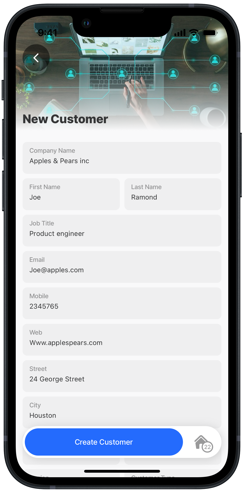

# Update customer details (PUT)

### Scenario



Add the ability to update a customer's details by pressing on the customer in the [list of customers](<List customers _GET_.md>) which loads that specific customer's details in a form. You can edit the fields and press the _Update Customer_ button.



<figure><figcaption><p>Update customer</p></figcaption></figure>



### How does this work

The customer details are loaded using the customer id as the `inputs` from the list-customer jig. An update function to call the REST APIs PUT operation is configured. The function and function parameters are referenced in the `execute-entity` action in the jig, which will update the customer's details when the _Update Customer_ button is pressed on the form. A Post operation is performed in the REST service.


This code sample builds upon the previous [List customers (GET)](<List customers _GET_.md>) step, to develop a complete and functional solution.


### REST API

<table><thead><tr><th width="177.6328125">REST</th><th>Detail</th></tr></thead><tbody><tr><td>URL</td><td>https://[your_rest_service]/api/customers</td></tr><tr><td>Operation/Method</td><td>PUT</td></tr></tbody></table>

### Function

The REST APIs PUT operator is used in a Jigx function with body parameters to specify the exact columns to be updated for the record. The `inputTransform` specifies how the data should be structured or formatted when being sent to the REST service. This transformation process ensures that the data adheres to the expected schema or format required by the REST service for processing the request.


```yaml
provider: DATA_PROVIDER_REST
# Updates data in the REST Service.
method: PUT 
# Use your REST service URL. 
url: https://[your_rest_service]/api/customers 
# Direct the function call to use local execution between the mobile device 
# and the REST service.
useLocalCall: true 
format: text

parameters:
  accessToken:
    location: header
    required: true
    type: string
    # Use manage.jigx.com to define credentials for your solution.
    value: service.oauth 

  id:
    type: int
    location: body
    required: true
  firstName:
    type: string
    location: body
    required: true
  lastName:
    type: string
    location: body
    required: true
  companyName:
    type: string
    location: body
    required: true
  address:
    type: string
    location: body
    required: false
  city:
    type: string
    location: body
    required: false
  state:
    type: string
    location: body
    required: false
  zip:
    type: string
    location: body
    required: false
  phone1:
    type: string
    location: body
    required: false
  phone2:
    type: string
    location: body
    required: false
  email:
    type: string
    location: body
    required: false
  web:
    type: string
    location: body
    required: false
  region:
    type: string
    location: body
    required: false
  customerType:
    type: string
    location: body
    required: false
  jobTitle:
    type: string
    location: body
    required: false
#Define the customer data that must be updated 
# in the record in the REST Service.  
inputTransform: |
  {
    "custId": id,
    "firstName": firstName,
    "lastName": lastName,
    "companyName": companyName,
    "address": address,
    "city": city,
    "state": state, 
    "zip": zip,
    "phone1": phone1,
    "phone2": phone2,
    "email": email,
    "web": web,
    "region": region,
    "customerType": customerType,
    "jobTitle": jobTitle
  }
```


### Action (global)

Create a load-data.jigx file under the actions folder. This file is configured with an action that syncs the data from the REST service, by calling the function, to the local Sqlite table. The action file is referenced in the index.jigx file to load the data when the app is opened or is in focus on the device.


```yaml
# The sync-entities action is used to get the data from the REST data
# provider using the function. The global action can be referenced throughout
# the solution for effieicency and performance.The data is synced from the 
#REST data provider to a local data provider on the device.
action: 
  type: action.sync-entities
  options:
    provider: DATA_PROVIDER_REST
    entities:
      - entity: customers
        function: rest-get-customers
      - entity: us-states
        function: rest-get-usStates  
        
```


### Jig (screen)

* On the list of customers jig configure an `on-press` action in the `swipable: left` event that adds the _View_ button to the list and links to the update-customer jig.
* Add a form component to load the customer details with each field's instanceId containing the same name as the body parameters in the function.
* For the state field configure a dropdrown with an expression to get the list of states for selection.
* Configure an `initialValue` property for each field in the form using an expression to return the customer data for that field.
* Add an `execute-entity` action to call the function that will update the customer record in the local table (using `method: update`) and in the REST service (`function: rest-update-customer`). Use an expression to specify the value for each of the function's parameters. Note that the customer id already exists and the expression for `id:` uses the `inputs` again to specifiy the customer record that must be updated. The `parameters` updates the record in the REST service, while the `data` property updates the record in the local database.



```yaml
title: Update Customer
type: jig.default

header:
  type: component.jig-header
  options:
    height: small
    children:
      type: component.image
      options:
        source:
          uri: https://www.dropbox.com/scl/fi/ha9zh6wnixblrbubrfg3e/business-5475661_640.jpg?rlkey=anemjh5c9qsspvzt5ri0i9hva&raw=1

datasources:
  # Use static datasource as the data is predefined and will not change.
  region:
    type: datasource.static
    options:
      data:
        - id: 1
          region: US Central
        - id: 2
          region: US East
        - id: 3
          region: US West
  customerType:
    type: datasource.static
    options:
      data:
        - id: 1
          type: New
          value:
        - id: 2
          type: Gold
          value: Gold
        - id: 3
          type: Silver
          value: Silver
  # Define the data to use in the jig, the data has been synced by the 
  # global action to the local data provider from the REST Service.
  customers: 
    type: datasource.sqlite
    options:
      provider: DATA_PROVIDER_LOCAL
      entities:
        - entity: customers
      query: |
        SELECT 
          cus.id AS id, 
          json_extract(cus.data, '$.firstName') AS firstName, 
          json_extract(cus.data, '$.lastName') AS lastName,
          json_extract(cus.data, '$.companyName') AS companyName,
          json_extract(cus.data, '$.address') AS address,
          json_extract(cus.data, '$.city') AS city,
          json_extract(cus.data, '$.state') AS state,
          json_extract(cus.data, '$.zip') AS zip,
          json_extract(cus.data, '$.phone1') AS phone1,
          json_extract(cus.data, '$.phone2') AS phone2,
          json_extract(cus.data, '$.email') AS email,
          json_extract(cus.data, '$.web') AS web,
          json_extract(cus.data, '$.customerType') AS customerType,
          json_extract(cus.data, '$.jobTitle') AS jobTitle,
          json_extract(cus.data, '$.region') AS region
        FROM 
          [customers] AS cus
        WHERE id = @custId      
      queryParameters:
        custId: =@ctx.jig.inputs.customer.id
        
children:
  - type: component.form
    instanceId: customer
    options:
      isDiscardChangesAlertEnabled: false
      children:
        - type: component.text-field
          instanceId: companyName
          options:
            label: Company Name
            initialValue: =@ctx.datasources.customers.companyName
        - type: component.field-row
          options:
            children:
              - type: component.text-field
                instanceId: firstName
                options:
                  label: First Name
                  initialValue: =@ctx.datasources.customers.firstName
              - type: component.text-field
                instanceId: lastName
                options: 
                  label: Last Name
                  initialValue: =@ctx.datasources.customers.lastName
        - type: component.text-field
          instanceId: jobTitle
          options:
            label: Job Title
            initialValue: =@ctx.datasources.customers.jobTitle
        - type: component.text-field
          instanceId: email
          options:
            label: Email
            initialValue: =@ctx.datasources.customers.email
        - type: component.text-field
          instanceId: phone1
          options:
            label: Mobile
            initialValue: =@ctx.datasources.customers.phone1
        - type: component.text-field
          instanceId: web
          options:
            label: Web
            initialValue: =@ctx.datasources.customers.web
        - type: component.text-field
          instanceId: address
          options:
            label: Street
            initialValue: =@ctx.datasources.customers.address
        - type: component.text-field
          instanceId: city
          options:
            label: City
            initialValue: =@ctx.datasources.customers.city
        - type: component.field-row
          options:
            children:
            - type: component.text-field
              instanceId: state
              options:
                label: State
                initialValue: =@ctx.datasources.customers.state
            - type: component.text-field
              instanceId: zip
              options:
                label: ZIP
                initialValue: =@ctx.datasources.customers.zip
        - type: component.field-row
          options:
            children:
              - type: component.dropdown
                instanceId: region
                options:
                  label: Region
                  data: =@ctx.datasources.region
                  initialValue: =@ctx.datasources.customers.region
                  item:
                    type: component.dropdown-item
                    options:
                      title: =@ctx.current.item.region
                      value: =@ctx.current.item.region
              - type: component.dropdown
                instanceId: customerType
                options:
                  label: Customer Type
                  data: =@ctx.datasources.customerType
                  initialValue: =@ctx.datasources.customers.customerType
                  item:
                    type: component.dropdown-item
                    options:
                      title: =@ctx.current.item.type
                      value: =@ctx.current.item.value

actions:
  - children:
        # Action to update the record.
      - type: action.execute-entity 
        options:
          title: Update Customer
          provider: DATA_PROVIDER_REST
          entity: customers
          # Update the record in the local SQLite table.
          method: update 
          # Update the record in the REST service. 
          function: rest-update-customer
          # Define the record's data to be updated in the REST service.  
          parameters: 
            id: =@ctx.jig.inputs.customer.id
            firstName: =@ctx.components.firstName.state.value
            lastName: =@ctx.components.lastName.state.value
            companyName: =@ctx.components.companyName.state.value
            address: =@ctx.components.address.state.value
            city: =@ctx.components.city.state.value
            customerType: =@ctx.components.customerType.state.value
            email: =$lowercase(@ctx.components.email.state.value)
            jobTitle: =@ctx.components.jobTitle.state.value
            phone1: =@ctx.components.phone1.state.value
            phone2: =@ctx.components.phone1.state.value
            region: =@ctx.components.region.state.value
            state: =@ctx.components.state.state.value
            web: =$lowercase(@ctx.components.web.state.value)
            zip: =@ctx.components.zip.state.value
          # Define the record's data to be updated in the local SQLite table.    
          data:
            id: =@ctx.jig.inputs.customer.id
            firstName: =@ctx.components.firstName.state.value
            lastName: =@ctx.components.lastName.state.value
            companyName: =@ctx.components.companyName.state.value
            address: =@ctx.components.address.state.value
            city: =@ctx.components.city.state.value
            customerType: =@ctx.components.customerType.state.value
            email: =$lowercase(@ctx.components.email.state.value)
            jobTitle: =@ctx.components.jobTitle.state.value
            phone1: =@ctx.components.phone1.state.value
            phone2: =@ctx.components.phone1.state.value
            region: =@ctx.components.region.state.value
            state: =@ctx.components.state.state.value
            web: =$lowercase(@ctx.components.web.state.value)
            zip: =@ctx.components.zip.state.value            
          onSuccess: 
            type: action.go-back
```



```yaml
title: Global Customers
type: jig.list
icon: global-accelerator

header:
  type: component.jig-header
  options:
    height: small
    children:
      type: component.image
      options:
        source:
          uri: https://www.dropbox.com/scl/fi/ha9zh6wnixblrbubrfg3e/business-5475661_640.jpg?rlkey=anemjh5c9qsspvzt5ri0i9hva&raw=1

# Specify the local datasource.
datasources:
  customers: 
    type: datasource.sqlite
    options:
      provider: DATA_PROVIDER_LOCAL
      entities:
        - entity: customers
      query: |
        SELECT 
          cus.id AS id, 
          json_extract(cus.data, '$.firstName') AS firstName, 
          json_extract(cus.data, '$.lastName') AS lastName,
          json_extract(cus.data, '$.companyName') AS companyName,
          json_extract(cus.data, '$.address') AS address,
          json_extract(cus.data, '$.city') AS city,
          json_extract(cus.data, '$.state') AS state,
          json_extract(cus.data, '$.zip') AS zip,
          json_extract(cus.data, '$.phone1') AS phone1,
          json_extract(cus.data, '$.phone2') AS phone2,
          json_extract(cus.data, '$.email') AS email,
          json_extract(cus.data, '$.web') AS web,
          json_extract(cus.data, '$.customerType') AS customerType,
          json_extract(cus.data, '$.jobTitle') AS jobTitle,
          json_extract(cus.data, '$.logo') AS logo
        FROM 
          [customers] AS cus
        -- ORDER BY 
        --  json_extract(cus.data, '$.companyName')

data: =@ctx.datasources.customers
item:
  type: component.list-item
  options:
    title: =@ctx.current.item.companyName
    subtitle: =@ctx.current.item.firstName & ' ' & @ctx.current.item.lastName
    leftElement: 
      element: avatar
      text: =@ctx.current.item.state
      uri: =@ctx.current.item.logo
    label:
      title: =$uppercase((@ctx.current.item.customerType = 'Silver' ? @ctx.current.item.customerType:@ctx.current.item.customerType = 'Gold' ? @ctx.current.item.customerType:''))
      color:
        - when: =@ctx.current.item.customerType = 'Gold'
          color: color3
        - when: =@ctx.current.item.customerType = 'Silver'
          color: color14
    # Add the onPress event to the customer - list to 
    # view & update customer details.        
    onPress: 
      type: action.go-to
      options:
        linkTo: update-customer
        inputs:
          customer: =@ctx.current.item
    # Add the swipeable event to the customer - list to delete customer            
    swipeable:
      left:
        - label: DELETE
          icon: delete-2
          color: negative
          onPress: 
            type: action.confirm
            options:
              isConfirmedAutomatically: false
              onConfirmed: 
                # Action to execute the delete.            
                type: action.execute-entity 
                options:
                  # Use the REST data provider to call the delete function.                  
                  provider: DATA_PROVIDER_REST
                  entity: customers
                  # Delete the record from the local SQLite table. 
                  method: delete 
                  goBack: stay
                  # Delete the record from the REST service.
                  function: rest-delete-customer 
                  # Specifiy the function parameters required by the 
                  # function to delete the customer, in this example custId.                 
                  parameters:
                    # id of customer record to be deleted in REST service. 
                    custId: =$number(@ctx.current.item.id)                 
                  data:  
                    # id of customer to be deleted from local data provider.
                    id: =@ctx.current.item.id 
                title: Are you sure?
                description: =('Press Confirm to permanently delete ' & @ctx.current.item.companyName)
```



### Index

For performance and offline support the data is synced from the REST service as soon as the app is opened or receives focus. This is achieved by calling the global action in the `OnFocus` and `onLoad` events.


```yaml
name: hello-rest-example
title: Hello REST Solution
category: sales
# onFocus is triggered whenever the jig is displayed. 
# The sync-entities action in the global action calls the Jigx REST
# function and populates the local SQLite tables on the device
# with the data returned from REST service.
onFocus: 
  type: action.execute-action
  options:
    action: load-data
# onLoad is triggered when the solution is loaded on the device.
# The sync-entities action in the global action calls the Jigx REST function
# and populates the local SQLite tables on the device with the data returned 
# from REST service.        
onLoad: 
  type: action.execute-action
  options:
    action: load-data
    
tabs:
  home:
    jigId: list-customers
    icon: home-apps-logo
```

