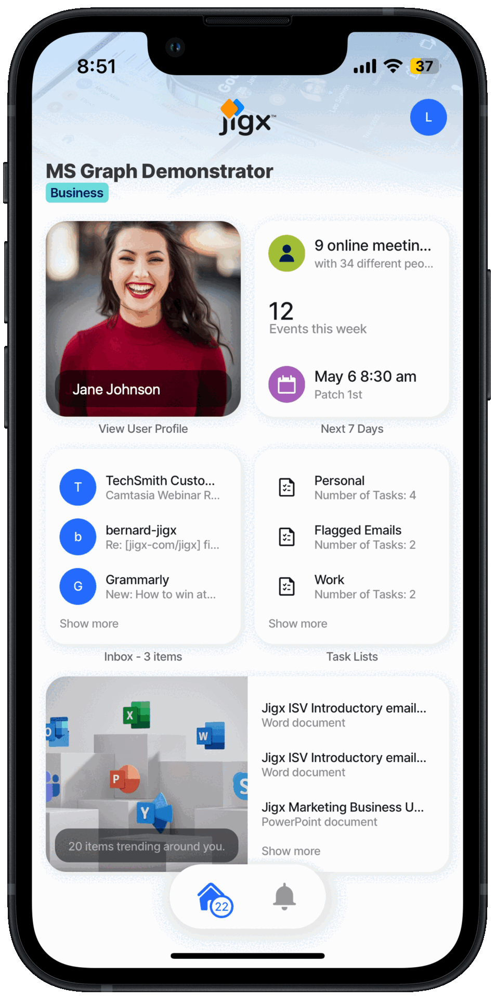

# MS Graph



The [MS Graph](https://docs.jigx.com/microsoft-graph-oauth) examples below use the User, Calendar, Mail, Insights, and To-do tasks resource types to create a powerful Jigx apps with everything you need in one app. The REST data provider requires you to [configure OAuth for MS Graph](https://docs.jigx.com/configuring-oauth-for-ms-graph) and the accessToken is used in the Jigx function.



<figure><figcaption></figcaption></figure>




When using the code and samples in this topic, remember that they are designed to function as part of a comprehensive solution. To fully benefit from the intended functionality and ensure compatibility, it is recommended that you use the entire solution rather than selecting individual components in isolation. Alternatively, you can use these samples as a guide to understand the underlying concepts and MS Graph API, which can help you integrate similar solutions into your projects more effectively. The entire MS Graph solution is available on [GitHub](https://github.com/jigx-com/jigx-samples/tree/main/quickstart/jigx-MS-Graph-demonstrator).


The following examples and code snippets are provided:

<table data-header-hidden><thead><tr><th width="198.59375"></th><th></th></tr></thead><tbody><tr><td><a href="MS Graph/Graph User Profile.md">Graph User Profile</a></td><td>Provides sample code to get a user's profile information from Microsoft Graph. It includes a <a href="MS Graph/Graph User Profile/Update Profile Photo.md">code sample</a> for updating a user's profile picture in Microsoft Graph.</td></tr><tr><td><a href="MS Graph/Graph Calendar.md">Graph Calendar</a></td><td>Provides sample code to get a list of the user's calendars and renders a calendar in a schedule view on a jig. It includes a code sample on adding calendar entries to a user's Microsoft 365 calendar in Exchange.</td></tr><tr><td><a href="MS Graph/Graph Mail.md">Graph Mail</a></td><td>Provides sample code to get a list of emails for a user and displays the emails in a list jig. Press on an email to view the content of the email.</td></tr><tr><td><a href="MS Graph/Graph tasks.md">Graph tasks</a></td><td>Provides sample code to get a list of To-do tasks for a user and displays the tasks in a list jig.</td></tr><tr><td><a href="MS Graph/Graph Insights.md">Graph Insights</a></td><td>Provides sample code to get insights that include a list of documents trending around the user and displays the list in a list jig.</td></tr></tbody></table>
