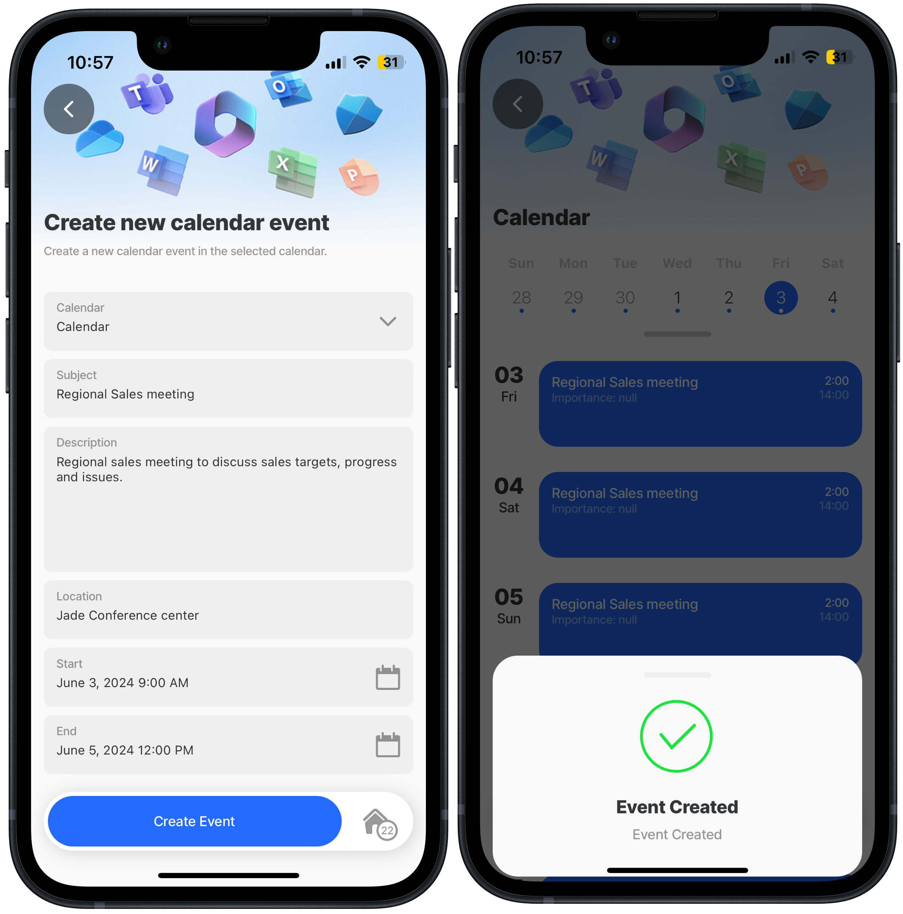

# Create Event Item



#### Scenario

Creates a new calendar event item in a user's specified calendar using the Microsoft Graph POST REST function. A default jig uses a form component to capture the event details.

**Resource links:**

* [Create event](https://learn.microsoft.com/en-us/graph/api/user-post-events?view=graph-rest-1.0\&tabs=http) - MS Graph documentation
* [Graph Explorer](https://developer.microsoft.com/en-us/graph/graph-explorer)
* [Configuring OAuth for MS Graph](https://docs.jigx.com/building-apps-with-jigx/data/data-providers/rest/microsoft-graph-oauth/configuring-oauth-for-ms-graph)

**Required OAuth scope** (least to most privilege):

Calendars.ReadWrite



<figure><figcaption><p>Create event items</p></figcaption></figure>



## Examples and code snippets


When using the code and samples in this topic, remember that they are designed to function as part of a comprehensive solution. To fully benefit from the intended functionality and ensure compatibility, it is recommended that you use the entire solution rather than selecting individual components in isolation. Alternatively, you can use these samples as a guide to understand the underlying concepts and MS Graph API, which can help you integrate similar solutions into your projects more effectively. The entire MS Graph solution is available on [GitHub](https://github.com/jigx-com/jigx-samples/tree/main/quickstart/jigx-MS-Graph-demonstrator).


## General


```yaml
name: ms-graph-demonstrator
title: MS Graph Demonstrator
description: A sample solution that uses the Microsoft Graph API. You can deploy and use this solution without any additional configuration.
category: business
tabs:
  home:
    jigId: view-user-jigx
    icon: home-apps-logo
  calendar:
    jigId: calendar-summary
    icon: calendar

onFocus:
  type: action.action-list
  options:
    isSequential: true
    actions:
      - type: action.sync-entities
        options:
          provider: DATA_PROVIDER_REST
          entities:
            - entity: user-profile
              function: get-user-profile
              parameters:
                accessToken: microsoft.OAuth
            - entity: profile-picture
              function: get-profile-picture
              parameters:
                accessToken: microsoft.OAuth
                userId: =@ctx.user.email
            - entity: next-week-calendar-events
              function: get-calendar-events-next-week
              parameters:
                accessToken: microsoft.OAuth
                startdatetime: =$fromMillis($millis())
                enddatetime: =$fromMillis($millis()+604800000)
            - entity: calendars
              function: get-calendar-list
              parameters:
                accessToken: microsoft.OAuth

onRefresh:
  type: action.action-list
  options:
    isSequential: true
    actions:
      - type: action.sync-entities
        options:
          provider: DATA_PROVIDER_REST
          entities:
            - entity: user-profile
              function: get-user-profile
              parameters:
                accessToken: microsoft.OAuth
            - entity: profile-picture
              function: get-profile-picture
              parameters:
                accessToken: microsoft.OAuth
                userId: =@ctx.user.email

            - entity: next-week-calendar-events
              function: get-calendar-events-next-week
              parameters:
                accessToken: microsoft.OAuth
                startdatetime: =$fromMillis($millis())
                enddatetime: =$fromMillis($millis()+604800000)
            - entity: calendars
              function: get-calendar-list
              parameters:
                accessToken: microsoft.OAuth
```


## Functions

MS Graph Create Event function in [GitHub](https://github.com/jigx-com/jigx-samples/blob/main/guides/ms-graph-solution/functions/create-calendar-event.jigx).


```yaml
provider: DATA_PROVIDER_REST
method: POST
url: https://graph.microsoft.com/v1.0/me/calendars/{calendarId}/events
inputTransform: |
  $.{
    "subject": subject,
    "body": {
      "contentType": "HTML",
      "content": description
    },
    "start": {
        "dateTime": startDateTime,
        "timeZone": startDateTimeTimeZone
    },
    "end": {
        "dateTime": endDateTime,
        "timeZone": endDateTimeTimeZone
    },
    "location":{
        "displayName": location
    }
  }
useLocalCall: true
parameters:
  accessToken:
    location: header
    required: true
    type: string
    value: microsoft.OAuth #Use manage.jigx.com to define credentials for your solution
  calendarId:
    type: string
    location: path
    required: true
  subject:
    type: string
    location: body
    required: true
  description:
    type: string
    location: body
    required: true
  startDateTime:
    type: string
    location: body
    required: true
  startDateTimeTimeZone:
    type: string
    location: body
    required: true
  endDateTime:
    type: string
    location: body
    required: true
  endDateTimeTimeZone:
    type: string
    location: body
    required: true
  location:
    type: string
    location: body
    required: true
```


## Jigs

MS Graph Create Calendar Events jig in [GitHub](https://github.com/jigx-com/jigx-samples/blob/main/guides/ms-graph-solution/jigs/create-calendar-event.jigx).


```yaml
title: Create new calendar event
description: Create a new calendar event in the selected calendar.
type: jig.default
icon: calendar

header:
  type: component.jig-header
  options:
    height: small
    children:
      type: component.image
      options:
        source:
          uri: https://support.content.office.net/en-us/media/f1c4b693-4670-4e7a-8102-bbf1749e83fe.jpg

onRefresh:
  type: action.sync-entities
  options:
    provider: DATA_PROVIDER_REST
    entities:
      - entity: calendars
        function: get-calendar-list
        parameters:
          accessToken: microsoft.OAuth
          userId: =@ctx.user.email

datasources:
  availableCalendars:
    type: datasource.sqlite
    options:
      provider: DATA_PROVIDER_LOCAL
      entities:
        - entity: calendars
      query: |
        SELECT id,
        '$.id' as calId,
        '$.name',
        '$.color',
        '$.hexColor',
        '$.isDefaultCalendar',
        '$.canShare',
        '$.canViewPrivateItems',
        '$.canEdit',
        '$.allowedOnlineMeetingProviders',
        '$.defaultOnlineMeetingProvider',
        '$.isRemovable',
        '$.owner'
        FROM [calendars]
        WHERE '$.canEdit' = true

children:
  - type: component.form
    instanceId: newEeventForm
    options:
      isDiscardChangesAlertEnabled: false
      children:
        - type: component.dropdown
          instanceId: calendarId
          options:
            label: Calendar
            data: =@ctx.datasources.availableCalendars
            item:
              type: component.dropdown-item
              options:
                title: =@ctx.current.item.name
                value: =@ctx.current.item.calId
            isRequired: true
        - type: component.text-field
          instanceId: subject
          options:
            label: Subject
        - type: component.text-field
          instanceId: description
          options:
            label: Description
            isMultiline: true
            textArea: medium
        - type: component.text-field
          instanceId: location
          options:
            label: Location
        - type: component.date-picker
          instanceId: startDateTime
          options:
            label: Start
            mode: datetime
            format: LLL
        - type: component.date-picker
          instanceId: endDateTime
          options:
            label: End
            mode: datetime
            format: LLL
actions:
  - children:
      - type: action.execute-entity
        options:
          title: Create Event
          provider: DATA_PROVIDER_REST
          function: create-calendar-event
          entity: calendarEvents
          method: functionCall
          parameters:
            accessToken: microsoft.OAuth
            userId: =@ctx.user.email
            calendarId: =@ctx.components.calendarId.state.selected.calId
            subject: =@ctx.components.subject.state.value
            description: =@ctx.components.description.state.value
            startDateTime: =@ctx.components.startDateTime.state.value
            startDateTimeTimeZone: =@ctx.system.timezone.name
            endDateTime: =@ctx.components.endDateTime.state.value
            endDateTimeTimeZone: =@ctx.system.timezone.name
            location: =@ctx.components.location.state.value
          onSuccess:
            description: "Event Created"
            title: "Event Created"
```


## See Also

* [Get Event List](<Get Event List.md>)
* [Get Event Item](<Get Event Item.md>)
