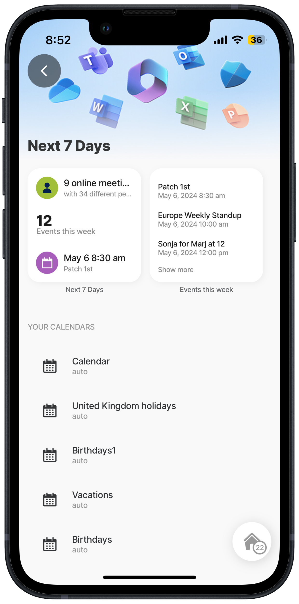

# Get Calendar List



## Scenario

Get a list of available calendars for a user in Microsoft Graph using a GET REST function and displaying the list of calendars in a list jig.

**Resource links:**

* [List calendars](https://learn.microsoft.com/en-us/graph/api/user-list-calendars?view=graph-rest-1.0\&tabs=http) - MS Graph documentation
* [Graph Explorer](https://developer.microsoft.com/en-us/graph/graph-explorer)
* [Configuring OAuth for MS Graph](https://docs.jigx.com/configuring-oauth-for-ms-graph)

**Required OAuth scope** (least to most privilege):

Calendars.Read Calendars.Read.Shared Calendars.ReadWrite

**Related Sample**

1. Pressing on the Calendar will navigate to [Get Event List](<Get Event List.md>) and display the events in the selected calendar.
2. Press on an item in the event list and view the event's details using the [Get Event Item](<Get Event Item.md>).



<figure><figcaption><p>Calender list</p></figcaption></figure>



## Examples and code snippets


When using the code and samples in this topic, remember that they are designed to function as part of a comprehensive solution. To fully benefit from the intended functionality and ensure compatibility, it is recommended that you use the entire solution rather than selecting individual components in isolation. Alternatively, you can use these samples as a guide to understand the underlying concepts and MS Graph API, which can help you integrate similar solutions into your projects more effectively. The entire MS Graph solution is available on [GitHub](https://github.com/jigx-com/jigx-samples/tree/main/quickstart/jigx-MS-Graph-demonstrator).


## General


```yaml
name: ms-graph-demonstrator
title: MS Graph Demonstrator
description: A sample solution that uses the Microsoft Graph API. You can deploy and use this solution without any additional configuration.
category: business
home:
    jigId: calendar-summary
    icon: home-apps-logo
    jigId: next-meeting
    when: |
      =@ctx.datasources.next-meeting=null? false:true
    icon: meeting-remote

onFocus:
  type: action.action-list
  options:
    isSequential: true
    actions:
      - type: action.sync-entities
        options:
          provider: DATA_PROVIDER_REST
          entities:
            - entity: next-week-calendar-events
              function: get-calendar-events-next-week
              parameters:
                accessToken: microsoft.OAuth
                startdatetime: =$fromMillis($millis())
                enddatetime: =$fromMillis($millis()+604800000)
            - entity: calendars
              function: get-calendar-list
              parameters:
                accessToken: microsoft.OAuth

onRefresh:
  type: action.action-list
  options:
    isSequential: true
    actions:
      - type: action.sync-entities
        options:
          provider: DATA_PROVIDER_REST
          entities:
            - entity: next-week-calendar-events
              function: get-calendar-events-next-week
              parameters:
                accessToken: microsoft.OAuth
                startdatetime: =$fromMillis($millis())
                enddatetime: =$fromMillis($millis()+604800000)
            - entity: calendars
              function: get-calendar-list
              parameters:
                accessToken: microsoft.OAuth

```


## Functions

MS Graph Calendar function in [GitHub](https://github.com/jigx-com/jigx-samples/blob/main/quickstart/jigx-MS-Graph-demonstrator/functions/calendar/get-calendar-list.jigx).


```yaml
provider: DATA_PROVIDER_REST
method: GET
url: https://graph.microsoft.com/v1.0/me/calendars
outputTransform: $
useLocalCall: true
parameters:
  accessToken:
    location: header
    required: true
    type: string
    value: microsoft.OAuth #Use manage.jigx.com to define credentials for your solution
records: =$.value
continuation:
  when: =$."@odata.nextLink"
  url: =$."@odata.nextLink"
  parameters:
    accessToken:
      location: header
      required: true
      type: string
      value: microsoft.OAuth
```


## Jigs

MS Graph Calendar jig in [GitHub](https://github.com/jigx-com/jigx-samples/blob/main/quickstart/jigx-MS-Graph-demonstrator/jigs/calendar/view-calendar-list.jigx).


```yaml
title: View Calendar List
description: View all calendars in Microsoft Graph for a user
type: jig.list
icon: calendar

header:
  type: component.jig-header
  options:
    height: small
    children:
      type: component.image
      options:
        source:
          uri: https://support.content.office.net/en-us/media/f1c4b693-4670-4e7a-8102-bbf1749e83fe.jpg

onRefresh:
  type: action.sync-entities
  options:
    provider: DATA_PROVIDER_REST
    entities:
      - entity: calendars
        function: get-calendar-list
        parameters:
          accessToken: microsoft.OAuth

datasources:
  calendarList:
    type: datasource.sqlite
    options:
      provider: DATA_PROVIDER_LOCAL
      entities:
        - entity: calendars
      query: |
        SELECT id,
        '$.id' as calId,
        '$.name',
        '$.color',
        '$.hexColor',
        '$.isDefaultCalendar',
        '$.canShare',
        '$.canViewPrivateItems',
        '$.canEdit',
        '$.allowedOnlineMeetingProviders',
        '$.defaultOnlineMeetingProvider',
        '$.isRemovable',
        '$.owner'
        FROM [calendars]

data: =@ctx.datasources.calendarList
item:
  type: component.list-item
  options:
    title: =@ctx.current.item.name
    subtitle: =@ctx.current.item.color
    leftElement:
      element: icon
      icon: calendar-3
    onPress:
      type: action.go-to
      options:
        linkTo: view-calendar-events
        parameters:
          calId: =@ctx.current.item.calId
```


## See Also

* [Get Event List](<Get Event List.md>)
* [Get Event Item](<Get Event Item.md>)
* [Create Event Item](<Create Event Item.md>)
