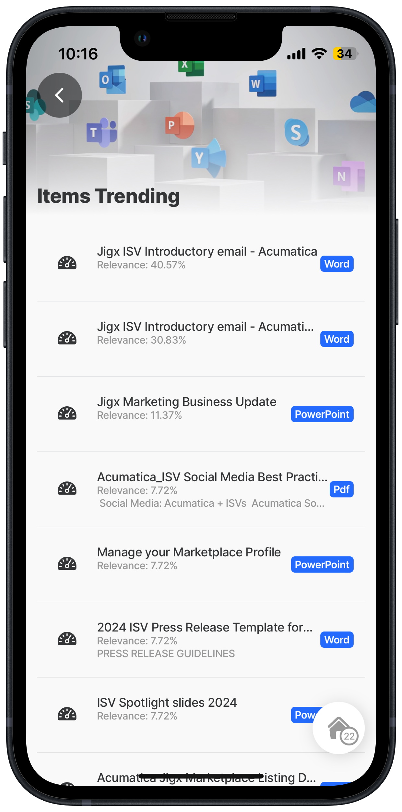

# Get item trending



## Scenario

Get insights that include a list of documents trending around the user using a GET REST function and display the list in a list jig.

**Resource links:**

* [Insights list trending](https://learn.microsoft.com/en-us/graph/api/insights-list-trending?view=graph-rest-1.0\&tabs=http) - MS Graph documentation
* [Graph Explorer](https://developer.microsoft.com/en-us/graph/graph-explorer)
* [Configuring OAuth for MS Graph](https://docs.jigx.com/configuring-oauth-for-ms-graph)

**Required OAuth scope** (least to most privilege):

Sites.Read.All Sites.ReadWrite.All&#x20;



<figure><figcaption><p>Insights - trending</p></figcaption></figure>



## Examples and code snippets


When using the code and samples in this topic, remember that they are designed to function as part of a comprehensive solution. To fully benefit from the intended functionality and ensure compatibility, it is recommended that you use the entire solution rather than selecting individual components in isolation. Alternatively, you can use these samples as a guide to understand the underlying concepts and MS Graph API, which can help you integrate similar solutions into your projects more effectively. The entire MS Graph solution is available on [GitHub](https://github.com/jigx-com/jigx-samples/tree/main/quickstart/jigx-MS-Graph-demonstrator).&#x20;


## General


```yaml
name: ms-graph-demonstrator
title: MS Graph Demonstrator
description: A sample solution that uses the Microsoft Graph API. You can deploy and use this solution without any additional configuration.
category: business
tabs:
  Home:
    jigId: view-user-jigx
    icon: person
  Trends:
    jigId: items-trending
    icon: newspaper
```


## Functions

MS Graph list trending function in [GitHub](https://github.com/jigx-com/jigx-samples/blob/main/quickstart/jigx-MS-Graph-demonstrator/functions/general/get-items-trending.jigx).


```yaml
provider: DATA_PROVIDER_REST
method: GET
url: https://graph.microsoft.com/v1.0/me/insights/trending
outputTransform: $.value
useLocalCall: true
parameters:
  accessToken:
    location: header
    required: true
    type: string
    value: microsoft.OAuth #Use manage.jigx.com to define credentials for your solution
  $top:
    type: string
    location: query
    required: false
    value: 100
continuation:
  when: =$.nextLink
  url: =$.nextLink
  parameters:
    accessToken:
      location: header
      required: true
      type: string
      value: microsoft.OAuth
```


## Jigs

MS Graph list trending jigs in [GitHub](https://github.com/jigx-com/jigx-samples/tree/main/quickstart/jigx-MS-Graph-demonstrator/jigs/general)



```yaml
title: Items Trending
type: jig.default

header:
  type: component.jig-header
  options:
    height: small
    children:
      type: component.image
      options:
        source:
          uri: https://www.windowslatest.com/wp-content/uploads/2018/12/Office-apps-new-icons.jpg

onRefresh:
  type: action.action-list
  options:
    actions:
      - type: action.sync-entities
        options:
          provider: DATA_PROVIDER_REST
          entities:
            - entity: items-trending
              function: get-items-trending
              parameters:
                accessToken: microsoft.OAuth

datasources:
  mydata:
    type: datasource.sqlite
    options:
      provider: DATA_PROVIDER_LOCAL

      entities:
        - entity: items-trending

      query: SELECT id, '$.weight',
        json_extract(Data, '$.resourceReference.webUrl') as webUrl,
        json_extract(Data, '$.resourceVisualization.containerDisplayName') as containerDisplayName,
        json_extract(Data, '$.resourceVisualization.previewText') as previewText,
        json_extract(Data, '$.resourceVisualization.title') as title,
        json_extract(Data, '$.resourceVisualization.type') as type
        FROM [items-trending]
        order by '$.weight' desc

children:
  - type: component.list
    options:
      data: =@ctx.datasources.mydata
      maximumItemsToRender: =$count(@ctx.datasources.mydata)
      item:
        type: component.list-item
        options:
          title: =@ctx.current.item.title
          subtitle: |
            ="Relevance: " & $round((@ctx.current.item.weight * 100),2) & "%"
          description: =@ctx.current.item.previewText
          divider: solid
          leftElement:
            element: icon
            icon: gauge-dashboard
          label:
            title: =@ctx.current.item.type
          onPress:
            type: action.go-to
            options:
              linkTo: =@ctx.current.item.type='pdf'? 'view-trending-object-pdf':'view-trending-object'
              parameters:
                uri: =@ctx.current.item.webUrl

widgets:
  trends:
    type: widget.group
    options:
      children:
        - type: widget.image
          options:
            isContentOverlaid: true
            bottom:
              type: component.titles
              options:
                align: center
                subtitle: =$count(@ctx.datasources.mydata) & " items trending around you."
            source:
              uri: https://www.windowslatest.com/wp-content/uploads/2018/12/Office-apps-new-icons.jpg
        - type: widget.list
          options:
            data: =@ctx.datasources.mydata
            item:
              type: component.list-item
              options:
                title: =@ctx.current.item.title
                subtitle: =@ctx.current.item.type & " document"
                description: =@ctx.current.item.previewText
                divider: solid
                onPress:
                  type: action.go-to
                  options:
                    linkTo: =@ctx.current.item.type='pdf'? 'view-trending-object-pdf':'view-trending-object'
                    parameters:
                      uri: =@ctx.current.item.webUrl
```



```yaml
title: Document
type: jig.document

source:
  documentType: PDF
  uri: =@ctx.jig.inputs.uri
```



```yaml
title: Document
type: jig.document

source:
  documentType: HTML
  uri: =@ctx.jig.inputs.uri
  isTrackingTransparencyRequired: false
```


