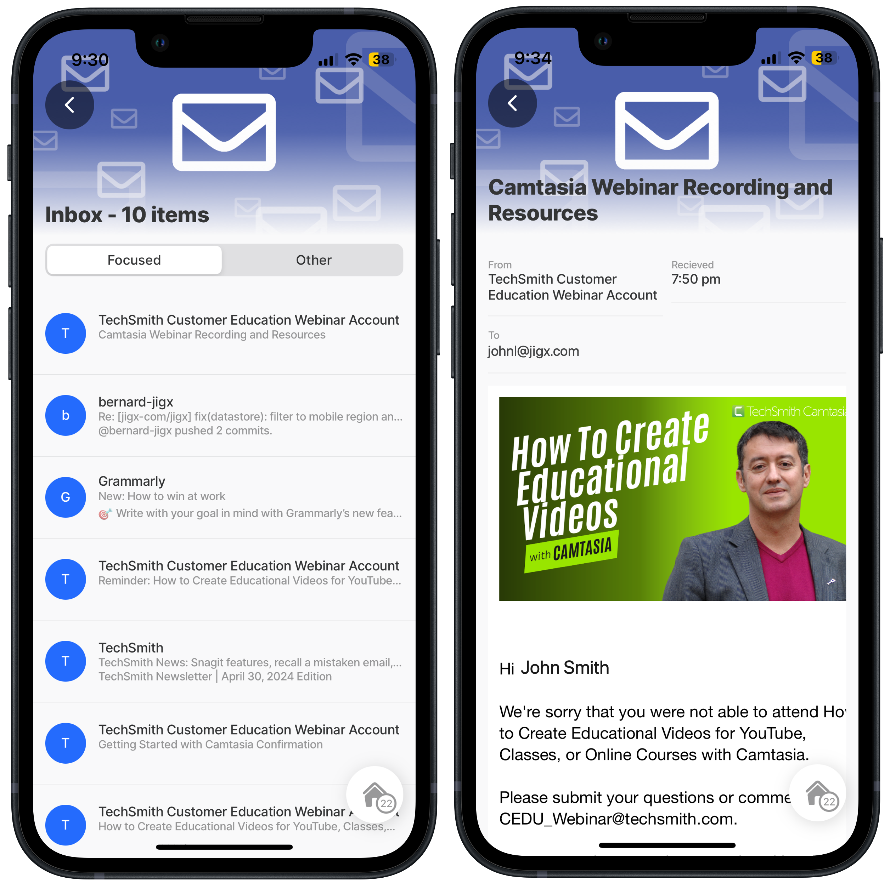

# Get list messages



#### Scenario

Get a list of emails for a user in Microsoft Graph using a GET REST function and displaying the emails in a list jig. Press on an email to view the content of the email.

**Resource links:**

* [List messages](https://learn.microsoft.com/en-us/graph/api/user-list-messages?view=graph-rest-1.0\&tabs=http#http-request) - MS Graph documentation
* [Graph Explorer](https://developer.microsoft.com/en-us/graph/graph-explorer)
* [Configuring OAuth for MS Graph](https://docs.jigx.com/building-apps-with-jigx/data/data-providers/rest/microsoft-graph-oauth/configuring-oauth-for-ms-graph)

**Required OAuth scope** (least to most privilege):

Mail.ReadBasic Mail.ReadWrite Mail.Read



<figure><figcaption><p>Messages</p></figcaption></figure>



## Examples and code snippets


When using the code and samples in this topic, remember that they are designed to function as part of a comprehensive solution. To fully benefit from the intended functionality and ensure compatibility, it is recommended that you use the entire solution rather than selecting individual components in isolation. Alternatively, you can use these samples as a guide to understand the underlying concepts and MS Graph API, which can help you integrate similar solutions into your projects more effectively. The entire MS Graph solution is available on [GitHub](https://github.com/jigx-com/jigx-samples/tree/main/quickstart/jigx-MS-Graph-demonstrator).


## General


```yaml
name: ms-graph-demonstrator
title: MS Graph Demonstrator
description: A sample solution that uses the Microsoft Graph API. You can deploy and use this solution without any additional configuration.
category: business
tabs:
 home:
    jigId: view-user-jigx
    icon: home-apps-logo
 calendar: "2x2"
    jigId: calendar-summary
    icon: calendar
 meeting:
    jigId: next-meeting
    when: |
      =@ctx.datasources.next-meeting=null? false:true
    icon: meeting-remote
 emails:
    jigId: list-email-messages
    icon: email
```


## Functions

MS Graph list messages function in [GitHub](https://github.com/jigx-com/jigx-samples/blob/main/quickstart/jigx-MS-Graph-demonstrator/functions/mail/get-email-messages.jigx).


```yaml
provider: DATA_PROVIDER_REST
method: GET
url: https://graph.microsoft.com/v1.0/me/mailFolders/inbox/messages
outputTransform: $
useLocalCall: true
parameters:
  accessToken:
    location: header
    required: true
    type: string
    value: microsoft.OAuth #Use manage.jigx.com to define credentials for your solution
  $filter:
    type: string
    location: query
    required: false
  $top:
    type: string
    location: query
    required: false
    value: 200
records: =$.value
continuation:
  when: =$."@odata.nextLink"
  url: =$."@odata.nextLink"
  parameters:
    accessToken:
      location: header
      required: true
      type: string
      value: microsoft.OAuth
```


## Jigs

MS Graph messages jig in [GitHub](https://github.com/jigx-com/jigx-samples/tree/main/quickstart/jigx-MS-Graph-demonstrator/jigs/mail).



```yaml
title: ="Inbox - " & $count(@ctx.datasources.mydata) & " items"
type: jig.list
icon: contact

header:
  type: component.jig-header
  options:
    height: small
    children:
      type: component.image
      options:
        source:
          uri: https://blog.smu.edu/itconnect/files/2020/12/Featured-Image-Email-354CA1-1.png

onRefresh:
  type: action.action-list
  options:
    actions:
      - type: action.sync-entities
        options:
          provider: DATA_PROVIDER_REST
          entities:
            - entity: email-messages
              function: get-email-messages
              parameters:
                accessToken: microsoft.OAuth
                $filter: ="receivedDateTime ge " & $fromMillis($millis()-432000000)
                $top: "200"

datasources:
  mydata:
    type: datasource.sqlite
    options:
      provider: DATA_PROVIDER_LOCAL
      entities:
        - entity: email-messages
      jsonProperties:
        - body
        - sender
        - from
        - toRecipients
        - replyTo
      query: SELECT id,
        '$.receivedDateTime',
        '$.sentDateTime',
        '$.hasAttachments',
        '$.subject',
        '$.bodyPreview',
        '$.importance',
        '$.conversationId',
        '$.isRead',
        '$.inferenceClassification',
        '$.body',
        '$.sender',
        '$.from',
        '$.toRecipients',
        '$.ccRecipients',
        '$.bccRecipients',
        '$.replyTo'
        FROM [email-messages]
        Where '$.inferenceClassification' LIKE @filter
        and json_extract(Data, '$.sender.emailAddress.address') != @me
        order by '$.receivedDateTime' desc
      queryParameters:
        filter: =@ctx.jig.state.filter
        me: =@ctx.user.email

data: =@ctx.datasources.mydata
item:
  type: component.list-item
  options:
    title: =@ctx.current.item.sender.emailAddress.name
    divider: solid
    subtitle: =@ctx.current.item.subject
    description: =@ctx.current.item.bodyPreview
    rightElement:
      element: icon
      icon: =(@ctx.current.item.hasAttachments = 1 ? 'document' :'')
    leftElement:
      element: avatar
      text: =$substring(@ctx.current.item.from.emailAddress.name, 0, 1)
      uri: ""
    onPress:
      type: action.go-to
      options:
        linkTo: view-email
        parameters:
          receivedDateTime: =@ctx.current.item.receivedDateTime
          sentDateTime: =@ctx.current.item.sentDateTime
          hasAttachments: =@ctx.current.item.hasAttachments
          subject: =@ctx.current.item.subject
          bodyPreview: =@ctx.current.item.bodyPreview
          importance: =@ctx.current.item.importance
          conversationId: =@ctx.current.item.conversationId
          isRead: =@ctx.current.item.isRead
          inferenceClassification: =@ctx.current.item.inferenceClassification
          body: =@ctx.current.item.body
          sender: =@ctx.current.item.sender
          from: =@ctx.current.item.from
          toRecipients: =@ctx.current.item.toRecipients
          ccRecipients: =@ctx.current.item.ccRecipients
          bccRecipients: =@ctx.current.item.bccRecipients
          replyTo: =@ctx.current.item.replyTo

filter:
  - title: Focused
    value: focused
  - title: Other
    value: other
```



```yaml
title: =@ctx.jig.inputs.subject
type: jig.default

header:
  type: component.jig-header
  options:
    height: small
    children:
      type: component.image
      options:
        source:
          uri: https://blog.smu.edu/itconnect/files/2020/12/Featured-Image-Email-354CA1-1.png

children:
  - type: component.entity
    options:
      children:
        - type: component.field-row
          options:
            children:
              - type: component.entity-field
                options:
                  label: From
                  value: =@ctx.jig.inputs.sender.emailAddress.name
              - type: component.entity-field
                options:
                  label: Recieved
                  value: =$fromMillis($toMillis(@ctx.jig.inputs.receivedDateTime), '[h]:[m01] [PN]', @ctx.system.timezone.offset)
        - type: component.entity-field
          options:
            label: To
            value: =@ctx.jig.inputs.toRecipients.emailAddress.address
  - type: component.web-view
    options:
      height: 800
      isTrackingTransparencyRequired: false
      content: |
        =("
        <html>
          <head>
          <style>
            body {
              font-family: Arial;
            }
          </style>
            <meta name=" & "'" & "viewport" & "'" & " content=" & "'" & "width=device-width, " & "initial-scale=1" & "'" & "/>
          </head>
          <body>" 
            & @ctx.jig.inputs.body.content
        & "</body>
        </html>")
```


