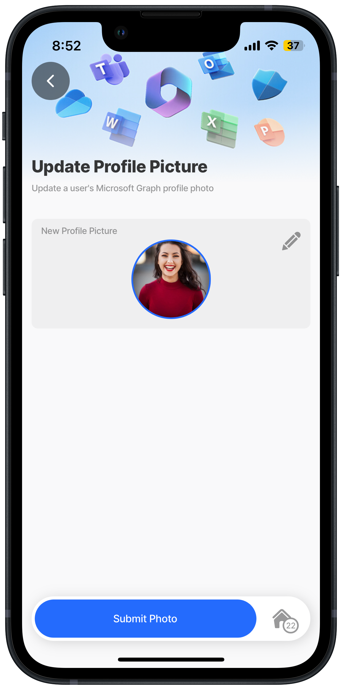

# Update Profile Photo



### Scenario

Update a user's profile photo in Microsoft Graph using the `media-field` component in a jig to select the photo. A Jigx REST function is used in the `execute-entity` action to make the update.

**Resource links:**

* [Update profilePhoto Graph](https://learn.microsoft.com/en-us/graph/api/profilephoto-update?view=graph-rest-1.0\&tabs=http) documentation
* [Graph explorer](https://developer.microsoft.com/en-us/graph/graph-explorer)
* [Configuring OAuth for MS Graph](https://docs.jigx.com/configuring-oauth-for-ms-graph)

**Required OAuth scope** (least to most privilege):

User.ReadWrite User.ReadWrite.All



<figure><figcaption><p>Update profile</p></figcaption></figure>



### Examples and code snippets


When using the code and samples in this topic, remember that they are designed to function as part of a comprehensive solution. To fully benefit from the intended functionality and ensure compatibility, it is recommended that you use the entire solution rather than selecting individual components in isolation. Alternatively, you can use these samples as a guide to understand the underlying concepts and MS Graph API, which can help you integrate similar solutions into your projects more effectively. The entire MS Graph solution is available on [GitHub](https://github.com/jigx-com/jigx-samples/tree/main/quickstart/jigx-MS-Graph-demonstrator).


### General



```yaml
name: ms-graph-demonstrator
title: MS Graph Demonstrator
description: A solution using Microsoft Graph APIs .
category: business

onLoad:
  type: action.execute-action
  options:
    action: full-sync

onRefresh:
  type: action.execute-action
  options:
    action: full-sync

expressions:
  today: =$substring($now(), 0, 10)
  todayStart: =$toMillis($today)
  weekdayStr: =$floor($todayStart/86400000)
  weekdayNum: =($weekdayStr + 4) % 7
  startOfWeek: =$todayStart - ($weekdayNum * 86400000)
  thisWeek: =$startOfWeek + 604800000
  next7: =$number($todayStart) + 604800000

tabs:
  home:
    jigId: home
    icon: home
```



```yaml
title: Home
type: jig.grid

children:
  - type: component.grid-item
    options:
      size: 2x2
      children:
        type: component.jig-widget
        options:
          jigId: view-user-jigx
          widgetId: profileImage
  - type: component.grid-item
    options:
      size: 2x2
      children:
        type: component.jig-widget
        options:
          jigId: calendar-summary
          widgetId: nextDays
  - type: component.grid-item
    when: =$boolean(@ctx.datasources.next-meeting.locationAddress)
    options:
      size: 4x2
      children:
        type: component.jig-widget
        options:
          jigId: next-meeting
          widgetId: meeting-location
  - type: component.grid-item
    options:
      size: 2x2
      children:
        type: component.jig-widget
        options:
          jigId: list-email-messages
  - type: component.grid-item
    options:
      size: 2x2
      children:
        type: component.jig-widget
        options:
          jigId: list-task-lists
          widgetId: taskList
  - type: component.grid-item
    options:
      size: 4x2
      children:
        type: component.jig-widget
        options:
          jigId: items-trending
          widgetId: trending
```



### Functions

MS Graph User function in [GitHub](https://github.com/jigx-com/jigx-samples/blob/main/quickstart/jigx-MS-Graph-demonstrator/functions/User/update-profile-picture.jigx).


```yaml
provider: DATA_PROVIDER_REST
method: PATCH
url: https://graph.microsoft.com/v1.0/me/photo/$value
useLocalCall: true
parameters:
  accessToken:
    location: header
    required: true
    type: string
    value: microsoft.OAuth # Use manage.jigx.com to define credentials for your solution
  Content-Type:
    location: header
    required: true
    type: string
    value: image/jpeg # set the content type of the body
  file:
    location: body
    required: true
    type: image
conversions:
  - property: file
    from: local-uri
    to: buffer
```


### Jigs

MS Graph User jig in [GitHub](https://github.com/jigx-com/jigx-samples/blob/main/quickstart/jigx-MS-Graph-demonstrator/jigs/user/update-profile-picture.jigx%22).


```yaml
title: Update Profile Picture
description: Update a user's Microsoft Graph profile photo
type: jig.default

header:
  type: component.jig-header
  options:
    height: small
    children:
      type: component.image
      options:
        source:
          uri: https://support.content.office.net/en-us/media/f1c4b693-4670-4e7a-8102-bbf1749e83fe.jpg

children:
  - type: component.form
    instanceId: pictureForm
    options:
      isDiscardChangesAlertEnabled: false
      children:
        - type: component.media-field
          instanceId: profilePicture
          options:
            label: New Profile Picture
            mediaType: image
            isMultiple: false
            # Optimized photo size with minimal quality loss.
            imageQuality: 80 

actions:
  - children:
      - type: action.execute-entity
        options:
          title: Submit Photo
          provider: DATA_PROVIDER_REST
          entity: profile-picture
          function: update-profile-picture
          parameters:
            accessToken: microsoft.OAuth
            Content-Type: image/jpeg
            file: =@ctx.components.profilePicture.state.value
          method: functionCall
          onSuccess:
            type: action.go-back
```


### See Also

* [Get User Profile & Photo](<Get User Profile _ Photo.md>)
