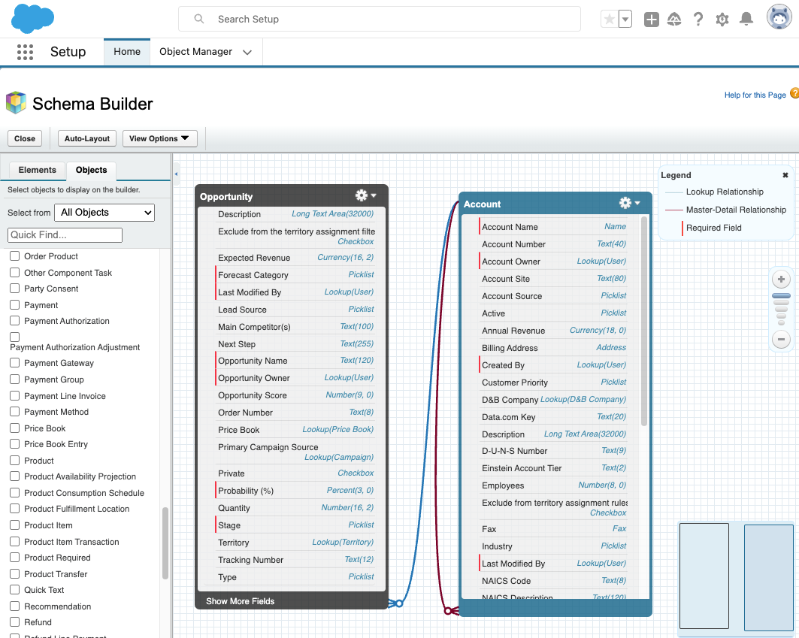
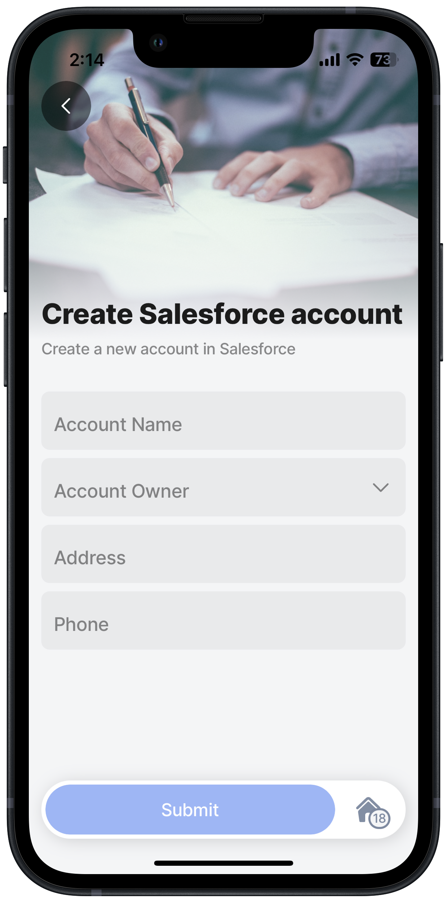

# Create records in objects

Create records in Salesforce objects straight from your mobile device. If you at a customer and want to create a new account with the customer or capture a new opportunity while having coffee with a prospect, you can design a form and use the Salesforce provider's create method.

You can use the [object reference for Salesforce](https://developer.salesforce.com/docs/atlas.en-us.object_reference.meta/object_reference/sforce_api_objects_concepts.htm), [https://workbench.developerforce.com/login.php,](https://workbench.developerforce.com/login.php) or the Salesforce schema builder to check the objects, required fields, and relationships. The minimum needed to create a record is based on the required fields.

<figure><figcaption><p>Salesforce schema builder</p></figcaption></figure>

### Examples and code snippets


Examples are based on test data in a Jigx demo Salesforce environment. Copying the sample code must be adjusted to represent your own Salesforce environment.


#### Create a Salesforce Account record



<figure><figcaption><p>Creat an Account object </p></figcaption></figure>



This example uses a default jig type with a a `component.form`. Certain of the Salesforce's Account object's fields are used to create a basic account record. You can add any additional fields you require.




```yaml
title: Create Salesforce account 
description: 2 Create a new account in Salesforce
type: jig.default

header:
  type: component.jig-header
  options:
    height: medium
    children:
      type: component.image
      options:
        source:
          uri: https://images.unsplash.com/photo-1450101499163-c8848c66ca85?ixlib=rb-4.0.3&ixid=M3wxMjA3fDB8MHxwaG90by1wYWdlfHx8fGVufDB8fHx8fA%3D%3D&auto=format&fit=crop&w=1470&q=80 
onFocus: 
    type: action.action-list
    options:
      actions:
        - type: action.sync-entities
          options: 
            provider: DATA_PROVIDER_SALESFORCE
            entities:
              - Account
                                
datasources:
  salesforce-acc-type: 
    type: datasource.sqlite
    options:
      provider: DATA_PROVIDER_LOCAL
      entities:
        - entity: Account
      query: SELECT '$.Type' FROM [Account]

children:
  - type: component.form
    instanceId: new-account
    options:
      children:    
        - type: component.text-field
          instanceId: Name
          options:
            label: Account Name
        - type: component.dropdown
          instanceId: Type
          options:
            label: Account Type
            data: =$distinct(@ctx.datasources.salesforce-acc-type)
            item:
              type: component.dropdown-item
              options:
                title: =@ctx.current.item.Type
                value: =@ctx.current.item.Type
        - type: component.text-field
          instanceId: BillingCountry
          options:
            label: Billing Country 
        - type: component.text-field
          instanceId: BillingState
          options:
            label: Billing State      
        - type: component.text-field
          instanceId: Phone
          options:
            label: Phone       
actions:
  - children:
      - type: action.action-list
        options:
          title: Submit
          isSequential: true
          actions:
            - type: action.submit-form
              options:
                formId: new-account
                provider: DATA_PROVIDER_SALESFORCE
                method: create
                entity: Account
                onSuccess: 
                  title: Successfully created
            - type: action.go-back
```


#### Create a Salesforce Opportunity record



This example uses a default jig type with a `component.form`. Certain of the Salesforce's Opportunity object's fields are used to create a basic record. You can add any additional fields you require.



Image\[]{src="https://archbee-image-uploads.s3.amazonaws.com/x7vdIDH6-ScTprfmi2XXX/xRt75T6ECDiejwwmNLRR-\_sf-newopp.PNG" size="70" position="center" caption="New opportunity" alt="New opportunity"}




```yaml
title: Create Salesforce opportunity 
description: Create a new opportunity in Salesforce
type: jig.default

header:
  type: component.jig-header
  options:
    height: medium
    children:
      type: component.image
      options:
        source:
          uri: https://images.unsplash.com/photo-1606189934732-1c274f894bf9?ixlib=rb-4.0.3&ixid=M3wxMjA3fDB8MHxwaG90by1wYWdlfHx8fGVufDB8fHx8fA%3D%3D&auto=format&fit=crop&w=1470&q=80 
onFocus: 
    type: action.action-list
    options:
      actions:
        - type: action.sync-entities
          options: 
            provider: DATA_PROVIDER_SALESFORCE
            entities:
              - Opportunity
                                
datasources:
  salesforce-opp: 
    type: datasource.sqlite
    options:
      provider: DATA_PROVIDER_LOCAL
      entities:
        - Opportunity
      query: SELECT id, '$.StageName', '$.Type' FROM [Opportunity]
children:
  - type: component.form
    instanceId: new-opportunity
    options:
      children:    
        - type: component.text-field
          instanceId: Name
          options:
            label: Opportunity Name
        - type: component.dropdown
          instanceId: StageName
          options:
            label: Stage
            data: =@ctx.datasources.salesforce-opp
            item:
              type: component.dropdown-item
              options:
                title: =@ctx.current.item.StageName
                value: =@ctx.current.item.StageName
        - type: component.dropdown
          instanceId: Type
          options:
             label: Opportunity Type
             data: =@ctx.datasources.salesforce-opp
             item:
               type: component.dropdown-item
               options:
                 title: =@ctx.current.item.Type
                 value: =@ctx.current.item.Type        
        - type: component.date-picker
          instanceId: CloseDate
          options:
            label: Select a close date 
            format: L
               
actions:
  - children:
      - type: action.action-list
        options:
          title: Submit
          isSequential: true
          actions:
            - type: action.submit-form
              options:
                formId: new-opportunity
                provider: DATA_PROVIDER_SALESFORCE
                method: create
                entity: Opportunity
                onSuccess: 
                  title: Successfully created
            - type: action.go-back
```

