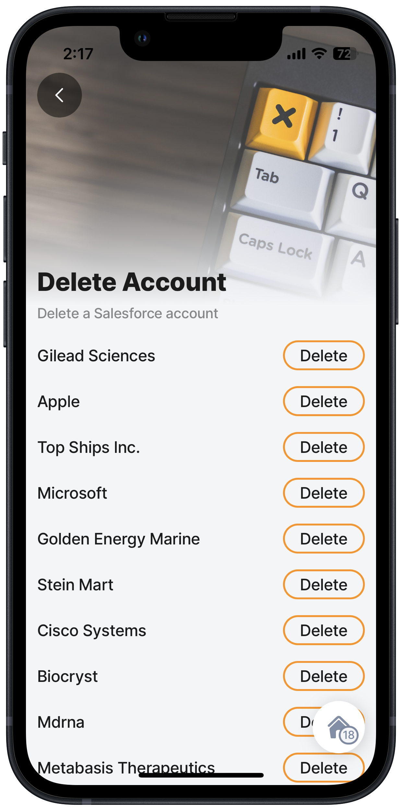

# Delete records in objects

Using the Salesforce provider's Delete method, you can delete records in a Salesforce object. This is helpful when a data cleanup is needed due to outdated, incorrect, or irrelevant data. It is essential to exercise caution when deleting records, as the action is irreversible. In Jigx Builder use an `action.confirm` with a `modal` to provide a message before deleting the record permanently. Ensure you have sufficient rights in Salesforce to delete a record in an object.

## Examples and code snippets


Examples are based on test data in a Jigx demo Salesforce environment. Copying the sample code must be adjusted to represent your own Salesforce environment.


### Delete a Salesforce Account record



<figure><figcaption><p>Deleting records</p></figcaption></figure>



This example uses a list jig type with a `component.list-item` with a `rightElement: button` to execute the Salesforce provider's `method: delete`.




```yaml
title: Delete Account
description: Delete a Salesforce account
type: jig.list

header:
  type: component.jig-header
  options:
    height: medium
    children:
      type: component.image
      options:
        source:
          uri: https://images.unsplash.com/photo-1600881217197-068e1d79ffb8?ixlib=rb-4.0.3&ixid=M3wxMjA3fDB8MHxwaG90by1wYWdlfHx8fGVufDB8fHx8fA%3D%3D&auto=format&fit=crop&w=2232&q=80

onFocus:
  type: action.action-list
  options:
    actions:
      - type: action.sync-entities
        options:
          provider: DATA_PROVIDER_SALESFORCE
          entities:
            - Account

datasources:
  salesforce-accounts: 
    type: datasource.sqlite
    options:
      provider: DATA_PROVIDER_LOCAL
      entities:
        - entity: Account
      query: SELECT id, '$.Name', '$.Type', '$.BillingCountry' FROM [Account] 
       
    
data: =@ctx.datasources.salesforce-accounts
item:
  type: component.list-item
  instanceId: =@ctx.current.item.id
  options:
    title: =@ctx.current.item.Name
    rightElement: 
      element: button
      title: Delete

      onPress: 
        type: action.action-list
        options:
          isSequential: true
          actions:
            - type: action.confirm
              options:
                isConfirmedAutomatically: false
                onConfirmed: 
                  type: action.execute-entity
                  options:
                    provider: DATA_PROVIDER_SALESFORCE
                    entity: Account
                    method: delete
                    data:
                      id: =@ctx.current.item.id
                    onSuccess: 
                      title: Account deleted
                  
                modal:
                  title: Are you sure you want to delete the Account?
            - type: action.go-back            
```

