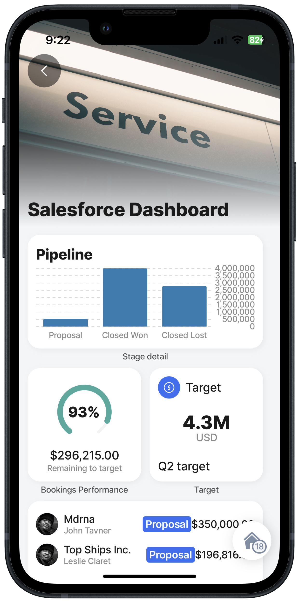

# Salesforce

Jigx easily integrates with your Salesforce instance, through the [Salesforce data provider](https://docs.jigx.com/building-apps-with-jigx/data/data-providers/salesforce). The following examples with code snippets are provided in this section:

* [Create records in objects](<Create records in objects.md>)
* [Delete records in objects](<Delete records in objects.md>)
* [Save & update records in objects](<Save _ update records in objects.md>)
* [List records in objects](<List records in objects.md>)

Creating a Salesforce dashboard can help you gain valuable insight into your business, improve decision-making, and enhance overall efficiency and performance across your organization. The Jigx Salesforce provider brings data directly into the app from Salesforce, giving you access to real-time data and visual insights no matter where you are. Tailor the app to display metrics that matter most to your business and configure them to suit different user roles and responsibilities. Dashboards can be shared with team members, managers, or stakeholders. Sales teams can benefit significantly from Salesforce dashboards as they provide a clear view of their pipelines, opportunities, and sales targets.




Examples are based on test data in a Jigx demo Salesforce environment. Copying the sample code must be adjusted to represent your own Salesforce environment.




<figure><figcaption><p>Salesforce Dashboard</p></figcaption></figure>



In this dashboard the Home Hub is configured to call eight jigs and one datasource file. The jigs use various components such as [form](../../Components/form/form.md), [list](../../Components/list/list.md), [widgets](https://docs.jigx.com/examples/readme/widgets), [bar-chart](../../Components/charts/bar-chart.md), and actions to create an informative interactive app. The Salesforce provider references various Salesforce objects as shown below.




```yaml
provider: DATA_PROVIDER_SALESFORCE
entities:
  - Account
  - Opportunity
  - OpportunityStage
  - User
  - UserRole
  - Territory2
```

