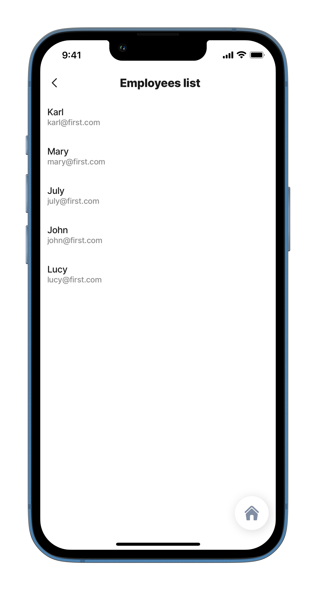

# sqlite

With SQLite, you can write your datasources as SQL queries. You can use the queries in datasources to create a select statement and get the data from the tables you need to use in your jig file. You can use it directly in the jig file, where the UI component configuration is or you can use it as a global datasource.\
For more information see:

1. [Datasources](https://docs.jigx.com/building-apps-with-jigx/data/datasources)
2. [Datasource SQLite](https://docs.jigx.com/building-apps-with-jigx/data/datasources/sqlite)
3. [SQLite cheatsheet](https://docs.jigx.com/building-apps-with-jigx/data/datasources/sqlite/sqlite-cheatsheet)

## Configuration options

When setting up a SQLite datasource, you use the datasource in the following ways:

1. In your jig file as a locally configured datasource under the `datasource` section.
2. In the global datasource file, that will allow you to use it across all the jig files. The global datasource files are located under the datasources folder in Jigx Builder.

## Examples and code snippets

View common examples of using SQLite below, you can use these as a guideline to configure the same in your solutions.

### sqlite in a jig file



<figure><figcaption><p>Locally configured datasource</p></figcaption></figure>



Datasource with type `sqlite` to select name, and email from the employee's table and to display the list of employees.

**Example**: See the full example on [GitHub](https://github.com/jigx-com/jigx-samples/blob/main/quickstart/jigx-samples/jigs/jig-types/jig-list/simple-lists/dynamic-data/employees-list.jigx).




```yaml
datasources:
  employees-dynamic:
    type: datasource.sqlite
    options:
      provider: DATA_PROVIDER_DYNAMIC
      entities:
        - entity: default/employees
      query: |
        SELECT
          id,
          '$.firstname',
          '$.email'
        FROM [default/employees]

```


### sqlite as a global datasource



<figure><figcaption><p>Global configured datasource</p></figcaption></figure>



Datasource with type `sqlite` as global datasource to select name, and email from the employee's table and to display the list of employees.

**Example:**\
See the full example on [GitHub](https://github.com/jigx-com/jigx-samples/blob/main/quickstart/jigx-samples/jigs/jig-types/jig-list/simple-lists/dynamic-data/employees-list.jigx)





```yaml
type: "datasource.sqlite"
options:
    provider: DATA_PROVIDER_DYNAMIC
    entities:
    - entity: default/employees
    query: |
    SELECT
        id,
        '$.firstname',
        '$.email'
    FROM [default/employees]
```



```yaml
data: =@ctx.datasources.employees-dynamic
item: 
  type: "component.list-item"
  options:
    title: =@ctx.current.item.firstname
    subtitle: =@ctx.current.item.email
```


