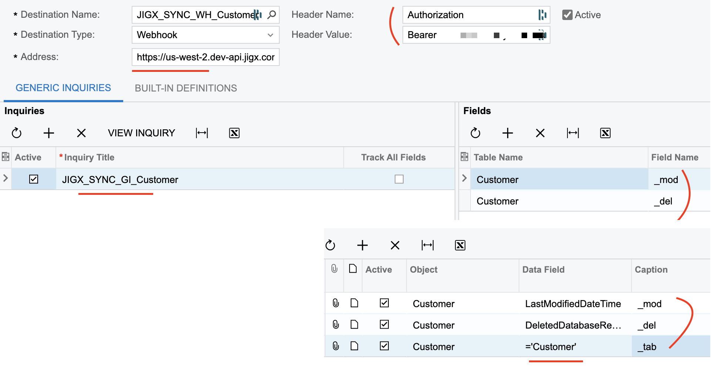

# Acumatica Push Notifications


The following information applies specifically to Acumatica integration.


## Acumatica

## Push Notifications

* In Acumatica, configure _push notification definitions_ to send updates to a notification destination (Jigx API endpoint) when specific data changes occur. For more information on setting up push notifications in Acumatica, refer to [Acumatica's Push Notifications](https://help.acumatica.com/\(W\(261\)\)/Wiki/ShowWiki.aspx?pageid=ba35054f-3485-415e-9785-da1195cb708b) documentation.

## Generic Inquiry (GI)

* Create a _Generic Inquiry (GI)_ in Acumatica with the following three output columns:
  * \_tab = 'Customer'
  * \_del (db deleted)
  * \_mod (time)
* Create a _push_ using the GI to the Jigx API endpoint.

<figure><figcaption><p>Acumatica Generic Inquiries</p></figcaption></figure>

## Jigx

## API Endpoint


```none
POST {{baseUrl}}/tool/organizations/:organizationId/solutions/:solutionId/acumatica/cdc?table=<table>
```


## Base URL

Replace \{{baseUrl\}} with the appropriate URL for your region.

<table><thead><tr><th width="221.76953125">Region</th><th>URL</th></tr></thead><tbody><tr><td>US</td><td><a href="https://us-east-1.api.jigx.com/v2.0">https://us-east-1.api.jigx.com/v2.0</a></td></tr><tr><td>South East (e.g. Australia)</td><td><a href="https://ap-southeast-2.api.jigx.com/v2.0">https://ap-southeast-2.api.jigx.com/v2.0</a></td></tr><tr><td>Europe</td><td><a href="https://eu-central-1.api.jigx.com/v2.0">https://eu-central-1.api.jigx.com/v2.0</a></td></tr></tbody></table>

## Authentication

* A **Personal Access Token (PAT)** is required. Get your PAT from [My Profile](https://docs.jigx.com/administration/my-profile#personal-access-tokens-pat) in :Link\[Jigx Management]{href="https://manage.jigx.com" newTab="true" hasDisabledNofollow="false"}.
* Enter the PAT as an API key with the prefix BEARER, for example, BEARER XXXXXXXXXX.

## Core elements

<table><thead><tr><th width="176.0234375">Element</th><th>Description</th></tr></thead><tbody><tr><td>organizationId</td><td><p>In Jigx Management under</p><p>organization details.</p></td></tr><tr><td>solutionId</td><td><p>In Jigx Management under</p><p>Solution Details.</p></td></tr><tr><td>baseURL</td><td>Refer to the Base URL table above to find the URL for your region.</td></tr><tr><td>acumatica-cdc</td><td>cdc is a standard term for change data capture.</td></tr><tr><td>&#x3C;table></td><td>The table created in Dynamic Data receives data changes pushed from Acumatica, which in turn updates the app. You can name the table whatever you like.</td></tr></tbody></table>

## Dynamic Data

The Acumatica _GI_ pushes data to the Jigx API endpoint, which then updates the corresponding table in Dynamic Data in [Jigx Management > Solution > Data >](https://docs.jigx.com/administration/solutions/data)

<figure><figcaption><p>Dynamic Data</p></figcaption></figure>

## Solutions

In the index.jigx file of the Jigx solution in Jigx Builder , configure the [onTableChange](../onTableChange.md) event. This event allows mobile updates in Jigx by monitoring data changes in the Dynamic Data table.
