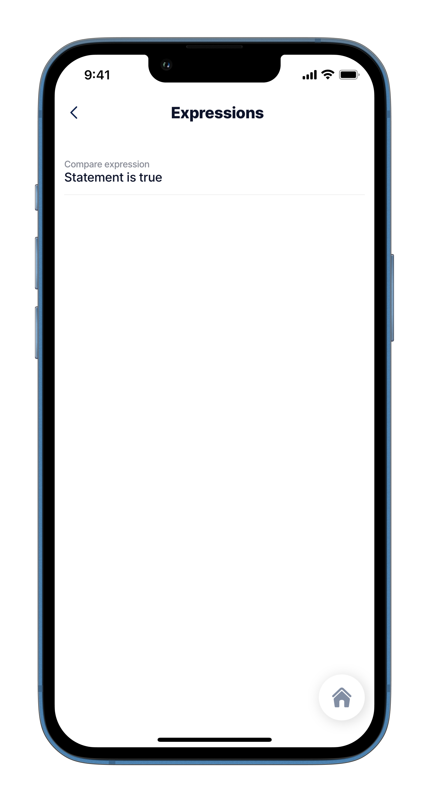

# Comparison Operators

Use JSONata comparison operators to compare values in your data and return a Boolean result (true or false) based on the comparison result, or use them for conditional logical expressions.

## Comparison operators

The operators used for comparing data are:

* [= (Equals)](https://docs.jsonata.org/comparison-operators#-equals)
* [!= (Not equals)](https://docs.jsonata.org/comparison-operators#-not-equals)
* [> (Greater than)](https://docs.jsonata.org/comparison-operators#-greater-than)
* [< (Less than)](https://docs.jsonata.org/comparison-operators#-less-than)
* [>= (Greater than or equals)](https://docs.jsonata.org/comparison-operators#-greater-than-or-equals)
* [<= (Less than or equals)](https://docs.jsonata.org/comparison-operators#-less-than-or-equals)
* [in (Inclusion)](https://docs.jsonata.org/comparison-operators#in-inclusion)

## Configuration

<table data-header-hidden><thead><tr><th width="172.19140625">Result</th><th>Expression</th></tr></thead><tbody><tr><td>Statement is true</td><td><code>value: "=@ctx.datasources.mydata.color = 'blue' and @ctx.datasources.mydata.number2 != 0 ? 'Statement is true':'Statement is false'"</code></td></tr></tbody></table>


Be careful when using complex expressions, such as expressions that iterate one datasource across another, as your solution performance could become slower. To avoid this, try to use the datasource queries to get the desired result rather than an expression.


## Examples and code snippets



<figure><figcaption><p>Comparison operators</p></figcaption></figure>



In this example the `color` and `number2` values are compared, if the color is blue and the vlaue of number2 is not equal to zero then the expression evalutes to True.

See the full code sample in [GitHub](https://github.com/jigx-com/jigx-samples/blob/main/quickstart/jigx-samples/jigs/guide-expressions/static-data/expression.jigx).&#x20;




```yaml
datasources:
  mydata: 
    type: datasource.static
    options:
      data:
        - name: Jane Stevens
          title: Doctor
          email: jane@first.com
          number: 0.64734
          number2: 12
          color: blue
          time: '2021-11-07T15:07:54.972Z'
          array: [5,1,2,3,7,9]

children:
  - type: component.entity
    options:
      children:
        - type: component.entity-field
          options:
            label: Compare expression
            value: "=@ctx.datasources.mydata.color = 'blue' and @ctx.datasources.mydata.number2 != 0 
                    ? 'Statement is true':'Statement is false'"
```

