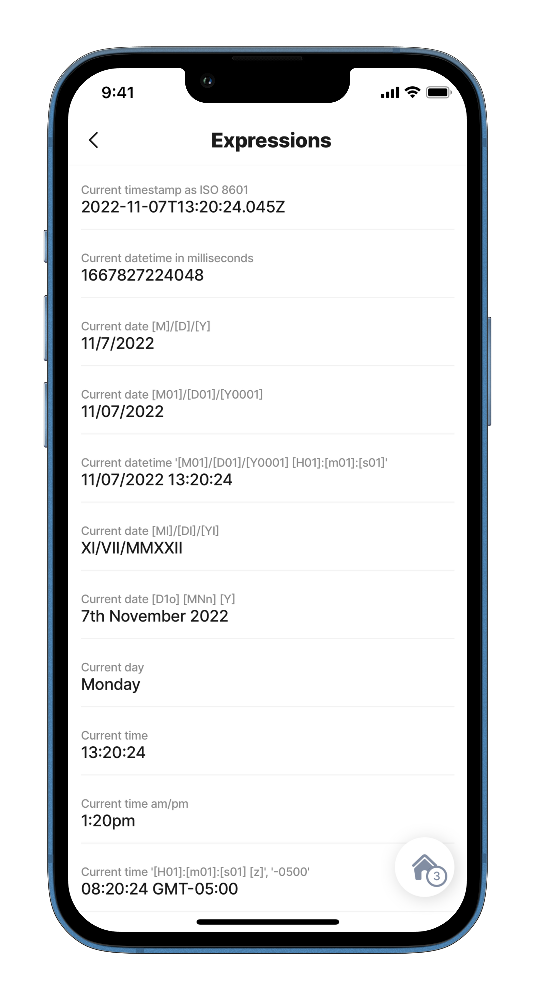

---
layout:
  width: wide
  title:
    visible: true
  description:
    visible: true
  tableOfContents:
    visible: true
  outline:
    visible: true
  pagination:
    visible: true
  metadata:
    visible: true
---

# Date & Time

Date and time expressions use the [JSONata Date/Time functions](https://docs.jsonata.org/date-time-functions) to return various formats of date/time, date, or time. These expressions are used to get the current timestamp in ISO 8601 formatted string, use an expression over the timestamp to convert the timestamp into a specific format.

## Configuration

<table><thead><tr><th width="256.296875">Result</th><th>Expression</th></tr></thead><tbody><tr><td>Current timestamp as ISO 8601</td><td><code>=$now()</code></td></tr><tr><td>Current datetime in milliseconds</td><td><code>=$toMillis($now())</code></td></tr><tr><td>Current date [M]/[D]/[Y]</td><td><code>=$fromMillis($toMillis($now()), '[M]/[D]/[Y]')</code></td></tr><tr><td>Current date [M01]/[D01]/[Y0001]</td><td><code>=$fromMillis($toMillis($now()), '[M01]/[D01]/[Y0001]')</code></td></tr><tr><td>Current datetime '[M01]/[D01]/[Y0001] [H01]:[m01]:[s01]'</td><td><code>=$fromMillis($toMillis($now()), '[M01]/[D01]/[Y0001] [H01]:[m01]:[s01]')</code></td></tr><tr><td>Current date [MI]/[DI]/[YI]</td><td><code>=$fromMillis($toMillis($now()), '[MI]/[DI]/[YI]')</code></td></tr><tr><td>Current date [D1o] [MNn] [Y]</td><td><code>=$fromMillis($toMillis($now()), '[D1o] [MNn] [Y]')</code></td></tr><tr><td>Current day</td><td><code>=$fromMillis($toMillis($now()), '[FNn]')</code></td></tr><tr><td>Current time</td><td><code>=$fromMillis($toMillis($now()), '[H01]:[m01]:[s01]')</code></td></tr><tr><td>Current time am/pm</td><td><code>=$fromMillis($toMillis($now()), '[h#1]:[m01][P]')</code></td></tr><tr><td>Current time '[H01]:[m01]:[s01] [z]', '-0500'</td><td><code>=$fromMillis($toMillis($now()), '[H01]:[m01]:[s01] [z]', '-0500')</code></td></tr><tr><td>Convert UTC to milliseconds</td><td><code>=$toMillis()</code></td></tr><tr><td>Convert millisecond to UTC</td><td><code>=$fromMillis()</code></td></tr></tbody></table>

## Consideration

* When using `=$now()` on a component level, the date/time is not refreshed when navigating out and into the jig. To cater to this scenario, add an `onFocus` with a `set-state` action to the jig.



```yaml
children:
  - type: component.entity
    options:
      children:
        - type: component.entity-field
          options:
            label: Order Date
            value: =@ctx.solution.state.now
```



```yaml
onFocus: 
  type: action.set-state
  options:
    state: =@ctx.solution.state.now
    value: =$now()
```




Be careful when using complex expressions, such as expressions that iterate one datasource across another, as your solution performance could become slower. To avoid this, try to use the datasource queries to get the desired result rather than an expression.&#x20;


## Examples and code snippets



<figure><figcaption><p>Date &#x26; time expressions</p></figcaption></figure>



This example uses a `component.enitity` to show the results of various date/time functions

See the full code sample in [GitHub](https://github.com/jigx-com/jigx-samples/blob/main/quickstart/jigx-samples/jigs/guide-expressions/static-data/expression.jigx).




```yaml
children:
  - type: component.entity
    options:
      children:
        - type: component.entity-field
          options:
            label: Current timestamp as ISO 8601
            value: =$now()
        - type: component.entity-field
          options:
            label: Current datetime in milliseconds
            value: =$toMillis($now())
        - type: component.entity-field
          options:
            label: Current date [M]/[D]/[Y]
            value: =$fromMillis($toMillis($now()), '[M]/[D]/[Y]')
        - type: component.entity-field
          options:
            label: Current date [M01]/[D01]/[Y0001]
            value: =$fromMillis($toMillis($now()), '[M01]/[D01]/[Y0001]')
        - type: component.entity-field
          options:
            label: Current datetime '[M01]/[D01]/[Y0001] [H01]:[m01]:[s01]'
            value: =$fromMillis($toMillis($now()), '[M01]/[D01]/[Y0001] [H01]:[m01]:[s01]')
        - type: component.entity-field
          options:
            label: Current date [MI]/[DI]/[YI]
            value: =$fromMillis($toMillis($now()), '[MI]/[DI]/[YI]')
        - type: component.entity-field
          options:
            label: Current date [D1o] [MNn] [Y]
            value: =$fromMillis($toMillis($now()), '[D1o] [MNn] [Y]')
        - type: component.entity-field
          options:
            label: Current day
            value: =$fromMillis($toMillis($now()), '[FNn]')
        - type: component.entity-field
          options:
            label: Current time
            value: =$fromMillis($toMillis($now()), '[H01]:[m01]:[s01]')
        - type: component.entity-field
          options:
            label: Current time am/pm
            value: =$fromMillis($toMillis($now()), '[h#1]:[m01][P]')
        - type: component.entity-field
          options:
            label: Current time '[H01]:[m01]:[s01] [z]', '-0500'
            value: =$fromMillis($toMillis($now()), '[H01]:[m01]:[s01] [z]', '-0500')
```

