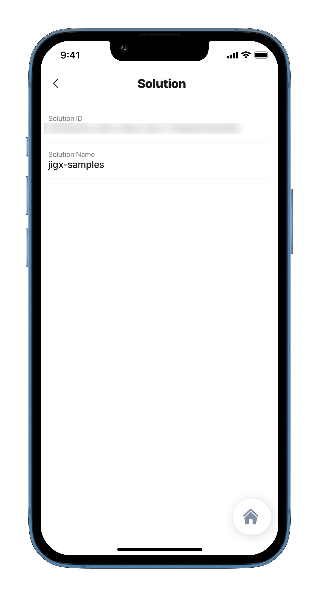

---
layout:
  width: wide
  title:
    visible: true
  description:
    visible: true
  tableOfContents:
    visible: true
  outline:
    visible: true
  pagination:
    visible: true
  metadata:
    visible: true
---

# Jigx Variables

## Jigx Variables

Jigx has a set of variables that can be used in expressions to manipulate data specific to a Jigx App, for example, determining the logged-in user, or the Jigx organization and solution.

## Organization

The `organization` variable is used to get information about the actual organization in Jigx, such as your Jigx organization's id.

## Configuration

| Result | Expression              |
| ------ | ----------------------- |
| id     | `=@ctx.organization.id` |

## Examples and code snippets



<figure><figcaption><p>Organization expression</p></figcaption></figure>



This example returns the organization's `id` . Each organization configured in [Organization Settings](<Jigx Variables.md>) in Jigx Management and will have a unique id. See the full code sample in [GitHub](https://github.com/jigx-com/jigx-samples/blob/main/quickstart/jigx-samples/jigs/guide-expressions/static-data/organization.jigx).



```yaml
children:
  - type: component.entity
    options:
      children:
        - type: component.entity-field
          options:
            label: Organization ID
            value: =@ctx.organization.id
```

## System

The system variable in an expression is used to get information about devices, for example, you can find information about the internet connection of the device, the language preference, the device's timezone and location details. System expressions are configured by `=@ctx.system.` followed by the specific variable name.

## Configuration

The supported variables for the system variable are:

<table><thead><tr><th width="146.71875">Variable</th><th width="261.40234375">Expression</th><th>Results</th></tr></thead><tbody><tr><td>appVersion</td><td><code>=@ctx.system.appVersion</code></td><td>This variable returns the current version of the installed app, which is useful for troubleshooting, crash tracing, and debugging issues. E.g. 1.110.7</td></tr><tr><td>deviceType</td><td><code>=@ctx.system.deviceType</code></td><td>The variable returns the current user's device type, such as tablet or handset.</td></tr><tr><td>geocodes</td><td><code>=@ctx.system.geocodes</code></td><td></td></tr><tr><td>isOffline</td><td><code>=@ctx.system.isOffline</code></td><td>Boolean</td></tr><tr><td>isOnline</td><td><code>=@ctx.system.isOnline</code></td><td>Boolean</td></tr><tr><td>isPortrait</td><td><code>=@ctx.system.isPortrait</code></td><td>The variable is set with a boolean and is used to configure the behavior of components in either portrait or landscape mode.</td></tr><tr><td>locale</td><td><code>=@ctx.system.locale</code></td><td></td></tr><tr><td>user</td><td><code>=@ctx.user.email</code> or <code>=@ctx.user.id</code></td><td>or XXXXXXXX-XXXX-XXXX-XXXX-XXXXXXXXXXXX</td></tr><tr><td>isLocationSharingEnabled</td><td><code>=@ctx.system.isLocationSharingEnabled</code></td><td>Boolean</td></tr><tr><td>solution</td><td><code>=@ctx.solution.id</code></td><td>XXXXXXXX-XXX-XXXX-XXXX-XXXXXXXXXXXX</td></tr><tr><td>timezone</td><td><code>=@ctx.system.timezone.offset</code></td><td>Get the information about the device's timezone, it can be: -<code>name</code>: e.g. Europe/Prague -<code>offset</code>: e.g. +200</td></tr><tr><td>geolocation</td><td></td><td><p><strong>Accuracy:</strong> <code>=@ctx.system.geolocation.coords.accuracy</code></p><p><strong>Altitude:</strong> <code>=@ctx.system.geolocation.coords.altitude</code></p><p><strong>Altitude Accuracy:</strong> <code>=@ctx.system.geolocation.coords.altitudeAccuracy</code></p><p><strong>Location - Heading:</strong> <code>=@ctx.system.geolocation.coords.heading</code></p><p><strong>Location - Latitude:</strong> <code>=@ctx.system.geolocation.coords.latitude</code></p><p><strong>Location - Longitude:</strong> <code>=@ctx.system.geolocation.coords.longitude</code></p><p><strong>Location - Speed:</strong> <code>=@ctx.system.geolocation.coords.speed</code></p><p><strong>Location - Timestamp:</strong> <code>=@ctx.system.geolocation.timestamp</code></p><p><strong>Location - Entire array (All details):</strong> <code>=$string(@ctx.system.geolocation)</code></p></td></tr></tbody></table>

## Examples and code snippets

### System isOffline



<figure><figcaption><p>System expression</p></figcaption></figure>



With this expression, you can disable the action button to prevent it from being pressed if the device is offline.

See the full code sample in [GitHub](https://github.com/jigx-com/jigx-samples/blob/main/quickstart/jigx-samples/jigs/guide-expressions/static-data/expression.jigx)




```yaml
actions:
  - children:
      - type: action.go-to
        options:
          style:
            isDisabled: =@ctx.system.isOffline = true
          title: Go to action
          linkTo: advanced-expressions
```


### System timezone



This example uses `system.timezone` to get the information about the device's timezone, it can be the `name` of the timezone or the `offset`. Use it further to convert date/time using [Date & Time](<Date _ Time.md>) expressions into the format that you require.

See the full code sample in [GitHub](https://github.com/jigx-com/jigx-samples/blob/main/quickstart/jigx-samples/jigs/guide-expressions/static-data/expression.jigx).



<figure><figcaption><p>System timezone expression</p></figcaption></figure>



```yaml
children:
  - type: component.entity
    options:
      children:
        - type: component.entity-field
          options:
            label: Timezone name
            value: =@ctx.system.timezone.name
        - type: component.entity-field
          options:
            label: Timezone offset
            value: =@ctx.system.timezone.offset
```

### System geolocation



<figure><figcaption><p>system geolocation expression</p></figcaption></figure>



This example shows how you can use `system.geolocation` to get the device's location (details).

See the full code sample in [GitHub](https://github.com/jigx-com/jigx-samples/blob/main/quickstart/jigx-samples/jigs/guide-expressions/static-data/geolocation.jigx).



```yaml
children: 
  - type: component.entity
    options:
      children:
        - type: component.entity-field
          options:
            label: System Location - Accuracy
            value: =@ctx.system.geolocation.coords.accuracy
        - type: component.entity-field
          options:
            label: System Location - Altitude
            value: =@ctx.system.geolocation.coords.altitude
        - type: component.entity-field
          options:
            label: System Location - Altitude Accuracy
            value: =@ctx.system.geolocation.coords.altitudeAccuracy
        - type: component.entity-field
          options:
            label: System Location - Heading
            value: =@ctx.system.geolocation.coords.heading
        - type: component.entity-field
          options:
            label: System Location - Latitude
            value: =@ctx.system.geolocation.coords.latitude
        - type: component.entity-field
          options:
            label: System Location - Longitude
            value: =@ctx.system.geolocation.coords.longitude
        - type: component.entity-field
          options:
            label: System Location - Speed
            value: =@ctx.system.geolocation.coords.speed
        - type: component.entity-field
          options:
            label: System Location - Timestamp
            value: =@ctx.system.geolocation.timestamp
            contentType: time
        - type: component.entity-field
          options:
            label: System Location - Entire array (All details)
            value: =$string(@ctx.system.geolocation)

```

### System appVersion & deviceType

Device information is important to identify the types of devices and the app version users are using. This is useful for troubleshooting issues and diagnosing app crashes. The details can be retrieved in multiple ways when using the system variable, such as on the app screen or when connected to Jigx dev tools in Jigx Builder.

<figure><figcaption><p>Jigx dev tools for debugging</p></figcaption></figure>

```yaml
children:
  - type: component.entity
    options:
      children:
        - type: component.entity-field
          options:
            label: AppVersion
            value: =@ctx.system.appVersion
        - type: component.entity-field
          options:
            label: Device Type
            value: =@ctx.system.deviceType 
```

### System isLocationSharingEnabled



See the example using dynamic data in GitHub.



<figure><figcaption></figcaption></figure>



```yaml
  onFinish: 
            type: action.confirm
            options:
              isConfirmedAutomatically: false
              onConfirmed: 
                type: action.go-back
              modal:
                title: Enjoy your pizza
      # Add the ability to stop sharing your location 
      - type: action.stop-location-sharing
        when: =@ctx.system.isLocationSharingEnabled
        options:
          title: Stop sharing
```

## User

## Configuration

<table><thead><tr><th width="115.625">Result</th><th>Expression</th></tr></thead><tbody><tr><td>Name</td><td><code>=@ctx.user.displayName</code></td></tr><tr><td>Email</td><td><code>=@ctx.user.email</code></td></tr><tr><td>id</td><td><code>=@ctx.user.id</code></td></tr></tbody></table>

## Examples and code snippets



The _user_ is used to get information about the logged-in user, for example, name, and email.

See the full code sample in [GitHub](https://github.com/jigx-com/jigx-samples/blob/main/quickstart/jigx-samples/jigs/guide-expressions/static-data/user.jigx).



<figure><figcaption><p>User expression</p></figcaption></figure>




```yaml
children:
  - type: component.entity
    options:
      children:
        - type: component.entity-field
          options:
            label: User Display Name
            value: =@ctx.user.displayName
        - type: component.entity-field
          options:
            label: User Email
            value: =@ctx.user.email
        - type: component.entity-field
          options:
            label: User Id
            value: =@ctx.user.id
```


## Solution

The `solution` variable is used to get information about the specific Jigx solution, for example, name, and id. [Custom variables](<Jigx Variables.md>) can be set in [Solution Settings](<Jigx Variables.md>) in Jigx Management, and the variable value referenced in the solution expression.

## Configuration

<table><thead><tr><th width="133.98046875">Result</th><th>Expression</th></tr></thead><tbody><tr><td>name</td><td><code>=@ctx.solution.name</code></td></tr><tr><td>id</td><td><code>=@ctx.solution.id</code></td></tr><tr><td>variable value</td><td><code>=@ctx.solution.settings.custom.variableName</code></td></tr></tbody></table>

## Examples and code snippets

### Solution Id and name



<figure><figcaption><p>Solution expression</p></figcaption></figure>



This example shows how to get the solution's id and name using the `solution` variable.

See the full code sample in [GitHub](https://github.com/jigx-com/jigx-samples/blob/main/quickstart/jigx-samples/jigs/guide-expressions/static-data/solution.jigx)



```yaml
children:
  - type: component.entity
    options:
      children:
        - type: component.entity-field
          options:
            label: Solution ID
            value: =@ctx.solution.id
        - type: component.entity-field
          options:
            label: Solution Name
            value: =@ctx.solution.name
```

### Solution settings - custom variable

<figure><figcaption></figcaption></figure>

```yaml
children:
  - type: component.entity
    options:
      children:
        - type: component.entity-field
          options:
            rightIcon: cursor-click-computers
            label: Click to view the report in SharePoint
# Reference the custom variable set in Management in the expression            
            value: =@ctx.solution.settings.custom.SharePoint_URL
```
