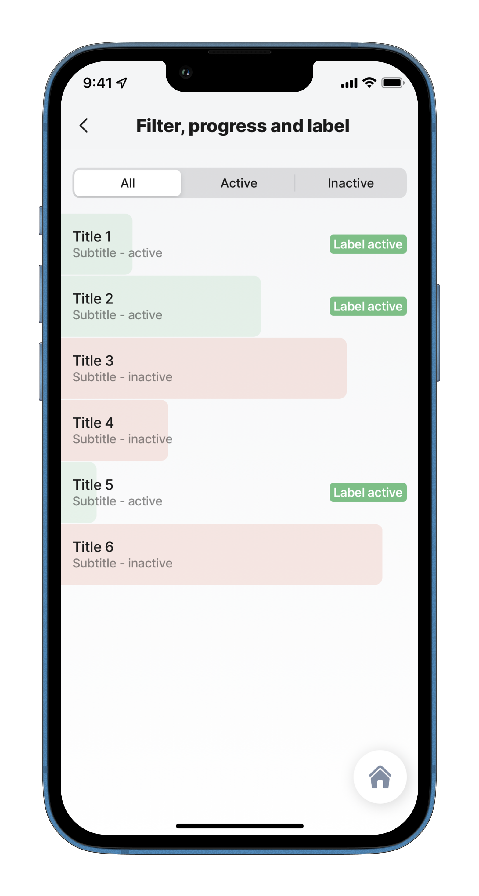

# Path Operators

JSONata path operators are used for navigating and accessing specific elements or properties within a data set.

## Path operators

The operators include:

* [. (Map)](https://docs.jsonata.org/path-operators#-map)
* [\[ ... \] (Filter)](https://docs.jsonata.org/path-operators#---filter)
* [^( ... ) (Order-by)](https://docs.jsonata.org/path-operators#---order-by)
* [{ ... } (Reduce)](https://docs.jsonata.org/path-operators#---reduce)
* [\* (Wildcard)](https://docs.jsonata.org/path-operators#-wildcard)
* [\*\* (Descendants)](https://docs.jsonata.org/path-operators#-descendants)
* [% (Parent)](https://docs.jsonata.org/path-operators#-parent)
* [# (Positional variable binding)](https://docs.jsonata.org/path-operators#-positional-variable-binding)
* [@ (Context variable binding)](https://docs.jsonata.org/path-operators#-context-variable-binding)

## Configuration

<table><thead><tr><th width="257.97265625">Result</th><th>Expression</th></tr></thead><tbody><tr><td>Filter a list according to a value</td><td><code>=$filter(@ctx.datasources.filter-list, function($v){$contains($string($v.status), $string(@ctx.components.filter-list.state.filter != null ? @ctx.components.filter-list.state.filter:'')) })[]</code></td></tr></tbody></table>


Be careful when using complex expressions, such as expressions that iterate one datasource across another, as your solution performance could become slower. To avoid this, try to use the datasource queries to get the desired result rather than an expression.


## Examples and code snippets

### Filtering data



<figure><figcaption><p>Static filter</p></figcaption></figure>



In this example the `Filter` path operator is used to create a filter for data records marked as Active or Inactive. **Example**: See the full code sample in [GitHub](%22https:/github.com/jigx-com/jigx-samples/blob/main/quickstart/jigx-samples/jigs/guide-expressions/static-data/filter.jigx).




```yaml
title: Filter, progress and label 
type: jig.list
  
datasources:
  filter-list:
    type: datasource.static
    options:
      data:
        - title: Title 1
          subtitle: Subtitle - active
          status: 'active'
          progress: 0.2
        - title: Title 2
          subtitle: Subtitle - active
          status: 'active'
          progress: 0.56
        - title: Title 3
          subtitle: Subtitle - inactive
          status: 'inactive'
          progress: 0.8
        - title: Title 4
          subtitle: Subtitle - inactive
          status: 'inactive'
          progress: 0.3
        - title: Title 5
          subtitle: Subtitle - active
          status: 'active'
          progress: 0.1
        - title: Title 6
          subtitle: Subtitle - inactive
          status: 'inactive'
          progress: 0.9

filter:
  - title: All
    value: ""
  - title: Active
    value: active
  - title: Inactive
    value: inactive
      
data:
  =$filter(@ctx.datasources.filter-list, function($v, $a, $i) { @ctx.jig.state.filter = "" or $v.status = @ctx.jig.state.filter })[]
    
item: 
  type: component.list-item
  options:
    title: =@ctx.current.item.title
    subtitle: =@ctx.current.item.subtitle
    progress: =@ctx.current.item.progress
    color:
      - when: =@ctx.current.item.status = 'active'
        color: color2
      - when:  =@ctx.current.item.status  = 'inactive'
        color: color4
    label:
      title: Label active
      isHidden: =@ctx.current.item.status  = 'inactive'
      color:
        - when: =@ctx.current.item.status = 'active'
          color: color2
```


### Searching data



Write an expression to add a search field when using **static data**. The character **\[]** at the end is very important. Even one item only will be displayed.

**Search:** See the full code sample in [GitHub](https://github.com/jigx-com/jigx-samples/blob/main/quickstart/jigx-samples/jigs/guide-expressions/static-data/search.jigx).



<figure><figcaption><p>Search static data</p></figcaption></figure>




```yaml
children:
  - type: component.list
    instanceId: listOfEmployees
    options:
      isSearchable: true
      data: =$filter(@ctx.datasources.employees, function($v){@ctx.datasources.employees ? $contains($string($v.name),$string(@ctx.components.listOfEmployees.state.searchText != null ? @ctx.components.listOfEmployees.state.searchText:'')) :true})[]
      maximumItemsToRender: 8
      item: 
        type: component.list-item
        options:
          title: =@ctx.current.item.name
          subtitle: =@ctx.current.item.position
          leftElement: 
            element: avatar
            text: N/A
            uri: =@ctx.current.item.img
```

