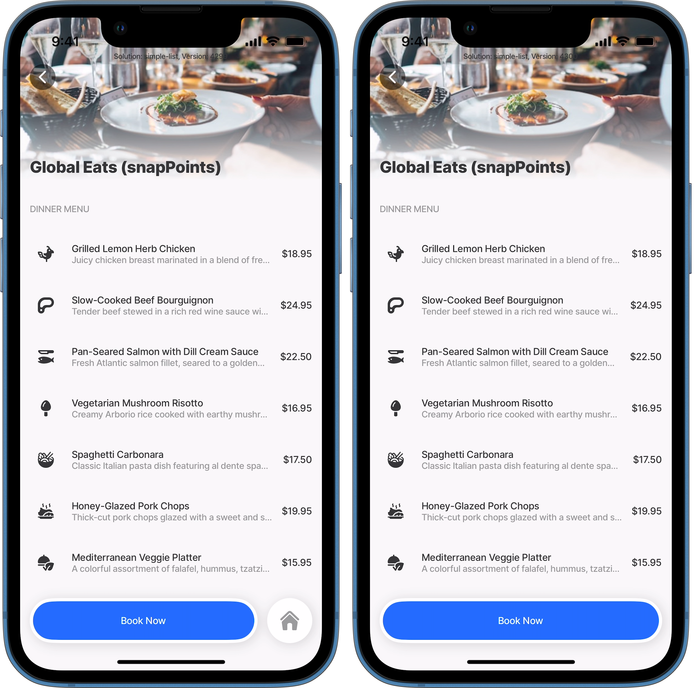

---
layout:
  width: wide
  title:
    visible: true
  description:
    visible: true
  tableOfContents:
    visible: true
  outline:
    visible: true
  pagination:
    visible: true
  metadata:
    visible: true
---

# Common jig type properties

Certain properties are shared across all jig types, ensuring consistency and flexibility in configuration. These common properties allow you to define behaviors, appearance, and functionality that apply universally, regardless of the specific jig type being used. This simplifies the setup process and helps maintain uniformity across different jigs.

These common properties include:

* badges
* [bottomSheet (Beta)](<Common jig type properties/bottomSheet _Beta_.md>)
* icons
* isSearchable
* filter
* [when](<../Components/Common component properties.md>)
* Home button visibility

## bottomSheet (Beta)

The bottomSheet element slides up from the bottom of the screen to present additional content, actions, or contextual information. See [bottomSheet (Beta)](<Common jig type properties/bottomSheet _Beta_.md>) for more information.

## Home button visibility

By default, the home button is visible on all jigs except the Home Hub. You can hide the home button on a jig if needed by setting the `isHomeButtonVisible` property to `false`. You can even dynamically show or hide the home button.

<figure><figcaption><p>Visible &#x26; hidden home button</p></figcaption></figure>


```yaml
title: Global Eats
type: jig.default
# Home button is visible by default, 
# set to false, hides the button on the jig.
# Use expressions to dynamically show or hide the home button. 
isHomeButtonVisible: false
```


**Considerations:**

* In some cases, keeping the home button visible can create extra spacing at the bottom of the jig or cause the home button to shift above or below other components.
  * Hiding the home button when using the [chat](../Components/chat.md) component ensures optimal use of the full screen for chat messages. If not hidden, the message field and send button are pushed up, and the home button appears beneath them.
  * When using two primary actions on a jig with the home button visible, results in the home button displaying above the action bar.
  * Similarly, when using the [summary](../Components/summary.md) component without hiding the home button, the home button is displayed above the summary.
  * Using [bottomSheet (Beta)](<Common jig type properties/bottomSheet _Beta_.md>) or [go-to](../Actions/go-to.md) with `isModal`, the modal overlays the home button on the main jig.

## isSearchable&#x20;

Setting the `isSearchable` property to `true` adds a search field at the top of the screen. By default screens display without search fields. The property is set at the root level of the jig. The property can be used together with the filter property for enhanced data filtering, the search field finds the relevant data in the active tab.


```yaml
title: Search List (Dynamic)
description: A dynamic list displaying search functionality
type: jig.list
icon: notes-paper-approve
isSearchable: true
```


**Requirements**:

1. **Datasource Integration**: The search functionality requires a datasource configuration.
2. **QueryParameters Binding**: The datasource query must include a search parameter binding.
3. **State Access**: The search text is accessible via  `=@ctx.jig.state.searchText`


```yaml
datasources:
  cleaning-services-dynamic:
    type: datasource.sqlite
    options:
      provider: DATA_PROVIDER_DYNAMIC
      entities:
        - entity: default/cleaning-services
      query: |
        SELECT 
          id, 
          '$.area',
          '$.description',
          '$.hourlyrate', 
          '$.illustration', 
          '$.image', 
          '$.indoor',
          '$.onceoffrate', 
          '$.service', 
          '$.time' 
        FROM [default/cleaning-services] 
        WHERE '$.service' LIKE '%'||@search||'%' OR @search IS NULL
      queryParameters:
        search: =@ctx.jig.state.searchText
```


## filter

The `filter` property creates tabbed filter options to categorize and filter data.


```yaml
filter:
  initialValue: [optional_default_tab_value]
  data:
    - title: "Tab Display Name"
      value: "filter_value"
    - title: "Tab Display Name"  
      value: "filter_value"
```

