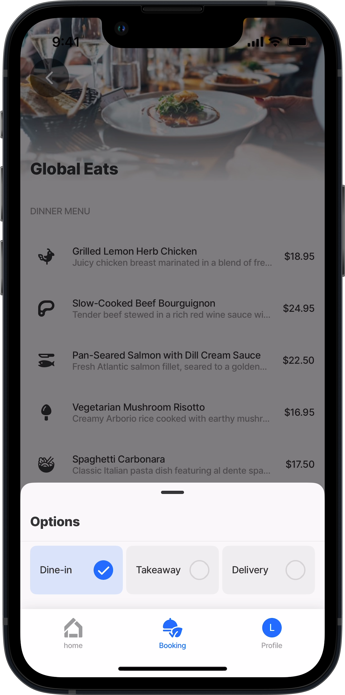
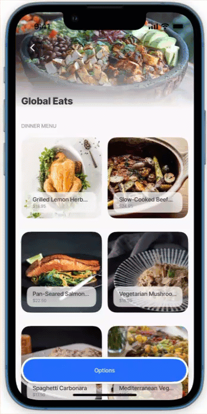
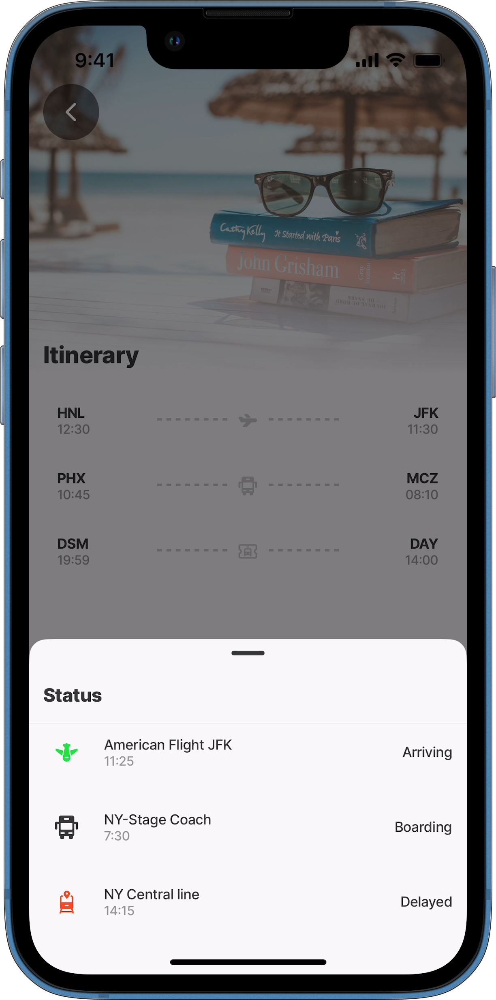
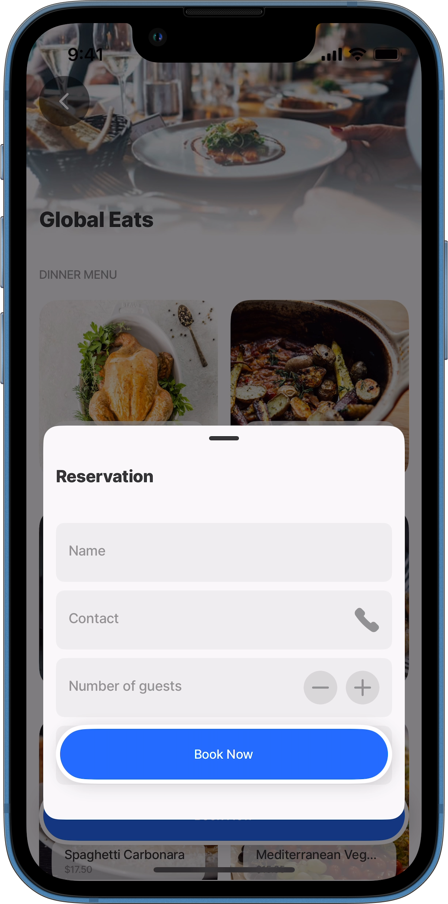
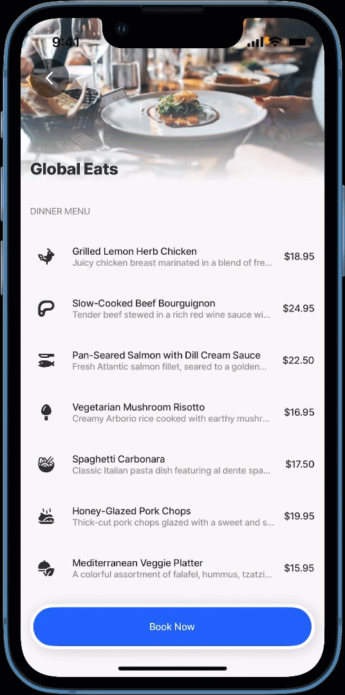

---
layout:
  width: wide
  title:
    visible: true
  description:
    visible: true
  tableOfContents:
    visible: true
  outline:
    visible: true
  pagination:
    visible: true
  metadata:
    visible: true
---

# bottomSheet (Beta)


BETA: This feature is currently in **beta**. Functionality and design may change as we continue to improve the experience. Any bugs discovered must be logged via [support@jigx.com](mailto:support@jigx.com).


The bottomSheet element slides up from the bottom of the screen to present additional content, actions, or contextual information. It enhances user interaction by providing a seamless display of information without navigating away from the current screen. Perfect for menus, filters, forms, or quick actions, the bottomSheet can be customized to suit various use cases while maintaining a smooth and intuitive user experience.

<figure><figcaption><p>BottomSheets</p></figcaption></figure>

## Configuration options

<table><thead><tr><th width="231.0625">Core structure</th><th></th></tr></thead><tbody><tr><td><code>jigId</code></td><td>Provide the <code>jigId</code> for the jigs that will be displayed when the bottomSheet is opened. - <code>instanceId</code> - Give the bottomSheet jig a unique identifier allowing you to reference the jig in expressions. - <code>inputs</code>- Specify the inputs related to the the jigs.</td></tr></tbody></table>

<table><thead><tr><th width="234.625">Other options</th><th></th></tr></thead><tbody><tr><td><code>isPanDownToCloseEnabled</code></td><td>Enable pan down gesture to close the sheet. Swiping or dragging downward while maintaining contact with the screen closes the sheet. Setting this to <code>false</code> disables closing the sheet by dragging down; instead, tapping outside the sheet on the jig will close it.</td></tr><tr><td><code>backDrop</code></td><td>The <code>backdrop</code> property controls the visibility of the jig content displayed beneath the bottomSheet. <code>appearsOnIndex</code> - Specifies the ID of the <code>snapPoint</code> at which the <code>backdrop</code> will appear. This value is a number starting from 0 and depends on the number of <code>snapPoints</code> configured. Example snapPoints configured: <code>snapPoints:</code> <code>- 30%</code> <code>- 50%</code> Example backdrop configuration: <code>backdrop:</code> <code>appearsOnIndex: 0</code> <code>disappearsOnIndex: 1</code> <code>disappearsOnIndex</code> - Specifies the ID of the snapPoint at which the backdrop will disappear. Like <code>appearsOnIndex</code>, the value starts at 0 and corresponds to the configured snapPoints. <code>isVisible</code> - Determines whether the backdrop is enabled.- <code>true</code> - Enables the backdrop, adding a grey overlay to the parent jig.- <code>false</code> - Disables the backdrop, rendering the parent jig without an overlay. Default: <code>true</code>. <code>opacity</code> - Sets the transparency level of the jig content under the bottomSheet. Acceptable values range from 0.1 (very transparent) to 1(fully opaque).</td></tr><tr><td><code>isDetached</code></td><td>When set to <code>true</code>, the modal detaches from the jig and slides up independently from the bottom of the screen.</td></tr><tr><td><code>initialValue</code></td><td>Setting the <code>initialValue</code> with the <code>jigId</code> ensures that the bottomSheet is open when the parent jig loads.</td></tr><tr><td><code>position</code></td><td>Determine the open position of the bottomSheet. Options are <code>left</code>, <code>middle</code> or <code>right</code>. <strong>Note</strong>: This property is specific to tablets.</td></tr><tr><td><code>snapIndex</code></td><td>Specifies the initial <code>snapPoint</code> to which the bottomSheet should open. The value is a number starting from 0 and corresponds to the configured <code>snapPoints</code>.</td></tr><tr><td><code>snapPoints</code></td><td><p>Defines the points where the bottomSheet will snap when opened. These points should be configured in ascending order, from the smallest to the largest, and are set as percentages. Examples:</p><ul><li>The <code>bottomSheet</code> covers the entire jig: <code>snapPoints:</code> <code>- 100%</code> The <code>bottomSheet</code> covers the 30% on first snap and 60% on the second snap <code>snapPoints:</code> <code>- 30%</code> <code>- 60%</code></li></ul></td></tr><tr><td><code>width</code></td><td>Select the width of the bottomSheet from <code>small</code>, <code>medium</code>, or <code>large</code>. <strong>Note:</strong> This property is specific to tablets.</td></tr></tbody></table>

## Considerations

* **Multiple bottomSheets:** Multiple `bottomSheets` can be configured. When doing so, the `action.go-to` for the second `bottomSheet` must be configured in the parent jig. Refer to the _Multiple BottomSheets_ example below.
* **Order of actions:** When configuring multiple actions, carefully consider the order of the action list. Certain actions should be executed before the `action.go-to` that opens the bottomSheet. For instance, a `execute-entity` action to save data should be performed before opening the bottomSheet.
* **Testing:** Configuring the bottomSheet requires careful setup and testing to ensure the jig content displays correctly and the bottomSheet renders as expected. Test on multiple devices to confirm the bottomSheet functions properly across all supported devices.
* **Global properties:** BottomSheet properties can be set globally, applying the same settings to all jigs specified in the bottomSheet. These properties are configured directly under the bottomSheet property.
* **Local properties (per jig):** BottomSheet properties can also be set individually for each jig. For instance, when multiple bottomSheets are configured, each jig may require unique settings, such as different heights or content. These properties are configured directly under each `jigId` property.
* **Navigating to jigs**: To navigate to another screen from the bottomSheet specify `isModal: false` to explicitly open the jig outside of the bottomSheet.
* **Retrieving Outputs from the bottomSheet**: When you navigate to a jig using the `action.go-to`  to open the bottom modal (by setting `isModal: true`), you can access the outputs from that jig by referencing its `instanceId` in your context expressions. In the originating jig, use the syntax `=@ctx.jigs.[isntance-id-of-the-jig].outputs.[key-of-output]` to retrieve specific output values. See the [Accessing jig outputs from a modal](../../Actions/go-to.md#accessing-jig-outputs-from-a-modal) example.

## Examples and code snippets

### Basic bottomSheet



<figure><figcaption><p>Basic bottomSheet</p></figcaption></figure>



Here is a simple example of a menu that is configured to open a `bottomSheet` with options to order the food. The Options `jigId` is specified under the bottomSheet property.





```yaml
title: Global Eats 
type: jig.default

header:
  type: component.jig-header
  options:
    height: small
    children:
      type: component.image
      options:
        source:
          uri: https://images.unsplash.com/photo-1414235077428-338989a2e8c0?w=500&auto=format&fit=crop&q=60&ixlib=rb-4.0.3&ixid=M3wxMjA3fDB8MHxzZWFyY2h8OHx8cmVzdHVyYW50JTIwZm9vZHxlbnwwfHwwfHx8MA%3D%3D
                    
children:
  - type: component.section
    options:
      title: Dinner Menu
      children:
        - type: component.list
          options:
            data: =@ctx.datasources.menu-list
            maximumItemsToRender: 8
            item: 
              type: component.list-item
              options:
                title: =@ctx.current.item.option
                subtitle: =@ctx.current.item.description
                leftElement: 
                  element: icon
                  icon: =@ctx.current.item.icon
                rightElement: 
                  element: value
                  text: =@ctx.current.item.price
# Configure the jig that will open as the bottomSheet.
# Use the jigId to specify the jig by name that will open in the bottomSheet.    
bottomSheet:
  children:
    - jigId: options
# Configuring a bottomSheet requires that the go-to action be set,
# with the same jig name as in the jigId specified in the linkTo property.
# isModal set to true is required for the jig to open in the bottomSheet, 
# if not set, then normal navigation will take place.
actions:
  - children:
      - type: action.go-to
        options:
          title: Options
          linkTo: options
          isModal: true
```



```yaml
# Jig that opens in the bottomSheet.
title: Options
type: jig.default

datasources:
  restaurant-options: 
    type: datasource.static
    options:
      data:
        - id: 1
          booking: Dine-in 
          icon: restaurant-seat
        - id: 2
          booking: Takeaway 
          icon: food-delivery-bag
        - id: 3
          booking: Delivery 
          icon: restaurant-food-truck

children:
  - type: component.form
    instanceId: rest-options
    options:
      isDiscardChangesAlertEnabled: false
      children:
        - type: component.choice-field
          instanceId: eating-options
          options:
            itemsPerRow: 3
            label: Restaurant options
            data: =@ctx.datasources.restaurant-options
            item:
              type: component.choice-field-item
              options:
                title: =@ctx.current.item.booking
                value: =@ctx.current.item.booking
```



```yaml
name: global-eats
title: global-eats
category: business      

tabs:
  Booking: 
    jigId: bottomsheet-basic
    icon: vegan-vegetarian-food-dome
```



```yaml
datasources:
  menu-list: 
    type: datasource.static
    options:
      data:
        - id: 1
          option: Grilled Lemon Herb Chicken
          description: Juicy chicken breast marinated in a blend of fresh lemon, rosemary, thyme, and garlic. Grilled to perfection and served with roasted vegetables and a side of garlic mashed potatoes.
          price: $18.95
          icon: chicken-body 
        - id: 2
          option: Slow-Cooked Beef Bourguignon
          description: Tender beef stewed in a rich red wine sauce with pearl onions, carrots, and mushrooms. Accompanied by buttered egg noodles or crusty bread for dipping.
          price: $24.95
          icon: barbecue-steak
        - id: 3
          option: Pan-Seared Salmon with Dill Cream Sauce
          description: Fresh Atlantic salmon fillet, seared to a golden crisp, topped with a creamy dill and lemon sauce. Served with wild rice pilaf and steamed asparagus.
          price: $22.50
          icon: fishing-bait-fish 
        - id: 4
          option: Vegetarian Mushroom Risotto
          description: Creamy Arborio rice cooked with earthy mushrooms, white wine, and parmesan cheese. Garnished with fresh parsley and a drizzle of truffle oil.
          price: $16.95
          icon: vegetable-mushroom-2 
        - id: 5
          option: Spaghetti Carbonara
          description: Classic Italian pasta dish featuring al dente spaghetti tossed with crispy pancetta, eggs, and Parmesan cheese. Finished with freshly cracked black pepper.
          price: $17.50
          icon: asian-food-noodle-ramen-bowl 
        - id: 6
          option: Honey-Glazed Pork Chops
          description: Thick-cut pork chops glazed with a sweet and savory honey-mustard sauce. Served with roasted sweet potatoes and sautéed green beans.
          price: $19.95
          icon: asian-food-barbeque-sucking-pork-roasted 
        - id: 7
          option: Mediterranean Veggie Platter
          description: A colorful assortment of falafel, hummus, tzatziki, tabbouleh, and warm pita bread. Paired with a Greek salad of cucumbers, tomatoes, olives, and feta cheese.
          price: $15.95
          icon: vegan-vegetarian-food-dome  
```



### BottomSheet with pan down to close disabled



This example demonstrates how to disable the bottomSheet from being closed by swiping or dragging downward. To achieve this, set the `isPanDownToCloseEnabled` property to `false`. This property is configured at the global level under the `bottomSheet` property. In this example, the jig rendered in the bottomSheet includes an `info-modal` action, which is used to display information necessary for ordering food from the menu. To close the bottomSheet in this example, add a `go-back` action.



<figure><figcaption><p>Pan down disabled</p></figcaption></figure>





```yaml
title: Global Eats 
type: jig.default

header:
  type: component.jig-header
  options:
    height: small
    children:
      type: component.image
      options:
        source:
          uri: https://images.unsplash.com/photo-1713667417581-9b755dbf7031?w=800&auto=format&fit=crop&q=60&ixlib=rb-4.0.3&ixid=M3wxMjA3fDB8MHxzZWFyY2h8M3x8VmVnZ2llJTIwUGxhdHRlcnxlbnwwfHwwfHx8MA%3D%3D

children:
  - type: component.section
    options:
      title: Dinner Menu
      children:
        - type: component.grid
          options:
            data: =@ctx.datasources.menu-list
            item:
              type: component.grid-item
              options:
                size: "2x2"
                children: 
                  type: component.image
                  options:
                    title: =@ctx.current.item.option
                    subtitle: =@ctx.current.item.price
                    source:
                      uri: =@ctx.current.item.photo
    
bottomSheet:
# Prevent the bottom sheet from being closed by swiping or dragging downward.
  isPanDownToCloseEnabled: false
# Set a snapPoint ensuring the content is visible at 40% of screen height.  
  snapPoints:
    - 40%
  children:
# Specify the jig that will open in the bottomSheet.  
    - jigId: options
    
# Configuring a bottomSheet requires that the go-to action be set,
# with the same jig name as in the jigId specified in the linkTo property.
# isModal set to true is required for the jig to open in the bottomSheet, 
# if not set, then normal navigation will take place.
actions:
  - children:
      - type: action.go-to
        options:
          title: Options
          linkTo: options-action
          isModal: true

```



```yaml
# Jig that opens in the bottomSheet.
title: Options
type: jig.default

datasources:
  restaurant-options: 
    type: datasource.static
    options:
      data:
        - id: 1
          booking: Dine-in 
          icon: restaurant-seat
        - id: 2
          booking: Takeaway 
          icon: food-delivery-bag
        - id: 3
          booking: Delivery 
          icon: restaurant-food-truck

children:
  - type: component.form
    instanceId: rest-options
    options:
      isDiscardChangesAlertEnabled: false
      children:
        - type: component.choice-field
          instanceId: eating-options
          options:
            itemsPerRow: 3
            label: Restaurant options
            data: =@ctx.datasources.restaurant-options
            item:
              type: component.choice-field-item
              options:
                title: =@ctx.current.item.booking
                value: =@ctx.current.item.booking

actions:
  - children:
      - type: action.info-modal
        options:
          title: Takeaway orders
          modal:
            title: Call to place an order
            buttonText: Exit
            description: Call 445-334-5632 to place your order and confirm a delivery address.
            element: 
              type: icon
              icon: phone-mobile-device-iphone-x-2
              color: positive   
```



```yaml
datasources:
  menu-list: 
    type: datasource.static
    options:
      data:
        - id: 1
          option: Grilled Lemon Herb Chicken
          price: $18.95
          photo: https://images.unsplash.com/photo-1594221708779-94832f4320d1?w=800&auto=format&fit=crop&q=60&ixlib=rb-4.0.3&ixid=M3wxMjA3fDB8MHxzZWFyY2h8MTB8fGdyaWxsZWQlMjBjaGlja2VufGVufDB8fDB8fHww
        - id: 2
          option: Slow-Cooked Beef Bourguignon
          price: $24.95
          photo: https://images.unsplash.com/photo-1548869206-93b036288d7e?w=800&auto=format&fit=crop&q=60&ixlib=rb-4.0.3&ixid=M3wxMjA3fDB8MHxzZWFyY2h8NHx8U2xvdyUyMENvb2tlZCUyMEJlZWYlMjBCb3VyZ3VpZ25vbnxlbnwwfHwwfHx8MA%3D%3D
        - id: 3
          option: Pan-Seared Salmon with Dill Cream Sauce
          price: $22.50
          photo: https://images.unsplash.com/photo-1519708227418-c8fd9a32b7a2?w=800&auto=format&fit=crop&q=60&ixlib=rb-4.0.3&ixid=M3wxMjA3fDB8MHxzZWFyY2h8Mnx8U2FsbW9ufGVufDB8fDB8fHww
        - id: 4
          option: Vegetarian Mushroom Risotto
          price: $16.95
          photo: https://images.unsplash.com/photo-1609770424775-39ec362f2d94?w=800&auto=format&fit=crop&q=60&ixlib=rb-4.0.3&ixid=M3wxMjA3fDB8MHxzZWFyY2h8Nnx8Umlzb3R0b3xlbnwwfHwwfHx8MA%3D%3D
        - id: 5
          option: Spaghetti Carbonara
          price: $17.50
          photo: https://images.unsplash.com/photo-1588013273468-315fd88ea34c?w=800&auto=format&fit=crop&q=60&ixlib=rb-4.0.3&ixid=M3wxMjA3fDB8MHxzZWFyY2h8Mnx8U3BhZ2hldHRpJTIwQ2FyYm9uYXJhfGVufDB8fDB8fHww
        - id: 6
          option: Mediterranean Veggie Platter
          price: $15.95
          photo: https://images.unsplash.com/photo-1567122256639-d880e21e48a5?w=800&auto=format&fit=crop&q=60&ixlib=rb-4.0.3&ixid=M3wxMjA3fDB8MHxzZWFyY2h8MTh8fFZlZ2dpZSUyMFBsYXR0ZXJ8ZW58MHx8MHx8fDA%3D           
                  
```



### BottomSheet set to open by default when the parent jig opens



<figure><figcaption><p>BottomSheet open by default</p></figcaption></figure>



In this example, the bottomSheet opens automatically when the parent jig loads. This is achieved by setting the `initialValue` property with the corresponding `jigId`.





```yaml
title: Itinerary
type: jig.default

header:
  type: component.jig-header
  options:
    height: medium
    children:
      type: component.image
      options:
        source:
          uri: https://images.unsplash.com/photo-1440778303588-435521a205bc?q=80&w=2670&auto=format&fit=crop&ixlib=rb-4.0.3&ixid=M3wxMjA3fDB8MHxwaG90by1wYWdlfHx8fGVufDB8fHx8fA%3D%3D

children:
  - type: component.list
    options:
      data: =@ctx.datasources.flight-schedule-static
      item: 
        type: component.stage
        options:
          icon: =@ctx.current.item.icon
          right:
            title: =@ctx.current.item.toabrv
            subtitle: =@ctx.current.item.board
          left:
            title: =@ctx.current.item.fromabrv
            subtitle: =@ctx.current.item.disembark 

bottomSheet:
# Set the bottomSheet to open by default when the parent jig loads.
  initialValue: status-itinerary
# Specify the jig that will open in the bottomSheet.    
  children:
    - jigId: status-itinerary
```



```yaml
# Jig that opens in the bottomSheet.
title: Status
type: jig.default

datasources:
  transport-status: 
    type: datasource.static
    options:
      data:
        - id: 1
          transport: American Flight JFK
          status: Arriving
          ETA: 11:25
          icon: plane
        - id: 2
          transport: NY-Stage Coach 
          status: Boarding
          ETA: 7:30
          icon: bus
        - id: 3
          transport: NY Central line
          status: Delayed
          ETA: 14:15 
          icon: train-location    

children:
  - type: component.list
    options:
      data: =@ctx.datasources.transport-status
      maximumItemsToRender: 8
      item: 
        type: component.list-item
        options:
          leftElement: 
            element: icon
            icon: =@ctx.current.item.icon
          rightElement: 
            element: value
            text: =@ctx.current.item.status
          title: =@ctx.current.item.transport
          subtitle: =@ctx.current.item.ETA
          color:
            - when: =@ctx.current.item.status = "Arriving"
              color: positive
            - when: =@ctx.current.item.status = "Delayed"
              color: negative
```



```yaml
datasources:
  flight-schedule-static:
    type: datasource.static
    options:
      data: 
        - id: 1
          airline: Get Stuff Done Airlines
          board: 11:30
          disembark: 12:30
          date: 30 Jul
          flight: A 0123
          from: Hawaii
          fromabrv: HNL
          gate: 16
          name: July Nelson
          seat: 12F
          to: New York
          toabrv: JFK
          icon: plane-1
          image: https://images.unsplash.com/photo-1436491865332-7a61a109cc05?ixlib=rb-1.2.1&ixid=MnwxMjA3fDB8MHxzZWFyY2h8MXx8cGxhbmV8ZW58MHx8MHx8&auto=format&fit=crop&w=500&q=60
        - id: 2
          airline: Get Stuff Done Bus Service
          board: 08:10
          disembark: 10:45
          date: 30 Jul
          flight: A 5738
          from: Phoenix
          fromabrv: PHX
          gate: 2
          name: Nora Gordon
          seat: 27A
          to: Alabama
          toabrv: MCZ
          icon: bus
          image: https://images.unsplash.com/photo-1464037866556-6812c9d1c72e?ixlib=rb-1.2.1&ixid=MnwxMjA3fDB8MHxzZWFyY2h8Nnx8cGxhbmV8ZW58MHx8MHx8&auto=format&fit=crop&w=500&q=60
        - id: 3
          airline: Get Stuff Done Train Service
          board: 14:00
          disembark: 19:59
          date: 30 Jul
          flight: A 1123
          from: Iowa
          fromabrv: DSM
          gate: 15
          name: Tracy Matthews
          seat: 13F
          to: Ohio
          toabrv: DAY
          icon: transportation-ticket-train-alternate
          image: https://images.unsplash.com/photo-1488085061387-422e29b40080?ixlib=rb-1.2.1&ixid=MnwxMjA3fDB8MHxzZWFyY2h8MTN8fHBsYW5lfGVufDB8fDB8fA%3D%3D&auto=format&fit=crop&w=500&q=60 
```



### BottomSheet with backdrop



In this example, the backdrop of the bottomSheet completely obscures the menu screen. This is achieved by using the `isVisible: true` and maximum `opacity: 1`. Note: Setting `isVisible: false` allows the menu to be visible.



<figure><figcaption><p>Backdrop</p></figcaption></figure>





```yaml
title: Global Eats 
type: jig.default

header:
  type: component.jig-header
  options:
    height: small
    children:
      type: component.image
      options:
        source:
          uri: https://images.unsplash.com/photo-1414235077428-338989a2e8c0?w=500&auto=format&fit=crop&q=60&ixlib=rb-4.0.3&ixid=M3wxMjA3fDB8MHxzZWFyY2h8OHx8cmVzdHVyYW50JTIwZm9vZHxlbnwwfHwwfHx8MA%3D%3D
             
children:
  - type: component.section
    options:
      title: Dinner Menu
      children:
        - type: component.list
          options:
            data: =@ctx.datasources.menu-list
            maximumItemsToRender: 8
            item: 
              type: component.list-item
              options:
                title: =@ctx.current.item.option
                subtitle: =@ctx.current.item.description
                leftElement: 
                  element: icon
                  icon: =@ctx.current.item.icon
                rightElement: 
                  element: value
                  text: =@ctx.current.item.price
    
bottomSheet:
# Configure the backdrop of the underlying jig and set the opacity to the 1.
  backdrop:
    isVisible: true
# The backdrop is set to the maximum opacity, completely obscure the underlying jig.
    opacity: 1
  snapPoints:
    - 40% # First snap point at 40% of screen height
# Specify the jig that will open in the bottomSheet.        
  children:
    - jigId: options-action   

# Configuring a bottomSheet requires that the go-to action be set,
# with the same jig name as in the jigId specified in the linkTo property.
# isModal set to true is required for the jig to open in the bottomSheet, 
# if not set, then normal navigation will take place.       
actions:
  - children:
      - type: action.go-to
        options:
          title: Booking options
          linkTo: options-action
          isModal: true
```



```yaml
# Jig that opens in the bottomSheet.
title: Options
type: jig.default

datasources:
  restaurant-options: 
    type: datasource.static
    options:
      data:
        - id: 1
          booking: Dine-in 
          icon: restaurant-seat
        - id: 2
          booking: Takeaway 
          icon: food-delivery-bag
        - id: 3
          booking: Delivery 
          icon: restaurant-food-truck

children:
  - type: component.form
    instanceId: rest-options
    options:
      isDiscardChangesAlertEnabled: false
      children:
        - type: component.choice-field
          instanceId: eating-options
          options:
            itemsPerRow: 3
            label: Restaurant options
            data: =@ctx.datasources.restaurant-options
            item:
              type: component.choice-field-item
              options:
                title: =@ctx.current.item.booking
                value: =@ctx.current.item.booking

actions:
  - children:
      - type: action.info-modal
        options:
          title: Takeaway orders
          modal:
            title: Call to place an order
            buttonText: Exit
            description: Call 445-334-5632 to place your order and confirm a delivery address.
            element: 
              type: icon
              icon: phone-mobile-device-iphone-x-2
              color: positive
```



```ruby
datasources:
  menu-list: 
    type: datasource.static
    options:
      data:
        - id: 1
          option: Grilled Lemon Herb Chicken
          description: Juicy chicken breast marinated in a blend of fresh lemon, rosemary, thyme, and garlic. Grilled to perfection and served with roasted vegetables and a side of garlic mashed potatoes.
          price: $18.95
          icon: chicken-body 
        - id: 2
          option: Slow-Cooked Beef Bourguignon
          description: Tender beef stewed in a rich red wine sauce with pearl onions, carrots, and mushrooms. Accompanied by buttered egg noodles or crusty bread for dipping.
          price: $24.95
          icon: barbecue-steak
        - id: 3
          option: Pan-Seared Salmon with Dill Cream Sauce
          description: Fresh Atlantic salmon fillet, seared to a golden crisp, topped with a creamy dill and lemon sauce. Served with wild rice pilaf and steamed asparagus.
          price: $22.50
          icon: fishing-bait-fish 
        - id: 4
          option: Vegetarian Mushroom Risotto
          description: Creamy Arborio rice cooked with earthy mushrooms, white wine, and parmesan cheese. Garnished with fresh parsley and a drizzle of truffle oil.
          price: $16.95
          icon: vegetable-mushroom-2 
        - id: 5
          option: Spaghetti Carbonara
          description: Classic Italian pasta dish featuring al dente spaghetti tossed with crispy pancetta, eggs, and Parmesan cheese. Finished with freshly cracked black pepper.
          price: $17.50
          icon: asian-food-noodle-ramen-bowl 
        - id: 6
          option: Honey-Glazed Pork Chops
          description: Thick-cut pork chops glazed with a sweet and savory honey-mustard sauce. Served with roasted sweet potatoes and sautéed green beans.
          price: $19.95
          icon: asian-food-barbeque-sucking-pork-roasted 
        - id: 7
          option: Mediterranean Veggie Platter
          description: A colorful assortment of falafel, hummus, tzatziki, tabbouleh, and warm pita bread. Paired with a Greek salad of cucumbers, tomatoes, olives, and feta cheese.
          price: $15.95
          icon: vegan-vegetarian-food-dome             
```



### BottomSheet with backdrop that appears & disappears on index



<figure><figcaption><p>Backdrop set to disappear</p></figcaption></figure>



This example demonstrates how to configure the `backdrop` of the bottomSheet to appear at a specific `snapPoint` and disappear at another. Use the `appearsOnIndex` and `disappearsOnIndex` properties, which correspond to the indexes of the `snapPoints`. The `snapIndex` property specifies the initial `snapPoint` at which the bottomSheet will open.





```yaml
title: Global Eats 
type: jig.default

header:
  type: component.jig-header
  options:
    height: small
    children:
      type: component.image
      options:
        source:
          uri: https://images.unsplash.com/photo-1414235077428-338989a2e8c0?w=500&auto=format&fit=crop&q=60&ixlib=rb-4.0.3&ixid=M3wxMjA3fDB8MHxzZWFyY2h8OHx8cmVzdHVyYW50JTIwZm9vZHxlbnwwfHwwfHx8MA%3D%3D

children:
  - type: component.section
    options:
      title: Dinner Menu
      children:
        - type: component.list
          options:
            data: =@ctx.datasources.menu-list
            maximumItemsToRender: 8
            item: 
              type: component.list-item
              options:
                title: =@ctx.current.item.option
                subtitle: =@ctx.current.item.description
                leftElement: 
                  element: icon
                  icon: =@ctx.current.item.icon
                rightElement: 
                  element: value
                  text: =@ctx.current.item.price
    
bottomSheet:
# Configure the backdrop of the underlying jig to appear when the bottomSheet
#reaches the first snapPoint, and disappear the second snapPoint is reached.
  backdrop:
     appearsOnIndex: 1 # Backdrop appears when the sheet is at the second snapPoint
     disappearsOnIndex: 0 # Backdrop disappears when the sheet is at the first snapPoint
  snapPoints:
      - 20% # 0 
      - 50% # 1
# Specifies the initial snapPoint to which the bottomSheet will open.   
  snapIndex: 1
 # Specify the jig that will open in the bottomSheet.   
  children:
    - jigId: options

# Configuring a bottomSheet requires that the go-to action be set,
# with the same jig name as in the jigId specified in the linkTo property.
# isModal set to true is required for the jig to open in the bottomSheet, 
# if not set, then normal navigation will take place.
actions:
  - children:
      - type: action.go-to
        options:
          title: Options
          linkTo: options-action
          isModal: true
```



```yaml
# Jig that opens in the bottomSheet.
title: Options
type: jig.default

datasources:
  restaurant-options: 
    type: datasource.static
    options:
      data:
        - id: 1
          booking: Dine-in 
          icon: restaurant-seat
        - id: 2
          booking: Takeaway 
          icon: food-delivery-bag
        - id: 3
          booking: Delivery 
          icon: restaurant-food-truck

children:
  - type: component.form
    instanceId: rest-options
    options:
      isDiscardChangesAlertEnabled: false
      children:
        - type: component.choice-field
          instanceId: eating-options
          options:
            itemsPerRow: 3
            label: Restaurant options
            data: =@ctx.datasources.restaurant-options
            item:
              type: component.choice-field-item
              options:
                title: =@ctx.current.item.booking
                value: =@ctx.current.item.booking

actions:
  - children:
      - type: action.info-modal
        options:
          title: Takeaway orders
          modal:
            title: Call to place an order
            buttonText: Exit
            description: Call 445-334-5632 to place your order and confirm a delivery address.
            element: 
              type: icon
              icon: phone-mobile-device-iphone-x-2
              color: positive
```



```yaml
datasources:
  menu-list: 
    type: datasource.static
    options:
      data:
        - id: 1
          option: Grilled Lemon Herb Chicken
          description: Juicy chicken breast marinated in a blend of fresh lemon, rosemary, thyme, and garlic. Grilled to perfection and served with roasted vegetables and a side of garlic mashed potatoes.
          price: $18.95
          icon: chicken-body 
        - id: 2
          option: Slow-Cooked Beef Bourguignon
          description: Tender beef stewed in a rich red wine sauce with pearl onions, carrots, and mushrooms. Accompanied by buttered egg noodles or crusty bread for dipping.
          price: $24.95
          icon: barbecue-steak
        - id: 3
          option: Pan-Seared Salmon with Dill Cream Sauce
          description: Fresh Atlantic salmon fillet, seared to a golden crisp, topped with a creamy dill and lemon sauce. Served with wild rice pilaf and steamed asparagus.
          price: $22.50
          icon: fishing-bait-fish 
        - id: 4
          option: Vegetarian Mushroom Risotto
          description: Creamy Arborio rice cooked with earthy mushrooms, white wine, and parmesan cheese. Garnished with fresh parsley and a drizzle of truffle oil.
          price: $16.95
          icon: vegetable-mushroom-2 
        - id: 5
          option: Spaghetti Carbonara
          description: Classic Italian pasta dish featuring al dente spaghetti tossed with crispy pancetta, eggs, and Parmesan cheese. Finished with freshly cracked black pepper.
          price: $17.50
          icon: asian-food-noodle-ramen-bowl 
        - id: 6
          option: Honey-Glazed Pork Chops
          description: Thick-cut pork chops glazed with a sweet and savory honey-mustard sauce. Served with roasted sweet potatoes and sautéed green beans.
          price: $19.95
          icon: asian-food-barbeque-sucking-pork-roasted 
        - id: 7
          option: Mediterranean Veggie Platter
          description: A colorful assortment of falafel, hummus, tzatziki, tabbouleh, and warm pita bread. Paired with a Greek salad of cucumbers, tomatoes, olives, and feta cheese.
          price: $15.95
          icon: vegan-vegetarian-food-dome 
```



### Detached bottomSheet



In this example the bottomSheet is detached from the main parent jig, giving it a floating effect. This functionality is achieved by setting the `isDetached` property to `true`.



<figure><figcaption><p>Detached bottomSheet</p></figcaption></figure>





```yaml
title: Global Eats 
type: jig.default

header:
  type: component.jig-header
  options:
    height: small
    children:
      type: component.image
      options:
        source:
          uri: https://images.unsplash.com/photo-1414235077428-338989a2e8c0?w=500&auto=format&fit=crop&q=60&ixlib=rb-4.0.3&ixid=M3wxMjA3fDB8MHxzZWFyY2h8OHx8cmVzdHVyYW50JTIwZm9vZHxlbnwwfHwwfHx8MA%3D%3D

children:
  - type: component.section
    options:
      title: Dinner Menu
      children:
        - type: component.grid
          options:
            data: =@ctx.datasources.menu-list
            item:
              type: component.grid-item
              options:
                size: "2x2"
                children: 
                  type: component.image
                  options:
                    title: =@ctx.current.item.option
                    subtitle: =@ctx.current.item.price
                    source:
                      uri: =@ctx.current.item.photo
    
bottomSheet:
# Detach the bottomSheet from the main parent screen.  
  isDetached: true
 # Specify the jig that will open in the bottomSheet.    
  children:
    - jigId: booking

# Configuring a bottomSheet requires that the go-to action be set,
# with the same jig name as in the jigId specified in the linkTo property.
# isModal set to true is required for the jig to open in the bottomSheet, 
# if not set, then normal navigation will take place.      
actions:
  - children:
      - type: action.go-to
        options:
          title: Book Now
          linkTo: booking
          isModal: true
```



```yaml
# Jig that opens in the bottomSheet.
title: Reservation
type: jig.default

children:
  - type: component.form
    instanceId: reservation
    options:
      isDiscardChangesAlertEnabled: false
      children:
        - type: component.text-field
          instanceId: fullname
          options:
            label: Name
        - type: component.text-field
          instanceId: phone
          options:
            label: Contact
            icon: phone
        - type: component.number-field
          instanceId: number
          options:
            label: Number of guests
            stepper:
              isEnabled: true
              value: 2
        - type: component.date-picker
          instanceId: reservation-date
          options:
            label: Reservation date & time
             
actions:
  - children:
      - type: action.execute-entity
        options:
          title: Book Now
          provider: DATA_PROVIDER_DYNAMIC
          entity: default/bookings
          method: create
          data:
            fullname: =@ctx.components.fullname.state.value
            phone: =@ctx.components.phone.state.value
            number: =@ctx.components.number.state.value
            reservation-date: =@ctx.components.reservation-date.state.value
```



```yaml
datasources:
  menu-list: 
    type: datasource.static
    options:
      data:
        - id: 1
          option: Grilled Lemon Herb Chicken 
          price: $18.95
          photo: https://images.unsplash.com/photo-1594221708779-94832f4320d1?w=800&auto=format&fit=crop&q=60&ixlib=rb-4.0.3&ixid=M3wxMjA3fDB8MHxzZWFyY2h8MTB8fGdyaWxsZWQlMjBjaGlja2VufGVufDB8fDB8fHww
        - id: 2
          option: Slow-Cooked Beef Bourguignon
          price: $24.95
          photo: https://images.unsplash.com/photo-1548869206-93b036288d7e?w=800&auto=format&fit=crop&q=60&ixlib=rb-4.0.3&ixid=M3wxMjA3fDB8MHxzZWFyY2h8NHx8U2xvdyUyMENvb2tlZCUyMEJlZWYlMjBCb3VyZ3VpZ25vbnxlbnwwfHwwfHx8MA%3D%3D
        - id: 3
          option: Pan-Seared Salmon with Dill Cream Sauce
          price: $22.50
          photo: https://images.unsplash.com/photo-1519708227418-c8fd9a32b7a2?w=800&auto=format&fit=crop&q=60&ixlib=rb-4.0.3&ixid=M3wxMjA3fDB8MHxzZWFyY2h8Mnx8U2FsbW9ufGVufDB8fDB8fHww
        - id: 4
          option: Vegetarian Mushroom Risotto
          price: $16.95
          photo: https://images.unsplash.com/photo-1609770424775-39ec362f2d94?w=800&auto=format&fit=crop&q=60&ixlib=rb-4.0.3&ixid=M3wxMjA3fDB8MHxzZWFyY2h8Nnx8Umlzb3R0b3xlbnwwfHwwfHx8MA%3D%3D
        - id: 5
          option: Spaghetti Carbonara
          price: $17.50
          photo: https://images.unsplash.com/photo-1588013273468-315fd88ea34c?w=800&auto=format&fit=crop&q=60&ixlib=rb-4.0.3&ixid=M3wxMjA3fDB8MHxzZWFyY2h8Mnx8U3BhZ2hldHRpJTIwQ2FyYm9uYXJhfGVufDB8fDB8fHww
        - id: 6
          option: Mediterranean Veggie Platter
          price: $15.95
          photo: https://images.unsplash.com/photo-1567122256639-d880e21e48a5?w=800&auto=format&fit=crop&q=60&ixlib=rb-4.0.3&ixid=M3wxMjA3fDB8MHxzZWFyY2h8MTh8fFZlZ2dpZSUyMFBsYXR0ZXJ8ZW58MHx8MHx8fDA%3D           
          
```



### BottomSheet with snapPoints



<figure><figcaption><p>BottomSheet with snapPoints</p></figcaption></figure>



This example demonstrates how to configure three snap points for the bottomSheet using the `SnapPoints` property. The bottomSheet will initially open at 20% of the screen. When panned up, it will expand to cover 40%, and finally, 60% of the screen. **Note**: Snapoints should be configured in ascending order, from the smallest to the largest.





```yaml
title: Global Eats 
type: jig.default

header:
  type: component.jig-header
  options:
    height: small
    children:
      type: component.image
      options:
        source:
          uri: https://images.unsplash.com/photo-1414235077428-338989a2e8c0?w=500&auto=format&fit=crop&q=60&ixlib=rb-4.0.3&ixid=M3wxMjA3fDB8MHxzZWFyY2h8OHx8cmVzdHVyYW50JTIwZm9vZHxlbnwwfHwwfHx8MA%3D%3D
           
children:
  - type: component.section
    options:
      title: Dinner Menu
      children:
        - type: component.list
          options:
            data: =@ctx.datasources.menu-list
            maximumItemsToRender: 8
            item: 
              type: component.list-item
              options:
                title: =@ctx.current.item.option
                subtitle: =@ctx.current.item.description
                leftElement: 
                  element: icon
                  icon: =@ctx.current.item.icon
                rightElement: 
                  element: value
                  text: =@ctx.current.item.price
       
bottomSheet:
  # Snapoints should be configured in ascending order, 
  # from the smallest to the largest.
  snapPoints:
    - 20% # First snap point at 20% of screen height
    - 40% # Second snap point at 40% of screen height
    - 60% # Third snap point at 60% of screen height
    
# Specify the jig that will open in the bottomSheet.   
  children:
    - jigId: booking
    
# Configuring a bottomSheet requires that the go-to action be set,
# with the same jig name as in the jigId specified in the linkTo property.
# isModal set to true is required for the jig to open in the bottomSheet, 
# if not set, then normal navigation will take place.
actions:
  - children:
      - type: action.go-to
        options:
          title: Book Now
          linkTo: booking
          isModal: true
```



```python
# Jig that opens in the bottomSheet.
title: Reservation
type: jig.default

children:
  - type: component.form
    instanceId: reservation
    options:
      isDiscardChangesAlertEnabled: false
      children:
        - type: component.text-field
          instanceId: fullname
          options:
            label: Name
        - type: component.text-field
          instanceId: phone
          options:
            label: Contact
            icon: phone
        - type: component.number-field
          instanceId: number
          options:
            label: Number of guests
            stepper:
              isEnabled: true
              value: 2
        - type: component.date-picker
          instanceId: reservation-date
          options:
            label: Reservation date & time
             
actions:
  - children:
      - type: action.execute-entity
        options:
          title: Book Now
          provider: DATA_PROVIDER_DYNAMIC
          entity: default/bookings
          method: create
          data:
            fullname: =@ctx.components.fullname.state.value
            phone: =@ctx.components.phone.state.value
            number: =@ctx.components.number.state.value
            reservation-date: =@ctx.components.reservation-date.state.value
```



```yaml
datasources:
  menu-list: 
    type: datasource.static
    options:
      data:
        - id: 1
          option: Grilled Lemon Herb Chicken
          description: Juicy chicken breast marinated in a blend of fresh lemon, rosemary, thyme, and garlic. Grilled to perfection and served with roasted vegetables and a side of garlic mashed potatoes.
          price: $18.95
          icon: chicken-body 
          image: 
        - id: 2
          option: Slow-Cooked Beef Bourguignon
          description: Tender beef stewed in a rich red wine sauce with pearl onions, carrots, and mushrooms. Accompanied by buttered egg noodles or crusty bread for dipping.
          price: $24.95
          icon: barbecue-steak
        - id: 3
          option: Pan-Seared Salmon with Dill Cream Sauce
          description: Fresh Atlantic salmon fillet, seared to a golden crisp, topped with a creamy dill and lemon sauce. Served with wild rice pilaf and steamed asparagus.
          price: $22.50
          icon: fishing-bait-fish 
        - id: 4
          option: Vegetarian Mushroom Risotto
          description: Creamy Arborio rice cooked with earthy mushrooms, white wine, and parmesan cheese. Garnished with fresh parsley and a drizzle of truffle oil.
          price: $16.95
          icon: vegetable-mushroom-2 
        - id: 5
          option: Spaghetti Carbonara
          description: Classic Italian pasta dish featuring al dente spaghetti tossed with crispy pancetta, eggs, and Parmesan cheese. Finished with freshly cracked black pepper.
          price: $17.50
          icon: asian-food-noodle-ramen-bowl 
        - id: 6
          option: Honey-Glazed Pork Chops
          description: Thick-cut pork chops glazed with a sweet and savory honey-mustard sauce. Served with roasted sweet potatoes and sautéed green beans.
          price: $19.95
          icon: asian-food-barbeque-sucking-pork-roasted 
        - id: 7
          option: Mediterranean Veggie Platter
          description: A colorful assortment of falafel, hummus, tzatziki, tabbouleh, and warm pita bread. Paired with a Greek salad of cucumbers, tomatoes, olives, and feta cheese.
          price: $15.95
          icon: vegan-vegetarian-food-dome             
```



### Multiple bottomSheets with local properties set



This example demonstrates that two jigs can be opened sequentially in the bottomSheet. Each jig is configured with its own local properties to ensure the bottomSheet adjusts and renders the content correctly.

**Note:** The `go-to` action for the second bottom sheet jig is configured within the YAML of the parent jig.

The first bottom sheet jig is set to open by default using the `initialValue` property.



<figure><figcaption><p>Multiple bottomSheets</p></figcaption></figure>





```yaml
title: Global Eats 
type: jig.default

header:
  type: component.jig-header
  options:
    height: small
    children:
      type: component.image
      options:
        source:
          uri: https://images.unsplash.com/photo-1414235077428-338989a2e8c0?w=500&auto=format&fit=crop&q=60&ixlib=rb-4.0.3&ixid=M3wxMjA3fDB8MHxzZWFyY2h8OHx8cmVzdHVyYW50JTIwZm9vZHxlbnwwfHwwfHx8MA%3D%3D

children:
  - type: component.section
    options:
      title: Dinner Menu
      children:
        - type: component.list
          options:
            data: =@ctx.datasources.menu-list
            maximumItemsToRender: 8
            item: 
              type: component.list-item
              options:
                title: =@ctx.current.item.option
                subtitle: =@ctx.current.item.description
                leftElement: 
                  element: icon
                  icon: =@ctx.current.item.icon
                rightElement: 
                  element: value
                  text: =@ctx.current.item.price
    
bottomSheet:
# Set the first bottomSheet to open by default when the parent jig loads.
  initialValue: options-bookings
  children:
# Specify the two jigs that will open in the bottomSheet.  
    - jigId: options-bookings
# Local bottomsheet properties.
# Configure each bottomSheet jig with its own individual properties,
# this ensures the bottomSheet renders correctly for each jig in the bottomSheet.      
      snapPoints:
        - 40%
    - jigId: booking
      snapPoints:
      - 20% # First snap point at 20% of screen height
      - 40% # Second snap point at 40% of screen height
      - 60% # Third snap point at 60% of screen height
      backdrop:
        opacity: 0.5
      snapIndex: 1
# Configuring a bottomSheet requires that the go-to action be set,
# with the same jig name as in the jigId specified in the linkTo property.
# isModal set to true is required for the jig to open in the bottomSheet, 
# if not set, then normal navigation will take place.           
actions:
  - children:
      - type: action.go-to
        options:
# Link to the first bottomSheet jig. 
# In the options.jigx file,
# set the go-to action for the second bottomsheet jig.        
          title: Booking options
          linkTo: options-bookings
          isModal: true 
```



```yaml
# First jig that opens in the bottomSheet.
title: Options
type: jig.default

datasources:
  restaurant-options: 
    type: datasource.static
    options:
      data:
        - id: 1
          booking: Dine-in 
          icon: restaurant-seat
        - id: 2
          booking: Takeaway 
          icon: food-delivery-bag
        - id: 3
          booking: Delivery 
          icon: restaurant-food-truck

children:
  - type: component.form
    instanceId: rest-options
    options:
      isDiscardChangesAlertEnabled: false
      children:
        - type: component.choice-field
          instanceId: eating-options
          options:
            itemsPerRow: 3
            label: Restaurant options
            data: =@ctx.datasources.restaurant-options
            item:
              type: component.choice-field-item
              options:
                title: =@ctx.current.item.booking
                value: =@ctx.current.item.booking

# Configure the go-to action for the second bottomsheet jig. 
actions:
  - children:   
        - type: action.go-to
          options:
            title: Book Now
            linkTo: booking 
```



```yaml
# Second jig that opens in the bottomSheet.
title: Reservation
type: jig.default

children:
  - type: component.form
    instanceId: reservation
    options:
      isDiscardChangesAlertEnabled: false
      children:
        - type: component.text-field
          instanceId: fullname
          options:
            label: Name
        - type: component.text-field
          instanceId: phone
          options:
            label: Contact
            icon: phone
        - type: component.number-field
          instanceId: number
          options:
            label: Number of guests
            stepper:
              isEnabled: true
              value: 2
        - type: component.date-picker
          instanceId: reservation-date
          options:
            label: Reservation date & time
             
actions:
  - children:
      - type: action.execute-entity
        options:
          title: Book Now
          provider: DATA_PROVIDER_DYNAMIC
          entity: default/bookings
          method: create
          data:
            fullname: =@ctx.components.fullname.state.value
            phone: =@ctx.components.phone.state.value
            number: =@ctx.components.number.state.value
            reservation-date: =@ctx.components.reservation-date.state.value
```



```yaml
datasources:
  menu-list: 
    type: datasource.static
    options:
      data:
        - id: 1
          option: Grilled Lemon Herb Chicken
          description: Juicy chicken breast marinated in a blend of fresh lemon, rosemary, thyme, and garlic. Grilled to perfection and served with roasted vegetables and a side of garlic mashed potatoes.
          price: $18.95
          icon: chicken-body 
        - id: 2
          option: Slow-Cooked Beef Bourguignon
          description: Tender beef stewed in a rich red wine sauce with pearl onions, carrots, and mushrooms. Accompanied by buttered egg noodles or crusty bread for dipping.
          price: $24.95
          icon: barbecue-steak
        - id: 3
          option: Pan-Seared Salmon with Dill Cream Sauce
          description: Fresh Atlantic salmon fillet, seared to a golden crisp, topped with a creamy dill and lemon sauce. Served with wild rice pilaf and steamed asparagus.
          price: $22.50
          icon: fishing-bait-fish 
        - id: 4
          option: Vegetarian Mushroom Risotto
          description: Creamy Arborio rice cooked with earthy mushrooms, white wine, and parmesan cheese. Garnished with fresh parsley and a drizzle of truffle oil.
          price: $16.95
          icon: vegetable-mushroom-2 
        - id: 5
          option: Spaghetti Carbonara
          description: Classic Italian pasta dish featuring al dente spaghetti tossed with crispy pancetta, eggs, and Parmesan cheese. Finished with freshly cracked black pepper.
          price: $17.50
          icon: asian-food-noodle-ramen-bowl 
        - id: 6
          option: Honey-Glazed Pork Chops
          description: Thick-cut pork chops glazed with a sweet and savory honey-mustard sauce. Served with roasted sweet potatoes and sautéed green beans.
          price: $19.95
          icon: asian-food-barbeque-sucking-pork-roasted 
        - id: 7
          option: Mediterranean Veggie Platter
          description: A colorful assortment of falafel, hummus, tzatziki, tabbouleh, and warm pita bread. Paired with a Greek salad of cucumbers, tomatoes, olives, and feta cheese.
          price: $15.95
          icon: vegan-vegetarian-food-dome       
```


