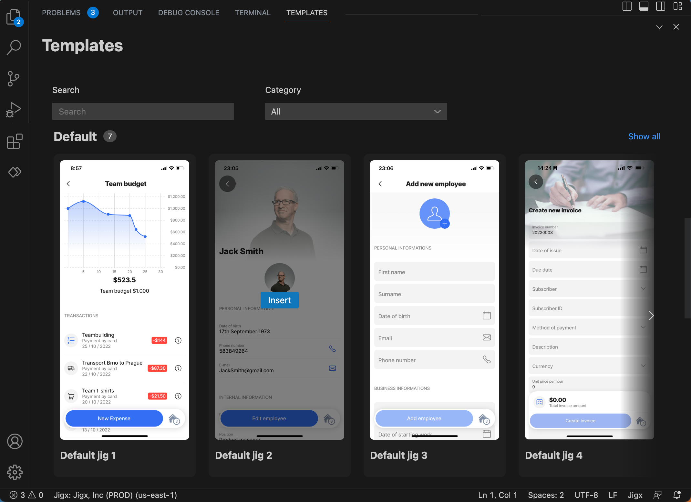
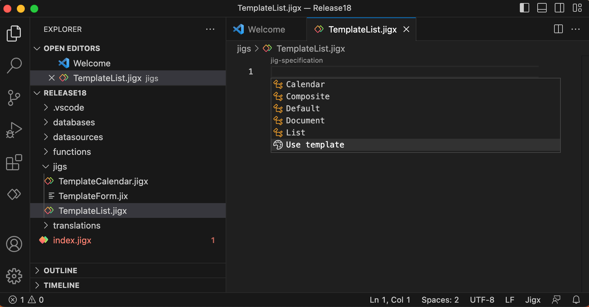

# Use template

**Jig templates** are a set of preconfigured jigs that use [Static Data](<Use template.md>) and [Dynamic Data](<Use template.md>) making it easy for you to start creating solutions. The chosen template inserts the required YAML in the correct format. Use this as a base on which to build when creating a jig. If the template by default provides the functionality you need, just publish your Jigx project to use the jig on your mobile device.

Use the scenario templates to create a complete solution, for example, a contact management solution.

For steps on how to use jig templates see [Jig Templates](<Use template.md>) .



<figure><figcaption>
Jig templates
</figcaption></figure>



<figure><figcaption>
Jig template options
</figcaption></figure>



&#x20;&#x20;

&#x20;&#x20;
