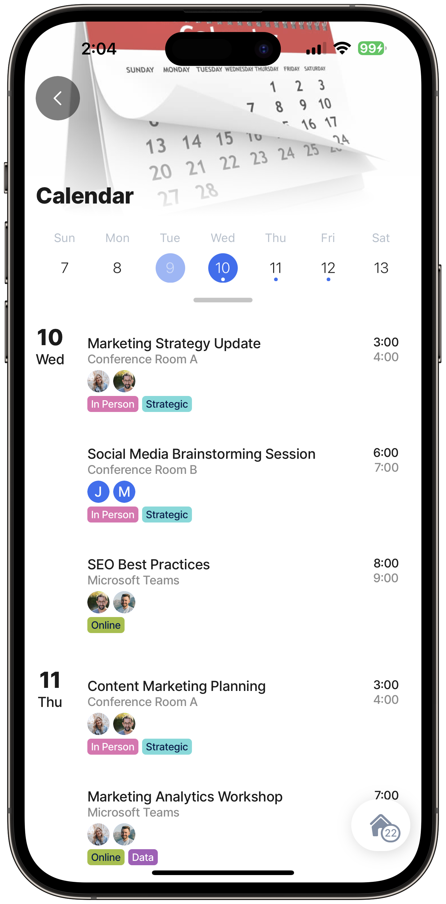
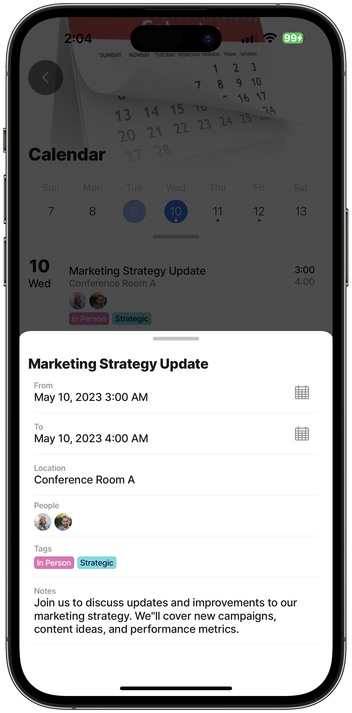
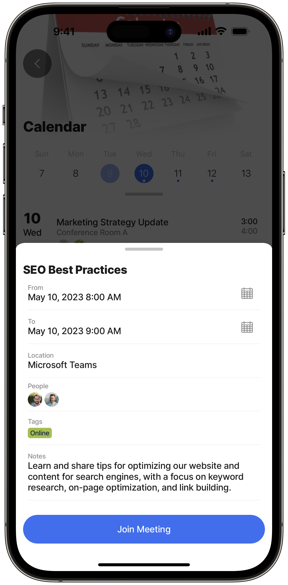
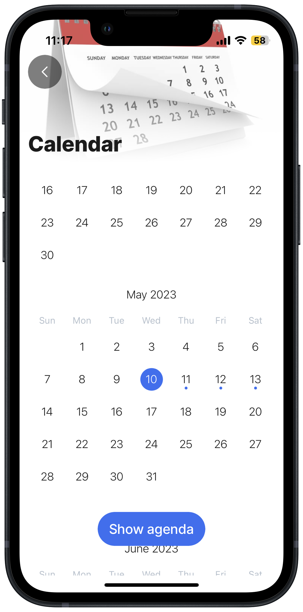
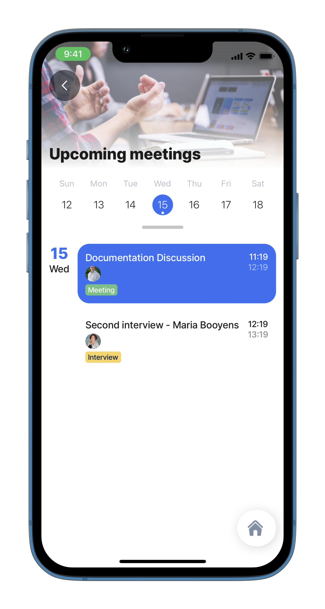
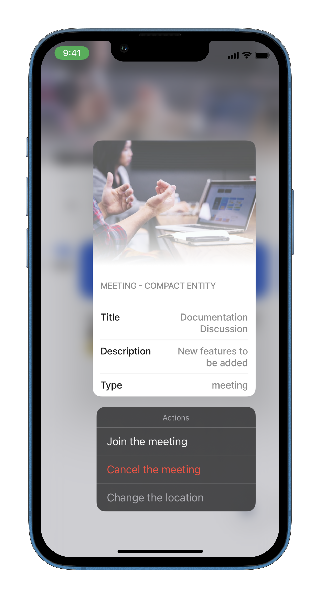

# jig.calendar



The calendar jig displays an agenda calendar view. `jig.calendar` contains data with an [event](../Components/event.md) component, which adds functionality to the calendar and provides a convenient overview of your scheduled events.



<figure><figcaption><p>Jig Calendar Preview</p></figcaption></figure>



## Configuration options

Some properties are common to all jig types, see [Common jig type properties](jig_calendar.md) for a list and their configuration options.

<table><thead><tr><th width="157.3125">Core structure</th><th></th></tr></thead><tbody><tr><td><code>from</code></td><td>Configure the starting time. You can change the property format by setting the value to the <code>Text With Format</code> property, <em>cntrl+space</em>, and choosing <code>Date</code>. In the <code>format</code> property, select the required date format. The default format saved in the database is <strong>yyyy/mm/ddThour:minute:second</strong> (i.e., 2022-07-27T08:15:00). Expressions for modifying the date and time format can be found in the .</td></tr><tr><td><code>title</code></td><td>Provide the name of the event. If you do not want to show a title in a jig use <code>title: ' '</code> or add an expression.</td></tr><tr><td><code>to</code></td><td>Configure the ending time. You can change the property format by setting the value to the <code>Text With Format</code> property, <em>cntrl+space</em>, and choosing <code>Date</code>. In the <code>format</code> property, select the required date format. The default format saved in the database is <strong>yyyy/mm/ddThour:minute:second</strong> (i.e., 2022-07-27T08:15:00). Expressions for modifying the date and time format can be found in the .</td></tr></tbody></table>

<table><thead><tr><th width="163.0546875">Other options</th><th></th></tr></thead><tbody><tr><td><code>description</code></td><td>The general description of the event.</td></tr><tr><td><code>icon</code></td><td>The icon will be displayed on the of this jig. Start typing the name of the icon to invoke the available list in IntelliSene. See <a href="jig_calendar.md">Jigx icons</a> for information on worknig with icons.</td></tr><tr><td><code>people</code></td><td>The list of invitees/attendees for the event. Use an expression to configure the property, for example, <code>people: =@ctx.current.item.attendees.emailAddress</code>.</td></tr><tr><td><code>location</code></td><td>The event's location, for example, a meeting room or conference center.</td></tr><tr><td><code>tags</code></td><td>Displays a list of <code>tags</code> for the event, such as meeting, interview, or social. The <code>tags</code> array can contain the <em>color</em> and <em>title</em> for each tag. <code>"=[{'title': @ctx.current.item.type, 'color': @ctx.current.item.color}]"</code> or define the tag in a datasource which is referenced in the property. <code>tags: =@ctx.current.item.tags</code></td></tr></tbody></table>

Certain actions can be executed on the event; for example, when pressing on the event opens the URL of the advertised event.

<table><thead><tr><th width="160.2734375">Actions</th><th></th></tr></thead><tbody><tr><td><code>onButtonPress</code></td><td>You can set any action in this property just like in the <code>onPress</code> property. The difference is that if only <code>onButtonPress</code> is configured, after pressing on the event, a modal window with the event's details opens. The modal contains a button for the action configured in the <code>onButtonPress</code> property. When <code>isHidden</code> is used with <code>when:false</code> , the <code>isHidden</code> property is automatically overwritten on the mobile device and set to <code>isHidden:true</code> and the button automatically hides.</td></tr><tr><td><code>onPress</code></td><td>When pressing on the event an action executes. Use IntelliSense to select an action or refer to the list of available . When the <code>onPress</code> is configured, the <code>onButtonPress</code> configuration is ignored.</td></tr></tbody></table>

## Examples and code snippets


The code below is an extract from the full _jigx-samples_ solution. The code snippets describe the component discussed in this section. For the solution to function in the Jigx app download the full _jigx-samples_ project from [GitHub](https://github.com/jigx-com/jigx-samples/tree/main/quickstart/jigx-samples), and follow the instructions in [Setting up your solution](jig_calendar.md).


### Calendar jig

In this example, we show the daily agenda, by tapping we can get the details about the actual event and the overview for a month is also available. You can easily recognize the days we have an event planned thanks to the markings.



<figure><figcaption><p>Calendar jig events</p></figcaption></figure>



<figure><figcaption><p>Event details</p></figcaption></figure>





<figure><figcaption><p>Meeting details &#x26; link</p></figcaption></figure>



<figure><figcaption><p>Month with event markers</p></figcaption></figure>



**Examples:** See the full code sample using static data in [GitHub](https://github.com/jigx-com/jigx-samples/blob/main/quickstart/jigx-samples/jigs/jig-types/jig-calendar/static-data/calendar-example/calendar-example.jigx). See the full code sample using dynamic data in [GitHub](https://github.com/jigx-com/jigx-samples/blob/main/quickstart/jigx-samples/datasources/events-and-calendars/calendar-data-dynamic.jigx). **Datasources:** See the full code sample for datasources for static data in [GitHub](https://github.com/jigx-com/jigx-samples/blob/main/quickstart/jigx-samples/datasources/events-and-calendars/calendar-data.jigx). See the full code sample for datasources for dynamic data in [GitHub](https://github.com/jigx-com/jigx-samples/blob/main/quickstart/jigx-samples/datasources/events-and-calendars/calendar-data-dynamic.jigx).


Using the code below requires data in the database, the jigx.sample solution has the data provided for calendar-sample. You can use the calendar-sample.csv file in [GitHub](https://github.com/jigx-com/jigx-samples/blob/main/quickstart/csv/calendar-sample.csv) and upload it via the [Data](jig_calendar.md) configuration in Jigx Management.




```yaml
title: Calendar
type: jig.calendar
icon: calendar

header:
  type: component.jig-header
  options:
    height: small
    children: 
      type: component.image
      options:
        source:
          uri: https://cdnsm5-ss13.sharpschool.com/UserFiles/Servers/Server_181580/Image/calendar.jpg

data: =@ctx.datasources.calendar-data-dynamic
item:
  type: component.event
  options:
    from: =@ctx.current.item.startDT
    to: =@ctx.current.item.endDT
    title: =@ctx.current.item.subject
    location:  =@ctx.current.item.location
    people: =@ctx.current.item.attendees.emailAddress
    description: =@ctx.current.item.bodyPreview
    tags: =@ctx.current.item.tags
    onButtonPress: 
      when: =@ctx.current.item.isOnline="true"
      type: action.open-url
      options:
        title: Join Meeting
        url: =@ctx.current.item.onlineUrl
        isTrackingTransparencyRequired: false
        isHidden: =@ctx.current.item.isOnline="true"?false:true
```



```yaml
datasources:
  calendar-data-dynamic:
    type: datasource.sqlite
    options:
      provider: DATA_PROVIDER_DYNAMIC
    
      entities:
        - default/calendar
    
      jsonProperties: 
      # column names of the result set specified under jsonProperties will retain their json object format
        - attendees
        - tags
        - start
    
    # PLEASE NOTE: the query below contains 2 complex statements to calculate the start and end date of the meeting. this is only for demo purposes
    # to ensure that entries in the calendar always starts tomorrow when you view the sample code.
    # Under normal circumstances the start and end dates are ISO-8601 format (YYYY-MM-DDTHH:MM).
      query: | 
        SELECT
          id,
          '$.subject',
          '$.location',
          '$.body',
          '$.bodyPreview',    
          date('now', json_extract(json_extract(data, '$.start'), '$.dayOffset'),'localtime') || 'T' || json_extract(json_extract(data, '$.start'), '$.time') as startDT,
          strftime('%Y-%m-%dT%H:%M:%S', datetime(date('now', json_extract(json_extract(data, '$.start'), '$.dayOffset'),'localtime') || 'T' || json_extract(json_extract(data, '$.start'), '$.time'), '+1 hours')) as endDT,
          '$.isAllDay',
          '$.attendees',
          '$.tags',
          '$.isOnline',
          '$.onlineUrl'
        FROM [default/calendar]
```



```yaml
databaseId: default
tables:
  calendar: null
```



```yaml
/name: jigx-calendar-sample
title: jigx-calendar-sample
category: business
tabs:
  home:
    jigId: calendar
    icon: calendar
```



### Considerations

* The sample above is for illustrative purposes only, and shows how to use a SQL statement to always return dates with events from the next day onwards.
* A dynamic data table defines the event data, and a JSON view of one of the records can be seen in Dynamic Data.
* The calendar uses a data source that selects the list of events. The start and end dates are dynamically calculated using the SQLite `date()` and `strftime()` functions. The JSON in the Dynamic Data is a string when entered through Jigx Management with the result of what seems like a double json\_extract, but is not.
* The SQL select statement that returns the `startDT` and `endDT` takes today’s date, adds the day offset as specified in the start field in Dynamic Data, and appends the time in the start field. The complete start dates and times are built up by concatenating the two values. Similarly for the end date except add an hour to the SQL statement.
* When using applications such as Microsoft Exchange and Microsoft Graph as a datasource, replace the date part of the `datetime` with the same formula while using the time part of the graph calendar item.

### Calendar with preview

This example displays a preview after long-pressing the event in the Calendar jig (on the event).


Only [Entity](../Preview/Entity.md) and [Web-view](../Preview/Web-view.md) are available as child components for preview.




<figure><figcaption><p>Calendar preview</p></figcaption></figure>



<figure><figcaption><p>Long-press on the event</p></figcaption></figure>





**Examples:** See the full example of [calendar-jig](https://github.com/jigx-com/jigx-samples/blob/main/quickstart/jigx-samples/jigs/jig-types/jig-calendar/static-data/calendar-preview/calendar-jig.jigx) and [calendar-detail-entity](https://github.com/jigx-com/jigx-samples/blob/main/quickstart/jigx-samples/jigs/jig-types/jig-calendar/static-data/calendar-preview/calendar-detail-entity.jigx) in GitHub.



```yaml
title: Entity preview - Calendar
type: jig.calendar
icon: career

header: 
  type: component.jig-header
  options:
    height: small
    children: 
      type: component.image
      options:
        title: Upcoming meetings
        source:
          uri: https://images.unsplash.com/photo-1517245386807-bb43f82c33c4?ixlib=rb-4.0.3&ixid=MnwxMjA3fDB8MHxzZWFyY2h8Mnx8bWVldGluZ3xlbnwwfHwwfHw%3D&auto=format&fit=crop&w=900&q=60
datasources:
  calendar_data: 
    type: datasource.static
    options:
      data:
        - description: New features to be added
          id: 1
          title: Documentation Discussion
          type: meeting
          color: color2
          people: https://images.unsplash.com/photo-1548449112-96a38a643324?ixlib=rb-1.2.1&ixid=MnwxMjA3fDB8MHxwaG90by1wYWdlfHx8fGVufDB8fHx8&auto=format&fit=crop&w=774&q=80
        - description: Project manager position
          id: 2
          title: Second interview - Maria Booyens
          type: interview
          color: color3
          people: https://images.unsplash.com/photo-1573497019940-1c28c88b4f3e?ixlib=rb-1.2.1&ixid=MnwxMjA3fDB8MHxwaG90by1wYWdlfHx8fGVufDB8fHx8&auto=format&fit=crop&w=774&q=80
          
data: =@ctx.datasources.calendar_data  
item:
  type: component.event
  options:
    from:
      text: =$fromMillis($toMillis($now()) + ($number(@ctx.current.item.id)- 1) * 3600000)
      format:
        dateFormat: "l"
    to: =$fromMillis($toMillis($now()) + $number(@ctx.current.item.id) *
      3600000)
    title: =@ctx.current.item.title
    description: =@ctx.current.item.description
    tags: "=[{'title': @ctx.current.item.type, 'color': @ctx.current.item.color}]"
    people: "=[{'avatarUrl': @ctx.current.item.people}]"
    onPress: 
      type: action.go-to
      options:
        linkTo: entity-calendar-detail
        parameters:
          title: =@ctx.current.item.title
          description: =@ctx.current.item.description
          type: =@ctx.current.item.type
    onButtonPress: 
      type: action.go-to
      options:
        title: Go to detail
        linkTo: entity-calendar-detail
        parameters:
          title: =@ctx.current.item.title
          description: =@ctx.current.item.description
          type: =@ctx.current.item.type
    buttonTitle: Go to detail
```



```yaml
title: Meeting detail
type: jig.default

header: 
  type: component.jig-header
  options:
    height: small
    children: 
      type: component.image
      options:
        title: Meeting detail
        source:
          uri: https://images.unsplash.com/photo-1517245386807-bb43f82c33c4?ixlib=rb-4.0.3&ixid=MnwxMjA3fDB8MHxzZWFyY2h8Mnx8bWVldGluZ3xlbnwwfHwwfHw%3D&auto=format&fit=crop&w=900&q=60

children:
    - type: component.entity
      options:
        isCompact: true
        children:
          - type: component.section
            options:
              title: Meeting - Compact entity
              children:
                - type: component.entity-field
                  options:
                    label: Title
                    value: =@ctx.jig.inputs.title   
                - type: component.entity-field
                  options:
                    label: Type
                    value: =@ctx.jig.inputs.type
                    rightIcon: conversation-chat-2
                - type: component.entity-field
                  options:
                    label: Description
                    value: =@ctx.jig.inputs.description   
              
preview:
  isCompact: true
  actions:
   - children:
        - type: action.go-to
          options:
            title: Join the meeting
            linkTo: placeholder
        - type: action.go-to
          options:
            title: Cancel the meeting
            linkTo: placeholder
            style:
              isDanger: true
        - type: action.go-to
          options:
            title: Change the location
            linkTo: placeholder
            style:
              isDisabled: true

  children:
    - type: component.entity
      options:
        isCompact: true
        children:
          - type: component.section
            options:
              title: Meeting - Compact entity
              children:
                - type: component.entity-field
                  options:
                    label: Title
                    value: =@ctx.jig.inputs.title  
                - type: component.entity-field
                  options:
                    label: Description
                    value: =@ctx.jig.inputs.description 
                - type: component.entity-field
                  options:
                    label: Type
                    value: =@ctx.jig.inputs.type       
          
  header: 
    type: component.jig-header
    options:
      height: medium
      children: 
        type: component.image
        options:
          title: Meeting detail
          source:
            uri: https://images.unsplash.com/photo-1517245386807-bb43f82c33c4?ixlib=rb-4.0.3&ixid=MnwxMjA3fDB8MHxzZWFyY2h8Mnx8bWVldGluZ3xlbnwwfHwwfHw%3D&auto=format&fit=crop&w=900&q=60
```



## See also

* [Jigs (screens)](jig_calendar.md)
* [Related examples (Github)](https://github.com/jigx-com/jigx-samples/tree/main/quickstart/jigx-samples/jigs/jig-types/jig-calendar)
