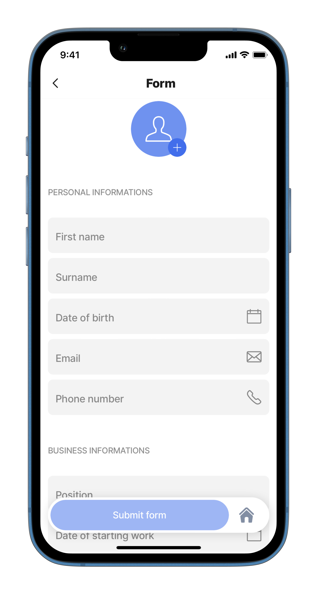
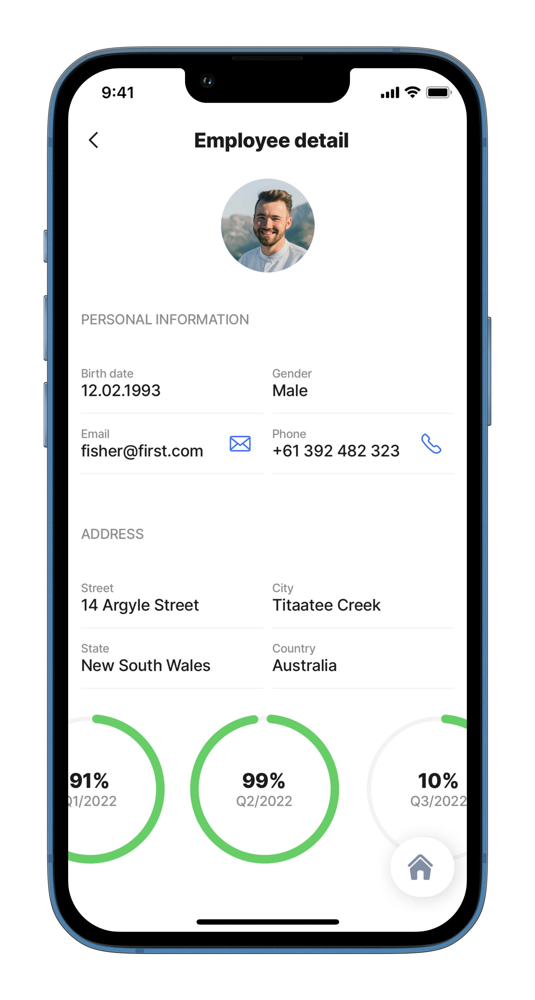

---
layout:
  width: wide
  title:
    visible: true
  description:
    visible: true
  tableOfContents:
    visible: true
  outline:
    visible: true
  pagination:
    visible: true
  metadata:
    visible: true
---

# jig.default



Type `jig.default` is the most versatile jig allowing you to create a jig with various setup options such as:

* A [form](../Components/form/form.md)
* A [list](../Widgets/list.md)
* The jig which can be a part of the [jig.composite](jig_composite.md)
* Used with a combination of different components and actions.



<figure><figcaption><p>Default jig</p></figcaption></figure>



## Configuration options

Some properties are common to all jig types, see [Common jig type properties](jig_default.md) for a list and their configuration options.

<table><thead><tr><th width="167.3359375">Core structure</th><th></th></tr></thead><tbody><tr><td><code>children</code></td><td>Add the UI elements () under the children property, for example, <code>component.form</code>. Use Intellisense (ctrl+space) to select a component from the available list.</td></tr><tr><td><code>title</code></td><td>Provide the name of the screen. If you do not want to show a title in a jig use <code>title: ' '</code> or add an expression.</td></tr></tbody></table>

## Other options

The `jig.default` is the most versatile jig available allowing you to create a variety of screens. Many options are available for configuration on this jig.

<table><thead><tr><th width="182.24609375">Other options</th><th></th></tr></thead><tbody><tr><td><code>actions</code></td><td>Choose from the provided list of available actions, for example, use the <code>go-to</code> action to open a different jig.</td></tr><tr><td><code>badge</code></td><td>Enhance your tabs with a badge, for instance show the number of grid-items. Add the <code>badge</code> property to the jig YAML with an expression.</td></tr><tr><td><code>bottomSheet</code></td><td>The bottomSheet element slides up from the bottom of the screen to present additional content, actions, or contextual information. See <a href="Common jig type properties/bottomSheet _Beta_.md">bottomSheet (Beta)</a> for more information.</td></tr><tr><td><code>description</code></td><td>Give the jig a description that is displayed under the <code>title</code>.</td></tr><tr><td><code>expressions</code></td><td>Use the <code>expressions</code> property to set global expressions that are reusable throughout the jig.</td></tr><tr><td><code>filter</code></td><td>The <code>filter</code> property creates tabbed filter options to categorize and filter data in the jig. For more information, see the <a href="Common jig type properties.md#filter">filter</a> in the common jig type properties.</td></tr><tr><td><code>icon</code></td><td>The icon will be displayed on the jig widget. Start typing the name of the icon to invoke the available list in IntelliSense. See <a href="https://docs2.jigx.com/m2WORrppBE0ftZCDChzX/examples/readme/jig-types/jig_grid">Jigx icons</a> for information on working with icons. The <code>icon</code> property applies to <code>component.jig-widget</code> without a <code>widgetId</code>. </td></tr><tr><td><code>inputs</code></td><td>Configure inputs that allow you to receive data from other jigs and use it in the current jig.</td></tr><tr><td><code>isCollapsible</code></td><td>When the jig is used in a composite jig and this property is set to <code>true</code>, a collapse and expand icon is shown, allowing the jig to be collapsed. This is helpful if the composite jig has several jigs configured, making it easier to view and interact with the app.</td></tr><tr><td><code>isHomeButtonVisible</code></td><td><p>By default, the home button is visible on all jigs except the Home Hub. You can hide the home button on a jig if needed by setting the <code>isHomeButtonVisible</code> property to <code>false</code>. For more information, see the <a href="Common jig type properties.md#home-button-visibility">home button visibility</a> in the common jig type properties.</p><p>   </p></td></tr><tr><td><code>isSearchable</code></td><td>By default, the home button is visible on all jigs except the Home Hub. You can hide the home button on a jig if needed by setting the <code>isHomeButtonVisible</code> property to <code>false</code>. For more information, see the <a href="Common jig type properties.md#filter">filter</a> in the common jig type properties.</td></tr><tr><td><code>isWaitingSync</code></td><td>Displays a waiting sync indicator.</td></tr><tr><td><code>jigId</code></td><td>Give the jig a unique ID that can be referenced outside the jig, for example, in state expressions.</td></tr><tr><td><code>output</code></td><td>Configure outputs that allow you to transfer data out of the current jig and use it in another jig. When referencing the output in another jig, use  <code>=@ctx.jigs.[instance-id-of-the-jig].outputs.[key-of-output]</code></td></tr><tr><td><code>placeholders</code></td><td>Create a placeholder to show when there is no data to use yet. </td></tr><tr><td><code>state</code></td><td>See <a href="https://docs.jigx.com/building-apps-with-jigx/logic/state">state</a> for more information.</td></tr><tr><td><code>summary</code></td><td>Add a component that displays at the bottom of the jig. See the <a href="../Components/summary.md">summary</a> component for more information.</td></tr><tr><td><code>widgets</code></td><td>Add a widget in the jig. See <a href="../Widgets/Widgets.md">widgets</a> for configuration options.</td></tr></tbody></table>

## Examples and code snippets


The code below is an extract from the full _jigx-samples_ solution. The code snippets describe the component discussed in this section. For the solution to function in the Jigx app download the full _jigx-samples_ project from [GitHub](https://github.com/jigx-com/jigx-samples/tree/main/quickstart/jigx-samples), and follow the instructions in [Setting up your solution](jig_default.md).


### Jig.default as a Form



<figure><figcaption><p>Jig default with a form</p></figcaption></figure>



**Examples:**\
See the full default-form.jigx code example in [GitHub](https://github.com/jigx-com/jigx-samples/blob/main/quickstart/jigx-samples/jigs/jig-types/jig-default/dynamic-data/default-form.jigx).\
**Datasource:**\
See the full datasource code example for dynamic data in [GitHub](https://github.com/jigx-com/jigx-samples/blob/main/quickstart/jigx-samples/jigs/jig-types/jig-default/dynamic-data/default-form.jigx).





```yaml
title: Form
type: jig.default

actions:
  - children:
      - type: action.submit-form
        options:
          formId: default-form
          provider: DATA_PROVIDER_DYNAMIC
          title: Submit form
          method: save
          entity: default/form

children:
  - type: component.form
    instanceId: default-form
    options:
      children:
        - type: component.number-field
          instanceId: employee-id
          options:
            label: employeeId
            isHidden: true
            initialValue: =($count(@ctx.datasources.employees.id) = 0 ? 1 :$count(@ctx.datasources.employees.id) + 1)
        - type: component.avatar-field
          instanceId: employee-photo
          options:
            label: Photo
        - type: component.section
          options:
            title: Personal information
            children:
              - type: component.text-field
                instanceId: employee-first-name
                options:
                  label: First name
              - type: component.text-field
                instanceId: employee-surname
                options:
                  label: Surname
              - type: component.date-picker
                instanceId: employee-date-of-birth
                options:
                  label: Date of birth
              - type: component.email-field
                instanceId: employee-email
                options:
                  label: Email
                  icon: email
              - type: component.number-field
                instanceId: employee-phone-number
                options:
                  label: Phone number
                  icon: phone
        - type: component.section
          options:
            title: Business information
            children:
              - type: component.text-field
                instanceId: employee-position
                options:
                  label: Position
              - type: component.date-picker
                instanceId: employee-startWork
                options:
                  label: Date of starting work
              - type: component.media-field
                instanceId: employee-contract
                options:
                  label: Contract
                  mediaType: image
```



```yaml
datasources:
  employees:
    type: datasource.sqlite
    options:
      provider: DATA_PROVIDER_DYNAMIC
      entities:
        - entity: default/employees
      query: |
        SELECT 
          id
        FROM [default/employees]
```



```ruby
databaseId: default
tables:
  employees: null
```



```yaml
name: form
title: default form
category: business

tabs:
  home:
    jigId: defaut-form
    icon: home-apps-logo
```



### Jig.default as a List



<figure><figcaption><p>Default jig with a list</p></figcaption></figure>



**Examples:**\
See the full code sample with static data in [GitHub](https://github.com/jigx-com/jigx-samples/blob/main/quickstart/jigx-samples/jigs/jig-types/jig-default/static-data/default-list.jigx).\
See the full code sample with dynamic data in [GitHub](https://github.com/jigx-com/jigx-samples/blob/main/quickstart/jigx-samples/jigs/jig-types/jig-default/dynamic-data/default-list-dynamic.jigx).

**Datasource:**\
See the full code sample for datasource for static data in [GitHub](https://github.com/jigx-com/jigx-samples/blob/main/quickstart/jigx-samples/jigs/jig-types/jig-default/static-data/default-list.jigx).

See the full datasource code samples for dynamic data for [product](https://github.com/jigx-com/jigx-samples/blob/main/quickstart/jigx-samples/datasources/products/prods.jigx) and [sales](https://github.com/jigx-com/jigx-samples/blob/main/quickstart/jigx-samples/datasources/products/sale.jigx) in GitHub.


Using the code below requires data in the database, the jigx.sample solution has the data provided for products. You can use the products.csv file in [GitHub](https://github.com/jigx-com/jigx-samples/blob/main/quickstart/csv/products.csv) and upload it via the [Data](https://docs.jigx.com/administration/solutions/data) configuration in Jigx Management.






```yaml
title: List
type: jig.default

children:
  - type: component.section
    options:
      title: Products
      children:
        - type: component.list
          options:
            data: =@ctx.datasources.prods
            item:
              type: component.product-item
              options:
                title: =@ctx.current.item.title
                image:
                  uri: =@ctx.current.item.uri
                tag: =@ctx.current.item.tag
                price:
                  value: =@ctx.current.item.price
                  format:
                    numberStyle: currency
  - type: component.section
    options:
      title: Sale
      children:
        - type: component.list
          options:
            data: =@ctx.datasources.sale
            item:
              type: component.product-item
              options:
                title: =@ctx.current.item.title
                image:
                  uri: =@ctx.current.item.uri
                tag: =@ctx.current.item.tag
                price:
                  value: =@ctx.current.item.price
                  format:
                    numberStyle: currency
                discount: =@ctx.current.item.discount
```



```yaml
datasources:
  prods:
    type: datasource.sqlite
    options:
      provider: DATA_PROVIDER_DYNAMIC
      entities:
        - entity: default/products
      query: |
        SELECT
          id,
          '$.title',
          '$.uri',
          '$.tag',
          '$.price',
          '$.category',
          '$.sale'
        FROM [default/products]
        WHERE '$.category' = 'product' AND '$.sale' IS NULL

  sales:
    type: datasource.sqlite
    options:
      provider: DATA_PROVIDER_DYNAMIC
      entities:
        - entity: default/products
      query: |
        SELECT
          id,
          '$.title',
          '$.uri',
          '$.tag',
          '$.price',
          '$.category',
          '$.discount',
          '$.sale'
        FROM [default/products]
        WHERE '$.sale' = 'true'
```



```yaml
databaseId: default
tables:
  products: null
```



### Other examples of jig.default



<figure><figcaption><p>Default employee jig</p></figcaption></figure>



**Examples:**\
See the full code sample with static data in [GitHub](https://github.com/jigx-com/jigx-samples/blob/main/quickstart/jigx-samples/jigs/jig-types/jig-default/static-data/default-employee-detail.jigx). See the full code sample with dynamic data in [GitHub](https://github.com/jigx-com/jigx-samples/blob/main/quickstart/jigx-samples/jigs/jig-types/jig-default/dynamic-data/employee-detail-dynamic.jigx)

**Datasource:**\
See the full datasource code sample for static data in [GitHub](https://github.com/jigx-com/jigx-samples/blob/main/quickstart/jigx-samples/datasources/products/products.jigx) See the full datasource code samples for dynamic data in [GitHub](https://github.com/jigx-com/jigx-samples/blob/main/quickstart/jigx-samples/datasources/products/products-dynamic.jigx)


Using the code below requires data in the database, the jigx.sample solution has the data provided for employees. You can use the employee.csv file in [GitHub](https://github.com/jigx-com/jigx-samples/blob/main/quickstart/csv/employees.csv) and upload it via the [Data](https://docs.jigx.com/administration/solutions/data) configuration in Jigx Management.






```yaml
title: Employee detail
type: jig.default

children:
  - type: component.avatar
    options:
      title: ""
      uri: =@ctx.datasources.employee-detail-dynamic.photo
      size: large
      align: center

  - type: component.entity
    options:
      children:
        - type: component.section
          options:
            title: Personal information
            children:
              - type: component.field-row
                options:
                  children:
                    - type: component.entity-field
                      options:
                        label: Birth date
                        value: =@ctx.datasources.employee-detail-dynamic.birthdate
                    - type: component.entity-field
                      options:
                        label: Gender
                        value: =@ctx.datasources.employee-detail-dynamic.gender
              - type: component.field-row
                options:
                  children:
                    - type: component.entity-field
                      options:
                        label: Email
                        value: =@ctx.datasources.employee-detail-dynamic.email
                        contentType: email
                    - type: component.entity-field
                      options:
                        label: Phone
                        value: =@ctx.datasources.employee-detail-dynamic.phone
                        contentType: phone
        - type: component.section
          options:
            title: Address
            children:
              - type: component.field-row
                options:
                  children:
                    - type: component.entity-field
                      options:
                        label: Street
                        value: =@ctx.datasources.employee-detail-dynamic.street
                    - type: component.entity-field
                      options:
                        label: City
                        value: =@ctx.datasources.employee-detail-dynamic.city
              - type: component.field-row
                options:
                  children:
                    - type: component.entity-field
                      options:
                        label: State
                        value: =@ctx.datasources.employee-detail-dynamic.state
                    - type: component.entity-field
                      options:
                        label: Country
                        value: =@ctx.datasources.employee-detail-dynamic.country

  - type: component.list
    options:
      data: =@ctx.datasources.quartal
      isHorizontal: true
      item:
        type: component.pie-chart
        options:
          chart:
            title:
              text: =@ctx.current.item.title
              verticalAlign: center
            subtitle:
              text: =@ctx.current.item.subtitle
              verticalAlign: center
            width: 140
            height: 140
            isAnimated: true
          legend:
            isHidden: true
          series:
            - data: =@ctx.current.item.data
```



```yaml
datasources:
  quartal:
    type: datasource.static
    options:
      data:
        - title: 91%
          subtitle: Q1/2022
          data:
            - y: 91
              color: positive
            - y: 9
              color: transparent
        - title: 99%
          subtitle: Q2/2022
          data:
            - y: 99
              color: positive
            - y: 1
              color: transparent
        - title: 10%
          subtitle: Q3/2022
          data:
            - y: 10
              color: positive
            - y: 90
              color: transparent
        - title: 0%
          subtitle: Q4/2022
          data:
            - y: 0
              color: positive
            - y: 100
              color: transparent

  employee-detail-dynamic:
    type: datasource.sqlite
    options:
      provider: DATA_PROVIDER_DYNAMIC
      entities:
        - entity: default/employees
      query: |
        SELECT 
          id, 
          '$.firstname', 
          '$.lastname', 
          '$.photo', 
          '$.birthdate', 
          '$.gender', 
          '$.email', 
          '$.phone', 
          '$.street', 
          '$.city', 
          '$.state', 
          '$.country', 
          '$.category', 
          '$.modify' 
        FROM [default/employees] WHERE '$.category' = "employee-detail"
```



```yaml
databaseId: default
tables:
  employees: null
```





<figure><figcaption><p>Default jig</p></figcaption></figure>



**Examples:**\
See full code sample with static data in [GitHub](https://github.com/jigx-com/jigx-samples/blob/main/quickstart/jigx-samples/jigs/jig-types/jig-default/static-data/default-product-detail.jigx) See full code sample with dynamic data in [GitHub](https://github.com/jigx-com/jigx-samples/blob/main/quickstart/jigx-samples/jigs/jig-types/jig-default/dynamic-data/default-product-detail-dynamic.jigx).

**Datasource:**\
See the full datasource code sample for static data in [GitHub](https://github.com/jigx-com/jigx-samples/blob/main/quickstart/jigx-samples/datasources/products/product-detail-static.jigx). See the full datasource code sample for dynamic data in [GitHub](https://github.com/jigx-com/jigx-samples/blob/main/quickstart/jigx-samples/datasources/products/product-detail-dynamic.jigx).


Using the code below requires data in the database, the jigx.sample solution has the data provided for products. You can use the products.csv file in [GitHub](https://github.com/jigx-com/jigx-samples/blob/main/quickstart/csv/products.csv) and upload it via the [Data](https://docs.jigx.com/administration/solutions/data) configuration in Jigx Management.






```yaml
title: Name
type: jig.default

header:
  type: component.jig-header
  options:
    height: medium
    children:
      type: component.image
      options:
        title: =@ctx.datasources.product-detail-dynamic.title
        subtitle: =@ctx.datasources.product-detail-dynamic.price
        source:
          uri: =@ctx.datasources.product-detail-dynamic.uri

summary:
  children:
    type: component.summary
    options:
      layout: default
      title: Add to cart
      leftIcon:
        element: icon
        name: shopping-cart-empty-1

children:
  - type: component.entity
    options:
      children:
        - type: component.entity-field
          options:
            label: ""
            isMultiline: true
            value: =@ctx.datasources.product-detail-dynamic.overview
  - type: component.expander
    options:
      header:
        centerElement:
          type: component.titles
          options:
            title: Details
      children:
        - type: component.entity
          options:
            children:
              - type: component.section
                options:
                  title: Bluetooth 4.0 connection
                  children:
                    - type: component.entity-field
                      options:
                        label: ""
                        isMultiline: true
                        value: =@ctx.datasources.product-detail-dynamic.bluetooth-detail
              - type: component.section
                options:
                  title: Fast, Precise Tracking
                  children:
                    - type: component.entity-field
                      options:
                        label: ""
                        isMultiline: true
                        value: =@ctx.datasources.product-detail-dynamic.precise-detail
              - type: component.section
                options:
                  title: Rechargeable Type-C Port
                  children:
                    - type: component.entity-field
                      options:
                        label: ""
                        isMultiline: true
                        value: =@ctx.datasources.product-detail-dynamic.recharge-detail
              - type: component.section
                options:
                  title: Modern, Ergonomic Design
                  children:
                    - type: component.entity-field
                      options:
                        label: ""
                        isMultiline: true
                        value: =@ctx.datasources.product-detail-dynamic.design-detail

  - type: component.expander
    options:
      header:
        centerElement:
          type: component.titles
          options:
            title: Tech Specs
      children:
        - type: component.entity
          options:
            children:
              - type: component.section
                options:
                  title: Compatible Devices
                  children:
                    - type: component.entity-field
                      options:
                        label: ""
                        isMultiline: true
                        value: =@ctx.datasources.product-detail-dynamic.compatible-detail
        - type: component.entity
          options:
            children:
              - type: component.section
                options:
                  title: Weight
                  children:
                    - type: component.entity-field
                      options:
                        label: ""
                        isMultiline: true
                        value: =@ctx.datasources.product-detail-dynamic.weight-detail
        - type: component.entity
          options:
            children:
              - type: component.section
                options:
                  title: Guarantee
                  children:
                    - type: component.entity-field
                      options:
                        label: ""
                        isMultiline: true
                        value: =@ctx.datasources.product-detail-dynamic.guarantee-detail

  - type: component.expander
    options:
      header:
        centerElement:
          type: component.titles
          options:
            title: Shipping & Returns
      children:
        - type: component.entity
          options:
            children:
              - type: component.entity-field
                options:
                  label: ""
                  isMultiline: true
                  value: =@ctx.datasources.product-detail-dynamic.shipping-detail
```



```yaml
datasources:
  products-dynamic:
    type: datasource.sqlite
    options:
      provider: DATA_PROVIDER_DYNAMIC

      entities:
        - entity: default/products

      query: |
        SELECT 
          id, 
          '$.title', 
          '$.price', 
          '$.uri', 
          '$.overview', 
          '$.bluetooth-detail', 
          '$.precise-detail', 
          '$.recharge-detail', 
          '$.design-detail', 
          '$.compatible-detail', 
          '$.weight-detail', 
          '$.guarantee-detail', 
          '$.shipping-detail', 
          '$.category', 
          '$.productid' 
        FROM [default/products] WHERE '$.category' = "detail" AND '$.productid' = '2'
```



```yaml
databaseId: default
tables:
  products: null
```



```yaml
name: default-product-detail
title: default form
category: business

tabs:
  home:
    jigId: defaut-product-detail-dynamic
    icon: home-apps-logo
```



## See also

* [Jigs (screens)](https://docs.jigx.com/building-apps-with-jigx/ui/jigs-_screens_)
* [Related examples (Github)](https://github.com/jigx-com/jigx-samples/tree/main/quickstart/jigx-samples/jigs/jig-types/jig-default)
