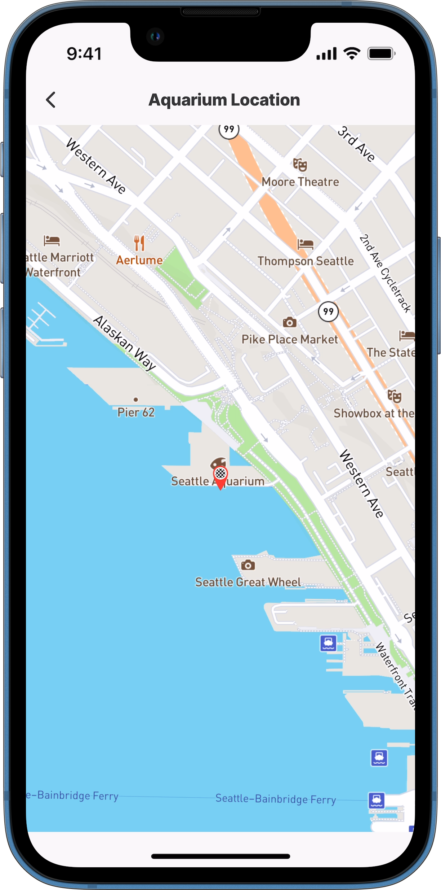

# jig.fullscreen



The `jig.full-screen` allows you to configure a component that covers the entire screen of the jig with no other elements visible. This is useful for creating a full screen of a [location](../Components/location.md) screen.&#x20;



<figure><figcaption><p>Location in full screen</p></figcaption></figure>



## Considerations

* This jig type does not allow for a `description` or `header` properties.
* The [location](../Components/location.md) component can be used in the `jig.full-screen`.
* When using an action within the jig, check that the action button does not overlap the fullscreen functionality. The best practice is not to use an action with the full-screen jig, as the action button covers elements shown in the full-screen.
* It is not recommended to use a full-screen jig in a [composite](jig_composite.md) jig, combining the fullscreen with another jig will not provide the optimal layout for the jig.

## Configuration options

Some properties are common to all jig types, see [Common jig type properties](jig_fullscreen.md) for a list and their configuration options.

The `jig.full-screen` can be configured in the following way in Jigx Builder.

<table><thead><tr><th width="135.89453125">Core structure</th><th></th></tr></thead><tbody><tr><td><code>component</code></td><td><p>Select the component to display as a full-screen, the available components are:</p><ul><li><code>component.chat</code></li><li><code>component.custom-component</code></li><li><code>component.location</code></li><li><code>component.web-view</code></li></ul></td></tr><tr><td><code>title</code></td><td>Give the jig a title that is displayed at the top of the screen. If you do not want to show a title in a jig use <code>title: ' '</code>.</td></tr><tr><td><code>type</code></td><td>Select <code>jig.full-screen</code></td></tr></tbody></table>

## Examples and code snippets

### Full-screen of a map



<figure><figcaption><p>Full screen jig</p></figcaption></figure>



In this example the location to the Seattle Aquarium is shown in full screen using jig type `jig.full-screen`, `component.location` and Dynamic Data datasource called address.

Refer to the [location](../Components/location.md) component for additional location setup options.

**Examples:**\
&#x20;See the full code sample using dynamic data in [GitHub](https://github.com/jigx-com/jigx-samples/blob/main/quickstart/jigx-samples/jigs/jig-types/jig-fullscreen/fullscreen-location-dd.jigx).





```yaml
title: Aquarium Location
type: jig.full-screen

component:
  type: component.location
  options:
    viewPoint:
      address: 1483 Alaskan Way, Seattle, US
      zoomLevel: 15
    markers:
      data: =@ctx.datasources.address
      item:
        type: component.marker-item
        options:
          address: 1483 Alaskan Way, Seattle, US
          children:
            type: component.icon
            options:
              size: medium
              color: negative
              icon: end-marker
```



```yaml
type: datasource.sqlite
options:
  provider: DATA_PROVIDER_DYNAMIC
  entities:
    - entity: default/location
  query: |
    SELECT
      '$.id',
      '$.address',
      '$.address-us',
      '$.category',  
      '$.lat',
      '$.lng',
      '$.city',
      '$.country',
      '$.street'
    FROM [default/location] WHERE '$.category' = "location"
```



## Chatbot in a full-screen jig

See the [chatbot with OpenAI](../Components/chat.md) example.

## See Also

* [Jigs (screens)](https://docs.jigx.com/jigs-screens)
* [location](../Components/location.md)
