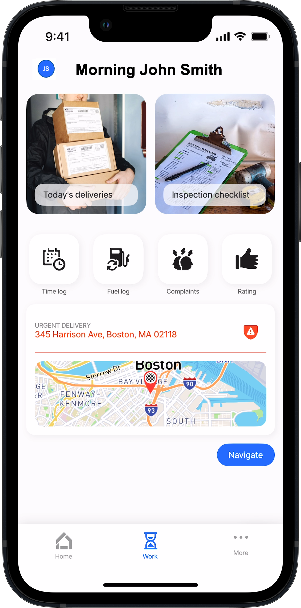
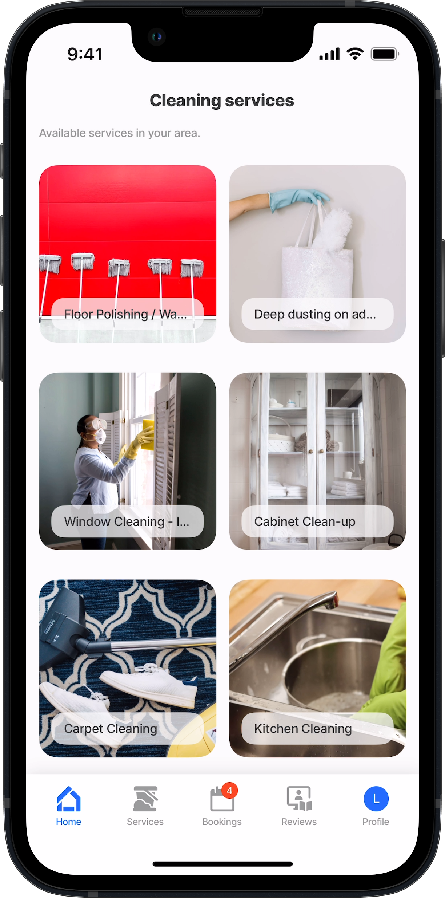
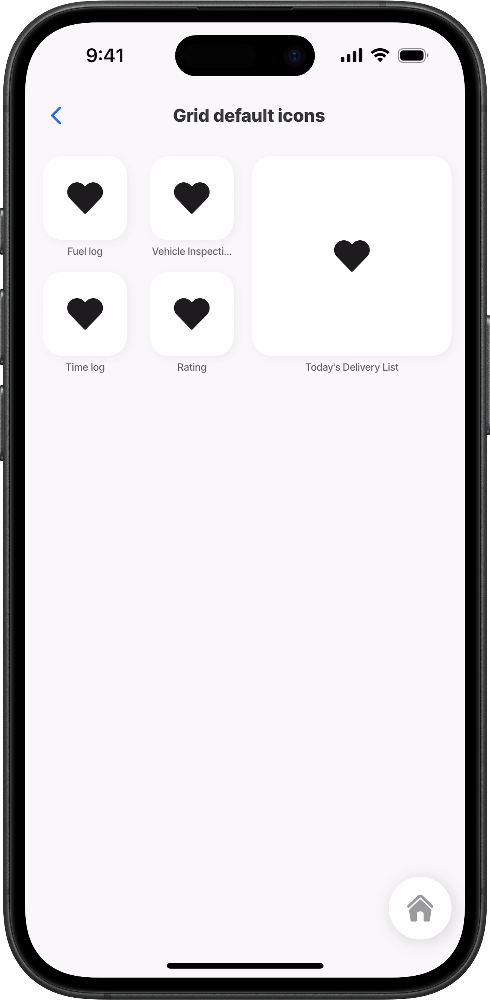
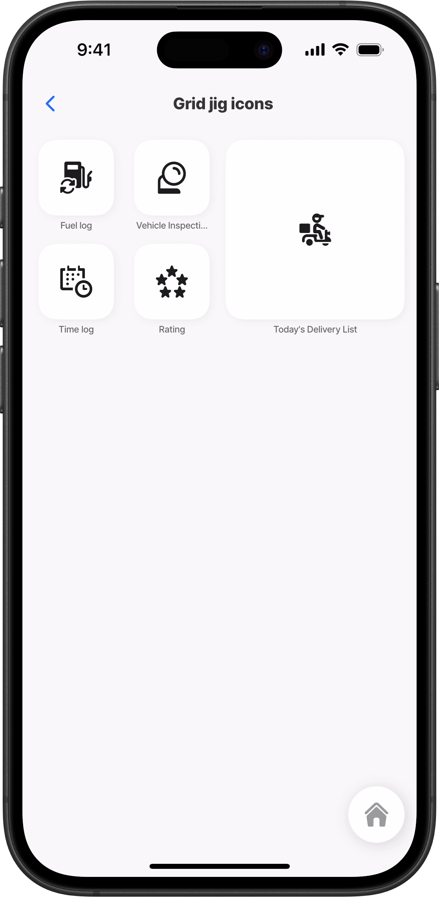
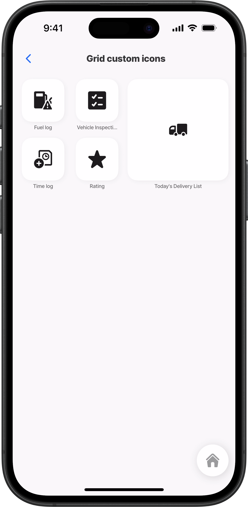
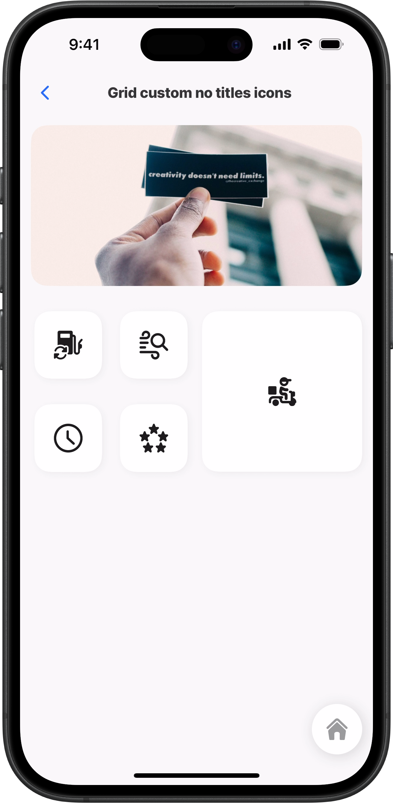
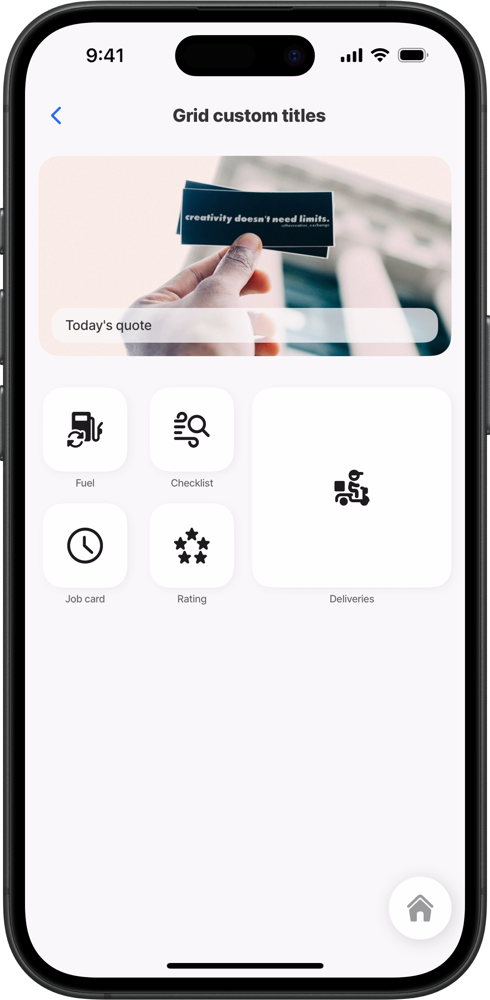
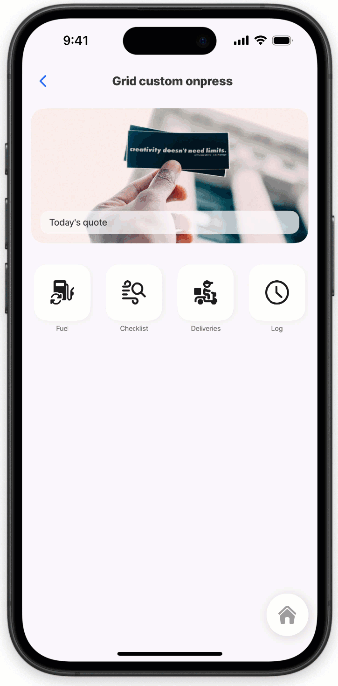

# jig.grid

The `jig.grid` enables you to create grid layouts in your app, organizing content into rows and columns for a visually consistent and flexible interface. It helps align elements proportionally, ensuring a structured design. The grid is ideal for creating galleries to display photos or product images, as well as dashboards, menus, and product lists.



<figure><figcaption><p>Custom Grid</p></figcaption></figure>



<figure><figcaption><p>Auto Grid</p></figcaption></figure>



### Configuration options

The `jig.grid` has two available configuration options:

1. **Auto Grid** - used to create a grid layout from a datasource. This is similar in configuration to a [jig.list](jig_list.md) where a single `grid-item` is configured and iterates through the datasource.
2. **Custom Grid** - used to create a custom grid layout using widgets, images, or custom components in various sizes. Some properties are common to all jig types, see [Common jig type properties](jig_grid.md) for a list and their configuration options.

<table><thead><tr><th width="148.84765625">Core structure</th><th></th></tr></thead><tbody><tr><td><code>title</code></td><td>Give the jig a title that is displayed at the top of the screen. If you do not want to show a title in a jig use <code>title: ' '</code>.</td></tr><tr><td><code>type</code></td><td>Select <code>jig.grid</code> for a grid layout configuration.</td></tr><tr><td><code>component</code></td><td>Within a grid jig type, the component is used to define each of the elements in the grid layout. Within the <code>grid-item</code> a select set of components can be configured.</td></tr><tr><td><code>datasources</code></td><td>Configure a datasource to call the data to display in the grid layout. The datasource property is required for the Auto Grid, but is optional for the Custom Grid selection.</td></tr></tbody></table>

<table><thead><tr><th width="199.66015625">Other options</th><th></th></tr></thead><tbody><tr><td><code>actions</code></td><td>Choose from the provided list of available actions, for example, use the <code>go-to</code> action to open a different jig.</td></tr><tr><td><code>badge</code></td><td>Enhance your tabs with a badge, for instance show the number of grid-items. Add the <code>badge</code> property to the jig YAML with an expression.</td></tr><tr><td><code>description</code></td><td>Give the jig a description that is displayed under the <code>title</code>.</td></tr><tr><td><code>data</code></td><td>Reference a global datasource to use in the jig .</td></tr><tr><td><code>grid-item</code></td><td><p><code>size</code> - Select either <code>1x1</code>, <code>2x2</code>, <code>2x4</code>, <code>4x2</code>, <code>4x4</code> <code>children</code> - Select a component from the predefined list to display in the grid. The components for selection are:</p><ul><li><a href="../Components/image.md">image</a></li><li><a href="jig_grid.md">widgets</a></li><li>Use Template - image templates</li></ul></td></tr><tr><td><code>expressions</code></td><td>Use the <code>expressions</code> property to set that are reusable throughout the jig.</td></tr><tr><td><code>header</code></td><td>Configure a that displays and image, location or video at the top of the jig.</td></tr><tr><td><code>icon</code></td><td>The icon will be displayed on the of the jig. Start typing the name of the icon to invoke the available list in IntelliSense. See <a href="jig_grid.md">Jigx icons</a> for information on working with icons. The <code>icon</code> property applies to <code>component.jig-widget</code> without a <code>widgetId</code>. See the considerations below for the rules governing icon behavior.</td></tr><tr><td><code>inputs</code></td><td>Configure that allow you to receive data from other jigs and use it in the current jig.</td></tr><tr><td><code>isCollapsible</code></td><td>When the jig is used in a and this property is set to <code>true</code>, a collapse and expand icon is shown, allowing the jig to be collapsed. This is helpful if the composite jig has a number of jigs configured, making it easier to view and interact with the app.</td></tr><tr><td><code>isInitiallyCollapsed</code></td><td>When the property is set to <code>true</code> and the jig is part of a composite jig, the jig will open in collapsed mode when the composite jig is launched.</td></tr><tr><td><code>isWaitingSync</code></td><td>Displays a waiting sync indicator.</td></tr><tr><td><code>jigId</code></td><td>Give the jig a unique id that can be referenced outside the jig, for example in state expressions.</td></tr><tr><td><code>outputs</code></td><td>Configure that allow you to transfer data out of the current jig and use it in another jig.</td></tr><tr><td><code>placeholders</code></td><td>Create a placeholder to show when there is no data to use yet. See tips and tricks -use a placeholder for a placeholder example.</td></tr><tr><td><code>preview</code></td><td>Configure the which is triggered by <em>long-pressing</em> on the grid-item.</td></tr><tr><td><code>summary</code></td><td>Add a component that displays at the bottom of the jig.</td></tr><tr><td><code>title</code></td><td>By default, the jig's <code>title</code> is displayed on the widget. You can override it by adding the <code>title</code> property to the <code>component.jig-widget</code> in the <code>grid-item</code>, either with a custom <code>title</code> or with <code>''</code> (a blank space) to remove the title entirely.</td></tr></tbody></table>

<table><thead><tr><th width="201.18359375">Events</th><th></th></tr></thead><tbody><tr><td><code>onFocus</code></td><td>Configure an action that executes when the jig opens, for example, <code>reset-solution-state</code>.</td></tr><tr><td><code>onRefresh</code></td><td>Configure an action that executes when the jig is pulled down, for example, <code>sync-entities</code>.</td></tr><tr><td><code>onPress</code></td><td>Add an <code>onPress</code> event to add an action directly on the grid-item, such as <code>open-url</code>.</td></tr></tbody></table>

## Considerations

* When using the `grid-item` with a `component.jig-widget`, note the following:
  * A `widgetId` is required if the referenced jig includes a widget configuration. This value should match the `Widget Name` specified in the referenced jig.
  * If no widget configuration exists, the widget’s icon is inherited from the jig’s `icon` value. If no `icon` is specified there either, a default icon is used. You can override the icon by specifying one in the `component.jig-widget` of the `grid-item`.
* For a `1x1` widget, or a `component.widget` with no widgetId, the following rules apply:
  * If no `icon` is specified, a default icon is displayed.
  * If an `icon` is configured in the linked jig, that icon is used.
  * If an `icon` is specified in the `component.widget` of the `grid-item`, it overrides all other icon settings.
* A jig with inputs in it's `title` will display without a title (blank) as the jig would not have received those inputs.

### Examples and code snippets

#### Custom grid jig



<figure><figcaption><p>Custom Grid - Delivery </p></figcaption></figure>



In this example, a delivery company uses a dashboard for drivers to display their daily deliveries, urgent tasks, inspection checklists, logs, and customer ratings or complaints. The `jig.grid` with the `custom grid` option is used, allowing multiple `grid-item` configurations. These items include widgets, images, and custom components in various sizes.

**Examples:** \
See the full code sample in [GitHub](https://github.com/jigx-com/jigx-samples/blob/main/quickstart/jigx-samples/jigs/jig-types/jig-grid/grid-custom.jigx). Supporting jig samples in [GitHub](https://github.com/jigx-com/jigx-samples/tree/main/quickstart/jigx-samples/jigs/jig-types/jig-grid).





```yaml
# Use the custom grid jig type to create a jig with images, icons, widgets, 
# and custom component.
type: jig.grid
title: ="Morning " & @ctx.user.displayName

children:
  # Configure multiple grid-items one for each element to display on the grid.
  # Elements are displayed in the order of grid-items starting from the top down.
  - type: component.grid-item
    options:
      # Specify the grid-item size.
      size: "2x2"
      children:
       # Add an image component with an onPress event to go to a jig.       
        type: component.image
        options:
          title: Today's deliveries
          source:
            uri: https://cdn.pixabay.com/photo/2021/04/05/16/28/packages-6153947_1280.jpg
          onPress: 
            type: action.go-to
            options:
              linkTo: delivery-list
  # Second Grid-item        
  - type: component.grid-item
    options:
      size: "2x2"
      children: 
        # Add an image component with an onPress event to go to a jig.          
        type: component.image
        options:
          title: Inspection checklist
          onPress: 
            type: action.go-to
            options:
              behaviour: existing
              linkTo: inspection   
          source:
            uri: https://cdn.pixabay.com/photo/2014/11/20/19/16/insurance-539659_640.jpg
  # Third Grid-item        
  - type: component.grid-item
    options:
      size: "1x1"
      children: 
        # Add a jig-widget component and link to the jig using the jigId.         
        type: component.jig-widget
        options:
          jigId: time-log
  # Fourth Grid-item
  - type: component.grid-item
    options:
      size: "1x1"
      children: 
        type: component.jig-widget
        options:
          jigId: fuel-log
  # Fifth Grid-item
  - type: component.grid-item
    options:
      size: "1x1"
      children: 
        type: component.jig-widget
        options:
          jigId: customer-complaints              
  # Sixth Grid-item
  - type: component.grid-item
    options:
      size: "1x1"
      children: 
        type: component.jig-widget
        options:
          jigId: customer-rating    
  # Seventh Grid-item          
  - type: component.grid-item
    options:
      size: "4x4"
      children: 
        # Add a custom component to display a card with a location and button.           
        type: component.custom-component
        componentId: grid-location
```



```yaml
type: component.default
children:
  - type: component.card
    options:
      children:
        - type: component.entity
          options:
            children:
                  - type: component.field-row
                    options:
                      children:
                        - type: component.entity-field
                          options:
                            rightIcon: shield-warning 
                            style:
                              isNegative: true
                            label: URGENT DELIVERY 
                            value: 345 Harrison Ave, Boston, MA 02118
        - type: component.location
          options:
            camera:
              centerPosition: middle
              address: 345 Harrison Ave, Boston, MA 02118
              zoomLevel: 11
       
  - type: component.view
    options:
      style:
        flex:
          direction: row
        bottom: medium
        top: medium
        alignSelf: flex-end
      children:
        - type: component.button
          options:
            title: Navigate
            type: primary
            isCompact: true
            onPress: 
              type: action.open-url
              options:
                url: https://www.google.com/maps/place/Boston
```



```yaml
title: Vehicle Inspection Checklist
type: jig.default

header:
  type: component.jig-header
  options:
    height: medium
    children:
      type: component.image
      options:
        source:
          uri: https://images.unsplash.com/photo-1498887960847-2a5e46312788?w=500&auto=format&fit=crop&q=60&ixlib=rb-4.0.3&ixid=M3wxMjA3fDB8MHxzZWFyY2h8Nnx8Y2FyJTIwY2hlY2tsaXN0fGVufDB8fDB8fHww

children:
  - type: component.form
    instanceId: checklist
    options:
      isDiscardChangesAlertEnabled: false
      children: 
        - type: component.checkbox
          instanceId: insp-tyres
          options:
            icon: car-dashboard-window-rear-wipe
            label: Tyres
            helperText: Check tyres pressure and for puntures
        - type: component.checkbox
          instanceId: insp-lights
          options:
            icon: car-dashboard-lights
            label: Lights
            helperText: Check front lights, indicator & rear lights     
        - type: component.checkbox
          instanceId: insp-windscreen
          options:
            icon: car-dashboard-window-rear
            label: Windscreen
            helperText: Check windscreen for chips and cracks
        - type: component.checkbox
          instanceId: insp-wipers
          options:
            icon: car-dashboard-window-rear-wipe
            label: Windscreen wipers
            helperText: Switch on wipers, and check wash liquid.     
        - type: component.checkbox
          instanceId: insp-locks
          options:
            icon: car-key-1
            label: Vehicle locks
            helperText: Check all door locks to maintain security standards
```



```yaml
title: Complaints
type: jig.default
icon: people-conflict-1

header:
  type: component.jig-header
  options:
    height: medium
    children:
      type: component.image
      options:
        source:
          uri: https://images.unsplash.com/photo-1503525537183-c84679c9147f?w=500&auto=format&fit=crop&q=60&ixlib=rb-4.0.3&ixid=M3wxMjA3fDB8MHxzZWFyY2h8M3x8YW5ncnklMjBjdXN0b21lcnxlbnwwfHwwfHx8MA%3D%3D

placeholders:
  - title: No data to display
children:
  - type: component.entity
    options:
      children:
        - type: component.entity-field
          options:
            label: Placeholder
            value: Placeholder
```





```yaml
title: Rating  
description: Customer Survey
type: jig.default

header:
  type: component.jig-header
  options:
    height: medium
    children:
      type: component.image
      options:
        source:
          uri: https://images.unsplash.com/photo-1628313388777-9b9a751dfc6a?q=80&w=1548&auto=format&fit=crop&ixlib=rb-4.0.3&ixid=M3wxMjA3fDB8MHxwaG90by1wYWdlfHx8fGVufDB8fHx8fA%3D%3D

datasources:
  customer-satisfaction: 
    type: datasource.static
    options:
      data:
        - id: 1
          option: 😀 Happy
        - id: 2
          option: 😕 Neutral  
        - id: 3
          option: 😡 Sad 

children:
  - type: component.form
    instanceId: customer-survey
    options:
      isDiscardChangesAlertEnabled: false
      children:
        - type: component.choice-field
          instanceId: satisfaction
          options:
            itemsPerRow: 3
            label: How satisfied were you with our service today?
            data: =@ctx.datasources.customer-satisfaction
            item:
              type: component.choice-field-item
              options:
                title: =@ctx.current.item.option
                value: =@ctx.current.item.option
actions:
  - children:
      - type: action.execute-entity
        options:
          title: submit
          provider: DATA_PROVIDER_DYNAMIC
          entity: default/customer
          method: create
          onSuccess: 
            type: action.info-modal
            options:
              modal:
                element: 
                  type: image
                  uri: https://images.unsplash.com/photo-1643878037082-ba1fd9a60b16?q=80&w=1632&auto=format&fit=crop&ixlib=rb-4.0.3&ixid=M3wxMjA3fDB8MHxwaG90by1wYWdlfHx8fGVufDB8fHx8fA%3D%3D
                title: Survey complete
                buttonText: Thank you
          data:
            satisfaction: =@ctx.components.satisfaction.state.value
```



```yaml
title: Fuel log
description: Description of your Jig
type: jig.default
icon: fuel-pump-reload

header:
  type: component.jig-header
  options:
    height: medium
    children:
      type: component.image
      options:
        source:
          uri: https://images.unsplash.com/photo-1602853175733-5ad62dc6a2c8?w=500&auto=format&fit=crop&q=60&ixlib=rb-4.0.3&ixid=M3wxMjA3fDB8MHxzZWFyY2h8M3x8ZnVlbHxlbnwwfHwwfHx8MA%3D%3D

placeholders:
  - title: No data to display
children:
  - type: component.entity
    options:
      children:
        - type: component.entity-field
          options:
            label: Placeholder
            value: Placeholder
```



```yaml
title: Time log
type: jig.default
icon: time-monthly-1

header:
  type: component.jig-header
  options:
    height: medium
    children:
      type: component.image
      options:
        source:
          uri: https://images.unsplash.com/37/tEREUy1vSfuSu8LzTop3_IMG_2538.jpg?w=500&auto=format&fit=crop&q=60&ixlib=rb-4.0.3&ixid=M3wxMjA3fDB8MHxzZWFyY2h8MTV8fHRpbWUlMjBsb2d8ZW58MHx8MHx8fDA%3D

placeholders:
  - title: No data to display
children:
  - type: component.entity
    options:
      children:
        - type: component.entity-field
          options:
            label: Placeholder
            value: Placeholder
```



#### Auto grid jig



<figure><figcaption><p>Auto Grid -Image Gallery</p></figcaption></figure>



In this example, a gallery of images is created to showcase the services a company offers. The `jig.grid` type is used with a datasource, enabling a simple configuration based on the records in the datasource. The `component.grid-item` only needs to be configured once using the expression `=@ctx.current.item.` followed by the desired data field. Using `current` loops through the datasource, creating a grid-item for each data record. Note that the specified `size` will apply to all returned records.

**Examples:** \
See the full code sample in [GitHub](https://github.com/jigx-com/jigx-samples/blob/main/quickstart/jigx-samples/jigs/jig-types/jig-grid/grid-auto.jigx)





```yaml
title: Cleaning services
description: Available services in your area.
# Use the grid jig type to create a gallery of images and titles.
type: jig.grid
# Define the datasource used to list the images and services.          
data: =@ctx.datasources.cleaning
item:
 # One grid-item component generates the entire grid using current data.
  type: component.grid-item
  options:
    # Select the size that all the items will display as, all items use the same size.
    size: "2x2"
    children: 
      # Choose the component to show in the grid.    
      type: component.image
      options:
        # Use the expression =@ctx.current.item.x with the data field name.
        # Use current loops through the datasource creating grid-items for each data record. 
        title: =@ctx.current.item.service
        source:  
          uri: =@ctx.current.item.image
```



```yaml
datasources:
  cleaning: 
    type: datasource.sqlite
    options:
      provider: DATA_PROVIDER_DYNAMIC
      entities:
        - entity: default/cleaning-services

      query: |
        SELECT 
          id, 
          '$.id' as sqlid, 
          '$.area', 
          '$.description', 
          '$.hourlyrate', 
          '$.image', 
          '$.service'  
        FROM [default/cleaning-services] 
        WHERE '$.hourlyrate' IS NOT NULL ORDER BY id DESC
```



#### Custom grid jig with default widget icons and titles



<figure><figcaption><p>Default icons</p></figcaption></figure>



In this example, no icons are configured, so all widgets display the default icon. The `title` of the jig is displayed below the widget.





```yaml
title: Grid default icons
type: jig.grid

children:
  - type: component.grid-item
    options:
      size: "1x1"
      children:
        type: component.jig-widget
        options:
          jigId: fuel-log

  - type: component.grid-item
    options:
      size: "1x1"
      children:
        type: component.jig-widget
        options:
          jigId: inspection

  - type: component.grid-item
    options:
      size: "2x2"
      children:
        type: component.jig-widget
        options:
          jigId: delivery-list

  - type: component.grid-item
    options:
      size: "1x1"
      children:
        type: component.jig-widget
        options:
          jigId: time-log

  - type: component.grid-item
    options:
      size: "1x1"
      children:
        type: component.jig-widget
        options:
          jigId: customer-rating
```



```yaml
title: Fuel log
description: Description of your Jig
type: jig.default

header:
  type: component.jig-header
  options:
    height: medium
    children:
      type: component.image
      options:
        source:
          uri: https://images.unsplash.com/photo-1602853175733-5ad62dc6a2c8?w=500&auto=format&fit=crop&q=60&ixlib=rb-4.0.3&ixid=M3wxMjA3fDB8MHxzZWFyY2h8M3x8ZnVlbHxlbnwwfHwwfHx8MA%3D%3D

placeholders:
  - title: No data to display
children:
  - type: component.entity
    options:
      children:
        - type: component.entity-field
          options:
            label: Placeholder
            value: Placeholder
```



```yaml
title: Vehicle Inspection Checklist
type: jig.default

header:
  type: component.jig-header
  options:
    height: medium
    children:
      type: component.image
      options:
        source:
          uri: https://images.unsplash.com/photo-1498887960847-2a5e46312788?w=500&auto=format&fit=crop&q=60&ixlib=rb-4.0.3&ixid=M3wxMjA3fDB8MHxzZWFyY2h8Nnx8Y2FyJTIwY2hlY2tsaXN0fGVufDB8fDB8fHww

children:
  - type: component.form
    instanceId: checklist
    options:
      isDiscardChangesAlertEnabled: false
      children: 
        - type: component.checkbox
          instanceId: insp-tyres
          options:
            icon: car-dashboard-window-rear-wipe
            label: Tyres
            helperText: Check tyres pressure and for puntures
        - type: component.checkbox
          instanceId: insp-lights
          options:
            icon: car-dashboard-lights
            label: Lights
            helperText: Check front lights, indicator & rear lights     
        - type: component.checkbox
          instanceId: insp-windscreen
          options:
            icon: car-dashboard-window-rear
            label: Windscreen
            helperText: Check windscreen for chips and cracks
        - type: component.checkbox
          instanceId: insp-wipers
          options:
            icon: car-dashboard-window-rear-wipe
            label: Windscreen wipers
            helperText: Switch on wipers, and check wash liquid.     
        - type: component.checkbox
          instanceId: insp-locks
          options:
            icon: car-key-1
            label: Vehicle locks
            helperText: Check all door locks to maintain security standards
```





```yaml
title: Today's Delivery List
type: jig.default

onFocus: 
  type: action.reset-state
  options:
    state: =@ctx.solution.state
    
header:
  type: component.jig-header
  options:
    height: medium
    children:
      type: component.image
      options:
        source:
          uri: https://images.unsplash.com/photo-1480632563560-30f503c09195?w=500&auto=format&fit=crop&q=60&ixlib=rb-4.0.3&ixid=M3wxMjA3fDB8MHxzZWFyY2h8NHx8cGFyY2VsfGVufDB8fDB8fHww

datasources:
  deliveries: 
    type: datasource.static
    options:
      data:
        - id: 1
          delivery-no: ABB3456
          name: Paul Harrison
          address: 12 Maple Close Beacon Hill Boston
        - id: 2
          delivery-no: WDX5635
          name: Claudia Trent
          address:  77 N Washington Street Boston
        - id: 3
          delivery-no: YGD4465
          name: Kate Masson
          address: 200 Claredon Street FL 49 Boston
        - id: 4
          delivery-no: RDE3957
          name: Ronald Price
          address: 88 Wareham Street Boston    

children: 
  - type: component.list
    options:
      data: =@ctx.datasources.deliveries
      maximumItemsToRender: 8
      item: 
        type: component.list-item
        options:
          title: =@ctx.current.item.address
          subtitle: =@ctx.current.item.name
          leftElement: 
            element: icon
            icon: package-size-l    
```



```yaml
title: Time log
type: jig.default

header:
  type: component.jig-header
  options:
    height: medium
    children:
      type: component.image
      options:
        source:
          uri: https://images.unsplash.com/37/tEREUy1vSfuSu8LzTop3_IMG_2538.jpg?w=500&auto=format&fit=crop&q=60&ixlib=rb-4.0.3&ixid=M3wxMjA3fDB8MHxzZWFyY2h8MTV8fHRpbWUlMjBsb2d8ZW58MHx8MHx8fDA%3D

placeholders:
  - title: No data to display
children:
  - type: component.entity
    options:
      children:
        - type: component.entity-field
          options:
            label: Placeholder
            value: Placeholder
```



```yaml
title: Rating  
description: Customer Survey
type: jig.default

header:
  type: component.jig-header
  options:
    height: medium
    children:
      type: component.image
      options:
        source:
          uri: https://images.unsplash.com/photo-1628313388777-9b9a751dfc6a?q=80&w=1548&auto=format&fit=crop&ixlib=rb-4.0.3&ixid=M3wxMjA3fDB8MHxwaG90by1wYWdlfHx8fGVufDB8fHx8fA%3D%3D

datasources:
  customer-satisfaction: 
    type: datasource.static
    options:
      data:
        - id: 1
          option: 😀 Happy
        - id: 2
          option: 😕 Neutral  
        - id: 3
          option: 😡 Sad 

children:
  - type: component.form
    instanceId: customer-survey
    options:
      isDiscardChangesAlertEnabled: false
      children:
        - type: component.choice-field
          instanceId: satisfaction
          options:
            itemsPerRow: 3
            label: How satisfied were you with our service today?
            data: =@ctx.datasources.customer-satisfaction
            item:
              type: component.choice-field-item
              options:
                title: =@ctx.current.item.option
                value: =@ctx.current.item.option
actions:
  - children:
      - type: action.execute-entity
        options:
          title: submit
          provider: DATA_PROVIDER_DYNAMIC
          entity: default/customer
          method: create
          onSuccess: 
            type: action.info-modal
            options:
              modal:
                element: 
                  type: image
                  uri: https://images.unsplash.com/photo-1643878037082-ba1fd9a60b16?q=80&w=1632&auto=format&fit=crop&ixlib=rb-4.0.3&ixid=M3wxMjA3fDB8MHxwaG90by1wYWdlfHx8fGVufDB8fHx8fA%3D%3D
                title: Survey complete
                buttonText: Thank you
          data:
            satisfaction: =@ctx.components.satisfaction.state.value
```



#### Custom grid with jig icons



In this example, the widget `icons` are configured in each jig, and the jig `title` is displayed below the widget.



<figure><figcaption><p>Jig icons</p></figcaption></figure>





```yaml
title: Grid jig icons
type: jig.grid

children:
  - type: component.grid-item
    options:
      size: "1x1"
      children:
        type: component.jig-widget
        options:
          jigId: fuel-log

  - type: component.grid-item
    options:
      size: "1x1"
      children:
        type: component.jig-widget
        options:
          jigId: inspection

  - type: component.grid-item
    options:
      size: "2x2"
      children:
        type: component.jig-widget
        options:
          jigId: delivery-list

  - type: component.grid-item
    options:
      size: "1x1"
      children:
        type: component.jig-widget
        options:
          jigId: time-log

  - type: component.grid-item
    options:
      size: "1x1"
      children:
        type: component.jig-widget
        options:
          jigId: customer-rating
```



```yaml
title: Fuel log
description: Description of your Jig
type: jig.default
# Configure the icon to display on the widget.
icon: fuel-pump-reload

header:
  type: component.jig-header
  options:
    height: medium
    children:
      type: component.image
      options:
        source:
          uri: https://images.unsplash.com/photo-1602853175733-5ad62dc6a2c8?w=500&auto=format&fit=crop&q=60&ixlib=rb-4.0.3&ixid=M3wxMjA3fDB8MHxzZWFyY2h8M3x8ZnVlbHxlbnwwfHwwfHx8MA%3D%3D

placeholders:
  - title: No data to display
children:
  - type: component.entity
    options:
      children:
        - type: component.entity-field
          options:
            label: Placeholder
            value: Placeholder
```



```yaml
title: Vehicle Inspection Checklist
type: jig.default
# Configure the icon to display on the widget.
icon: model-magnifying-stand

header:
  type: component.jig-header
  options:
    height: medium
    children:
      type: component.image
      options:
        source:
          uri: https://images.unsplash.com/photo-1498887960847-2a5e46312788?w=500&auto=format&fit=crop&q=60&ixlib=rb-4.0.3&ixid=M3wxMjA3fDB8MHxzZWFyY2h8Nnx8Y2FyJTIwY2hlY2tsaXN0fGVufDB8fDB8fHww

children:
  - type: component.form
    instanceId: checklist
    options:
      isDiscardChangesAlertEnabled: false
      children:
        - type: component.checkbox
          instanceId: insp-tyres
          options:
            icon: car-dashboard-window-rear-wipe
            label: Tyres
            helperText: Check tyres pressure and for puntures
        - type: component.checkbox
          instanceId: insp-lights
          options:
            icon: car-dashboard-lights
            label: Lights
            helperText: Check front lights, indicator & rear lights
        - type: component.checkbox
          instanceId: insp-windscreen
          options:
            icon: car-dashboard-window-rear
            label: Windscreen
            helperText: Check windscreen for chips and cracks
        - type: component.checkbox
          instanceId: insp-wipers
          options:
            icon: car-dashboard-window-rear-wipe
            label: Windscreen wipers
            helperText: Switch on wipers, and check wash liquid.
        - type: component.checkbox
          instanceId: insp-locks
          options:
            icon: car-key-1
            label: Vehicle locks
            helperText: Check all door locks to maintain security standards
```



```yaml
title: Time log
type: jig.default
# Configure the icon to display on the widget.
icon: time-monthly-1

header:
  type: component.jig-header
  options:
    height: medium
    children:
      type: component.image
      options:
        source:
          uri: https://images.unsplash.com/37/tEREUy1vSfuSu8LzTop3_IMG_2538.jpg?w=500&auto=format&fit=crop&q=60&ixlib=rb-4.0.3&ixid=M3wxMjA3fDB8MHxzZWFyY2h8MTV8fHRpbWUlMjBsb2d8ZW58MHx8MHx8fDA%3D

placeholders:
  - title: No data to display
children:
  - type: component.entity
    options:
      children:
        - type: component.entity-field
          options:
            label: Placeholder
            value: Placeholder
```





```yaml
title: Today's Delivery List
type: jig.default
# Configure the icon to display on the widget.
icon: delivery-person-motorcycle

onFocus:
  type: action.reset-state
  options:
    state: =@ctx.solution.state

header:
  type: component.jig-header
  options:
    height: medium
    children:
      type: component.image
      options:
        source:
          uri: https://images.unsplash.com/photo-1480632563560-30f503c09195?w=500&auto=format&fit=crop&q=60&ixlib=rb-4.0.3&ixid=M3wxMjA3fDB8MHxzZWFyY2h8NHx8cGFyY2VsfGVufDB8fDB8fHww

datasources:
  deliveries:
    type: datasource.static
    options:
      data:
        - id: 1
          delivery-no: ABB3456
          name: Paul Harrison
          address: 12 Maple Close Beacon Hill Boston
        - id: 2
          delivery-no: WDX5635
          name: Claudia Trent
          address: 77 N Washington Street Boston
        - id: 3
          delivery-no: YGD4465
          name: Kate Masson
          address: 200 Claredon Street FL 49 Boston
        - id: 4
          delivery-no: RDE3957
          name: Ronald Price
          address: 88 Wareham Street Boston

children:
  - type: component.list
    options:
      data: =@ctx.datasources.deliveries
      maximumItemsToRender: 8
      item:
        type: component.list-item
        options:
          title: =@ctx.current.item.address
          subtitle: =@ctx.current.item.name
          leftElement:
            element: icon
            icon: package-size-l
```



```python
title: Rating
description: Customer Survey
type: jig.default
# Configure the icon to display on the widget.
icon: rating-five-star

header:
  type: component.jig-header
  options:
    height: medium
    children:
      type: component.image
      options:
        source:
          uri: https://images.unsplash.com/photo-1628313388777-9b9a751dfc6a?q=80&w=1548&auto=format&fit=crop&ixlib=rb-4.0.3&ixid=M3wxMjA3fDB8MHxwaG90by1wYWdlfHx8fGVufDB8fHx8fA%3D%3D

datasources:
  customer-satisfaction:
    type: datasource.static
    options:
      data:
        - id: 1
          option: 😀 Happy
        - id: 2
          option: 😕 Neutral
        - id: 3
          option: 😡 Sad

children:
  - type: component.form
    instanceId: customer-survey
    options:
      isDiscardChangesAlertEnabled: false
      children:
        - type: component.choice-field
          instanceId: satisfaction
          options:
            itemsPerRow: 3
            label: How satisfied were you with our service today?
            data: =@ctx.datasources.customer-satisfaction
            item:
              type: component.choice-field-item
              options:
                title: =@ctx.current.item.option
                value: =@ctx.current.item.option
actions:
  - children:
      - type: action.execute-entity
        options:
          title: submit
          provider: DATA_PROVIDER_DYNAMIC
          entity: default/customer
          method: create
          onSuccess:
            type: action.info-modal
            options:
              modal:
                element:
                  type: image
                  uri: https://images.unsplash.com/photo-1643878037082-ba1fd9a60b16?q=80&w=1632&auto=format&fit=crop&ixlib=rb-4.0.3&ixid=M3wxMjA3fDB8MHxwaG90by1wYWdlfHx8fGVufDB8fHx8fA%3D%3D
                title: Survey complete
                buttonText: Thank you
          data:
            satisfaction: =@ctx.components.satisfaction.state.value
```



#### Custom grid jig with custom widget icons



<figure><figcaption><p>Custom icons</p></figcaption></figure>



In this example, the widget `icons` are configured in the `component.widget` of the `grid-item`, overriding the `icons` defined in the individual jigs. The jig `title` is displayed below each widget.





```yaml
title: Grid custom icons
type: jig.grid

children:
  - type: component.grid-item
    options:
      size: "1x1"
      children:
        type: component.jig-widget
        options:
          jigId: fuel-log
          # Configure a custom icon for the widget.
          icon: low-fuel

  - type: component.grid-item
    options:
      size: "1x1"
      children:
        type: component.jig-widget
        options:
          jigId: inspection
          # Configure a custom icon for the widget.
          icon: checklist

  - type: component.grid-item
    options:
      size: "2x2"
      children:
        type: component.jig-widget
        options:
          jigId: delivery-list
          # Configure a custom icon for the widget.
          icon: delivery-truck-2

  - type: component.grid-item
    options:
      size: "1x1"
      children:
        type: component.jig-widget
        options:
          jigId: time-log
          # Configure a custom icon for the widget.
          icon: time-clock-file-add

  - type: component.grid-item
    options:
      size: "1x1"
      children:
        type: component.jig-widget
        options:
          jigId: customer-rating
          # Configure a custom icon for the widget.
          icon: rating-star
```



```python
title: Fuel log
description: Description of your Jig
type: jig.default
# This icon is overridden by the icon configured in the grid jig.
icon: fuel-pump-reload

header:
  type: component.jig-header
  options:
    height: medium
    children:
      type: component.image
      options:
        source:
          uri: https://images.unsplash.com/photo-1602853175733-5ad62dc6a2c8?w=500&auto=format&fit=crop&q=60&ixlib=rb-4.0.3&ixid=M3wxMjA3fDB8MHxzZWFyY2h8M3x8ZnVlbHxlbnwwfHwwfHx8MA%3D%3D

placeholders:
  - title: No data to display
children:
  - type: component.entity
    options:
      children:
        - type: component.entity-field
          options:
            label: Placeholder
            value: Placeholder
```



```yaml
title: Vehicle Inspection Checklist
type: jig.default
# This icon is overridden by the icon configured in the grid jig.
icon: model-magnifying-stand

header:
  type: component.jig-header
  options:
    height: medium
    children:
      type: component.image
      options:
        source:
          uri: https://images.unsplash.com/photo-1498887960847-2a5e46312788?w=500&auto=format&fit=crop&q=60&ixlib=rb-4.0.3&ixid=M3wxMjA3fDB8MHxzZWFyY2h8Nnx8Y2FyJTIwY2hlY2tsaXN0fGVufDB8fDB8fHww

children:
  - type: component.form
    instanceId: checklist
    options:
      isDiscardChangesAlertEnabled: false
      children:
        - type: component.checkbox
          instanceId: insp-tyres
          options:
            icon: car-dashboard-window-rear-wipe
            label: Tyres
            helperText: Check tyres pressure and for puntures
        - type: component.checkbox
          instanceId: insp-lights
          options:
            icon: car-dashboard-lights
            label: Lights
            helperText: Check front lights, indicator & rear lights
        - type: component.checkbox
          instanceId: insp-windscreen
          options:
            icon: car-dashboard-window-rear
            label: Windscreen
            helperText: Check windscreen for chips and cracks
        - type: component.checkbox
          instanceId: insp-wipers
          options:
            icon: car-dashboard-window-rear-wipe
            label: Windscreen wipers
            helperText: Switch on wipers, and check wash liquid.
        - type: component.checkbox
          instanceId: insp-locks
          options:
            icon: car-key-1
            label: Vehicle locks
            helperText: Check all door locks to maintain security standards
```





```yaml
title: Today's Delivery List
type: jig.default
# This icon is overridden by the icon configured in the grid jig.
icon: delivery-person-motorcycle

onFocus:
  type: action.reset-state
  options:
    state: =@ctx.solution.state

header:
  type: component.jig-header
  options:
    height: medium
    children:
      type: component.image
      options:
        source:
          uri: https://images.unsplash.com/photo-1480632563560-30f503c09195?w=500&auto=format&fit=crop&q=60&ixlib=rb-4.0.3&ixid=M3wxMjA3fDB8MHxzZWFyY2h8NHx8cGFyY2VsfGVufDB8fDB8fHww

datasources:
  deliveries:
    type: datasource.static
    options:
      data:
        - id: 1
          delivery-no: ABB3456
          name: Paul Harrison
          address: 12 Maple Close Beacon Hill Boston
        - id: 2
          delivery-no: WDX5635
          name: Claudia Trent
          address: 77 N Washington Street Boston
        - id: 3
          delivery-no: YGD4465
          name: Kate Masson
          address: 200 Claredon Street FL 49 Boston
        - id: 4
          delivery-no: RDE3957
          name: Ronald Price
          address: 88 Wareham Street Boston

children:
  - type: component.list
    options:
      data: =@ctx.datasources.deliveries
      maximumItemsToRender: 8
      item:
        type: component.list-item
        options:
          title: =@ctx.current.item.address
          subtitle: =@ctx.current.item.name
          leftElement:
            element: icon
            icon: package-size-l
```



```yaml
title: Time log
type: jig.default
# This icon is overridden by the icon configured in the grid jig.
icon: time-monthly-1

header:
  type: component.jig-header
  options:
    height: medium
    children:
      type: component.image
      options:
        source:
          uri: https://images.unsplash.com/37/tEREUy1vSfuSu8LzTop3_IMG_2538.jpg?w=500&auto=format&fit=crop&q=60&ixlib=rb-4.0.3&ixid=M3wxMjA3fDB8MHxzZWFyY2h8MTV8fHRpbWUlMjBsb2d8ZW58MHx8MHx8fDA%3D

placeholders:
  - title: No data to display
children:
  - type: component.entity
    options:
      children:
        - type: component.entity-field
          options:
            label: Placeholder
            value: Placeholder
```



```yaml
title: Rating
description: Customer Survey
type: jig.default
# This icon is overridden by the icon configured in the grid jig.
icon: rating-five-star

header:
  type: component.jig-header
  options:
    height: medium
    children:
      type: component.image
      options:
        source:
          uri: https://images.unsplash.com/photo-1628313388777-9b9a751dfc6a?q=80&w=1548&auto=format&fit=crop&ixlib=rb-4.0.3&ixid=M3wxMjA3fDB8MHxwaG90by1wYWdlfHx8fGVufDB8fHx8fA%3D%3D

datasources:
  customer-satisfaction:
    type: datasource.static
    options:
      data:
        - id: 1
          option: 😀 Happy
        - id: 2
          option: 😕 Neutral
        - id: 3
          option: 😡 Sad

children:
  - type: component.form
    instanceId: customer-survey
    options:
      isDiscardChangesAlertEnabled: false
      children:
        - type: component.choice-field
          instanceId: satisfaction
          options:
            itemsPerRow: 3
            label: How satisfied were you with our service today?
            data: =@ctx.datasources.customer-satisfaction
            item:
              type: component.choice-field-item
              options:
                title: =@ctx.current.item.option
                value: =@ctx.current.item.option
actions:
  - children:
      - type: action.execute-entity
        options:
          title: submit
          provider: DATA_PROVIDER_DYNAMIC
          entity: default/customer
          method: create
          onSuccess:
            type: action.info-modal
            options:
              modal:
                element:
                  type: image
                  uri: https://images.unsplash.com/photo-1643878037082-ba1fd9a60b16?q=80&w=1632&auto=format&fit=crop&ixlib=rb-4.0.3&ixid=M3wxMjA3fDB8MHxwaG90by1wYWdlfHx8fGVufDB8fHx8fA%3D%3D
                title: Survey complete
                buttonText: Thank you
          data:
            satisfaction: =@ctx.components.satisfaction.state.value
```



#### Custom grid jig with no widget and image titles



This example demonstrates that setting the `title` property in the`component.widget` of the `grid-item` overrides the default jig `title`. Configuring the `component.widget` `title` as a blank space ( ' ' ) removes the title entirely. Custom `icons` are also configured in the `component.widget` of the grid jig for each widget.



<figure><figcaption><p>Widgets with no titles</p></figcaption></figure>





```yaml
title: Grid custom no titles icons
type: jig.grid

children:
  - type: component.grid-item
    options:
      size: "4x2"
      children:
        type: component.image
        options:
          source:
            uri: https://images.unsplash.com/photo-1507183711269-1235bed98f14?q=80&w=1548&auto=format&fit=crop&ixlib=rb-4.1.0&ixid=M3wxMjA3fDB8MHxwaG90by1wYWdlfHx8fGVufDB8fHx8fA%3D%3D

  - type: component.grid-item
    options:
      size: "1x1"
      children:
        type: component.jig-widget
        options:
          jigId: fuel-log
          # Configure a custom icon for the widget.
          icon: fuel-pump-reload
          # Using a blank space (' ') for the title removes it entirely.
          title: ' '

  - type: component.grid-item
    options:
      size: "1x1"
      children:
        type: component.jig-widget
        options:
          jigId: inspection
          # Configure a custom icon for the widget.
          icon: air-quality-check-magnifying-glass
          # Using a blank space (' ') for the title removes it entirely.
          title: ' '
  - type: component.grid-item
    options:
      size: "2x2"
      children:
        type: component.jig-widget
        options:
          jigId: delivery-list
          # Configure a custom icon for the widget.
          icon: delivery-person-motorcycle-1
          # Using a blank space (' ') for the title removes it entirely.
          title: ' '
  - type: component.grid-item
    options:
      size: "1x1"
      children:
        type: component.jig-widget
        options:
          jigId: time-log
          # Configure a custom icon for the widget.
          icon: time-clock-circle-alternate
          # Using a blank space (' ') for the title removes it entirely.
          title: ' '
  - type: component.grid-item
    options:
      size: "1x1"
      children:
        type: component.jig-widget
        options:
          jigId: customer-rating
          # Configure a custom icon for the widget.
          icon: rating-five-star
          # Using a blank space (' ') for the title removes it entirely.
          title: ' '
```



```yaml
title: Fuel log
description: Description of your Jig
type: jig.default

header:
  type: component.jig-header
  options:
    height: medium
    children:
      type: component.image
      options:
        source:
          uri: https://images.unsplash.com/photo-1602853175733-5ad62dc6a2c8?w=500&auto=format&fit=crop&q=60&ixlib=rb-4.0.3&ixid=M3wxMjA3fDB8MHxzZWFyY2h8M3x8ZnVlbHxlbnwwfHwwfHx8MA%3D%3D

placeholders:
  - title: No data to display
children:
  - type: component.entity
    options:
      children:
        - type: component.entity-field
          options:
            label: Placeholder
            value: Placeholder
```



```yaml
title: Vehicle Inspection Checklist
type: jig.default

header:
  type: component.jig-header
  options:
    height: medium
    children:
      type: component.image
      options:
        source:
          uri: https://images.unsplash.com/photo-1498887960847-2a5e46312788?w=500&auto=format&fit=crop&q=60&ixlib=rb-4.0.3&ixid=M3wxMjA3fDB8MHxzZWFyY2h8Nnx8Y2FyJTIwY2hlY2tsaXN0fGVufDB8fDB8fHww

children:
  - type: component.form
    instanceId: checklist
    options:
      isDiscardChangesAlertEnabled: false
      children:
        - type: component.checkbox
          instanceId: insp-tyres
          options:
            icon: car-dashboard-window-rear-wipe
            label: Tyres
            helperText: Check tyres pressure and for puntures
        - type: component.checkbox
          instanceId: insp-lights
          options:
            icon: car-dashboard-lights
            label: Lights
            helperText: Check front lights, indicator & rear lights
        - type: component.checkbox
          instanceId: insp-windscreen
          options:
            icon: car-dashboard-window-rear
            label: Windscreen
            helperText: Check windscreen for chips and cracks
        - type: component.checkbox
          instanceId: insp-wipers
          options:
            icon: car-dashboard-window-rear-wipe
            label: Windscreen wipers
            helperText: Switch on wipers, and check wash liquid.
        - type: component.checkbox
          instanceId: insp-locks
          options:
            icon: car-key-1
            label: Vehicle locks
            helperText: Check all door locks to maintain security standards
```





```yaml
title: Today's Delivery List
type: jig.default

onFocus:
  type: action.reset-state
  options:
    state: =@ctx.solution.state

header:
  type: component.jig-header
  options:
    height: medium
    children:
      type: component.image
      options:
        source:
          uri: https://images.unsplash.com/photo-1480632563560-30f503c09195?w=500&auto=format&fit=crop&q=60&ixlib=rb-4.0.3&ixid=M3wxMjA3fDB8MHxzZWFyY2h8NHx8cGFyY2VsfGVufDB8fDB8fHww

datasources:
  deliveries:
    type: datasource.static
    options:
      data:
        - id: 1
          delivery-no: ABB3456
          name: Paul Harrison
          address: 12 Maple Close Beacon Hill Boston
        - id: 2
          delivery-no: WDX5635
          name: Claudia Trent
          address: 77 N Washington Street Boston
        - id: 3
          delivery-no: YGD4465
          name: Kate Masson
          address: 200 Claredon Street FL 49 Boston
        - id: 4
          delivery-no: RDE3957
          name: Ronald Price
          address: 88 Wareham Street Boston

children:
  - type: component.list
    options:
      data: =@ctx.datasources.deliveries
      maximumItemsToRender: 8
      item:
        type: component.list-item
        options:
          title: =@ctx.current.item.address
          subtitle: =@ctx.current.item.name
          leftElement:
            element: icon
            icon: package-size-l
```



```yaml
title: Time log
type: jig.default

header:
  type: component.jig-header
  options:
    height: medium
    children:
      type: component.image
      options:
        source:
          uri: https://images.unsplash.com/37/tEREUy1vSfuSu8LzTop3_IMG_2538.jpg?w=500&auto=format&fit=crop&q=60&ixlib=rb-4.0.3&ixid=M3wxMjA3fDB8MHxzZWFyY2h8MTV8fHRpbWUlMjBsb2d8ZW58MHx8MHx8fDA%3D

placeholders:
  - title: No data to display
children:
  - type: component.entity
    options:
      children:
        - type: component.entity-field
          options:
            label: Placeholder
            value: Placeholder
```



```yaml
title: Rating
description: Customer Survey
type: jig.default

header:
  type: component.jig-header
  options:
    height: medium
    children:
      type: component.image
      options:
        source:
          uri: https://images.unsplash.com/photo-1628313388777-9b9a751dfc6a?q=80&w=1548&auto=format&fit=crop&ixlib=rb-4.0.3&ixid=M3wxMjA3fDB8MHxwaG90by1wYWdlfHx8fGVufDB8fHx8fA%3D%3D

datasources:
  customer-satisfaction:
    type: datasource.static
    options:
      data:
        - id: 1
          option: 😀 Happy
        - id: 2
          option: 😕 Neutral
        - id: 3
          option: 😡 Sad

children:
  - type: component.form
    instanceId: customer-survey
    options:
      isDiscardChangesAlertEnabled: false
      children:
        - type: component.choice-field
          instanceId: satisfaction
          options:
            itemsPerRow: 3
            label: How satisfied were you with our service today?
            data: =@ctx.datasources.customer-satisfaction
            item:
              type: component.choice-field-item
              options:
                title: =@ctx.current.item.option
                value: =@ctx.current.item.option
actions:
  - children:
      - type: action.execute-entity
        options:
          title: submit
          provider: DATA_PROVIDER_DYNAMIC
          entity: default/customer
          method: create
          onSuccess:
            type: action.info-modal
            options:
              modal:
                element:
                  type: image
                  uri: https://images.unsplash.com/photo-1643878037082-ba1fd9a60b16?q=80&w=1632&auto=format&fit=crop&ixlib=rb-4.0.3&ixid=M3wxMjA3fDB8MHxwaG90by1wYWdlfHx8fGVufDB8fHx8fA%3D%3D
                title: Survey complete
                buttonText: Thank you
          data:
            satisfaction: =@ctx.components.satisfaction.state.value
```



#### Custom grid with custom widget and image titles



<figure><figcaption><p>Custom titles</p></figcaption></figure>



This example demonstrates that setting the `title` property in the `component.widget` `grid-item` overrides the default jig `title`. Custom icons are also configured in the `component.widget` of the grid jig for each widget. For image widgets, the title configured in the `component.image` of the `grid-item` overlays the image.

**Examples:** See the full code sample in [GitHub](https://github.com/jigx-com/jigx-samples/blob/main/quickstart/jigx-samples/jigs/jig-types/jig-grid/grid-custom-icons-titles.jigx). \
Supporting jig samples in [GitHub](https://github.com/jigx-com/jigx-samples/tree/main/quickstart/jigx-samples/jigs/jig-types/jig-grid).&#x20;





```yaml
title: Grid custom titles
type: jig.grid

children:
  - type: component.grid-item
    options:
      size: "4x2"
      children:
        type: component.image
        options:
          source:
            uri: https://images.unsplash.com/photo-1507183711269-1235bed98f14?q=80&w=1548&auto=format&fit=crop&ixlib=rb-4.1.0&ixid=M3wxMjA3fDB8MHxwaG90by1wYWdlfHx8fGVufDB8fHx8fA%3D%3D
          # Add a custom title to display on the image.
          title: Today's quote
  - type: component.grid-item
    options:
      size: "1x1"
      children:
        type: component.jig-widget
        options:
          jigId: fuel-log
          # Configure a custom icon for the widget.
          icon: fuel-pump-reload
          # Add a custom title to display below the widget.
          title: Fuel

  - type: component.grid-item
    options:
      size: "1x1"
      children:
        type: component.jig-widget
        options:
          jigId: inspection
          # Configure a custom icon for the widget.
          icon: air-quality-check-magnifying-glass
          # Add a custom title to display below the widget.
          title: Checklist
  - type: component.grid-item
    options:
      size: "2x2"
      children:
        type: component.jig-widget
        options:
          jigId: delivery-list
          # Configure a custom icon for the widget.
          icon: delivery-person-motorcycle-1
          # Add a custom title to display below the widget.
          title: Deliveries
  - type: component.grid-item
    options:
      size: "1x1"
      children:
        type: component.jig-widget
        options:
          jigId: time-log
          # Configure a custom icon for the widget.
          icon: time-clock-circle-alternate
          # Add a custom title to display below the widget.
          title: Job card
  - type: component.grid-item
    options:
      size: "1x1"
      children:
        type: component.jig-widget
        options:
          jigId: customer-rating
          # Configure a custom icon for the widget.
          icon: rating-five-star
          # Add a custom title to display below the widget.
          title: Rating
```



```yaml
# The widget title is overridden by the title configured in the grid jig.
title: Fuel log
type: jig.default

header:
  type: component.jig-header
  options:
    height: medium
    children:
      type: component.image
      options:
        source:
          uri: https://images.unsplash.com/photo-1602853175733-5ad62dc6a2c8?w=500&auto=format&fit=crop&q=60&ixlib=rb-4.0.3&ixid=M3wxMjA3fDB8MHxzZWFyY2h8M3x8ZnVlbHxlbnwwfHwwfHx8MA%3D%3D

placeholders:
  - title: No data to display
children:
  - type: component.entity
    options:
      children:
        - type: component.entity-field
          options:
            label: Placeholder
            value: Placeholder
```



```ruby
# The widget title is overridden by the title configured in the grid jig.
title: Vehicle Inspection Checklist
type: jig.default

header:
  type: component.jig-header
  options:
    height: medium
    children:
      type: component.image
      options:
        source:
          uri: https://images.unsplash.com/photo-1498887960847-2a5e46312788?w=500&auto=format&fit=crop&q=60&ixlib=rb-4.0.3&ixid=M3wxMjA3fDB8MHxzZWFyY2h8Nnx8Y2FyJTIwY2hlY2tsaXN0fGVufDB8fDB8fHww

children:
  - type: component.form
    instanceId: checklist
    options:
      isDiscardChangesAlertEnabled: false
      children:
        - type: component.checkbox
          instanceId: insp-tyres
          options:
            icon: car-dashboard-window-rear-wipe
            label: Tyres
            helperText: Check tyres pressure and for puntures
        - type: component.checkbox
          instanceId: insp-lights
          options:
            icon: car-dashboard-lights
            label: Lights
            helperText: Check front lights, indicator & rear lights
        - type: component.checkbox
          instanceId: insp-windscreen
          options:
            icon: car-dashboard-window-rear
            label: Windscreen
            helperText: Check windscreen for chips and cracks
        - type: component.checkbox
          instanceId: insp-wipers
          options:
            icon: car-dashboard-window-rear-wipe
            label: Windscreen wipers
            helperText: Switch on wipers, and check wash liquid.
        - type: component.checkbox
          instanceId: insp-locks
          options:
            icon: car-key-1
            label: Vehicle locks
            helperText: Check all door locks to maintain security standards
```





```yaml
# The widget title is overridden by the title configured in the grid jig.
title: Today's Delivery List
type: jig.default

onFocus:
  type: action.reset-state
  options:
    state: =@ctx.solution.state

header:
  type: component.jig-header
  options:
    height: medium
    children:
      type: component.image
      options:
        source:
          uri: https://images.unsplash.com/photo-1480632563560-30f503c09195?w=500&auto=format&fit=crop&q=60&ixlib=rb-4.0.3&ixid=M3wxMjA3fDB8MHxzZWFyY2h8NHx8cGFyY2VsfGVufDB8fDB8fHww

datasources:
  deliveries:
    type: datasource.static
    options:
      data:
        - id: 1
          delivery-no: ABB3456
          name: Paul Harrison
          address: 12 Maple Close Beacon Hill Boston
        - id: 2
          delivery-no: WDX5635
          name: Claudia Trent
          address: 77 N Washington Street Boston
        - id: 3
          delivery-no: YGD4465
          name: Kate Masson
          address: 200 Claredon Street FL 49 Boston
        - id: 4
          delivery-no: RDE3957
          name: Ronald Price
          address: 88 Wareham Street Boston

children:
  - type: component.list
    options:
      data: =@ctx.datasources.deliveries
      maximumItemsToRender: 8
      item:
        type: component.list-item
        options:
          title: =@ctx.current.item.address
          subtitle: =@ctx.current.item.name
          leftElement:
            element: icon
            icon: package-size-l
```



```yaml
# The widget title is overridden by the title configured in the grid jig.
title: Time log
type: jig.default

header:
  type: component.jig-header
  options:
    height: medium
    children:
      type: component.image
      options:
        source:
          uri: https://images.unsplash.com/37/tEREUy1vSfuSu8LzTop3_IMG_2538.jpg?w=500&auto=format&fit=crop&q=60&ixlib=rb-4.0.3&ixid=M3wxMjA3fDB8MHxzZWFyY2h8MTV8fHRpbWUlMjBsb2d8ZW58MHx8MHx8fDA%3D

placeholders:
  - title: No data to display
children:
  - type: component.entity
    options:
      children:
        - type: component.entity-field
          options:
            label: Placeholder
            value: Placeholder
```



```yaml
# The widget title is overridden by the title configured in the grid jig.
title: Rating
description: Customer Survey
type: jig.default

header:
  type: component.jig-header
  options:
    height: medium
    children:
      type: component.image
      options:
        source:
          uri: https://images.unsplash.com/photo-1628313388777-9b9a751dfc6a?q=80&w=1548&auto=format&fit=crop&ixlib=rb-4.0.3&ixid=M3wxMjA3fDB8MHxwaG90by1wYWdlfHx8fGVufDB8fHx8fA%3D%3D

datasources:
  customer-satisfaction:
    type: datasource.static
    options:
      data:
        - id: 1
          option: 😀 Happy
        - id: 2
          option: 😕 Neutral
        - id: 3
          option: 😡 Sad

children:
  - type: component.form
    instanceId: customer-survey
    options:
      isDiscardChangesAlertEnabled: false
      children:
        - type: component.choice-field
          instanceId: satisfaction
          options:
            itemsPerRow: 3
            label: How satisfied were you with our service today?
            data: =@ctx.datasources.customer-satisfaction
            item:
              type: component.choice-field-item
              options:
                title: =@ctx.current.item.option
                value: =@ctx.current.item.option
actions:
  - children:
      - type: action.execute-entity
        options:
          title: submit
          provider: DATA_PROVIDER_DYNAMIC
          entity: default/customer
          method: create
          onSuccess:
            type: action.info-modal
            options:
              modal:
                element:
                  type: image
                  uri: https://images.unsplash.com/photo-1643878037082-ba1fd9a60b16?q=80&w=1632&auto=format&fit=crop&ixlib=rb-4.0.3&ixid=M3wxMjA3fDB8MHxwaG90by1wYWdlfHx8fGVufDB8fHx8fA%3D%3D
                title: Survey complete
                buttonText: Thank you
          data:
            satisfaction: =@ctx.components.satisfaction.state.value
```



#### Custom grid widgets with OnPress event



In this example, each `component.widget` is configured with an `onPress` event that executes an action, such as `opening-a-map` or displaying an `info-modal`. Note that the configured `onPress` event overrides the default behavior of opening the jig specified in the `jigId`.&#x20;



<figure><figcaption><p>Widget with onpress</p></figcaption></figure>




```yaml
title: Grid custom onpress
type: jig.grid

children:
  - type: component.grid-item
    options:
      size: "4x2"
      children:
        type: component.image
        options:
          source:
            uri: https://images.unsplash.com/photo-1507183711269-1235bed98f14?q=80&w=1548&auto=format&fit=crop&ixlib=rb-4.1.0&ixid=M3wxMjA3fDB8MHxwaG90by1wYWdlfHx8fGVufDB8fHx8fA%3D%3D
          title: Today's quote
  - type: component.grid-item
    options:
      size: "1x1"
      children:
        type: component.jig-widget
        options:
          jigId: fuel-log
          icon: fuel-pump-reload
          title: Fuel
          # Configure an action that 
          onPress:
            type: action.open-media-picker
            options:
              mediaType: image

  - type: component.grid-item
    options:
      size: "1x1"
      children:
        type: component.jig-widget
        options:
          jigId: inspection
          icon: air-quality-check-magnifying-glass
          title: Checklist
          onPress:
            type: action.info-modal
            options:
              modal:
                title: Inspection checklist
                description: Complete the manual inspection checklist
                element:
                  type: icon
                  icon: checklist-alternate
                  color: warning
                buttonText: Exit
  - type: component.grid-item
    options:
      size: "1x1"
      children:
        type: component.jig-widget
        options:
          jigId: delivery-list
          icon: delivery-person-motorcycle-1
          title: Deliveries
          onPress:
            type: action.open-map
            options:
              address: 1600 Amphitheatre Parkway, Mountain View, CA 94043

  - type: component.grid-item
    options:
      size: "1x1"
      children:
        type: component.jig-widget
        options:
          jigId: time-log
          icon: time-clock-circle-alternate
          title: Log
          onPress:
            type: action.open-url
            options:
              url: https://jigx.com/solutions/construction/
```

