---
layout:
  width: wide
  title:
    visible: true
  description:
    visible: true
  tableOfContents:
    visible: true
  outline:
    visible: true
  pagination:
    visible: true
  metadata:
    visible: true
---

# jig.list



Use the `jig.list` to create a list from a datasource and style that list to your requirements. A list is a changeable, ordered sequence of elements and related values. They enable you to keep data that belongs together, condense your code, and perform the same methods and operations on multiple values at once. Looking to add a shopping cart or product list to your app? The [product-item](../Components/list/product-item.md) list comes with great out-of-the-box features that make it easy to build.



<figure>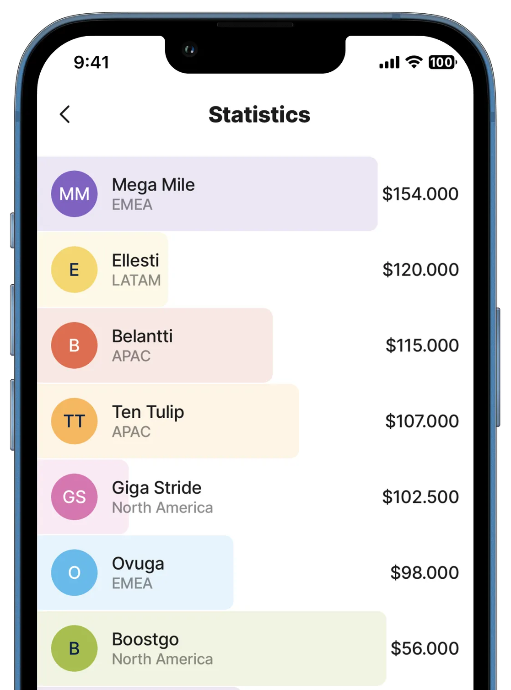<figcaption><p>Jig List Preview</p></figcaption></figure>



## Considerations

* This jig type is similar to the component List, with the only exception that [list components](../Widgets/list.md) is a component that you use on a [Default jig](jig_default.md) with other items, whereas the List jig is a jig dedicated to a list only.
* Each item in a list can be called individually through indexing. Lists are a compound data type made up of smaller parts and are very flexible because they can have values added, removed, and changed.
* When you need to store a lot of values or iterate over values, and you want to be able to readily modify those values, you’ll likely want to work with list data types.
* Each element or value inside a list is called an item.
* A `jig.list` component allows for a few configuration options and is automatically added as a list on a widget if the sizing of the widget exceeds 1x1. See the [list](../Components/list/list.md) for information on the list widget. This component can also be added to a `jig.default` where the [list](../Widgets/list.md) component is configured along with other content or components.
* When using the `value` property for filtering, it's recommended to use simple values such as strings or numbers (e.g., 'today', '7d', '14d'). Avoid using objects, as the filter logic is designed for strict equality checks. Instead, derive complex data like date ranges elsewhere based on the selected value.

## Configuration options

The `jig.list` can be configured in the following ways within the Jigx Builder:

* As a normal list (this is the main type - refer to the [list-item](../Components/list/list-item.md) component section for unique formatting options)
* As a list with [expanders](../Components/expander/expander.md)
* As a list with [stages](../Components/expander/stage.md)
* As a list of [product-items](../Components/list/product-item.md)
* As a list shown as a [bar-chart](../Components/charts/bar-chart.md)
* As a list shown as a [pie-chart](../Components/charts/pie-chart.md)

Some properties are common to all jig types, see [Common jig type properties](jig_list.md) for a list and their configuration options.

<table data-header-hidden><thead><tr><th width="138.046875">Other options</th><th></th></tr></thead><tbody><tr><td><code>badge</code></td><td><p>Add a badge to the list that displays on the widget to highlight critical information and capture the user's attention, ensuring key updates or notifications are easily noticeable within the app. The badge can be configured at the root level of the jig file:</p><ul><li>To display as a red dot using the <code>empty</code> value.</li><li>A red dot with a number using an expression to perform a count. For example, counting the number of tasks in the list.</li></ul></td></tr><tr><td><code>filter</code></td><td><code>initialValue</code> - Predefine the default selected tab for a filter on the list, so that when opening the default filter tab, it is displayed. <br><code>data</code> - define the filter tabs using: <code>title</code> - Give the filter a name. The text that will be displayed in the tab, for example, in stock. <br><code>value</code> - The value that the list filter returns. Use the following expressions to return this value:<br><code>=@ctx.components.my-list.state.filter</code> (for a list in a default jig) <code>=@ctx.jig.state.filter</code>(for a list jig) <br>For <code>true/false</code> values that are saved as a <strong>boolean</strong> ensure the filter has a <strong>boolean</strong> value. <br>For <code>true/false</code> values that are saved as <strong>strings</strong> ensure the filter has a <strong>string</strong> value. When using the <code>value</code> property for filtering, it's recommended to use simple values such as strings or numbers (e.g., 'today', '7d', '14d'). <br>Avoid using objects, as the filter logic is designed for strict equality checks. Instead, derive complex data, such as date ranges elsewhere, based on the selected value.</td></tr><tr><td><code>hasActiveItem</code></td><td>When set to <code>true</code> the list has an active item state.</td></tr><tr><td><code>isHorizontal</code></td><td>Set to <code>true</code> displays the list horizontally, while <code>false</code> displays the list vertically. The default list is displayed vertically.</td></tr><tr><td><code>isContained</code></td><td>Used to style the list item, <code>true</code> wraps the list item in a card, while <code>false</code> displays the item with no styling. This property can be used with vertical and horizontal lists and <code>component.list-item</code>.</td></tr><tr><td><code>isSearchable</code></td><td>Set to <code>true</code> adds a search field to the list. The default list is displayed without a search field.</td></tr><tr><td><code>isSelectable</code></td><td>When set to <code>true</code> the ability to select individual and multiple items in the list is available. Click the *Select *link in the top right of the screen. The default list is displayed without selection options.</td></tr><tr><td><code>leftElement</code></td><td><p>Set an element to the left of the list. The following elements are available:</p><ul><li><code>avatar</code> - configure the <code>color</code>, <code>size</code>, <code>text</code>, <code>uri</code>, and <code>onPress</code> event.</li><li><code>checkbox</code></li><li><code>icon</code> - the icon <code>size</code>, <code>color</code>,<code>shape</code>, <code>type</code>, <code>isSubtle</code> (low opacity), and <code>onPress</code> event is configurable.</li><li><code>image</code> - the image <code>size</code>, <code>shape</code>, <code>resizeMode</code>, and <code>onPress</code> event is configurable.</li><li><code>progress</code></li></ul></td></tr><tr><td><code>rating</code></td><td>Displays a rating as either a numerical value or a percentage. This property is highly flexible, with options to configure the <code>ratingIcon</code>, <code>color</code>, and accompanying descriptive <code>text</code>. By default, the rating property has only one icon showing a rating-star in the primary color. <code>value</code>- Rating with numerical value. The value of the rating, which can be a simple number. The number of icons is calculated based on this value unless overridden in the icon configuration. Configuring the <code>current</code> and <code>maximum</code> values, shows the value as a fraction, for example 7/10. <code>percentage</code> - Rating with a percentage. The percentage value for the rating, where the value ranges between 0 and 1, for example 0.75 is 75%. <code>ratingIcon</code> - By default the <em>rating-star</em> icon in the <em>primary</em> color is displayed. <code>icon</code> - Add an icon to represent the rating. A list of icons is available. See for more information. <code>color</code>- Sets the color of the icon, choose a color from the provided color palette. Default color is primary if the property is not specified in the YAML. See the list of available colors in . <code>current</code> and <code>maximum</code> values - Where maximum is the number of icons to display and current the number of icons to color. <code>text</code> - add descriptive text that displays next to rating. Ratings can set up in the following ways: 1) Example of <code>value</code> for a product rating. 2) Example of a user rating shown in a <code>percentage</code> 3) Example of <code>value</code> rating showing 2.5/5 as a rating with single star icon.</td></tr><tr><td><code>rightElement</code></td><td><p>Set an element to the right of the list. The following elements are available:</p><ul><li><code>amountControl</code></li><li><code>badge</code> - can be a solid colored badge or a badge with a number in it. Badges always use the primary color.</li><li><code>button</code></li><li><code>checkbox</code></li><li><code>icon</code> - the icon <code>size</code>, <code>color</code>,<code>shape</code>, <code>type</code>, <code>isSubtle</code> (low opacity), and <code>onPress</code> event is configurable.</li><li><code>switch</code></li><li><code>value</code> - When using <code>text</code>, the option to change its <code>color</code> is available.</li><li><code>text</code> - define up to three lines of text with styling (color, bold, font size) applied to each line of text.</li></ul></td></tr><tr><td><code>sections</code></td><td>Used for styling a list, when set to <code>true</code> each item in the list displays in its own section, divided by a line. The default is <code>false</code>.</td></tr><tr><td><code>tags</code></td><td><p>A set of descriptive keywords appear at the bottom of each list item, helping to categorize and provide context. Unlike labels, multiple tags can be shown. Tags support up to two lines; if the tags exceed this space, a +1 indicator is added to represent the number of hidden tags. For example, if two tags are hidden, +2 will display at the end of the list.</p><ul><li><code>text</code> - The text content displayed within the tag.</li><li><code>color</code> - Sets the color of the tags, choose a color from the provided color palette. The default is primary. See the list of available colors in . Tags can be set up in three ways: 1) Using a dynamic expression from a datasource: <code>tags: =@ctx.datasources.product-tags[product = @ctx.current.item.id].{"text":tags, "color":color}</code> 2) Using a dynamic expression from a list item: <code>tags: =@ctx.current.item.tags.{"text":$, "color":"primary"}</code> 3) Using static, predefined tags <code>tags: - text: =@ctx.current.item.rating > 0.75 ? 'Great'</code></li></ul></td></tr><tr><td><code>title</code></td><td>Add a <code>title</code> for the list-item. You can use an expression and datasource to set the title. Select <em>Line Options</em> (<code>text</code>), allowing configuration of individual parts of the central element in a list-item. You can set properties such as <code>color</code>, <code>fontSize</code>, <code>bold</code>, <code>format</code>, <code>isSubtle</code> (low opacity), and <code>numberOfLines</code>, rather than applying them globally via the root.</td></tr></tbody></table>



```yaml
rating:
   value: 4.5
   text: based on 1,200 reviews
```



```yaml
percentage:
rating:
   percentage: 0.75
   text: expectations exceeded
```



```yaml
rating:
   value:
      current: 2.5 
      maximum: 5 
   ratingIcon:
      icon: rating-star
```



<table><thead><tr><th width="211.640625">State Configuration</th><th width="227.34765625">Key</th><th>Notes</th></tr></thead><tbody><tr><td><code>=@ctx.jig.state.</code></td><td>activeItem activeItemId amounts filter isHorizontal isRefreshing isSelectable isSelectActive searchText selected value</td><td>State is set by the creator in the YAML. State applies to the jig</td></tr><tr><td><code>=@ctx.current.state.</code></td><td>amount checked</td><td>Applies to a list, list.item, product-item, and stage components. List's data is an array of records. The <code>=@ctx.current.state</code> is the state of the current object in the array.</td></tr><tr><td><code>=@ctx.solution.state.</code></td><td>activeItemId now</td><td>Global state variable that can be used throughout the solution.</td></tr></tbody></table>

## Examples and code snippets


The code below is an extract from the full _jigx-samples_ solution. The code snippets describe the component discussed in this section. For the solution to function in the Jigx app download the full _jigx-samples_ project from [GitHub](https://github.com/jigx-com/jigx-samples/tree/main/quickstart/jigx-samples), and follow the instructions in [Setting up your solution](jig_list.md).


### Simple List



<figure>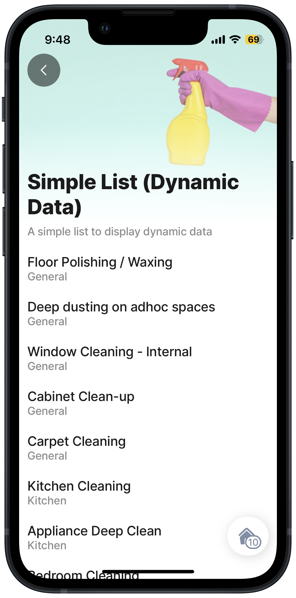<figcaption><p>Simple List</p></figcaption></figure>



This example displays the list in its most basic form without any additional properties or elements configured. Scroll down for more examples of how you can implement lists.

**Examples**:\
See the full code sample using static data [local](https://github.com/jigx-com/jigx-samples/blob/main/quickstart/jigx-samples/jigs/jig-types/jig-list/simple-lists/static-data/simple-list-sd-local.jigx) and [global](https://github.com/jigx-com/jigx-samples/blob/main/quickstart/jigx-samples/jigs/jig-types/jig-list/simple-lists/static-data/simple-list-sd-global.jigx) in GitHub.\
See the full code sample using dynamic data in [GitHub](https://github.com/jigx-com/jigx-samples/blob/main/quickstart/jigx-samples/jigs/jig-types/jig-list/simple-lists/dynamic-data/simple-list-dd.jigx).

**Datasources**:\
See the full datasource code sample for static data in [GitHub](https://github.com/jigx-com/jigx-samples/blob/main/quickstart/jigx-samples/datasources/services/repair-services-static.jigx).\
See the full datasource code sample for dynamic data in [GitHub](https://github.com/jigx-com/jigx-samples/blob/main/quickstart/jigx-samples/datasources/services/cleaning-services-dynamic.jigx).


Using the code below requires data in the database, the jigx.sample solution has the data provided for cleaning -services. You can use the cleaning-services.csv file in [GitHub](https://github.com/jigx-com/jigx-samples/blob/main/quickstart/csv/cleaning-services.csv) and upload it via the [Data](https://docs.jigx.com/administration/solutions/data) configuration in Jigx Management.






```yaml
title: Simple List (Dynamic Data)
description: A simple list to display dynamic data
type: jig.list
icon: task-list

header:
  type: component.jig-header
  options:
    height: medium
    children:
      type: component.image
      options:
        source:
          uri: https://images.unsplash.com/photo-1563453392212-326f5e854473?ixlib=rb-1.2.1&ixid=MnwxMjA3fDB8MHxwaG90by1wYWdlfHx8fGVufDB8fHx8&auto=format&fit=crop&w=1470&q=80
          
data: =@ctx.datasources.cleaning-services-dynamic
item:
  type: component.list-item
  options:
    title: =@ctx.current.item.service
    subtitle: =@ctx.current.item.area
```



```yaml
datasources:
  cleaning-services-dynamic:
    type: datasource.sqlite
    options:
      provider: DATA_PROVIDER_DYNAMIC
      entities:
        - entity: default/cleaning-services
      query: |
        SELECT 
          id, 
          '$.id' as sqlid, 
          '$.area', 
          '$.description', 
          '$.hourlyrate', 
          '$.illustration', 
          '$.image', 
          '$.indoor', 
          '$.onceoffrate', 
          '$.service', 
          '$.pressed', 
          '$.time',
          '$.quantity'
        FROM [default/cleaning-services] WHERE '$.hourlyrate' IS NOT NULL ORDER BY id DESC
```



```yaml
databaseId: default
tables:
  cleaning-services: null
```



```yaml
name: simple-list
title: simple-list
category: business
tabs:
  home:
    jigId: simple-list-dd
    icon: home-apps-logo
```



### Lists with styles


{% column width="50%" %}
<figure>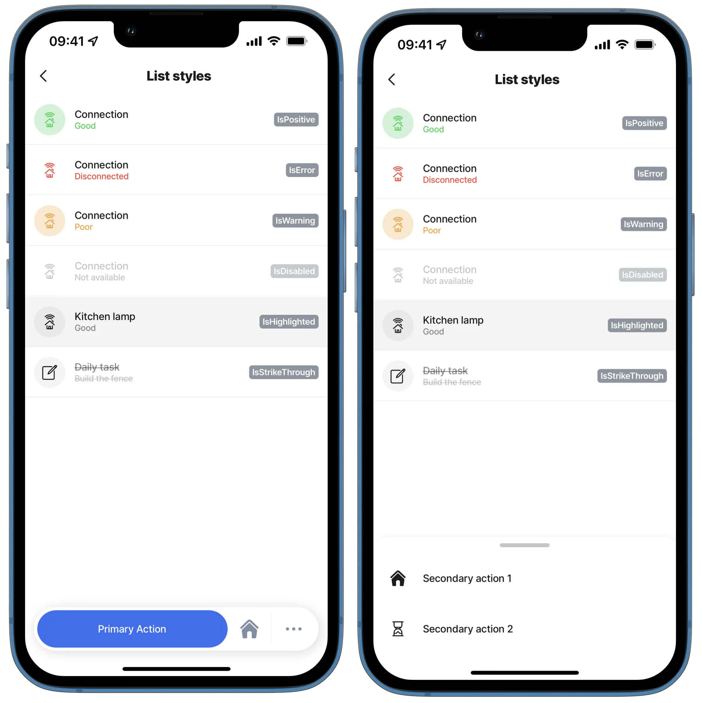<figcaption><p>List style</p></figcaption></figure>


{% column width="50%" %}
This is a very basic example to guide you on the various styles available to you. This is not only useful to see your options but also to see how these options compare to one another.

**Examples:**\
See the full example using [GitHub](https://github.com/jigx-com/jigx-samples/blob/main/quickstart/jigx-samples/jigs/jig-types/jig-list/simple-lists/static-data/list-with-styles-sd.jigx) in GitHub.





```yaml
title: List styles
type: jig.list
# isHorizontal: true
# isHorizontalScrollIndicatorHidden: true

actions:
  - children:
      - type: action.go-back
        options:
          title: Primary Action
      - type: action.go-back
        options:
          title: Secondary action 1
          icon: home
      - type: action.go-back
        options:
          title: Secondary action 2
          icon: hourglassactions:
  - children:
      - type: action.go-back
        options:
          title: Primary Action
      - type: action.go-back
        options:
          title: Secondary action 1
          icon: home
      - type: action.go-back
        options:
          title: Secondary action 2
          icon: hourglass
          
data: =@ctx.datasources.styles
item:
  type: component.list-item
  options:
    title: =@ctx.current.item.name
    subtitle: =@ctx.current.item.subtitle
    label:
      title: =@ctx.current.item.label-title
      color:
        - when: true
          color: color14

    divider: solid
    horizontalItemSize: regular

    style:
      isPositive: =@ctx.current.item.isPositive
      isHighlighted: =@ctx.current.item.isHighlighted
      isStrikeThrough: =@ctx.current.item.isStrikeThrough
      isError: =@ctx.current.item.isError
      isWarning: =@ctx.current.item.isWarning
      isDisabled: =@ctx.current.item.isDisabled

    leftElement:
      element: icon
      icon: =@ctx.current.item.icon
      type: =@ctx.current.item.type
```



```yaml
datasources:
  styles:
    type: datasource.static
    options:
      data:
        - name: Connection
          subtitle: Good
          label-title: IsPositive
          isHighlighted: false
          isStrikeThrough: false
          isPositive: true
          isError: false
          isWarning: false
          isDisabled: false
          icon: house-signal
          type: duotone
          
        - name: Connection
          subtitle: Disconnected
          label-title: IsError
          isHighlighted: false
          isStrikeThrough: false
          isPositive: false
          isError: true
          isWarning: false
          isDisabled: false
          icon: house-signal
          
        - name: Connection
          subtitle: Poor
          label-title: IsWarning
          isHighlighted: false
          isStrikeThrough: false
          isPositive: false
          isError: false
          isWarning: true
          isDisabled: false
          icon: house-signal
          type: contained

        - name: Connection
          subtitle: Not available
          label-title: isDisabled
          isHighlighted: false
          isStrikeThrough: false
          isPositive: false
          isError: false
          isWarning: false
          isDisabled: true
          icon: house-signal
          type: contained
          
        - name: Kitchen lamp
          subtitle: Good
          label-title: isHighlighted
          isHighlighted: true
          isStrikeThrough: false
          isPositive: false
          isError: false
          isWarning: false
          isDisabled: false
          icon: house-signal
          type: duotone
          
        - name: Daily task
          subtitle: Build the fence
          label-title: isStrikeThrough
          isHighlighted: false
          isStrikeThrough: true
          isPositive: false
          isError: false
          isWarning: false
          isDisabled: false
          icon: pencil-write
          type: duotone
```



```yaml
name: list styles
title: list-styles
category: business
tabs:
  home:
    jigId: list-with-styles-sd
    icon: home-apps-logo
```



### List with Expanders (using Titles)



This example shows a list of Expanders that have used `titles` component as the header element.

Expanders are ideal for displaying additional information without having to navigate away to another page.

**Examples:**\
See the full code sample using [GitHub](https://github.com/jigx-com/jigx-samples/blob/main/quickstart/jigx-samples/jigs/jig-types/jig-list/advanced-lists/static-data/list-with-expander-title-sd.jigx) in GitHub. See the full code sample using [GitHub](https://github.com/jigx-com/jigx-samples/blob/main/quickstart/jigx-samples/jigs/jig-types/jig-list/advanced-lists/dynamic-data/list-with-expander-title-dd.jigx)

**Datasources:**

See the full datasource code sample for [static data](https://github.com/jigx-com/jigx-samples/blob/main/quickstart/jigx-samples/datasources/expanders%20and%20stages/expander-on-list.jigx). See the full datasource code sample for [dynamic data](https://github.com/jigx-com/jigx-samples/blob0/main/quickstart/jigx-samples/datasources/expanders%20and%20stages/expander-on-list-dynamic.jigx) in Github.



<figure><figcaption><p>List with expander</p></figcaption></figure>




Using the code below requires data in the database, the jigx.sample solution has the data provided for employees. You can use the employees.csv file in [GitHub](https://github.com/jigx-com/jigx-samples/blob/main/quickstart/csv/employees.csv) and upload it via the [Data](https://docs.jigx.com/administration/solutions/data) configuration in Jigx Management.




```yaml
title: Work Team
description: List with Expander and Title as Header Element (Centre)
type: jig.list

header:
  type: component.jig-header
  options:
    height: medium
    children: 
      type: component.image
      options:
        source:
          uri: https://images.unsplash.com/photo-1517048676732-d65bc937f952?ixlib=rb-1.2.1&ixid=MnwxMjA3fDB8MHxwaG90by1wYWdlfHx8fGVufDB8fHx8&auto=format&fit=crop&w=2940&q=80

data: =@ctx.datasources.expander-on-list-dynamic
item:
  type: component.expander
  options:
    header:
      centerElement: 
        type: component.titles
        options:
          title: =@ctx.current.item.firstname & ' ' & @ctx.current.item.lastname
          subtitle: =@ctx.current.item.position
          icon: person
          align: left
    children:
      - type: component.entity
        options:
          children:
            - type: component.field-row
              options:
                children:
                  - type: component.entity-field
                    options:
                      label: Phone
                      value: =@ctx.current.item.phone
                  - type: component.entity-field
                    options:
                      label: Email
                      value: =@ctx.current.item.email
            - type: component.entity-field
              options:
                label: Address
                value: =@ctx.current.item.address
```



```yaml
datasources:
  expander-on-list-dynamic:
    type: datasource.sqlite
    options:
      provider: DATA_PROVIDER_DYNAMIC
      entities:
        - entity: default/employees
      query: | 
        SELECT 
          id,
          '$.firstname',
          '$.lastname', 
          '$.email',
          '$.phone', 
          '$.position', 
          '$.address', 
          '$.category' 
        FROM [default/employees] WHERE '$.category' = 'employees-expander'
```



```yaml
databaseId: default
tables:
  employees: null
```



```yaml
name: list-expander
title: list-expander
category: business
tabs:
  home:
    jigId: list-with-expander-title-dd
    icon: home-apps-logo
```



### List with Stages



<figure>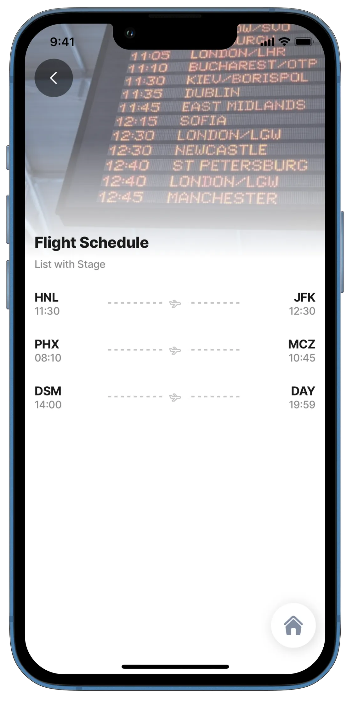<figcaption><p>List with stages</p></figcaption></figure>



This example is for list items that would have a left and right element and would typically show a start-and-end concept. A common use of this is usually flight schedules, however, this can be used for a multitude of different uses as you can choose a different icon.


This is very often used in the header component of the expander. See the list example for the expander above for comparisons.


**Examples:**\
See the full code sample using [static data](https://github.com/jigx-com/jigx-samples/blob/main/quickstart/jigx-samples/jigs/jig-types/jig-list/advanced-lists/static-data/list-with-stage-sd.jigx) in GitHub. See the full code sample using [dynamic data](https://github.com/jigx-com/jigx-samples/blob/main/quickstart/jigx-samples/jigs/jig-types/jig-list/advanced-lists/dynamic-data/list-with-stage-dd.jigx) in GitHub.

**Datasource:**\
See the full datasource code sample for [static data](https://github.com/jigx-com/jigx-samples/blob/main/quickstart/jigx-samples/datasources/expanders%20and%20stages/flight-schedule-static.jigx) in GitHub. See the full datasource code sample for [dynamic data](https://github.com/jigx-com/jigx-samples/blob/main/quickstart/jigx-samples/datasources/expanders%20and%20stages/flight-schedule-dynamic.jigx) in GitHub.


Using the code below requires data in the database, the jigx.sample solution has the data provided for flight-schedule. You can use the flight-schedule.csv file in [GitHub](https://github.com/jigx-com/jigx-samples/blob/main/quickstart/csv/flight-schedule.csv) and upload it via the [Data](https://docs.jigx.com/administration/solutions/data) configuration in Jigx Management.






```yaml
title: Flight Schedule
description: List with Stage
type: jig.list
icon: plane-1

header:
  type: component.jig-header
  options:
    height: medium
    children: 
      type: component.image
      options:
        source:
          uri: https://images.unsplash.com/photo-1490430657723-4d607c1503fc?ixlib=rb-1.2.1&ixid=MnwxMjA3fDB8MHxzZWFyY2h8OHx8ZmxpZ2h0c3xlbnwwfHwwfHw%3D&auto=format&fit=crop&w=500&q=60

data: =@ctx.datasources.flight-schedule-dynamic
item:
  type: component.stage
  options:
    icon: plane-1
    right:
      title: =@ctx.current.item.toabrv
      subtitle: =@ctx.current.item.disembark
    left:
      title: =@ctx.current.item.fromabrv
      subtitle: =@ctx.current.item.board
          
widgets:
  flights:
    type: widget.list
    options:
      data: =@ctx.datasources.flight-schedule-dynamic
      item: 
        type: component.stage
        options:
          icon: plane-1
          right:
            title: =@ctx.current.item.toabrv
            subtitle: =@ctx.current.item.to
          left:
            title: =@ctx.current.item.fromabrv
            subtitle: =@ctx.current.item.from
```



```yaml
datasources:
  flight-schedule-dynamic:
    type: datasource.sqlite
    options:
      provider: DATA_PROVIDER_DYNAMIC
      entities:
        - entity: default/flight-schedule
      query: | 
        SELECT 
          id, 
          '$.airline', 
          '$.board', 
          '$.disembark', 
          '$.date', 
          '$.flight', 
          '$.from', 
          '$.fromabrv', 
          '$.gate', 
          '$.name', 
          '$.seat', 
          '$.to', 
          '$.toabrv' 
        FROM [default/flight-schedule]
```



```yaml
databaseId: default
tables:
  flight-schedule: null
```



```yaml
name: list-stages
title: list-stages
category: business
tabs:
  home:
    jigId: list-with-stage-dd
    icon: home-apps-logo
```



### List with Product-items



<figure>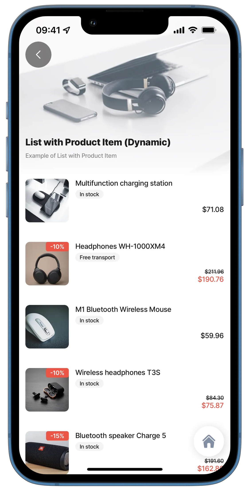<figcaption><p>List with product items</p></figcaption></figure>



This example displays the built-in functionality of displaying product items in a way that allows for impact yet does not require intricate setups.

**Examples:**\
See the full code sample using [static data](https://github.com/jigx-com/jigx-samples/blob/main/quickstart/jigx-samples/jigs/jig-types/jig-list/advanced-lists/static-data/list-with-product-item-sd.jigx) in GitHub. See the full code sample using [dynamic data](https://github.com/jigx-com/jigx-samples/blob/main/quickstart/jigx-samples/jigs/jig-types/jig-list/advanced-lists/dynamic-data/list-with-product-item-dd.jigx) in GitHub.

**Datasource:**\
See the full datasource code sample for [static data](https://github.com/jigx-com/jigx-samples/blob/main/quickstart/jigx-samples/datasources/products/products.jigx) in GitHub. See the full datasource code sample for [dynamic data](https://github.com/jigx-com/jigx-samples/blob/main/quickstart/jigx-samples/datasources/products/products-dynamic.jigx) in GitHub.


Using the code below requires data in the database, the jigx.sample solution has the data provided for products. You can use the products.csv file in <[GitHub](https://github.com/jigx-com/jigx-samples/blob/main/quickstart/csv/products.csv) and upload it via the \[Data]\(https://docs.jigx.com/administration/solutions/data configuration in Jigx Management.






```yaml
title: List with Product Item (Dynamic)
description: Example of List with Product Item
type: jig.list

icon: delivery-truck-5

header:
  type: component.jig-header
  options:
    height: medium
    children: 
      type: component.image
      options:
        source:
          uri: https://images.unsplash.com/photo-1498049794561-7780e7231661?ixlib=rb-1.2.1&ixid=MnwxMjA3fDB8MHxzZWFyY2h8OXx8dGVjaG5vbG9neSUyMHByb2R1Y3RzfGVufDB8fDB8fA%3D%3D&auto=format&fit=crop&w=500&q=60


data: =@ctx.datasources.products-dynamic
item:
  type: component.product-item
  options:
    title: =@ctx.current.item.title
    image:
      uri: =@ctx.current.item.uri
    discount: =@ctx.current.item.discount
    price:
      value: =@ctx.current.item.price
      format:
        numberStyle: currency
    tag: =@ctx.current.item.tag
```



```yaml
datasources:
  products-dynamic:
    type: datasource.sqlite
    options:
      provider: DATA_PROVIDER_DYNAMIC
      entities:
        - entity: default/products
      query: |
        SELECT
          id,
          '$.title',
          '$.uri',
          '$.tag',
          '$.price',
          '$.category',
          '$.discount'
        FROM [default/products]
        WHERE '$.category' = "product"
```



```yaml
databaseId: default
tables:
  products: null
```



```yaml
name: list-with-product
title: list-with-product
category: business
tabs:
  home:
    jigId: list-with-product-item-dd
    icon: home-apps-logo
```



### List with Avatars



<figure><figcaption><p>List with avatars</p></figcaption></figure>



This example displays the list items in a way that allows for impact yet does not require intricate setups. Avatars are displayed for each list item.

**Examples:**\
See the full code samples using [static data](https://github.com/jigx-com/jigx-samples/blob/main/quickstart/jigx-samples/jigs/jig-types/jig-list/advanced-lists/static-data/list-avatars-sd.jigx) in GitHub. See the full code samples using [dynamic data](https://github.com/jigx-com/jigx-samples/blob/main/quickstart/jigx-samples/jigs/jig-types/jig-list/advanced-lists/dynamic-data/list-avatars-dd.jigx) in GitHub.

**Datasource**:\
See the full datasource code samples for [static data](https://github.com/jigx-com/jigx-samples/blob/main/quickstart/jigx-samples/jigs/jig-types/jig-list/advanced-lists/static-data/list-avatars-sd.jigx) in GitHub. See the full datasource code samples for [dynamic data](https://github.com/jigx-com/jigx-samples/blob/main/quickstart/jigx-samples/jigs/jig-types/jig-list/advanced-lists/dynamic-data/list-avatars-dd.jigx) in GitHub.


Using the code below requires data in the database, the jigx.sample solution has the data provided for avatars and employees. You can use the [avatar.csv](https://github.com/jigx-com/jigx-samples/blob/main/quickstart/csv/avatar.csv) and [employees.csv](https://github.com/jigx-com/jigx-samples/blob/main/quickstart/csv/employees.csv) files in GitHub and upload it via the [Data](https://docs.jigx.com/administration/solutions/data) configuration in Jigx Management.






```yaml
title: List with Avatars (Dynamic)
type: jig.list
icon: task-list

header:
  type: component.jig-header
  options:
    height: medium
    children:
      type: component.image
      options:
        source:
          uri: https://images.unsplash.com/photo-1597423498219-04418210827d?ixlib=rb-1.2.1&ixid=MnwxMjA3fDB8MHxzZWFyY2h8MTB8fHJlcGFpcnN8ZW58MHx8MHx8&auto=format&fit=crop&w=900&q=60

data: =@ctx.datasources.groups
item:
  type: component.list-item
  options:
    title: =@ctx.current.item.group
    subtitle: ='Group id:'& ' ' & @ctx.current.item.groupId 
    avatars:  =@ctx.datasources.avatars[groupId = @ctx.current.item.groupId].{"text":name,"uri":photo}[] 
```



```yaml
datasources:
  groups:
    type: datasource.sqlite
    options:
      provider: DATA_PROVIDER_DYNAMIC
      entities:
        - default/employees
      query: |
        SELECT 
          id, 
          '$.group',
          '$.groupId',
          '$.category'
        FROM [default/employees] WHERE '$.category' = "employees" and '$.groupId' IS NOT NULL
        
  avatars:
    type: datasource.sqlite
    options:
      provider: DATA_PROVIDER_DYNAMIC
      entities:
        - default/avatar
      query: |
        SELECT 
          id, 
          '$.name',
          '$.photo',
          '$.groupId',
          '$.category'
        FROM [default/avatar] WHERE '$.category' = "avatars"
```



```yaml
databaseId: default
tables:
  avatar: null
  employees: null
```



```yaml
name: list-with-avatars
title: list-with-avatars
category: business
tabs:
  home:
    jigId: list-with-avatars-dd
    icon: home-apps-logo
```



### List with right numbered badges


{% column width="50%" %}
This example displays a list of task priorities, with the number of tasks in each priority shown in a `badge` on the right. Badges always use the primary color. You cannot change the color of the badge.

**Examples:**\
See the full example in [GitHub](https://github.com/jigx-com/jigx-samples/blob/main/quickstart/jigx-samples/jigs/jig-types/jig-list/advanced-lists/dynamic-data/list-right-numbered-badge.jigx).


{% column width="50%" %}
<figure><figcaption><p>List with numbered badge</p></figcaption></figure>





```yaml
title: Team task priorties
description: A list displaying priorities, with a numbered badge for each. 
type: jig.list
icon: task-list

header:
  type: component.jig-header
  options:
    height: medium
    children:
      type: component.image
      options:
        source:
          uri: https://images.unsplash.com/photo-1557426272-fc759fdf7a8d?w=500&auto=format&fit=crop&q=60&ixlib=rb-4.0.3&ixid=M3wxMjA3fDB8MHxzZWFyY2h8MTZ8fHRlYW0lMjBzdGF0c3xlbnwwfHwwfHx8MA%3D%3D

  priority: 
    type: datasource.static
    options:
      data:
        - id: 1
          name: Closed
          icon: check-2-alternate
        - id: 2
          name: Urgent
          icon: double-exclamation-mark-2-formatting
        - id: 3
          name: High
          icon: arrow-double-up
        - id: 4
          name: Low
          icon: arrow-double-down
        - id: 4
          name: Medium
          icon: equal-math-symbol-circle
              
data: =@ctx.datasources.team-tasks    
item:
  type: component.list-item
  options:
    color:
      - when: =@ctx.current.item.priority = 'Urgent'
        color: negative
      - when: =@ctx.current.item.priority = 'Medium'
        color: primary
      - when: =@ctx.current.item.priority = 'Low'
        color: color6
      - when: =@ctx.current.item.priority = 'Closed'
        color: positive
      - when: =@ctx.current.item.priority = 'High'
        color: warning
    title: =@ctx.current.item.priority
    leftElement:
      element: icon
      icon: =@ctx.datasources.priority[name = @ctx.current.item.priority].icon
      type: duotone
    rightElement: 
      element: badge
# The badge will display with the number of priorities per priority,
# the count is configured in the datasource query.      
      value: =@ctx.current.item.taskCount
```



```yaml
datasources:
  team-tasks:
    type: datasource.sqlite
    options:
      provider: DATA_PROVIDER_DYNAMIC
      entities:
        - entity: default/tasks
      query: |
        SELECT 
          id, 
          JSON_EXTRACT(task.data, '$.taskAssignee') AS taskAssignee,
          JSON_EXTRACT(task.data, '$.taskName') AS taskName,
          JSON_EXTRACT(task.data, '$.taskCost') AS taskCost,
          JSON_EXTRACT(task.data, '$.taskId') AS taskId,
          JSON_EXTRACT(task.data, '$.taskStatus') AS taskStatus,
          JSON_EXTRACT(task.data, '$.team') AS team,
          JSON_EXTRACT(task.data, '$.Profile') AS Profile,
          JSON_EXTRACT(task.data, '$.priority') AS priority,
          COUNT(JSON_EXTRACT(task.data, '$.taskId')) AS taskCount
        FROM [default/tasks] AS task
        GROUP BY priority
        ORDER BY priority DESC
```



### List with Pie Charts



<figure>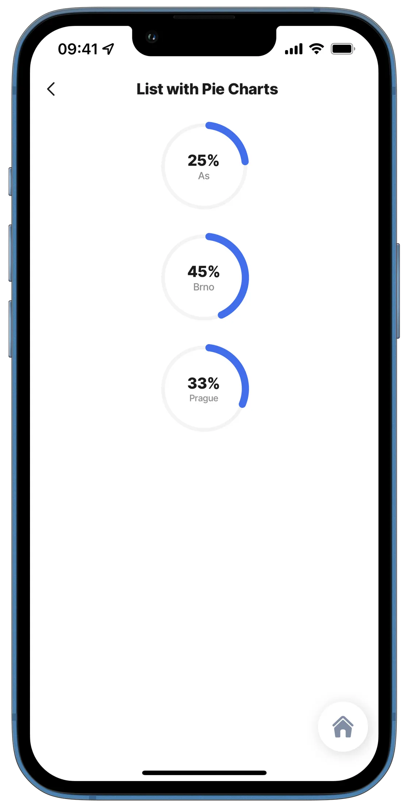<figcaption><p>Pie Chart list</p></figcaption></figure>



This is a simple example of how pie charts can also be displayed on a list - this is great for visual representation of information.

**Examples:**\
See full code sample using [static data](https://github.com/jigx-com/jigx-samples/blob/main/quickstart/jigx-samples/jigs/jig-types/jig-list/advanced-lists/static-data/list-with-pie-charts-sd.jigx) in GitHub





```yaml
title: List with Pie Charts
type: jig.list

data: =@ctx.datasources.components
item:
  type: component.pie-chart
  options:
    chart:
      title:
        text: =@ctx.current.item.title
        verticalAlign: center
      subtitle:
        text: =@ctx.current.item.subtitle
        verticalAlign: center
      width: 100
      height: 100
    legend:
      isHidden: true
    series:
      - data: =@ctx.current.item.data
        layout: pie
```



```yaml
datasources:
  components:
    type: datasource.static
    options:
      data:
        - title: 25%
          subtitle: As
          data:
            - 25
            - y: 75
              color: transparent
        - title: 45%
          subtitle: Brno
          data:
            - 45
            - y: 55
              color: transparent
        - title: 33%
          subtitle: Prague
          data:
            - 33
            - y: 67
              color: transparent
```



```yaml
name: list-with-pie-charts
title: list-with-pie-charts
category: business
tabs:
  home:
    jigId: list-with-pie-charts-sd
    icon: home-apps-logo
```



### Horizontal list



<figure>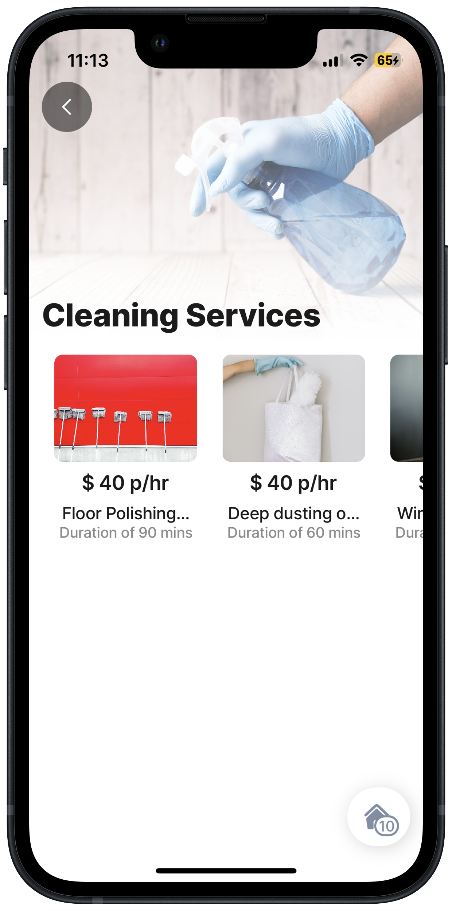<figcaption><p>Horizontal list</p></figcaption></figure>



This provides an example of a horizontal list with some UI elements like an image and values configured. Horizontal lists are especially helpful when used on a Composite Jig with other Jigs.

**Examples:**\
See the full code sample using [static data](https://github.com/jigx-com/jigx-samples/blob/main/quickstart/jigx-samples/jigs/jig-types/jig-list/advanced-lists/static-data/horizontal-lists/list-horizontal-sd.jigx) in GitHub. See the full code sample using [dynamic data](https://github.com/jigx-com/jigx-samples/blob/main/quickstart/jigx-samples/jigs/jig-types/jig-list/advanced-lists/dynamic-data/list-horizontal-dd.jigx) in GitHub.

**Datasources:**\
See the full datasource code sample for [static data](https://github.com/jigx-com/jigx-samples/blob/main/quickstart/jigx-samples/datasources/services/repair-services-static.jigx) in GitHub. See the full datasource code sample for [dynamic data](https://github.com/jigx-com/jigx-samples/blob/main/quickstart/jigx-samples/datasources/services/cleaning-services-dynamic.jigx) in GitHub.

**Other examples:**

See more code samples for [horizontal lists](https://github.com/jigx-com/jigx-samples/tree/main/quickstart/jigx-samples/jigs/jig-types/jig-list/advanced-lists/static-data/horizontal-lists) in GitHub.


Using the code below requires data in the database, the jigx.sample solution has the data provided for cleaning -services. You can use the cleaning-services.csv file in [GitHub](https://github.com/jigx-com/jigx-samples/blob/main/quickstart/csv/cleaning-services.csv) and upload it via the [Data](https://docs.jigx.com/administration/solutions/data) configuration in Jigx Management.





Horizontal lists cannot be used with the [section](../Components/entity/section.md) component as an empty white jig will be displaye




```yaml
title: Cleaning Services
description: List of available Cleaning Services
type: jig.list
icon: contact 
isHorizontal: true
isHorizontalScrollIndicatorHidden: false

header:
  type: component.jig-header
  options:
    height: medium
    children:
      type: component.image
      options:
        source:
          uri: https://images.unsplash.com/photo-1628177142898-93e36e4e3a50?ixlib=rb-1.2.1&ixid=MnwxMjA3fDB8MHxwaG90by1wYWdlfHx8fGVufDB8fHx8&auto=format&fit=crop&w=2070&q=80


data: =@ctx.datasources.cleaning-services-dynamic
item:
  type: component.list-item
  options:
    title: =@ctx.current.item.service
    subtitle: ='Duration of ' & @ctx.current.item.time & ' mins'
    horizontalItemSize: large
    leftElement: 
      element: image
      text: ''
      uri: =@ctx.current.item.image
    rightElement:
      element: value
      text: =(@ctx.current.item.hourlyrate) != 'NA' ? '$ ' & $number(@ctx.current.item.hourlyrate) & ' p/hr':'$ ' & $number(@ctx.current.item.onceoffrate) & ' once off'
```



```yaml
datasources:
  cleaning-services-dynamic:
    type: datasource.sqlite
    options:
      provider: DATA_PROVIDER_DYNAMIC
      entities:
        - entity: default/cleaning-services
      query: |
        SELECT 
          id, 
          '$.id' as sqlid, 
          '$.area', 
          '$.description', 
          '$.hourlyrate', 
          '$.illustration', 
          '$.image', 
          '$.indoor', 
          '$.onceoffrate', 
          '$.service', 
          '$.pressed', 
          '$.time',
          '$.quantity'
        FROM [default/cleaning-services] WHERE '$.hourlyrate' IS NOT NULL ORDER BY id DESC
default.jigx
```



```yaml
databaseId: default
tables:
  cleaning-services: null
```



```yaml
name: horizontal-list
title: horizontal-list
category: business
tabs:
  home:
    jigId: list-horizontal-dd
    icon: home-apps-logo
```



### Lists with Search functionality



<figure>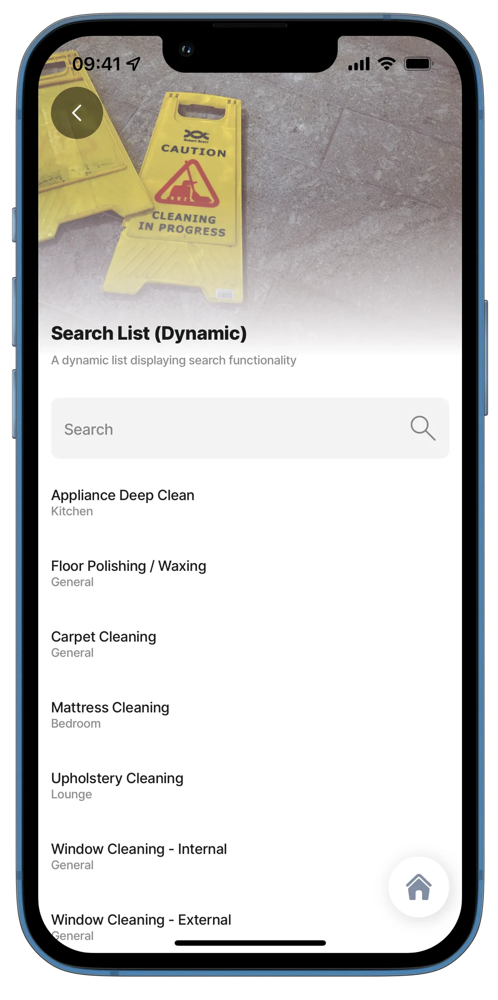<figcaption><p>List with search</p></figcaption></figure>



This example displays the search functionality of a basic List Jig that allows the user to filter a list with tons of data instantaneously based on certain keywords they have entered.

**Examples**:\
See the full code sample using [static data](https://github.com/jigx-com/jigx-samples/blob/main/quickstart/jigx-samples/jigs/jig-types/jig-list/advanced-lists/static-data/list-with-search-sd.jigx) in GitHub.\
See the full code sample using [dynamic data](https://github.com/jigx-com/jigx-samples/blob/main/quickstart/jigx-samples/jigs/jig-types/jig-list/advanced-lists/dynamic-data/list-with-search-dd.jigx) in GitHub.

**Datasources**:\
See the full datasource code sample for[static data](https://github.com/jigx-com/jigx-samples/blob/main/quickstart/jigx-samples/jigs/jig-types/jig-list/advanced-lists/static-data/list-with-search-sd.jigx) in GitHub.\
See the full datasource code sample for [dynamic data](https://github.com/jigx-com/jigx-samples/blob/main/quickstart/jigx-samples/datasources/services/cleaning-services-dynamic.jigx) in GitHub.




Using the code below requires data in the database, the jigx.sample solution has the data provided for cleaning -services. You can use the cleaning-services.csv file in [GitHub](https://github.com/jigx-com/jigx-samples/blob/main/quickstart/csv/cleaning-services.csv) and upload it via the [Data](https://docs.jigx.com/administration/solutions/data) configuration in Jigx Management.




```yaml
title: Search List (Dynamic)
description: A dynamic list displaying search functionality
type: jig.list
icon: notes-paper-approve
isSearchable: true

header:
  type: component.jig-header
  options:
    height: medium
    children:
      type: component.image
      options:
        source:
          uri: https://images.unsplash.com/photo-1529220502050-f15e570c634e?ixlib=rb-1.2.1&ixid=MnwxMjA3fDB8MHxwaG90by1wYWdlfHx8fGVufDB8fHx8&auto=format&fit=crop&w=1829&q=80

datasources:
  cleaning-services-dynamic:
    type: datasource.sqlite
    options:
      provider: DATA_PROVIDER_DYNAMIC
  
      entities:
        - entity: default/cleaning-services-dynamic
  
      query: SELECT id, '$.area', '$.description', '$.hourlyrate', '$.illustration', '$.image', '$.indoor', '$.onceoffrate', '$.service', '$.time' FROM [default/cleaning-services] WHERE '$.service' LIKE '%'||@search||'%' OR @search IS NULL
      queryParameters:
        search: =@ctx.jig.state.searchText
  
data: =@ctx.datasources.cleaning-services-dynamic
item:
  type: component.list-item
  options:
    title: =@ctx.current.item.service
    subtitle: =@ctx.current.item.area
    
```



```yaml
datasources:
  cleaning-services-dynamic:
    type: datasource.sqlite
    options:
      provider: DATA_PROVIDER_DYNAMIC
      entities:
        - entity: default/cleaning-services
      query: |
        SELECT 
          id, 
          '$.id' as sqlid, 
          '$.area', 
          '$.description', 
          '$.hourlyrate', 
          '$.illustration', 
          '$.image', 
          '$.indoor', 
          '$.onceoffrate', 
          '$.service', 
          '$.pressed', 
          '$.time',
          '$.quantity'
        FROM [default/cleaning-services] WHERE '$.hourlyrate' IS NOT NULL ORDER BY id DESC
```



```yaml
databaseId: default
tables:
  cleaning-services: null
```



```yaml
name: list-with-search
title: list-with-search
category: business
tabs:
  home:
    jigId: list-with-search-dd
    icon: home-apps-logo
```



### Lists with Filter functionality



<figure>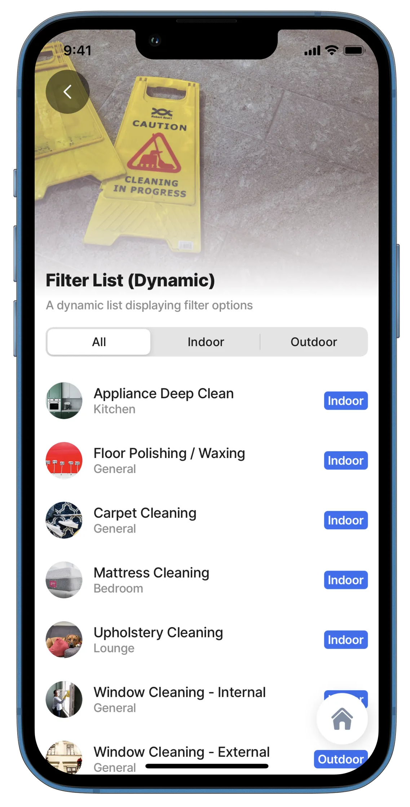<figcaption><p>List with filter</p></figcaption></figure>



This example helps to categorically filter the data to create meaningful sections or split the data for ease of use for the users.

**Examples**:\
See the full code sample using [static data](https://github.com/jigx-com/jigx-samples/blob/main/quickstart/jigx-samples/jigs/jig-types/jig-list/advanced-lists/static-data/list-filter-label-sd.jigx) in GitHub.\
See the full code sample using [dynamic data](https://github.com/jigx-com/jigx-samples/blob/main/quickstart/jigx-samples/jigs/jig-types/jig-list/advanced-lists/dynamic-data/list-filter-label-dd.jigx) in GitHub.

**Datasources**:\
See the full datasource code sample for [static data](https://github.com/jigx-com/jigx-samples/blob/main/quickstart/jigx-samples/jigs/jig-types/jig-list/advanced-lists/static-data/list-filter-label-sd.jigx) in GitHub.\
See the full datasource code sample for [dynamic data](https://github.com/jigx-com/jigx-samples/blob/main/quickstart/jigx-samples/jigs/jig-types/jig-list/advanced-lists/dynamic-data/list-filter-label-dd.jigx).




Using the code below requires data in the database, the jigx.sample solution has the data provided for cleaning -services. You can use the cleaning-services.csv file in [GitHub](https://github.com/jigx-com/jigx-samples/blob/main/quickstart/csv/cleaning-services.csv) and upload it via the [Data](https://docs.jigx.com/administration/solutions/data) configuration in Jigx Management.




```yaml
title: Filter List (Dynamic)
description: A dynamic list displaying filter options
type: jig.list
icon: notes-paper-approve

filter: 
  data: 
  - title: All
    value: ''
  - title: Indoor
    value: "TRUE"
  - title: Outdoor
    value: "FALSE"
  
header:
  type: component.jig-header
  options:
    height: medium
    children:
      type: component.image
      options:
        source:
          uri: https://images.unsplash.com/photo-1529220502050-f15e570c634e?ixlib=rb-1.2.1&ixid=MnwxMjA3fDB8MHxwaG90by1wYWdlfHx8fGVufDB8fHx8&auto=format&fit=crop&w=1829&q=80
        
data: =@ctx.datasources.cleaning-services-dynamic
item:
  type: component.list-item
  options:
    title: =@ctx.current.item.service
    subtitle: =@ctx.current.item.area
    label:
      title: =(@ctx.current.item.indoor = "TRUE" ? 'Indoor' :'Outdoor')
    leftElement: 
      element: avatar
      text: =$substring($substringBefore(@ctx.current.item.service, " "), 1, 1) & $substring($substringAfter(@ctx.current.item.service, " ") , 1, 1)
      uri: =@ctx.current.item.image
```



```yaml
datasources:
  cleaning-services-dynamic:
    type: datasource.sqlite
    options:
      provider: DATA_PROVIDER_DYNAMIC
      entities:
        - entity: default/cleaning-services
  
      query: |
        SELECT 
          id, 
          '$.area', 
          '$.description', 
          '$.hourlyrate', 
          '$.illustration', 
          '$.image', 
          '$.indoor', 
          '$.onceoffrate', 
          '$.service', 
          '$.time' 
        FROM [default/cleaning-services] 
        WHERE '$.indoor' LIKE @filter or @filter IS NULL
      queryParameters:
        filter: =@ctx.jig.state.filter
```



```yaml
databaseId: default
tables:
  cleaning-services: null
```



```yaml
name: list-with-filter
title: list-with-filter
category: business
tabs:
  home:
    jigId: list-filter-label-dd
    icon: home-apps-logo
```



### Lists with Search and Filter functionality



<figure><figcaption><p>List search and filter</p></figcaption></figure>



To further enhance the search and filter capabilities for the user, there is also an option to combine the search and filter functionality as can be seen in this example.

**Examples**:\
See the full code sample using [static data](https://github.com/jigx-com/jigx-samples/blob/main/quickstart/jigx-samples/jigs/jig-types/jig-list/advanced-lists/static-data/list-filter-search-label-sd.jigx) in GitHub.\
See the full code sample using [dynamic data](https://github.com/jigx-com/jigx-samples/blob/main/quickstart/jigx-samples/jigs/jig-types/jig-list/advanced-lists/dynamic-data/list-filter-search-label-dd.jigx) in GitHub.

**Datasources**:\
See the full datasource code sample for [static data](https://github.com/jigx-com/jigx-samples/blob/main/quickstart/jigx-samples/jigs/jig-types/jig-list/advanced-lists/static-data/list-filter-search-label-sd.jigx) in GitHub.\
See the full datasource for code sample [dynamic data](https://github.com/jigx-com/jigx-samples/blob/main/quickstart/jigx-samples/jigs/jig-types/jig-list/advanced-lists/dynamic-data/list-filter-search-label-dd.jigx) in GitHub.




Using the code below requires data in the database, the jigx.sample solution has the data provided for cleaning -services. You can use the cleaning-services.csv file in [GitHub](https://github.com/jigx-com/jigx-samples/blob/main/quickstart/csv/cleaning-services.csv) and upload it via the [Data](https://docs.jigx.com/administration/solutions/data) configuration in Jigx Management.




```yaml
title: Filter & Search List (Dynamic)
description: A dynamic list displaying filter and searching
type: jig.list
icon: notes-paper-approve
isSearchable: true

filter: 
  data: 
  - title: All
    value: ''
  - title: Indoor
    value: "TRUE"
  - title: Outdoor
    value: "FALSE"
  
header:
  type: component.jig-header
  options:
    height: medium
    children:
      type: component.image
      options:
        source:
          uri: https://images.unsplash.com/photo-1529220502050-f15e570c634e?ixlib=rb-1.2.1&ixid=MnwxMjA3fDB8MHxwaG90by1wYWdlfHx8fGVufDB8fHx8&auto=format&fit=crop&w=1829&q=80
  
data: =@ctx.datasources.cleaning-services-dynamic
item:
  type: component.list-item
  options:
    title: =@ctx.current.item.service
    subtitle: =@ctx.current.item.area
    label:
      title: =(@ctx.current.item.indoor = "TRUE" ? 'Indoor':'Outdoor')
    
    leftElement: 
      element: avatar
      text: =$substring($substringBefore(@ctx.current.item.service, " "), 1, 1) & $substring($substringAfter(@ctx.current.item.service, " ") , 1, 1)
      uri: =@ctx.current.item.image
```



```yaml
datasources:
  cleaning-services-dynamic:
    type: datasource.sqlite
    options:
      provider: DATA_PROVIDER_DYNAMIC
  
      entities:
        - entity: default/cleaning-services-dynamic
  
      query: SELECT id, '$.area', '$.description', '$.hourlyrate', '$.illustration', '$.image', '$.indoor', '$.onceoffrate', '$.service', '$.time' FROM [default/cleaning-services-dynamic] WHERE ('$.indoor' LIKE @filter OR @filter IS NULL) AND ('$.service' LIKE '%'||@search||'%' OR @search IS NULL)
      queryParameters:
        filter: =@ctx.jig.state.filter
        search: =@ctx.jig.state.searchText
```



```yaml
databaseId: default
tables:
  cleaning-services: null
```



```yaml
name: list-with-filter-search
title: list-with-filter-search
category: business
tabs:
  home:
    jigId: list-filter-search-label-dd
    icon: home-apps-logo
```



### Filtered list with default tab set



In this example, there are three tabs to filter on. By default we want the jig to open on the second tab (Team B). This is achieved by adding an `initialValue` property to the `filter` property.

**Example**:\
See the example in [GitHub](https://github.com/jigx-com/jigx-samples/blob/main/quickstart/jigx-samples/jigs/jig-types/jig-list/advanced-lists/dynamic-data/list-filter-initialvalue.jigx).



<figure>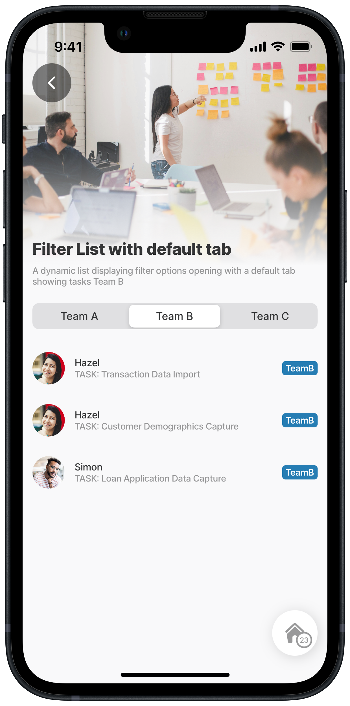<figcaption><p>Filtered list with default tab</p></figcaption></figure>





```yaml
title: Filter List with default tab
description: A dynamic list displaying filter options opening with a default tab showing tasks Team B
type: jig.list
icon: filter-1
  
header:
  type: component.jig-header
  options:
    height: medium
    children:
      type: component.image
      options:
        source:
          uri: https://images.unsplash.com/photo-1552664730-d307ca884978?q=80&w=2970&auto=format&fit=crop&ixlib=rb-4.0.3&ixid=M3wxMjA3fDB8MHxwaG90by1wYWdlfHx8fGVufDB8fHx8fA%3D%3D

filter:
# Set the jig to open with teamB tab open as default
    initialValue: teamB
    data: 
      - title: Team A
        value: teamA
      - title: Team B
        value: teamB
      - title: Team C
        value: teamC 
  
data: =@ctx.datasources.department
item:
  type: component.list-item
  options:
    title: =@ctx.current.item.taskAssignee
    subtitle: =@ctx.current.item.taskName
    label:
      color:
        - when: true
          color: color1
      title: =@ctx.current.item.team
    leftElement: 
      element: avatar
      text: =@ctx.current.item.taskAssignee
      uri: =@ctx.current.item.Profile
```



```yaml
datasources:
  department:
    type: datasource.sqlite
    options:
      provider: DATA_PROVIDER_DYNAMIC
      entities:
        - entity: default/tasks
      query: |
        SELECT 
          id, 
          '$.taskAssignee',
          '$.taskName',
          '$.taskCost',
          '$.taskId', 
          '$.taskStatus',
          '$.team', 
          '$.Profile'
         
        FROM [default/tasks]
        WHERE '$.team' LIKE @filter or @filter IS NULL
      queryParameters:
          filter: =@ctx.jig.state.filter
```



### Selectable lists



<figure>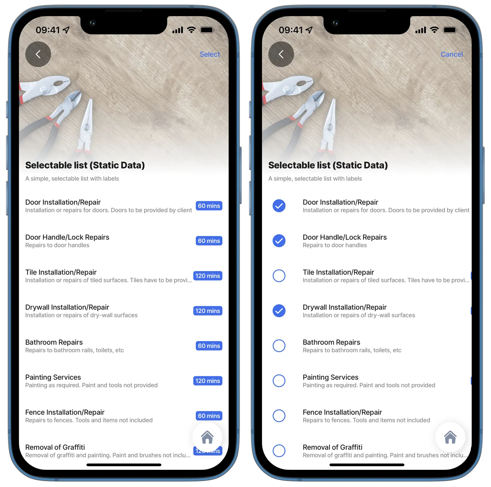<figcaption><p>Selectable list</p></figcaption></figure>



This example shows functionality that allows users to select one or numerous list items for quick actioning, saving them the time and effort of having to perform numerous repetitive manual tasks.\
\
**Examples**:\
See the full code sample using [static data](https://github.com/jigx-com/jigx-samples/blob/main/quickstart/jigx-samples/jigs/jig-types/jig-list/advanced-lists/static-data/list-selectable-sd.jigx) in GitHub.\
See the full code sample using [dynamic data](https://github.com/jigx-com/jigx-samples/blob/main/quickstart/jigx-samples/jigs/jig-types/jig-list/advanced-lists/dynamic-data/list-selectable-dd.jigx) in GitHub.

**Datasources**:\
See the full datasource code sample for [static data](https://github.com/jigx-com/jigx-samples/blob/main/quickstart/jigx-samples/datasources/services/repair-services-static.jigx) in GitHub.\
See the full datasource code sample for [dynamic data](https://github.com/jigx-com/jigx-samples/blob/main/quickstart/jigx-samples/datasources/services/cleaning-services-dynamic.jigx) in GitHub.




Using the code below requires data in the database, the jigx.sample solution has the data provided for cleaning -services. You can use the cleaning-services.csv file in [GitHub](https://github.com/jigx-com/jigx-samples/blob/main/quickstart/csv/cleaning-services.csv) and upload it via the [Data](https://docs.jigx.com/administration/solutions/data) configuration in Jigx Management.




```yaml
title: Selectable List (Dynamic Data)
description: A simple, selectable list with labels
type: jig.list
icon: task-list
isSelectable: true

header:
  type: component.jig-header
  options:
    height: medium
    children: 
      type: component.image
      options:
        source:
          uri: https://images.unsplash.com/photo-1482449609509-eae2a7ea42b7?ixlib=rb-1.2.1&ixid=MnwxMjA3fDB8MHxzZWFyY2h8MTl8fGNsZWFuaW5nfGVufDB8fDB8fA%3D%3D&auto=format&fit=crop&w=900&q=60

data: =@ctx.datasources.cleaning-services-dynamic
item:
  type: component.list-item
  options:
    title: =@ctx.current.item.service
    subtitle: =@ctx.current.item.description
    progress: =@ctx.component.state.checked = true ? 1 :0
    color:
      - when: =@ctx.component.state.checked = true ? true :false
        color: color2
    label:
      title: =@ctx.current.item.time & ' mins'
```



```yaml
datasources:
  cleaning-services:
    type: datasource.sqlite
    options:
      provider: DATA_PROVIDER_DYNAMIC
      entities:
        - entity: default/cleaning-services
      query: |
        SELECT 
          id, 
          '$.id' as sqlid, 
          '$.area', 
          '$.description', 
          '$.hourlyrate', 
          '$.illustration', 
          '$.image', 
          '$.indoor', 
          '$.onceoffrate', 
          '$.service', 
          '$.pressed', 
          '$.time',
          '$.quantity'
        FROM [default/cleaning-services] WHERE '$.hourlyrate' IS NOT NULL ORDER BY id DESC
```



```yaml
databaseId: default
tables:
  cleaning-services: null
```



```yaml
name: list-selectable
title: list-selectable
category: business
tabs:
  home:
    jigId: list-selectable-dd
    icon: home-apps-logo
```



### Lists with active items



This allows the user to see when they are interacting with a specific list item. Whilst interacting, the list item changes slightly making it clear to the user that they are interacting with this item.

**Examples**:\
See the full code sample using [static data](https://github.com/jigx-com/jigx-samples/blob/main/quickstart/jigx-samples/jigs/jig-types/jig-list/advanced-lists/static-data/list-with-active-item-sd.jigx) in GitHub.\
See the full code sample using [dynamic data](https://github.com/jigx-com/jigx-samples/blob/main/quickstart/jigx-samples/jigs/jig-types/jig-list/advanced-lists/dynamic-data/list-with-active-item-dd.jigx) in GitHub.

**Datasources**:\
See the full datasource code sample for [static data](https://github.com/jigx-com/jigx-samples/blob/main/quickstart/jigx-samples/datasources/services/repair-services-static.jigx) in GitHub.\
See the full datasource code sample for [dynamic data](https://github.com/jigx-com/jigx-samples/blob/main/quickstart/jigx-samples/datasources/services/cleaning-services-dynamic.jigx) in GitHub.



<figure>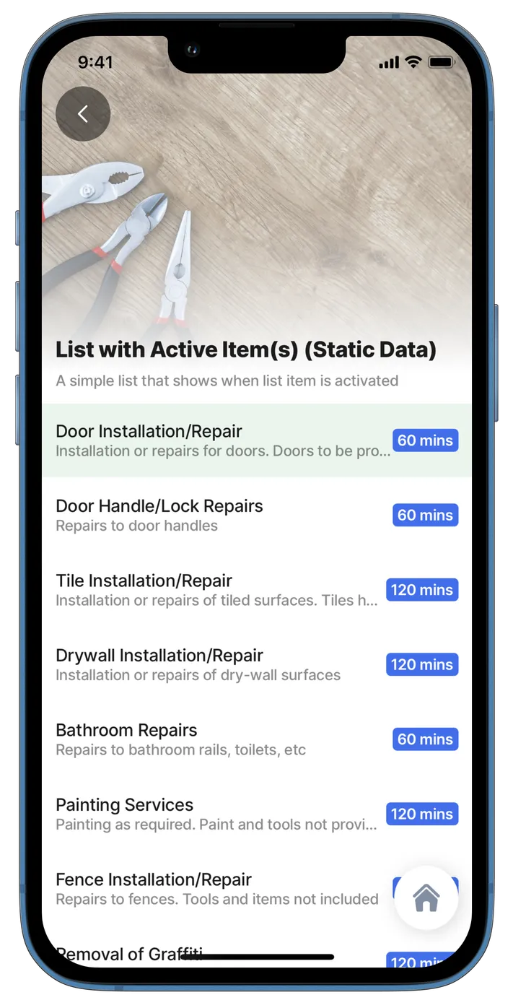<figcaption><p>List with active items</p></figcaption></figure>




Using the code below requires data in the database, the jigx.sample solution has the data provided for cleaning -services. You can use the cleaning-services.csv file in [GitHub](https://github.com/jigx-com/jigx-samples/blob/main/quickstart/csv/cleaning-services.csv) and upload it via the [Data](https://docs.jigx.com/administration/solutions/data) configuration in Jigx Management.




```yaml
title: List with Active Item(s) (Dynamic Data)
description: A simple list that shows when list item is activated
type: jig.list
icon: task-list
hasActiveItem: true

header:
  type: component.jig-header
  options:
    height: medium
    children: 
      type: component.image
      options:
        source:
          uri: https://images.unsplash.com/photo-1482449609509-eae2a7ea42b7?ixlib=rb-1.2.1&ixid=MnwxMjA3fDB8MHxzZWFyY2h8MTl8fGNsZWFuaW5nfGVufDB8fDB8fA%3D%3D&auto=format&fit=crop&w=900&q=60

data: =@ctx.datasources.cleaning-services-dynamic
item:
  type: component.list-item
  options:
    title: =@ctx.current.item.service
    subtitle: =@ctx.current.item.description
    progress: =@ctx.current.item.id = @ctx.solution.state.activeItemId ? 1 :0
    color:
      - when: =@ctx.current.item.id = @ctx.solution.state.activeItemId ? true :false
        color: color2
    label:
      title: =@ctx.current.item.time & ' mins'
    onPress: 
      type: action.action-list
      options:
        actions:
          - type: action.set-state
            options:
              state: =@ctx.solution.state.activeItemId
              value: =@ctx.current.item.id
```



```yaml
datasources:
  cleaning-services-dynamic:
    type: datasource.sqlite
    options:
      provider: DATA_PROVIDER_DYNAMIC
      entities:
        - entity: default/cleaning-services
      query: |
        SELECT 
          id, 
          '$.id' as sqlid, 
          '$.area', 
          '$.description', 
          '$.hourlyrate', 
          '$.illustration', 
          '$.image', 
          '$.indoor', 
          '$.onceoffrate', 
          '$.service', 
          '$.pressed', 
          '$.time',
          '$.quantity'
        FROM [default/cleaning-services] WHERE '$.hourlyrate' IS NOT NULL ORDER BY id DESC
```



```yaml
databaseId: default
tables:
  cleaning-services: null
```



```yaml
name: list-active-item
title: list-active-item
category: business
tabs:
  home:
    jigId: list-with-active-item-dd
    icon: home-apps-logo
```



### List with Sections



<figure>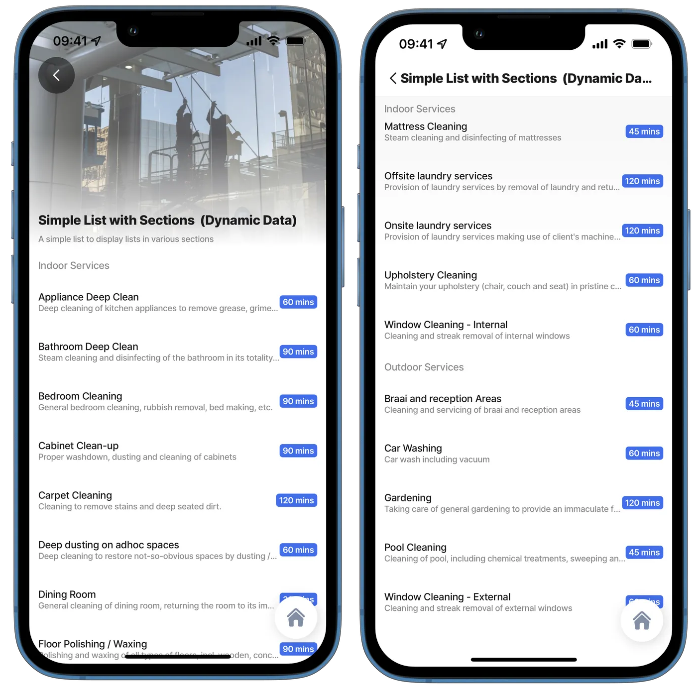<figcaption></figcaption></figure>



This functionality allows you to split your lists into more meaningful sections.

**Examples**:\
See the full code sample using [static data](https://github.com/jigx-com/jigx-samples/blob/main/quickstart/jigx-samples/jigs/jig-types/jig-list/advanced-lists/static-data/list-with-search-sd.jigx) in GitHub.\
See the full code sample using[dynamic data](https://github.com/jigx-com/jigx-samples/blob/main/quickstart/jigx-samples/jigs/jig-types/jig-list/advanced-lists/dynamic-data/list-with-sections-dd.jigx)in GitHub.

**Datasources**:\
See the full datasource code sample for [static data](https://github.com/jigx-com/jigx-samples/blob/main/quickstart/jigx-samples/datasources/services/repair-services-static.jigx) in GitHub.\
See the full datasource code sample for [dynamic data](https://github.com/jigx-com/jigx-samples/blob/main/quickstart/jigx-samples/datasources/services/cleaning-services-dynamic.jigx) in GitHub.




Using the code below requires data in the database, the jigx.sample solution has the data provided for cleaning -services. You can use the cleaning-services.csv file in [GitHub](jig_list.md) and upload it via the [Data](https://docs.jigx.com/administration/solutions/data) configuration in Jigx Management.




```yaml
title: Simple List with Sections  (Dynamic Data)
description: A simple list to display lists in various sections
type: jig.list
icon: task-list

header:
  type: component.jig-header
  options:
    height: medium
    children:
      type: component.image
      options:
        source:
          uri: https://images.unsplash.com/photo-1482449609509-eae2a7ea42b7?ixlib=rb-1.2.1&ixid=MnwxMjA3fDB8MHxzZWFyY2h8MTl8fGNsZWFuaW5nfGVufDB8fDB8fA%3D%3D&auto=format&fit=crop&w=900&q=60

sections:
    - title: Indoor Services
      data: =@ctx.datasources.cleaning-services-dynamic[indoor='TRUE']
    - title: Outdoor Services
      data: =@ctx.datasources.cleaning-services-dynamic[indoor='FALSE']
item:
    type: component.list-item
    options:
      title: =@ctx.current.item.service
      subtitle: =@ctx.current.item.description
      label:
        title: =@ctx.current.item.time & ' mins'
```



```yaml
datasources:
  cleaning-services-dynamic:
    type: datasource.sqlite
    options:
      provider: DATA_PROVIDER_DYNAMIC
      entities:
        - entity: default/cleaning-services
      query: |
        SELECT 
          id, 
          '$.id' as sqlid, 
          '$.area', 
          '$.description', 
          '$.hourlyrate', 
          '$.illustration', 
          '$.image', 
          '$.indoor', 
          '$.onceoffrate', 
          '$.service', 
          '$.pressed', 
          '$.time',
          '$.quantity'
        FROM [default/cleaning-services] WHERE '$.hourlyrate' IS NOT NULL ORDER BY id DESC
```



```yaml
databaseId: default
tables:
  cleaning-services: null
```



```yaml
name: list-with-sections
title: list-with-sections
category: business
tabs:
  home:
    jigId: list-with-sections-dd
    icon: home-apps-logo
```



### List with items contained in a card



This example use the `isContained` property set to `true` to style each item by wrapping it in a card. The code sample below is for a vertical list. You can also wrap list items in a card for a horizontal list.

**Examples:**\
See the full example in [GitHub](https://github.com/jigx-com/jigx-samples/blob/main/quickstart/jigx-samples/jigs/jig-types/jig-list/advanced-lists/static-data/list-item-contained.jigx).



<figure><figcaption><p>List items contained in a card</p></figcaption></figure>




```yaml
title: List with items wrapped in a card
description: A list displaying images on list items styled in a card
type: jig.list
icon: task-list
# Change the list to a horizontal list by uncommenting the isHorizontal line below
# isHorizontal: true

header:
  type: component.jig-header
  options:
    height: medium
    children:
      type: component.image
      options:
        source:
          uri: https://images.unsplash.com/photo-1581244277943-fe4a9c777189?ixlib=rb-1.2.1&ixid=MnwxMjA3fDB8MHxwaG90by1wYWdlfHx8fGVufDB8fHx8&auto=format&fit=crop&w=1632&q=80

data: =@ctx.datasources.repair-services-static
item:
  type: component.list-item
  options:
    isContained: true
    title: =@ctx.current.item.service
    subtitle: =@ctx.current.item.description
    leftElement:
      element: image
      text: =@ctx.current.item.service
      uri: =@ctx.current.item.imag
```


### List with ratings as a value



This example uses the basic rating configuration to display a `value` with accompanying `text`. By default, the rating shows a single star in the primary color.

**Examples:**\
See the full example in [GitHub](https://github.com/jigx-com/jigx-samples/blob/main/quickstart/jigx-samples/jigs/jig-types/jig-list/advanced-lists/static-data/list-with-rating-value.jigx).



<figure>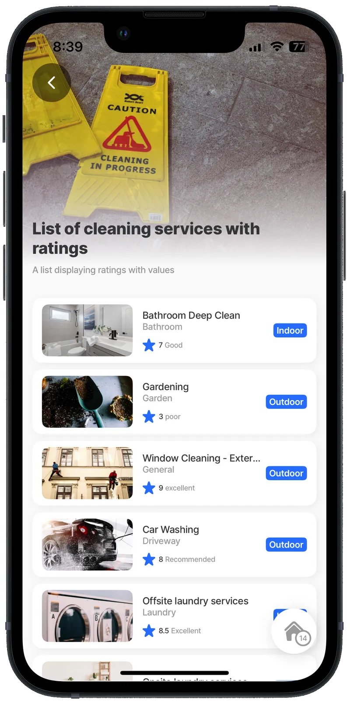<figcaption><p>List with ratings</p></figcaption></figure>





```yaml
title: List of cleaning services with ratings
type: jig.list
description: A list displaying ratings with values
icon: notes-paper-approve

header:
  type: component.jig-header
  options:
    height: medium
    children:
      type: component.image
      options:
        source:
          uri: https://images.unsplash.com/photo-1529220502050-f15e570c634e?ixlib=rb-1.2.1&ixid=MnwxMjA3fDB8MHxwaG90by1wYWdlfHx8fGVufDB8fHx8&auto=format&fit=crop&w=1829&q=80
    
data: =@ctx.datasources.cleaning-services-static
item:
  type: component.list-item
  options:
    isContained: true
    title: =@ctx.current.item.service
    subtitle: =@ctx.current.item.area
    label:  
      title: =(@ctx.current.item.status = "indoor" ? 'Indoor' :'Outdoor')
    leftElement:
      element: image
      text: =$substring($substringBefore(@ctx.current.item.service, " "), 1, 1) &
        $substring($substringAfter(@ctx.current.item.service, " ") , 1, 1)
      uri: =@ctx.current.item.image
# Rating uses a value from the datasource with accompanying text.
# By default, a single star icon in the primary color is shown.        
    rating: 
      value: =@ctx.current.item.rating
      text: =@ctx.current.item.ratingText
```



```yaml
datasources:
  cleaning-services-static:
    type: datasource.static
    options:
      data:
        - area: Bathroom
          category: withRate
          description: Steam cleaning and disinfecting of the bathroom in its totality.
            Provision of fresh towels.
          hourlyrate: 30
          illustration: https://clipart-library.com/newimages/bathroom-clip-art-15.jpg
          image: https://images.unsplash.com/photo-1646592472335-fa6be8e9bc7c?ixlib=rb-1.2.1&ixid=MnwxMjA3fDB8MHxwaG90by1wYWdlfHx8fGVufDB8fHx8&auto=format&fit=crop&w=1471&q=80
          onceoffrate: null
          service: Bathroom Deep Clean
          status: indoor
          time: 90
          ratingText: Good
          rating: 7
        - area: Garden
          category: null
          description: Taking care of general gardening to provide an immaculate first
            impression
          hourlyrate: null
          illustration: https://clipart-library.com/images/6Tr8BrjTK.jpg
          image: https://images.unsplash.com/photo-1416879595882-3373a0480b5b?ixlib=rb-1.2.1&ixid=MnwxMjA3fDB8MHxwaG90by1wYWdlfHx8fGVufDB8fHx8&auto=format&fit=crop&w=1470&q=80
          onceoffrate: 100
          service: Gardening
          status: outdoor
          time: 120
          ratingText: poor
          rating: 3
        - area: General
          category: null
          description: Cleaning and streak removal of external windows
          hourlyrate: 35
          illustration: https://clipart-library.com/img1/872145.png
          image: https://images.unsplash.com/photo-1650538250295-6ef68d7ae1f4?ixlib=rb-1.2.1&ixid=MnwxMjA3fDB8MHxwaG90by1wYWdlfHx8fGVufDB8fHx8&auto=format&fit=crop&w=1470&q=80
          onceoffrate: null
          service: Window Cleaning - External
          status: outdoor
          time: 60
          ratingText: excellent
          rating: 9
        - area: Driveway
          category: null
          description: Car wash including vacuum
          hourlyrate: null
          image: https://images.unsplash.com/photo-1520340356584-f9917d1eea6f?ixlib=rb-1.2.1&ixid=MnwxMjA3fDB8MHxwaG90by1wYWdlfHx8fGVufDB8fHx8&auto=format&fit=crop&w=1631&q=80
          onceoffrate: 50
          service: Car Washing
          status: outdoor
          time: 60
          ratingText: Recommended
          rating: 8
        - area: Laundry
          category: null
          description: Provision of laundry services by removal of laundry and return of
            laundry. Includes a surcharge for delivery.
          hourlyrate: null
          image: https://images.unsplash.com/photo-1637795065412-eed4c565db78?w=800&auto=format&fit=crop&q=60&ixlib=rb-4.0.3&ixid=M3wxMjA3fDB8MHxzZWFyY2h8MTl8fGxhdW5kcnklMjBzZXJ2aWNlfGVufDB8fDB8fHww
          onceoffrate: 110
          service: Offsite laundry services
          status: indoor
          time: 120
          ratingText: Excellent
          rating: 8.5
        - area: Laundry
          category: null
          description: Provision of laundry services making use of client's machines. Note
            that where this has been booked, but machines are not available,
            this will automatically be adjusted to offsite laundry services.
          hourlyrate: null
          image: https://images.unsplash.com/photo-1626806819282-2c1dc01a5e0c?w=800&auto=format&fit=crop&q=60&ixlib=rb-4.0.3&ixid=M3wxMjA3fDB8MHxzZWFyY2h8MTV8fGxhdW5kcnklMjByb29tfGVufDB8fDB8fHww
          onceoffrate: 110
          service: Onsite laundry services
          status: indoor
          time: 120
          ratingText: Not satisfied
        - area: Lounge
          category: null
          description: Maintain your upholstery (chair, couch and seat) in pristine
            condition. We use only the most delicate clearning methods.
          hourlyrate: 40
          image: https://images.unsplash.com/photo-1612696733290-a2a26ce8131c?ixlib=rb-1.2.1&ixid=MnwxMjA3fDB8MHxwaG90by1wYWdlfHx8fGVufDB8fHx8&auto=format&fit=crop&w=1470&q=80
          onceoffrate: null
          service: Upholstery Cleaning
          status: indoor
          time: 60
          ratingText: Poor
          rating: 5
        - area: Pool
          category: null
          description: Cleaning of pool, including chemical treatments, sweeping and
            proper flush.
          hourlyrate: null
          image: https://images.unsplash.com/photo-1562844275-857f6e7c429e?ixlib=rb-1.2.1&ixid=MnwxMjA3fDB8MHxwaG90by1wYWdlfHx8fGVufDB8fHx8&auto=format&fit=crop&w=1603&q=80
          onceoffrate: 40
          service: Pool Cleaning
          status: outdoor
          time: 45
          ratingText: Excellent service
          rating: 9
```



### List with ratings with a value, minimum, maximum and icon



Create a product review jig that provides a `rating` using a `value`, an `icon` representing the value, rating `icons` with `color`. The list is styled by wrapping the items in a card using the `isContained` property. A verified `label` is added to the right while the product image is added as an `avatar` to the left.

**Examples:**\
See the full example in [GitHub](jig_list.md).



<figure>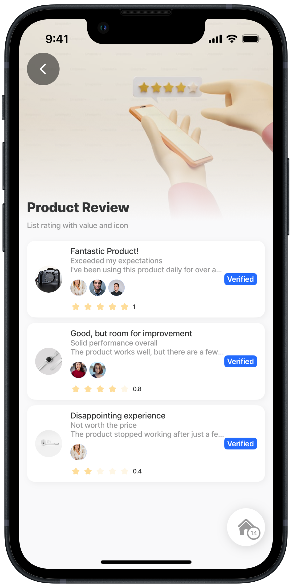<figcaption><p>List with ratings and icons</p></figcaption></figure>





```yaml
title: Product Review
description: List rating with value and icon
type: jig.list
icon: contact

header:
  type: component.jig-header
  options:
    height: medium
    children:
      type: component.image
      options:
        source:
          uri: https://plus.unsplash.com/premium_photo-1682309642428-3f8b37637434?w=900&auto=format&fit=crop&q=60&ixlib=rb-4.0.3&ixid=M3wxMjA3fDB8MHxzZWFyY2h8NXx8cmF0aW5nc3xlbnwwfHwwfHx8MA%3D%3D
    
data: =@ctx.datasources.product-review
item:
  type: component.list-item
  options:
    title: =@ctx.current.item.title
    subtitle: =@ctx.current.item.subtitle
    avatars: =@ctx.datasources.product-users[product =
      @ctx.current.item.id].{"text":text,"uri":avatars}[]
    description: =@ctx.current.item.thirdLine
    isContained: true
    label:
      title: =@ctx.current.item.label
    leftElement:
      element: avatar
      text: ""
      uri: =@ctx.current.item.productImage
# Rating uses a value from the datasource, the rating icon and color is customized.
# By configuring the maximum property sets the number of icons required.
# By configuring the current property colors the number of icons specified in the maximum
# property with the value to create the rating.
    rating:
      value: =@ctx.current.item.rating
      ratingIcon:
        color: color3
        current: =@ctx.current.item.ratingValue
        icon: rating-star-1
        maximum: 5
```



```yaml
type: datasource.static
options:
  data:
    - avatars:
        - https://plus.unsplash.com/premium_photo-1658527049634-15142565537a?w=900&auto=format&fit=crop&q=60&ixlib=rb-4.0.3&ixid=M3wxMjA3fDB8MHxzZWFyY2h8MXx8YXZhdGFyfGVufDB8fDB8fHww
        - https://images.unsplash.com/photo-1500648767791-00dcc994a43e?w=900&auto=format&fit=crop&q=60&ixlib=rb-4.0.3&ixid=M3wxMjA3fDB8MHxzZWFyY2h8Mnx8YXZhdGFyfGVufDB8fDB8fHww
        - https://images.unsplash.com/photo-1535713875002-d1d0cf377fde?w=900&auto=format&fit=crop&q=60&ixlib=rb-4.0.3&ixid=M3wxMjA3fDB8MHxzZWFyY2h8M3x8YXZhdGFyfGVufDB8fDB8fHww
        - https://images.unsplash.com/photo-1494790108377-be9c29b29330?w=900&auto=format&fit=crop&q=60&ixlib=rb-4.0.3&ixid=M3wxMjA3fDB8MHxzZWFyY2h8NHx8YXZhdGFyfGVufDB8fDB8fHww
        - https://images.unsplash.com/photo-1438761681033-6461ffad8d80?w=900&auto=format&fit=crop&q=60&ixlib=rb-4.0.3&ixid=M3wxMjA3fDB8MHxzZWFyY2h8N3x8YXZhdGFyfGVufDB8fDB8fHww
      id: 1
      label: Verified
      productImage: https://images.unsplash.com/photo-1559912311-8421ee673ca5?w=700&auto=format&fit=crop&q=60&ixlib=rb-4.0.3&ixid=M3wxMjA3fDB8MHxzZWFyY2h8Nnx8cHJvZHVjdCUyMGltYWdlc3xlbnwwfHwwfHx8MA%3D%3D
      rating: 0.95
      ratingValue: 5
      ratingText: (529)
      subtitle: Exceeded my expectations
      tags:
        - high quality
        - durable
        - recommended
        - value for money
      thirdLine: I've been using this product daily for over a year, and it still
        works as well as the day I bought it. Highly recommend!
      title: Fantastic Product!
    - avatars:
        - https://plus.unsplash.com/premium_photo-1658527049634-15142565537a?w=900&auto=format&fit=crop&q=60&ixlib=rb-4.0.3&ixid=M3wxMjA3fDB8MHxzZWFyY2h8MXx8YXZhdGFyfGVufDB8fDB8fHww
        - https://images.unsplash.com/photo-1500648767791-00dcc994a43e?w=900&auto=format&fit=crop&q=60&ixlib=rb-4.0.3&ixid=M3wxMjA3fDB8MHxzZWFyY2h8Mnx8YXZhdGFyfGVufDB8fDB8fHww
        - https://images.unsplash.com/photo-1535713875002-d1d0cf377fde?w=900&auto=format&fit=crop&q=60&ixlib=rb-4.0.3&ixid=M3wxMjA3fDB8MHxzZWFyY2h8M3x8YXZhdGFyfGVufDB8fDB8fHww
      id: 2
      label: Verified
      productImage: https://images.unsplash.com/photo-1523275335684-37898b6baf30?w=900&auto=format&fit=crop&q=60&ixlib=rb-4.0.3&ixid=M3wxMjA3fDB8MHxzZWFyY2h8Mnx8cHJvZHVjdHxlbnwwfHwwfHx8MA%3D%3D
      rating: 0.75
      ratingValue: 4
      ratingText: (1999+)
      subtitle: Solid performance overall
      tags:
        - value for money
        - good support
        - recommended
      thirdLine: The product works well, but there are a few minor issues that could
        be improved. Customer support was helpful in resolving my concerns.
      title: Good, but room for improvement
    - avatars:
        - https://images.unsplash.com/photo-1438761681033-6461ffad8d80?w=900&auto=format&fit=crop&q=60&ixlib=rb-4.0.3&ixid=M3wxMjA3fDB8MHxzZWFyY2h8N3x8YXZhdGFyfGVufDB8fDB8fHww
      id: 3
      label: Verified
      productImage: https://images.unsplash.com/photo-1504274066651-8d31a536b11a?w=700&auto=format&fit=crop&q=60&ixlib=rb-4.0.3&ixid=M3wxMjA3fDB8MHxzZWFyY2h8NTR8fHByb2R1Y3QlMjBpbWFnZXN8ZW58MHx8MHx8fDA%3D
      rating: 0.35
      ratingValue: 2
      ratingText: (247)
      subtitle: Not worth the price
      tags:
        - not satisfied
        - poor quality
      thirdLine: The product stopped working after just a few weeks. The build quality
        feels cheap, and I’m not happy with the overall experience.
      title: Disappointing experience
```



```yaml
type: datasource.static
options:
  data:
    - avatars: https://plus.unsplash.com/premium_photo-1658527049634-15142565537a?w=900&auto=format&fit=crop&q=60&ixlib=rb-4.0.3&ixid=M3wxMjA3fDB8MHxzZWFyY2h8MXx8YXZhdGFyfGVufDB8fDB8fHww
      id: 1
      product: 1
      text: AB
    - avatars: https://images.unsplash.com/photo-1500648767791-00dcc994a43e?w=900&auto=format&fit=crop&q=60&ixlib=rb-4.0.3&ixid=M3wxMjA3fDB8MHxzZWFyY2h8Mnx8YXZhdGFyfGVufDB8fDB8fHww
      id: 2
      product: 1
      text: CD
    - avatars: https://images.unsplash.com/photo-1535713875002-d1d0cf377fde?w=900&auto=format&fit=crop&q=60&ixlib=rb-4.0.3&ixid=M3wxMjA3fDB8MHxzZWFyY2h8M3x8YXZhdGFyfGVufDB8fDB8fHww
      id: 3
      product: 1
      text: EF
    - avatars: https://images.unsplash.com/photo-1494790108377-be9c29b29330?w=900&auto=format&fit=crop&q=60&ixlib=rb-4.0.3&ixid=M3wxMjA3fDB8MHxzZWFyY2h8NHx8YXZhdGFyfGVufDB8fDB8fHww
      id: 4
      product: 2
      text: GH
    - avatars: https://images.unsplash.com/photo-1438761681033-6461ffad8d80?w=900&auto=format&fit=crop&q=60&ixlib=rb-4.0.3&ixid=M3wxMjA3fDB8MHxzZWFyY2h8N3x8YXZhdGFyfGVufDB8fDB8fHww
      id: 5
      product: 2
      text: IJ
    - avatars: https://plus.unsplash.com/premium_photo-1658527049634-15142565537a?w=900&auto=format&fit=crop&q=60&ixlib=rb-4.0.3&ixid=M3wxMjA3fDB8MHxzZWFyY2h8MXx8YXZhdGFyfGVufDB8fDB8fHww
      id: 6
      product: 3
      text: KL
```



### List with ratings as a percentage



This example uses the simplest configuration of the rating property to display a `percentage`. By default the rating shows a star in the primary color.

**Examples:** See the full example in [GitHub](https://github.com/jigx-com/jigx-samples/blob/main/quickstart/jigx-samples/jigs/jig-types/jig-list/advanced-lists/static-data/list-with-rating-percentage.jigx).



<figure>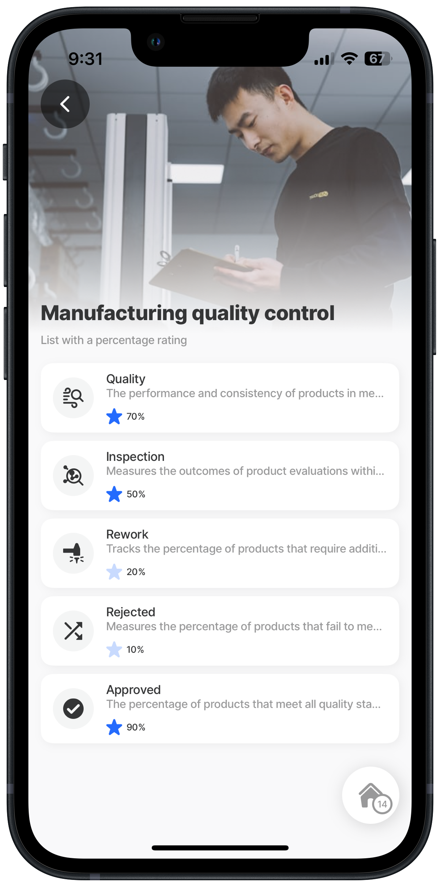<figcaption><p>List with percentage ratings</p></figcaption></figure>





```yaml
title: Manufacturing quality control
description: List with a percentage rating
type: jig.list
icon: contact

header:
  type: component.jig-header
  options:
    height: medium
    children:
      type: component.image
      options:
        source:
          uri: https://images.unsplash.com/photo-1700727448575-6f1680cd7d75?w=800&auto=format&fit=crop&q=60&ixlib=rb-4.0.3&ixid=M3wxMjA3fDB8MHxzZWFyY2h8Nnx8cXVhbGl0eSUyMGNvbnRyb2x8ZW58MHx8MHx8fDA%3D

data: =@ctx.datasources.control-stats
item:
  type: component.list-item
  options:
    isContained: true
    title: =@ctx.current.item.stat
    subtitle: =@ctx.current.item.description
    rating: 
# Rating uses a percentage defined in the datasource.
# By default, a single star icon in the primary color is shown.     
      percentage: =@ctx.current.item.percentage
    leftElement: 
      element: icon
      icon: =@ctx.current.item.icon
      isDuotone: true
```



```yaml
datasources:
  control-stats: 
    type: datasource.static
    options:
      data:
        - id: 1
          stat: Quality
          description: The performance and consistency of products in meeting established standards.
          percentage: 0.7
          percentage-text: y
          icon: air-quality-check-magnifying-glass
        - id: 2  
          stat: Inspection
          description: Measures the outcomes of product evaluations within the quality control process.
          percentage: 0.5
          icon: amazon-inspector
        - id: 3  
          stat: Rework
          description: Tracks the percentage of products that require additional processing or correction after initial inspection
          percentage: 0.2
          icon: hardware-hammer-nail-hit
        - id: 4  
          stat: Rejected
          description: Measures the percentage of products that fail to meet quality standards and cannot be reworked or sold.
          percentage: 0.1
          icon: cross-over
        - id: 5  
          stat: Approved
          description: The percentage of products that meet all quality standards and are cleared for distribution or sale.
          percentage: 0.9 
          icon: select
```



### List with ratings with a percentage, minimum, maximum and icon



This example sets up a product review jig that displays:

* A `rating` as a percentage.
* An `icon` and `color` customized to represent the rating percentage visually.
* A styled list where each item is displayed within a card format, achieved by enabling the `isContained` property.
* A verified `label` placed on the right side of the item.
* A product image shown as an `avatar` on the left side.

**Examples:**\
See the full example in [GitHub](https://github.com/jigx-com/jigx-samples/blob/main/quickstart/jigx-samples/jigs/jig-types/jig-list/advanced-lists/static-data/list-with-rating-percentage-max.jigx).



<figure>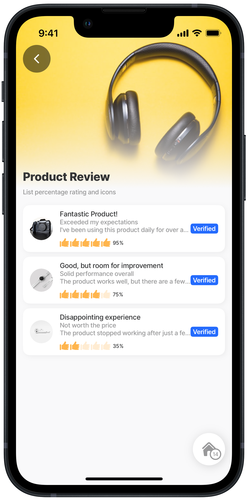<figcaption><p>List with percentage ratings and icons</p></figcaption></figure>





```yaml
title: Product Review
description: List percentage rating and icons
type: jig.list
icon: contact

header:
  type: component.jig-header
  options:
    height: medium
    children:
      type: component.image
      options:
        source:
          uri: https://images.unsplash.com/photo-1505740420928-5e560c06d30e?w=800&auto=format&fit=crop&q=60&ixlib=rb-4.0.3&ixid=M3wxMjA3fDB8MHxzZWFyY2h8MTF8fHByb2R1Y3QlMjBleHBlcmllbmNlfGVufDB8fDB8fHww
    
data: =@ctx.datasources.product-review
item:
  type: component.list-item
  options:
    title: =@ctx.current.item.title
    subtitle: =@ctx.current.item.subtitle
    description: =@ctx.current.item.thirdLine
    isContained: true
    label:
      title: =@ctx.current.item.label
    leftElement:
      element: avatar
      text: ""
      uri: =@ctx.current.item.productImage
# Rating uses a percentage from the datasource, the rating icon and color is customized.
# By configuring the maximum property sets the number of icons required.
# By configuring the current property colors the number of icons specified in the maximum
# property with the value to create the rating.        
    rating:
      percentage: =@ctx.current.item.rating
      ratingIcon:
        color: color7
        current: =@ctx.current.item.rating*5
        icon: thumb-up-like
        maximum: 5
```



```yaml
type: datasource.static
options:
  data:
    - avatars:
        - https://plus.unsplash.com/premium_photo-1658527049634-15142565537a?w=900&auto=format&fit=crop&q=60&ixlib=rb-4.0.3&ixid=M3wxMjA3fDB8MHxzZWFyY2h8MXx8YXZhdGFyfGVufDB8fDB8fHww
        - https://images.unsplash.com/photo-1500648767791-00dcc994a43e?w=900&auto=format&fit=crop&q=60&ixlib=rb-4.0.3&ixid=M3wxMjA3fDB8MHxzZWFyY2h8Mnx8YXZhdGFyfGVufDB8fDB8fHww
        - https://images.unsplash.com/photo-1535713875002-d1d0cf377fde?w=900&auto=format&fit=crop&q=60&ixlib=rb-4.0.3&ixid=M3wxMjA3fDB8MHxzZWFyY2h8M3x8YXZhdGFyfGVufDB8fDB8fHww
        - https://images.unsplash.com/photo-1494790108377-be9c29b29330?w=900&auto=format&fit=crop&q=60&ixlib=rb-4.0.3&ixid=M3wxMjA3fDB8MHxzZWFyY2h8NHx8YXZhdGFyfGVufDB8fDB8fHww
        - https://images.unsplash.com/photo-1438761681033-6461ffad8d80?w=900&auto=format&fit=crop&q=60&ixlib=rb-4.0.3&ixid=M3wxMjA3fDB8MHxzZWFyY2h8N3x8YXZhdGFyfGVufDB8fDB8fHww
      id: 1
      label: Verified
      productImage: https://images.unsplash.com/photo-1559912311-8421ee673ca5?w=700&auto=format&fit=crop&q=60&ixlib=rb-4.0.3&ixid=M3wxMjA3fDB8MHxzZWFyY2h8Nnx8cHJvZHVjdCUyMGltYWdlc3xlbnwwfHwwfHx8MA%3D%3D
      rating: 0.95
      ratingValue: 5
      ratingText: (529)
      subtitle: Exceeded my expectations
      tags:
        - high quality
        - durable
        - recommended
        - value for money
      thirdLine: I've been using this product daily for over a year, and it still
        works as well as the day I bought it. Highly recommend!
      title: Fantastic Product!
    - avatars:
        - https://plus.unsplash.com/premium_photo-1658527049634-15142565537a?w=900&auto=format&fit=crop&q=60&ixlib=rb-4.0.3&ixid=M3wxMjA3fDB8MHxzZWFyY2h8MXx8YXZhdGFyfGVufDB8fDB8fHww
        - https://images.unsplash.com/photo-1500648767791-00dcc994a43e?w=900&auto=format&fit=crop&q=60&ixlib=rb-4.0.3&ixid=M3wxMjA3fDB8MHxzZWFyY2h8Mnx8YXZhdGFyfGVufDB8fDB8fHww
        - https://images.unsplash.com/photo-1535713875002-d1d0cf377fde?w=900&auto=format&fit=crop&q=60&ixlib=rb-4.0.3&ixid=M3wxMjA3fDB8MHxzZWFyY2h8M3x8YXZhdGFyfGVufDB8fDB8fHww
      id: 2
      label: Verified
      productImage: https://images.unsplash.com/photo-1523275335684-37898b6baf30?w=900&auto=format&fit=crop&q=60&ixlib=rb-4.0.3&ixid=M3wxMjA3fDB8MHxzZWFyY2h8Mnx8cHJvZHVjdHxlbnwwfHwwfHx8MA%3D%3D
      rating: 0.75
      ratingValue: 4
      ratingText: (1999+)
      subtitle: Solid performance overall
      tags:
        - value for money
        - good support
        - recommended
      thirdLine: The product works well, but there are a few minor issues that could
        be improved. Customer support was helpful in resolving my concerns.
      title: Good, but room for improvement
    - avatars:
        - https://images.unsplash.com/photo-1438761681033-6461ffad8d80?w=900&auto=format&fit=crop&q=60&ixlib=rb-4.0.3&ixid=M3wxMjA3fDB8MHxzZWFyY2h8N3x8YXZhdGFyfGVufDB8fDB8fHww
      id: 3
      label: Verified
      productImage: https://images.unsplash.com/photo-1504274066651-8d31a536b11a?w=700&auto=format&fit=crop&q=60&ixlib=rb-4.0.3&ixid=M3wxMjA3fDB8MHxzZWFyY2h8NTR8fHByb2R1Y3QlMjBpbWFnZXN8ZW58MHx8MHx8fDA%3D
      rating: 0.35
      ratingValue: 2
      ratingText: (247)
      subtitle: Not worth the price
      tags:
        - not satisfied
        - poor quality
      thirdLine: The product stopped working after just a few weeks. The build quality
        feels cheap, and I’m not happy with the overall experience.
      title: Disappointing experience
```



```yaml
type: datasource.static
options:
  data:
    - avatars: https://plus.unsplash.com/premium_photo-1658527049634-15142565537a?w=900&auto=format&fit=crop&q=60&ixlib=rb-4.0.3&ixid=M3wxMjA3fDB8MHxzZWFyY2h8MXx8YXZhdGFyfGVufDB8fDB8fHww
      id: 1
      product: 1
      text: AB
    - avatars: https://images.unsplash.com/photo-1500648767791-00dcc994a43e?w=900&auto=format&fit=crop&q=60&ixlib=rb-4.0.3&ixid=M3wxMjA3fDB8MHxzZWFyY2h8Mnx8YXZhdGFyfGVufDB8fDB8fHww
      id: 2
      product: 1
      text: CD
    - avatars: https://images.unsplash.com/photo-1535713875002-d1d0cf377fde?w=900&auto=format&fit=crop&q=60&ixlib=rb-4.0.3&ixid=M3wxMjA3fDB8MHxzZWFyY2h8M3x8YXZhdGFyfGVufDB8fDB8fHww
      id: 3
      product: 1
      text: EF
    - avatars: https://images.unsplash.com/photo-1494790108377-be9c29b29330?w=900&auto=format&fit=crop&q=60&ixlib=rb-4.0.3&ixid=M3wxMjA3fDB8MHxzZWFyY2h8NHx8YXZhdGFyfGVufDB8fDB8fHww
      id: 4
      product: 2
      text: GH
    - avatars: https://images.unsplash.com/photo-1438761681033-6461ffad8d80?w=900&auto=format&fit=crop&q=60&ixlib=rb-4.0.3&ixid=M3wxMjA3fDB8MHxzZWFyY2h8N3x8YXZhdGFyfGVufDB8fDB8fHww
      id: 5
      product: 2
      text: IJ
    - avatars: https://plus.unsplash.com/premium_photo-1658527049634-15142565537a?w=900&auto=format&fit=crop&q=60&ixlib=rb-4.0.3&ixid=M3wxMjA3fDB8MHxzZWFyY2h8MXx8YXZhdGFyfGVufDB8fDB8fHww
      id: 6
      product: 3
      text: KL
```



### List with multiple tags



This example creates a list with multiple `tags` shown on each list-item.

* A styled list where each item is displayed within a card format, achieved by enabling the `isContained` property.
* The `tags` show the assigned team, priority, and status.
* A product image shown as an `avatar` on the left side.

**Examples:**\
See the full example in [GitHub](https://github.com/jigx-com/jigx-samples/blob/main/quickstart/jigx-samples/jigs/jig-types/jig-list/advanced-lists/dynamic-data/list-with-tags-multiple.jigx).



<figure><figcaption><p>List with multiple tags</p></figcaption></figure>





```yaml
title: Team task list with mulitple tags
description: List items display multiple tags 
type: jig.list

header:
  type: component.jig-header
  options:
    children:
      options:
        source:
          uri: https://images.unsplash.com/photo-1590402494628-9b9acf0b90ae?q=80&w=2970&auto=format&fit=crop&ixlib=rb-4.0.3&ixid=M3wxMjA3fDB8MHxwaG90by1wYWdlfHx8fGVufDB8fHx8fA%3D%3D
      type: component.image
    height: medium

data: =@ctx.datasources.team-tasks
item:
  type: component.list-item
  options:
    isContained: true
    title: =@ctx.current.item.taskAssignee
    subtitle: =@ctx.current.item.taskName
# Add multiple tags to the list-items.
# Each tag can have its own color.
# Tags are shown in the order they configured.   
    tags:
      - text: =@ctx.current.item.team
        color: primary
      - text: =@ctx.current.item.priority
        color: warning
      - text: =@ctx.current.item.taskStatus
        color: color2
    leftElement: 
      element: avatar
      text: =@ctx.current.item.taskAssignee
      uri: =@ctx.current.item.Profile
```



```yaml
datasources:
  team-tasks:
    type: datasource.sqlite
    options:
      provider: DATA_PROVIDER_DYNAMIC
      entities:
        - entity: default/tasks
      query: |
        SELECT 
          id, 
          '$.taskAssignee',
          '$.taskName',
          '$.taskCost',
          '$.taskId', 
          '$.taskStatus',
          '$.team', 
          '$.Profile',
          '$.priority'
         
        FROM [default/tasks]
```



### List with ratings and tags



This example show a list of cleaning services that displays:

* A `rating` as a `value`.
* An `icon` and `color` customized to represent the rating value visually.
* Multiple `tags` showing the hourly rate and cleaning area category.
* A styled list where each item is displayed within a card format, achieved by enabling the `isContained` property.
* A numbered `badge` in the `rightElement` of the item shows the number of services available.

**Examples:**\
See the full example in [GitHub](https://github.com/jigx-com/jigx-samples/blob/main/quickstart/jigx-samples/jigs/jig-types/jig-list/advanced-lists/dynamic-data/list-with-tags-rating.jigx).



<figure>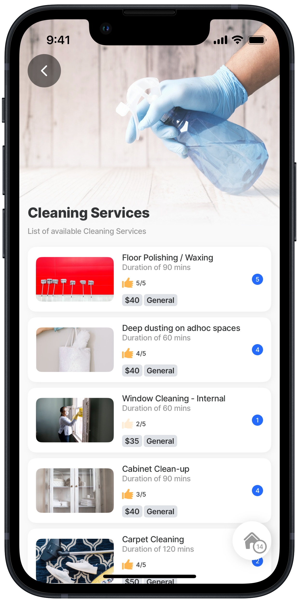<figcaption><p>List with ratings &#x26; tags</p></figcaption></figure>





```yaml
title: Cleaning Services
description: List of available Cleaning Services
type: jig.list
icon: contact 

header:
  type: component.jig-header
  options:
    height: medium
    children:
      type: component.image
      options:
        source:
          uri: https://images.unsplash.com/photo-1628177142898-93e36e4e3a50?ixlib=rb-1.2.1&ixid=MnwxMjA3fDB8MHxwaG90by1wYWdlfHx8fGVufDB8fHx8&auto=format&fit=crop&w=2070&q=80

data: =@ctx.datasources.cleaning-services-dynamic
item:
  type: component.list-item
  options:
    
    title: =@ctx.current.item.service
    subtitle: ='Duration of ' & @ctx.current.item.time & ' mins'
    horizontalItemSize: large
# Wrap each list-item in a card. 
    isContained: true
# Rating uses a value from the datasource, the rating icon and color is customized.
# By configuring the maximum property sets the number of icons required.
# By configuring the current property colors the number of icons specified in the maximum
# property with the value to create the rating.       
    rating: 
      ratingIcon:
        icon: thumb-up-like
        color: color7
      value: 
        current: =@ctx.current.item.rating
        maximum: 5
# Add multiple tags to the list-items.
# Each tag can have its own color.
# Tags are shown in the order they configured.          
    tags:
      - text: =('$' & @ctx.current.item.hourlyrate)
        color: color14
      - text: =@ctx.current.item.area
        color: color14
    leftElement: 
      element: image
      text: ''
      uri: =@ctx.current.item.image
    rightElement: 
# The badge will display with the number of service,
# the count is configured in the datasource.         
      element: badge
      value: =@ctx.current.item.quantity
```



```yaml
type: datasource.sqlite
options:
  provider: DATA_PROVIDER_DYNAMIC

  entities:
    - entity: default/cleaning-services

  query: |
    SELECT 
      id, 
      '$.id' as sqlid, 
      '$.area', 
      '$.description', 
      '$.hourlyrate', 
      '$.illustration', 
      '$.image', 
      '$.indoor', 
      '$.onceoffrate', 
      '$.service', 
      '$.pressed', 
      '$.time',
      '$.quantity',
      '$.rating'
    FROM [default/cleaning-services] WHERE '$.hourlyrate' IS NOT NULL ORDER BY id DESC
```



## See also

* [Jigs (screens)](https://docs.jigx.com/building-apps-with-jigx/ui/jigs-_screens_)
* [list-item](../Components/list/list-item.md)
* [Related examples (Github)](https://github.com/jigx-com/jigx-samples/tree/main/samples/jigx-samples/jigs/jig-types/jig-list)
* [State](https://docs.jigx.com/building-apps-with-jigx/logic/state)
