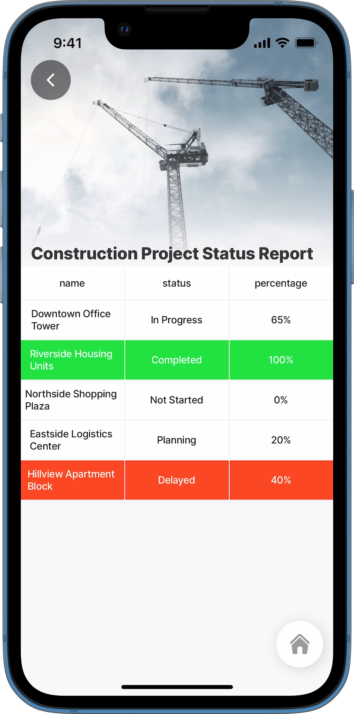
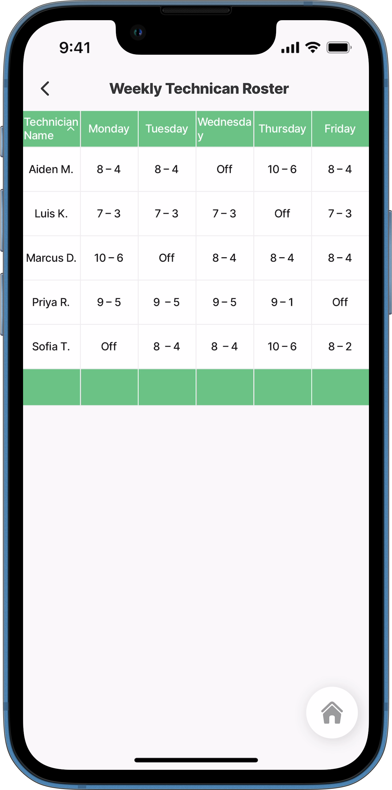
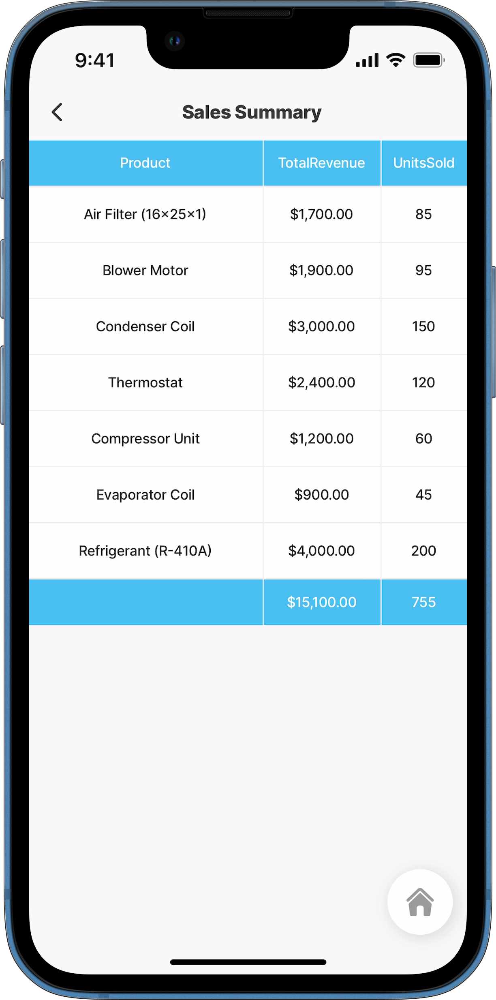
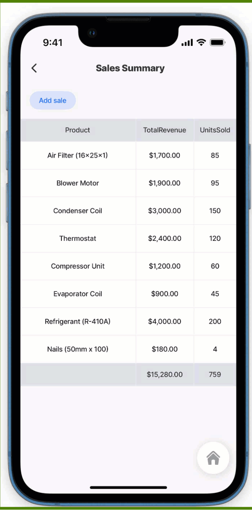

---
layout:
  width: wide
  title:
    visible: true
  description:
    visible: true
  tableOfContents:
    visible: true
  outline:
    visible: true
  pagination:
    visible: true
  metadata:
    visible: true
---

# jig.table

The table jig displays structured data in rows and columns, allowing users to view and interact with multiple records within the app.

<figure><figcaption><p>Table jig</p></figcaption></figure>

## Configuration options

Some properties are common to all jig types, see [Common jig type properties](jig_table.md) for a list and their configuration options.

The table Jigx type includes multiple child components, each of which can be configured individually based on the desired table layout. The properties for each component are described below.

### component.table-row

`component.table-row`- The table jig is configured with a datasource, and a single `component.table-row` is configured and iterates through the datasource to display each row. This is a required component.

<table><thead><tr><th width="192.47265625">Structure</th><th></th></tr></thead><tbody><tr><td><code>component.table-row</code></td><td><p>This is similar in configuration to a where a single <code>table-row</code> is configured and iterates through the datasource.</p><ul><li><code>instanceId</code> - Unique identifier of the table-row component. When defined its possible to address its state. <code>InstanceId:</code> Expects a string.</li><li><code>when</code> - used to determine under which conditions the table will display. If the property is set to <code>false</code>, the component won't be displayed. Default is <code>true</code>. An expression can be configured in this property.</li></ul></td></tr><tr><td><code>color</code></td><td>Highlight the row(s) with a distinct background color for emphasis or status. For example, <code>color:</code> <code>- when: =@ctx.current.item.age > 60</code> <code>color: warning</code></td></tr><tr><td><code>data</code></td><td>Reference the defined datasource to use in the <code>component.table-row</code>.</td></tr><tr><td><code>datasources</code></td><td>Configure a datasource to call the data to display in the table rows.</td></tr><tr><td><code>onPress</code></td><td>Action that will be triggered by pressing on the table row.</td></tr></tbody></table>

### component.table-cell

This component is part of the `columnDefinition` setup, allowing reusable configurations for customizing column cells and ensuring consistent, flexible table layouts.

<table><thead><tr><th width="186.359375">structure</th><th></th></tr></thead><tbody><tr><td><code>children</code></td><td>Define the cell <code>value</code> by using a , or <a href="../Custom components _Alpha_/Text _Alpha_.md">component.text</a>. Specify a value for the cell, this can be text that can be evaluated, translated, and formatted.</td></tr><tr><td><code>onPress</code></td><td>Action that will be triggered by pressing on the table cell for a specific column.</td></tr></tbody></table>

### component.table-header-cell

This component is part of the `columnDefinition` setup, allowing reusable configurations for column header cells and ensuring consistent, flexible table layouts.This component targets the cells in the columns' header.

<table><thead><tr><th width="153.8515625">Structure</th><th></th></tr></thead><tbody><tr><td><code>children</code></td><td>Define the cell value by using a or by using a <a href="../Custom components _Alpha_/Text _Alpha_.md">component.text</a>. Specify a value for the cell, this can be text that can be evaluated, translated, and formatted.</td></tr><tr><td><code>onPress</code></td><td>Action that will be triggered by pressing on the text in the table header's cell for a specific column.</td></tr></tbody></table>

### component.table-footer-cell

This component is part of the `columnDefinition` setup, allowing reusable configurations for column footer cells and ensuring consistent, flexible table layouts.This component targets the cells in the columns' footer.

<table><thead><tr><th width="148.1015625">Structure</th><th></th></tr></thead><tbody><tr><td><code>children</code></td><td>Define the cell value by using a , or by using <a href="../Custom components _Alpha_/Text _Alpha_.md">component.text</a>. Specify a value for the cell, this can be text that can be evaluated, translated, formatted.</td></tr><tr><td><code>onPress</code></td><td>Action that will be triggered by pressing on the text in the table footer's cell for a specific column.</td></tr></tbody></table>

### component.table-footer

* This component targets the entire table footer. All configured properties will be applied uniformly to it.
*   This property works in conjunction with the `component.table-footer-cell`. When a `component.table-footer-cell` is defined within the `columnDefinition`, ensure that the `component.table-footer` property is also included to enable the footer component to render. See the YAML example below.

    ```yaml
    tableFooter:
      type: component.table-footer
    ```

<table><thead><tr><th width="148.25390625">Structure</th><th></th></tr></thead><tbody><tr><td><code>color</code></td><td>Add a distinct background color for emphasis or status to the table footer. For example, <code>color:</code> <code>- when: true</code> <code>color: color4</code></td></tr></tbody></table>

### component.table-header

* This component targets the entire table header. All configured properties will be applied uniformly to it.
*   Specifying the component without additional properties will render the header columns using the `column.id` as the header text.

    ```yaml
    tableHeader:
      type: component.table-header
    ```

### columns

<table><thead><tr><th width="179.921875">Other options</th><th></th></tr></thead><tbody><tr><td><code>columns</code></td><td><p>Defines the structure and configuration for a single table column, either through inline definitions or by referencing a reusable column definition. Columns can also be dynamically set using a single expression for flexible configuration across all columns.</p><ul><li><code>id:</code>Specifies a unique identifier for the column, used to reference the column’s data. The name must be the same as the datasource column name for the data to display.</li><li><code>columnDefinition</code>- a reusable configuration for a column, providing consistency across multiple columns. A <code>columnDefinitionId:</code> is required as an identifier of the column definition to be used.</li></ul></td></tr><tr><td><code>columnDefinition</code></td><td><p>Defines reusable configurations for table columns, including properties like width, header, footer, and cell customization, allowing for flexible and consistent table layouts.</p><ul><li><code>Column Name</code>- must match the name in the <code>column:id</code></li><li><code>cell</code> - Sets the value for the individual cells in the column. You can use <code>=@ctx.current.item.</code>, <code>=@ctx.current.column.id</code>, or <code>=@ctx.current.cell.value</code></li><li><code>footer</code> - <code>=@ctx.current.column.id</code></li><li><code>header</code> - <code>=@ctx.current.column.id</code></li><li><code>width</code> - Customizes the width of columns to improve visibility and fit specific content, offering flexibility in the table layout. Options include <code>large</code>, <code>regular</code>, <code>small</code>.</li></ul></td></tr><tr><td><code>selectionToolbar</code></td><td>The <code>selectionToolbar</code> appears at the bottom of the table when rows are selected. To enable row selection, <code>isSelectable: true</code> must be set at the root level of the jig. The toolbar displays a tag with the number of selected rows, followed by the configured action. Avoid overloading the <code>selectionToolbar</code> with too many actions or long labels, as it may compress, break layout, or disappear if space runs out.</td></tr><tr><td><code>tableHeader</code></td><td>Define the appearance and behavior of all table headers, including <code>color</code> or <code>onPress</code> actions.</td></tr><tr><td><code>tableFooter</code></td><td>Define the appearance and behavior of all table footers, including <code>color</code> or <code>onPress</code> actions.</td></tr><tr><td><code>toolbar</code></td><td>The <code>toolbar</code> appears at the top of the table as a buttons. The toolbar is configured with actions, such as <code>got-to</code> or <code>execute-entity</code> to create a new row.</td></tr><tr><td><code>sort</code></td><td><p>Initial sort configuration for the table.</p><ul><li><code>columnId</code> - Provide the column name that the sorting will be applied to.</li><li><code>isDescending</code> - set to <code>true</code> sorts descending, set to <code>false</code> sorts ascending. <code>=@ctx.jig.state.sort</code> is used to access the sort state within the jig. To add sorting to a table the <code>jig.table</code> must be configured with the following: 1) <code>isSortable: true</code> at the root level. 2) The <code>data</code> property must be set with an expression to sort the data in the columns. See <em>data-yaml</em> code example below. 3) The <code>sort</code> property configured at the root level to configure descending or ascending. See <em>sort-yaml</em> code example below.</li></ul></td></tr></tbody></table>



```yaml
data: | 
    =$sort(@ctx.datasources.roster, function($l, $r) {
    @ctx.jig.state.sort.isDescending ?
      ($lookup($l, @ctx.jig.state.sort.columnId) > $lookup($r, @ctx.jig.state.sort.columnId)) :
      ($lookup($l, @ctx.jig.state.sort.columnId) < $lookup($r, @ctx.jig.state.sort.columnId))
  })
```



```yaml
isSortable: true
sort:
  columnId: first_name
  isDescending: fals
```



<table><thead><tr><th width="173.3203125">State Configuration</th><th width="107.90234375">Key</th><th>Notes</th></tr></thead><tbody><tr><td><code>=@ctx.jig.state.</code></td><td>sort</td><td>Used to access the sorting state in the table.</td></tr></tbody></table>

## Considerations

* There is no horizontal scroll. Depending on the device, some columns may not be visible. For the best experience when viewing tables with many columns in the app, we recommend using a tablet.
* To enable sorting in a table, set `isSortable: true` at the root level. The `data` property must include an expression for _sorting_ and _lookup_, and the `sort: isDescending` property must be set to either `false` for ascending or `true` for descending.
* To enable row selection, `isSelectable: true` must be set at the root level of the jig. The `selectableToolbar` becomes visible only when rows are selected and appears at the bottom of the table. It displays a tag showing the number of selected rows, followed by the configured action.
* Avoid overloading the `selectionToolbar` with too many actions or long labels, as it may compress, break layout, or disappear if space runs out.

## Examples and code snippets

### Basic table with color



<figure><figcaption><p>Basic table with color</p></figcaption></figure>



This example demonstrates a basic `jig.table` configuration using a static datasource to display construction project data. Row colors are dynamically set using a `when` condition based on the project's status ("Complete" or "Delayed").

**Example:** See the full code example in [GitHub](https://github.com/jigx-com/jigx-samples/blob/main/quickstart/jigx-samples/jigs/jig-types/jig-table/jig-table-basic.jigx).




```yaml
title: Construction Project Status Report
# The table must be configured in a table jig type.
type: jig.table

header:
  type: component.jig-header
  options:
    height: medium
    children: 
      type: component.image
      options:
        source:
          uri: https://images.unsplash.com/photo-1592818993411-eba55f84e788?w=900&auto=format&fit=crop&q=60&ixlib=rb-4.0.3&ixid=M3wxMjA3fDB8MHxzZWFyY2h8MTV8fHJlcG9ydHMlMjBjb25zdHJ1Y3Rpb258ZW58MHx8MHx8fDA%3D
# The table requires a datasource to populate the rows.
datasources:
  projects:
    type: datasource.static
    options:
      data:
        - id: 1
          name: Downtown Office Tower
          status: In Progress
          percentage: 65% 
        - id: 2å
          name: Riverside Housing Units
          status: Completed
          percentage: 100%
        - id: 3
          name: Northside Shopping Plaza
          status: Not Started
          percentage: 0% 
        - id: 4
          name: Eastside Logistics Center
          status: Planning
          percentage: 20% 
        - id: 5
          name: Hillview Apartment Block
          status: Delayed
          percentage: 40%       
# Reference the defined datasource to use in the table.
data: =@ctx.datasources.projects
# Define the appearance and behavior of all table rows.
item:
  type: component.table-row
  options: 
    # Configure the color condition highlighting projects that are complete,
    # or at risk due to delays.    
    color:
      - when: =@ctx.current.item.status = 'Delayed'
        color: negative
      - when: =@ctx.current.item.status = 'Completed'
        color: positive
# Specify the required table columns. 
# The column names must match the datasource column names.        
columns:
  - id: name 
  - id: status
  - id: percentage  
```


### Table with header, footer and sorting



This table example displays a week's shifts per technician using a `jig.table` with Dynamic Data. The table is set up with a colored `header` and `footer`, and sorting is configured in descending order on the Technician Name column.

**Example:**\
See the full code example in [GitHub](https://github.com/jigx-com/jigx-samples/blob/main/quickstart/jigx-samples/jigs/jig-types/jig-table/jig-table-header-footer-sorting.jigx).



<figure><figcaption><p>Table with colored header &#x26; footer</p></figcaption></figure>



**Note:** To add sorting to a table the jig.table must be configured with the following:

1. `isSortable: true` at the root level.
2.  The `data` property must be set with an expression to sort the data in the columns.

    ```yaml
    data: |
      =$sort(@ctx.datasources.roster, function($l, $r) {
        @ctx.jig.state.sort.isDescending ?
          ($lookup($l, @ctx.jig.state.sort.columnId) > $lookup($r, @ctx.jig.state.sort.columnId)) :
          ($lookup($l, @ctx.jig.state.sort.columnId) < $lookup($r, @ctx.jig.state.sort.columnId))
      })
    ```
3. The `sort` property configured at the root level to configure descending or ascending.



```yaml
title: Weekly Technican Roster
type: jig.table
# Specify that the table can be sorted.
isSortable: true
 
# Reference the defined datasource to use in the table.
# Configure how the data can be sorted.
data: |
  =$sort(@ctx.datasources.roster, function($l, $r) {
    @ctx.jig.state.sort.isDescending ?
      ($lookup($l, @ctx.jig.state.sort.columnId) > $lookup($r, @ctx.jig.state.sort.columnId)) :
      ($lookup($l, @ctx.jig.state.sort.columnId) < $lookup($r, @ctx.jig.state.sort.columnId))
  })
# Specific the initial column to sort on, either descending or ascending.
sort: 
  columnId: TechnicianName
  isDescending: true
  
# Define the appearance and behavior of all table rows.  
item:
  type: component.table-row
  options:
    color:
      - when: false
        color: color1
# Define the appearance of all table headers.        
tableHeader:
  type: component.table-header
  options:
    color:
      - when: true
        color: color2
# Define the appearance of all table footers.      
tableFooter:
  type: component.table-footer
  options:
    color:
      - when: true
        color: color2
    
# Specify the required table columns. 
# The column names must match the datasource column names.      
columns: 
  - id: TechnicianName  
  - id: Monday   
  - id: Tuesday  
  - id: Wednesday
  - id: Thursday 
  - id: Friday
```



```yaml
datasources:
  roster: 
    type: datasource.sqlite
    options:
      provider: DATA_PROVIDER_DYNAMIC
      entities:
        - default/roster
  
      query: 
        SELECT id,
         '$.TechnicianName', 
         '$.Monday',
         '$.Tuesday',
         '$.Wednesday',
         '$.Thursday',
         '$.Friday',
         '$.Notes' 
         FROM [default/roster] 
```



### Table with column widths, columnDefinitions, header and footer



<figure><figcaption><p>Table widths &#x26; column definitions</p></figcaption></figure>



In this example, a table summarizes the sale of products for the month. In the `columnDefinition`, the `width`, `footer`, and `cell:format` is configured. The `tableHeader` and tableFooter's appearance is enhanced by adding a color.

**Example:**\
See the full code example in [GitHub](https://github.com/jigx-com/jigx-samples/blob/main/quickstart/jigx-samples/jigs/jig-types/jig-table/jig-table-columndef-width.jigx).





```yaml
title: Sales Summary
type: jig.table
# Reference the defined datasource to use in the table.
data: =@ctx.datasources.sales-summary

# Component.table-row is required for data to display in the rows.
item: 
  type: component.table-row

# Define the specific layout for each column,
# using the column id as the identifer.          
columnDefinition:
  # Configure the first column's width, 
  # ensuring that all text is visible in the column. 
  Product: 
    width: regular
  # In the second column,
  # configure the width, which maximizes table layout,
  # by using just the required space.
  # Configure the cells to display the currency in each cell of the column.
  # Format the column footer to display the total revenue,
  # using an expression to add up the values in the column.    
  TotalRevenue:
    width: small
    cell:
      type: component.table-cell
      options:
        children: 
          type: component.text
          options:
            value: 
              text: =@ctx.current.item.TotalRevenue
              format:
                numberStyle: currency
                currency: USD               
    footer:
      type: component.table-footer-cell
      options:
        children: 
          type: component.text
          options:
            value: 
              text: =$sum(@ctx.datasources.sales-summary.TotalRevenue)
              format: 
                numberStyle: currency
                currency: USD
# In the third column,
# format the column footer to display the total number of units sold.                
  UnitsSold:
    footer:
      type: component.table-footer-cell
      options:
        children: 
          type: component.text
          options:
            value: =$sum(@ctx.datasources.sales-summary.UnitsSold)
# Specify the columns for the table.
# Configure the columns to use the definition defined for each column.          
columns: 
  - id: Product
    columnDefinitionId: Product
  - id: TotalRevenue
    columnDefinitionId: TotalRevenue
  - id: UnitsSold  
    columnDefinitionId: UnitsSold
# Define the color of the table header.    
tableHeader:
  type: component.table-header
  options:
    color:
      - when: true
        color: color9
# Define the color of the table footer.    
tableFooter:
  type: component.table-footer
  options:
    color:
      - when: true
        color: color9
```



```yaml
type: datasource.sqlite
options:
  provider: DATA_PROVIDER_DYNAMIC
  entities:
    - default/sales

  query: 
    SELECT id,
     '$.Product',
     '$.TotalRevenue',
     '$.UnitsSold'
    FROM [default/sales]
```



### Edit table rows using onPress



<figure><figcaption><p>Editing the table</p></figcaption></figure>



In this example, a table displays delivery items and their current status. The status `column` is editable to reflect delivery progress. The `component.table-row` is configured with an `onPress` event that triggers a `go-to` action. This action uses `isModal: true` to open a jig as a bottom modal. `Inputs` are passed to this jig, including the row’s id and status.

The modal jig includes a `form` component with a `text-field` that displays the `initialValue` using the status passed from the `onPress` event. An `execute-entity` action is used to update the status, and a `goBack: previous` closes the modal, returning to the table with the updated status shown.

**Example:**\
See the full code example in [GitHub](https://github.com/jigx-com/jigx-samples/blob/main/quickstart/jigx-samples/jigs/jig-types/jig-table/jig-table-onpress-edit.jigx).





```yaml
title: Site Deliveries
type: jig.table
     
header:
  type: component.jig-header
  options:
    height: medium
    children: 
      type: component.image
      options:
        source:
          uri: https://images.unsplash.com/photo-1592818993411-eba55f84e788?w=900&auto=format&fit=crop&q=60&ixlib=rb-4.0.3&ixid=M3wxMjA3fDB8MHxzZWFyY2h8MTV8fHJlcG9ydHMlMjBjb25zdHJ1Y3Rpb258ZW58MHx8MHx8fDA%3D

# Reference the datasource to use in the table.
data: =@ctx.datasources.product-delivery
# Define the appearance and behavior of all table rows.
item:
  type: component.table-row
  options:
    # Add an onPress action that opens a jig as a modal with the rows status displayed in a text-field.
    # The status is updated and the table shows the new status. 
    onPress: 
      type: action.action-list
      options:
        isSequential: true
        actions:
          - type: action.go-to
            options:
              # Set the jig to open as a modal,
              # instead of navigating away from the table jig. 
              isModal: true
              linkTo: table-onpress-edit  
              # Pass the row’s status and id as inputs to the jig,
              # used for editing the status.
              inputs:
                status: =@ctx.current.item.status
                id: =@ctx.current.item.id
# Define the appearance of all table headers.                      
tableHeader:
  type: component.table-header
  options:
    color:
      - when: true
        color: color14
# Specify the required table columns. 
# The column names must match the datasource column names.           
columns:  
  - id: deliveryId
  - id: Item
  - id: destination
  - id: status 
```



```yaml
title: Update delivery status
type: jig.default
# Define the inputs name and type and passed from the table jig.
inputs:
  status:
    type: string
    required: true
  id:
    type: string
    required: true
# Create a form to edit the status cell of the table.     
children:
  - type: component.form
    instanceId: edit-table
    options:
      isDiscardChangesAlertEnabled: false
      children:
        - type: component.text-field
           # Specific the datasource/table column name that will be updated.
          instanceId: status
          options:
            # Pass the existing value into the form's text field,
            # using inputs.
            initialValue: =@ctx.jig.inputs.status
            label: Update status

actions:
  - numberOfVisibleActions: 1
    children:
      # Configure the action to update the datasource row,
      # with the new status.
      - type: action.execute-entity
        options:
          title: Update Record
          provider: DATA_PROVIDER_DYNAMIC
          entity: default/product-delivery
          method: update
          data:
            # Specify the row using the id that must be updated.
            id: =@ctx.jig.inputs.id
            # Specify the column/field to update in the datasource.
            status: =@ctx.components.status.state.value
          # Use the goBack to close the modal. 
          # The table will reflect the updated status in the row.  
          goBack: previous 
```



```yaml
type: datasource.sqlite
options:
  provider: DATA_PROVIDER_DYNAMIC

  entities:
    - default/product-delivery

  query: 
    SELECT id,
     '$.deliveryId',
     '$.Item',
     '$.destination',
     '$.status',
     '$.expectedDelivery'
    FROM [default/product-delivery]
```



### Delete selected rows (selectableToolbar)



This example demonstrates how to delete rows from a table. The `isSelectable: true` property is set at the root level of the jig, allowing rows to be selected. The `selectableToolbar` is configured to execute an action that deletes the selected data from the datasource, which also removes it from the table.

**Note:** The `selectableToolbar` only appears when rows are selected. Avoid overloading the `selectionToolbar` with too many actions or long labels, as it may compress, break layout, or disappear if space runs out.

**Example:**\
See the full code example in [GitHub](https://github.com/jigx-com/jigx-samples/blob/main/quickstart/jigx-samples/jigs/jig-types/jig-table/jig-table-delete-select-toolbar.jigx).



<figure><figcaption><p>Delete rows in table</p></figcaption></figure>




```yaml
title: Deliveries
type: jig.table
# Configure the table rows to be selecatable.
isSelectable: true
    
header:
  type: component.jig-header
  options:
    height: small
    children: 
      type: component.image
      options:
        source:
          uri: https://images.unsplash.com/photo-1566576721346-d4a3b4eaeb55?w=500&auto=format&fit=crop&q=60&ixlib=rb-4.0.3&ixid=M3wxMjA3fDB8MHxzZWFyY2h8Mnx8ZGVsaXZlcnl8ZW58MHx8MHx8fDA%3D

onFocus: 
  type: action.sync-entities
  options:
    provider: DATA_PROVIDER_DYNAMIC
    entities:
      - default/product-delivery
# Reference the defined datasource to use in the table.
data: =@ctx.datasources.product-delivery
item:
  type: component.table-row
  
# Define the color of the table header.                       
tableHeader:
  type: component.table-header
  options:
    color:
      - when: true
        color: color6
# Specify the columns for the table. 
# The column names must match the datasource column names.       
columns: 
  - id: deliveryId
  - id: Item
  - id: destination
  - id: status         
# Configure that execute-entites to delete multiple rows from the table and datasource.
selectionToolbar:
  children:
    - type: action.execute-entities
      options:
        title: Remove Delivered items
        provider: DATA_PROVIDER_DYNAMIC
        entity: default/product-delivery
        method: delete
        # Configure the rows with data to delete, using the jig state.
        data: =@ctx.jig.state.selected
```


### Add a new row (toolbar)



<figure><figcaption><p>Add row to table</p></figcaption></figure>



In this example, a table displays recorded sales. An action button in the top `toolbar` allows users to add a new row to the table. Tapping the button opens a jig as a bottom modal using `isModal: true`. The modal contains a `component.form` and an `execute-entity` action to create the new row. Once submitted, the `goBack: previous` property closes the modal, and the table updates to show the newly added row at the bottom.

**Example:**\
See the full code example in [GitHub](https://github.com/jigx-com/jigx-samples/blob/main/quickstart/jigx-samples/jigs/jig-types/jig-table/table-add-row.jigx).





```yaml
title: Sales Summary
type: jig.table
# Reference the defined datasource to use in the table.
data: =@ctx.datasources.sales-summary

item: 
  type: component.table-row
# Define the specific layout for each column using the column id as the identifer.          
columnDefinition:
# Configure the first column's width, ensuring that all text is visible in the column. 
  Product: 
    width: regular
# In the second column,
# configure the width, which maximizes table layout by using just the required space.
# Configure the cells to display the currency in each cell of the column.
# Format the column footer to display the total revenue using an expression,
# to add up the values in the column.        
  TotalRevenue:
    width: small
    cell:
      type: component.table-cell
      options:
        children: 
          type: component.text
          options:
            value: 
              text: =@ctx.current.item.TotalRevenue
              format:
                numberStyle: currency
                currency: USD
    footer:
      type: component.table-footer-cell
      options:
        children: 
          type: component.text
          options:
            value: 
              text: =$sum(@ctx.datasources.sales-summary.TotalRevenue)
              format: 
                numberStyle: currency
                currency: USD
  # In the third column,
  # format the column footer to display the total number of units sold.              
  UnitsSold:
    footer:
      type: component.table-footer-cell
      options:
        children: 
          type: component.text
          options:
            value: =$sum(@ctx.datasources.sales-summary.UnitsSold)
# Specify the columns for the table.
# Configure the columns to use the definition defined for each column.          
columns: 
  - id: Product
    columnDefinitionId: Product
  - id: TotalRevenue
    columnDefinitionId: TotalRevenue
  - id: UnitsSold  
    columnDefinitionId: UnitsSold
# Define the color of the table header.    
tableHeader:
  type: component.table-header
  options:
    color:
      - when: true
        color: color14
# Define the color of the table footer.    
tableFooter:
  type: component.table-footer
  options:
    color:
      - when: true
        color: color14
# Cofigure the toolbar that will display above the table.
# Add the reuqired action, to open a jig as a modal.
# The jig has a form for capturing the new row's data. 
toolbar:
  actions:
    - type: action.go-to
      options:
        title: Add sale
        linkTo: table-add-row
        isModal: true
```



```yaml
title: Add new sale
type: jig.default
# Clear the form data when the jig comes into focus.
onFocus: 
  type: action.reset-state
  options:
    state: =@ctx.components.add-row.state.data
# Use a form to capture the new table row data.       
children:
  - type: component.form
    instanceId: add-row
    options:
      isDiscardChangesAlertEnabled: false
      children:
        - type: component.text-field
          # instanceId must match the table column name. 
          instanceId: Product
          options:
            label: Product
        - type: component.number-field
          instanceId: TotalRevenue
          options:
            label: Sale amount
        - type: component.number-field
          instanceId: UnitsSold
          options:
            label: Units Sold   
actions:
  - numberOfVisibleActions: 1
    children:
      # Configure the action to create the data in datasource which will be displayed as a new row in the table.
      - type: action.execute-entity
        options:
          title: Update Record
          provider: DATA_PROVIDER_DYNAMIC
          entity: default/sales
          method: create
          data: 
            Product: =@ctx.components.Product.state.value
            TotalRevenue: =@ctx.components.TotalRevenue.state.value
            UnitsSold: =@ctx.components.UnitsSold.state.value
          # Use the goBack to close the modal.  
          goBack: previous
```



```yaml
type: datasource.sqlite
options:
  provider: DATA_PROVIDER_DYNAMIC

  entities:
    - default/sales

  query: 
    SELECT id,
     '$.Product',
     '$.TotalRevenue',
     '$.UnitsSold'
    FROM [default/sales]
```


