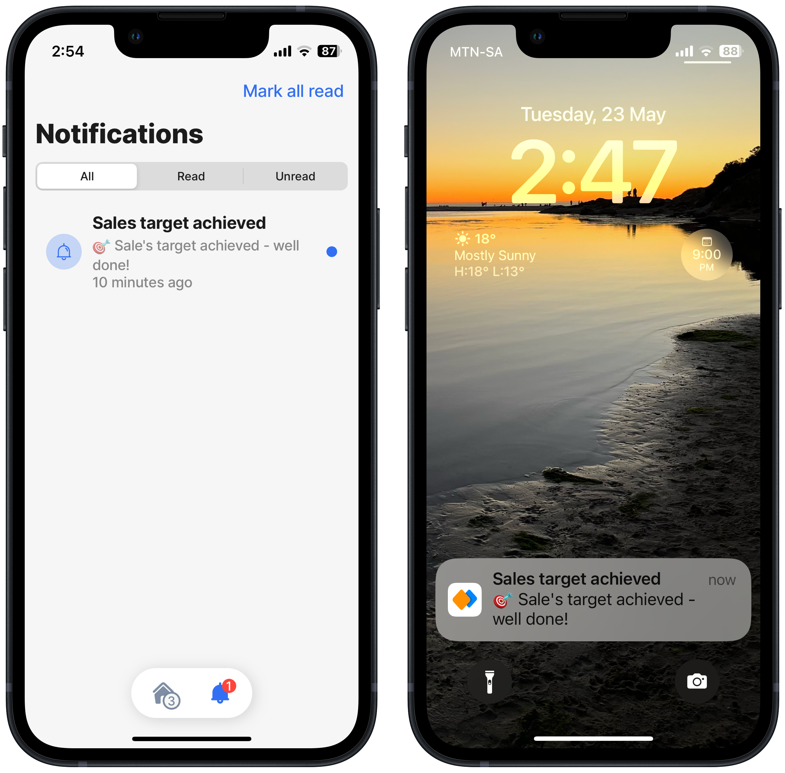
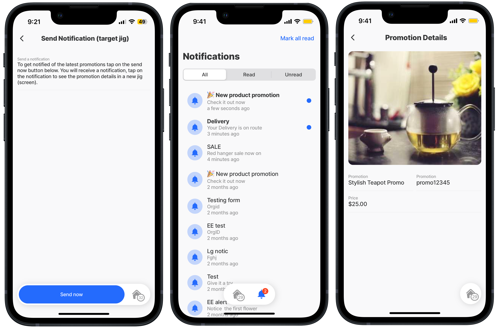
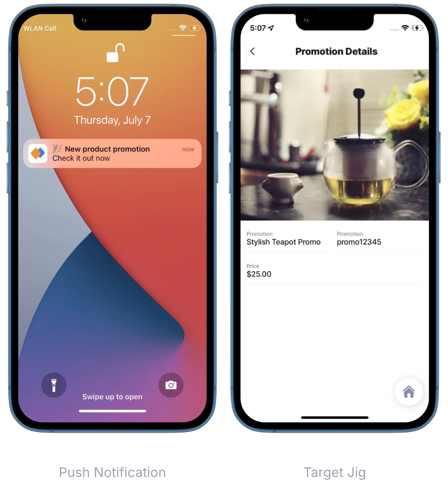

---
layout:
  width: wide
  title:
    visible: true
  description:
    visible: true
  tableOfContents:
    visible: true
  outline:
    visible: true
  pagination:
    visible: true
  metadata:
    visible: true
---

# Notifications



You can send Notifications using Jigx Management or programmatically in your solutions, see [Notifications](https://docs.jigx.com/administration/notifications). Notifications can be configured to be sent to a single user, the entire organization, users of a specific solution, and even users of a specific jig in a specific solution.



<figure><figcaption><p>In-app &#x26; push notifications</p></figcaption></figure>



## Configuration options

<table><thead><tr><th width="147.6875">Core structure</th><th></th></tr></thead><tbody><tr><td>function</td><td>Define a function in the <em>Functions</em> folder of your solution. The function has input parameters such as the notification <code>title</code>, the notification <code>text</code> and requires a Jigx <code>accessToken</code> or <a href="https://docs.jigx.com/my-profile#personal-access-tokens-pat">personal access token (PAT)</a> .</td></tr><tr><td>jig</td><td>jigs will invoke the function for sending notifications either via submitting form values to the function or by using an <a href="../Actions/execute-entity.md">execute-entity</a> action for invoking the function.</td></tr></tbody></table>

## Notification URL per region

<table><thead><tr><th width="157.69921875">Region</th><th>URL</th></tr></thead><tbody><tr><td>US</td><td><a href="https://us-east-1.api.jigx.com/v2.0/tool/organizations/%7BorganizationId%7D/notifications">https://us-east-1.api.jigx.com/v2.0/tool/organizations/{organizationId}/notifications</a></td></tr><tr><td><p>South East</p><p>(e.g. Australia)</p></td><td><a href="https://ap-southeast-2.api.jigx.com/v2.0/tool/organizations/%7BorganizationId%7D/notifications">https://ap-southeast-2.api.jigx.com/v2.0/tool/organizations/{organizationId}/notifications</a></td></tr><tr><td>Europe</td><td><a href="https://eu-central-1.api.jigx.com/v2.0/tool/organizations/%7BorganizationId%7D/notifications">https://eu-central-1.api.jigx.com/v2.0/tool/organizations/{organizationId}/notifications</a></td></tr></tbody></table>

## Examples and code snippets


In the code examples below replace `YOUR_ORG_ID` with your actual Organization Id. You can find it in the Organization Settings section of the Jigx Management or use the expression `=@ctx.organization.id`.

Click here to go there directly: [https://manage.jigx.com/settings/org-details](https://manage.jigx.com/organization/org-details)


## Notification sent when submitting a form

In this example we are using hidden form components (e.g. `organizationId`) to pass required parameters to the function. The emails field contains a comma-separated list of recipients. You could also use [Expressions](https://docs.jigx.com/building-apps-with-jigx/logic/expressions) to create that comma-separated string dynamically at runtime.

Once you submitted the form, the recipients should receive both a push notification and an in-app notification. You can also check the delivery status of your notification in the [Notifications](https://docs.jigx.com/administration/notifications) section of the Jigx Management.

Add a function definition called _send-notification.jigx_ to the _functions_ folder of your solution and copy & paste the following snippet into it. Replace the {organizationId} in the `url` with your organization's Id.

<figure><figcaption><p>Submit form to send notification</p></figcaption></figure>

See the code sample in [GitHub](https://github.com/jigx-com/jigx-samples/blob/main/quickstart/jigx-samples/jigs/guide-notifications/basic/send-submit-form.jigx).



```yaml
# Add this file under the functions folder
provider: DATA_PROVIDER_REST
method: POST
url: https://us-east-1.api.jigx.com/v2.0/tool/organizations/{organizationId}/notifications
inputTransform: >-
  $.{
    "content": {
      "title":title,
      "text":text,
      "jigId":jigId,
      "screen":"jig" 
    },
    "scope":scope,
    "emails":emails,
    "description": "description",
    "solutionId": solutionId
  }
parameters:
  solutionId:
   type: string
   location: body
   required: false 
  jigId:
    type: string
    location: body
    required: false
    value: notification-form
  deviceId:
    location: body
    type: string
    required: true
    value: jig
  command:
    location: body
    type: string
    required: false
    value: createNotification
  organizationId:
    location: path
    type: string
    required: true
  scope:
    location: body
    type: string
    required: false
    value: USR
  emails:
    location: body
    type: array
    required: true
  title:
    location: body
    type: string
    required: true
  text:
    location: body
    type: string
    required: true
  accessToken:
    location: header
    type: jigx
    value: jigx
    required: true
  
```



```yaml
title: Send Notification (submit-form)
icon: alert-circle
type: jig.default

actions:
  - children:
      - type: action.submit-form
        options:
          title: Send notification
          formId: send-form
          provider: DATA_PROVIDER_REST
          method: functionCall
          function: send-notification
          entity: send-notification
          onSuccess:
            title: Message sent
                
children:
  - type: component.form
    instanceId: send-form
    options:
      children:
        - type: component.text-field
          instanceId: title
          options:
            label: Title
        - type: component.text-field
          instanceId: text
          options:
            label: Text
        - type: component.text-field
          instanceId: organizationId
          options:
            label: organizationId
            initialValue: =@ctx.organization.id
            isHidden: true
        - type: component.text-field
          instanceId: solutionId
          options:
            label: solutionId
            initialValue: =@ctx.solution.id
            isHidden: true    
        - type: component.text-field
          instanceId: emails
          options:
            label: emails
            initialValue: =@ctx.user.email
            isHidden: true
        - type: component.text-field
          instanceId: accessToken
          options:
            label: accessToken
            initialValue: jigx
            isHidden: true
```



## Send notification with execute-entity

You can also send notifications using an [execute-entity](../Actions/execute-entity.md) action if you want to have more control over what's being sent to the function.

In this example we are using state to access the two form fields `title` and `text`. All other function's parameters are set in the execute-entity action. Note that you don't have to use form fields as you could also assign all `parameters` in the action itself.

<figure><figcaption><p>Notification sent with execute entity</p></figcaption></figure>



```yaml
# Add this file under the functions folder
provider: DATA_PROVIDER_REST
method: POST
url: https://us-east-1.api.jigx.com/v2.0/tool/organizations/{organizationId}/notifications
inputTransform: >-
  $.{
    "content": {
      "title":title,
      "text":text,
      "jigId":jigId,
      "screen":"jig" 
    },
    "scope":scope,
    "emails":emails,
    "description": "description",
    "solutionId": solutionId
  }
parameters:
  solutionId:
   type: string
   location: body
   required: false 
  jigId:
    type: string
    location: body
    required: false
    value: notification-form
  deviceId:
    location: body
    type: string
    required: true
    value: jig
  command:
    location: body
    type: string
    required: false
    value: createNotification
  organizationId:
    location: path
    type: string
    required: true
  scope:
    location: body
    type: string
    required: false
    value: USR
  emails:
    location: body
    type: array
    required: true
  title:
    location: body
    type: string
    required: true
  text:
    location: body
    type: string
    required: true
  accessToken:
    location: header
    type: jigx
    value: jigx
    required: true
    
```



```yaml
title: Send Notification (execute-entity)
icon: alert-circle
type: jig.default

actions:
  - children:
      - type: action.execute-entity
        options:
          title: Send now
          provider: DATA_PROVIDER_REST
          method: functionCall
          entity: send-notification
          function: send-notification
          parameters:
            deviceId: jig
            organizationId: =@ctx.organization.id 
            solutionId: =@ctx.solution.id
            emails: =@ctx.user.email
            title: =@ctx.components.title.state.value
            text:  =@ctx.components.text.state.value
            accessToken: jigx
          onSuccess: 
            title: Message sent
                
children:
  - type: component.form
    instanceId: send-form
    options:
      children:
        - type: component.text-field
          instanceId: title
          options:
            label: Title
        - type: component.text-field
          instanceId: text
          options:
            label: Text
```



## Send notification with a target jig with input parameters

You can also target a specific jig with input parameters from your push notification. An example of this would be a notification about a new product promotion with the promotion detail jig as the target. When the user taps on the notification (either on the native push notification or the in-app notification), the app will navigate to the specific promotion

<figure><figcaption><p>Target a jig with a notification</p></figcaption></figure>

<figure><figcaption></figcaption></figure>

For this, you need an adjusted REST function definition (see 1), a Jig that invokes the REST function (see 2), and a target jig that will be displayed when the user taps on the notification (see 3).

Replace the {organizationId} in the `url` with your organization's Id.

See the code sample in [GitHub](https://github.com/jigx-com/jigx-samples/blob/main/quickstart/jigx-samples/functions/Notifications/send-notification-target-jig.jigx).



```yaml
# Add this file under the functions folder
provider: DATA_PROVIDER_REST
method: POST
url: https://us-east-1.api.jigx.com/v2.0/tool/organizations/{organizationId}/notifications
inputTransform: >
  $.{
      "content": {
        "title": title,
        "text": text, 
        "screen": "jig",
        "jigId": jigId,
        "inputs":{
          "promotionId":promotionId
        }  
    },
      "scope": scope,
      "emails": emails,
      "solutionId": solutionId
  }
parameters:
  deviceId:
    location: body
    type: string
    required: true
    value: jig
  command:
    location: body
    type: string
    required: false
    value: createNotification
  organizationId:
    location: path
    type: string
    required: true
  scope:
    location: body
    type: string
    required: false
    value: USR
  emails:
    location: body
    type: array
    required: true
  title:
    location: body
    type: string
    required: true
  text:
    location: body
    type: string
    required: true
  promotionId:
    location: body
    type: string
    required: true
  solutionId:
    location: body
    type: string
    required: true
  jigId:
    location: body
    type: string
    required: true
  accessToken:
    location: header
    type: jigx
    value: jigx
    required: true
    
```



```yaml
title: Send Notification (target jig)
icon: alert-circle
type: jig.default

actions:
  - children:
      - type: action.execute-entity
        options:
          title: Send now
          provider: DATA_PROVIDER_REST
          method: functionCall
          entity: send-notification-target-jig
          function: send-notification-target-jig
          parameters:
            deviceId: jig
            organizationId: =@ctx.organization.id 
            emails: =@ctx.user.email
            title: 🎉 New product promotion
            text:  Check it out now
            solutionId: =@ctx.solution.id 
            promotionId: promo12345
            jigId: view-promotion-details
            accessToken: jigx
          onSuccess: 
            title: Message sent
                
children:
  - type: component.form
    instanceId: send-form
    options:
      children:
        - type: component.text-field
          instanceId: title
          options:
            label: Title
        - type: component.text-field
          instanceId: text
          options:
            label: Text
```



```yaml
title: Promotion Details
icon: zoom-in
type: jig.default

datasources:
  promotions:
    type: datasource.static
    options:
      data:
        - promotionId: promo12345
          name: Stylish Teapot Promo
          price: 25
          image: https://picsum.photos/id/225/500/300
                
children:
  - type: component.image
    options:
      source:
        uri: =@ctx.datasources.promotions[promotionId = @ctx.jig.inputs.promotionId].image
      resizeMode: cover
      height: 300
  - type: component.entity
    options:
      children:
        - type: component.field-row
          options:
            children:
              - type: component.entity-field
                options:
                  label: Promotion
                  value: =@ctx.datasources.promotions[promotionId = @ctx.jig.inputs.promotionId].name
              - type: component.entity-field
                options:
                  label: Promotion #
                  value: =@ctx.jig.inputs.promotionId
        - type: component.entity-field
          options:
            label: Price
            value: 
              text: =@ctx.datasources.promotions[promotionId = @ctx.jig.inputs.promotionId].price
              format:
                numberStyle: currency
                currency: USD            
```



## Sending push notifications using the Jigx notification Endpoint

See [External push notifications (API)](<External push notifications _API_.md>) for more information and examples.
