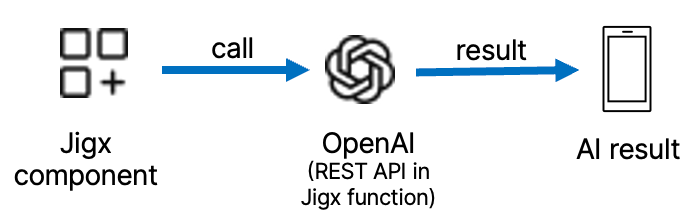
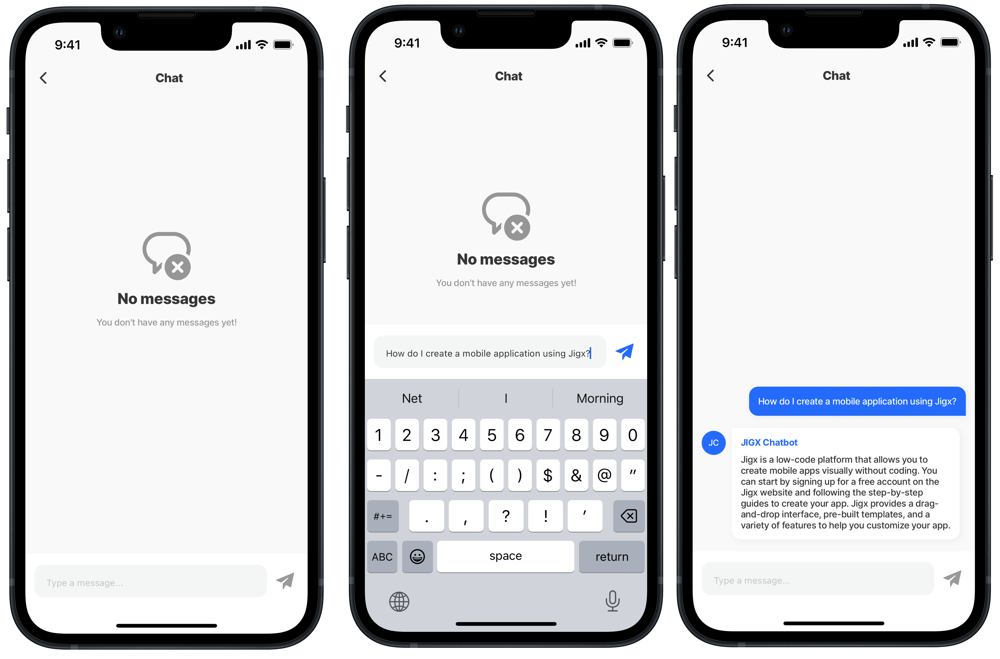

# OpenAI integration

Integrating OpenAI into your Jigx App offers tremendous potential to enhance functionality, improve user experiences, and drive innovation. By leveraging the power of advanced AI models, you can create smarter, more responsive, and engaging apps that meet users' evolving needs. Whether building a new app or enhancing an existing one, OpenAI provides the tools and capabilities to transform your vision into reality.

## What AI models do we support?

Jigx provides an integration layer allowing you to call any REST-based service. AI services such as ChatGPT provide a REST service. Jigx supports any AI service that is exposed to a REST service.

## Considerations

* Use your ChatGPT API key or AI model key to authorize the function calls.
* When integrating OpenAI's language models into your app, configure prompts to ensure optimal performance. Effective prompting can significantly influence the quality of responses generated by the AI.
* Refer to [https://platform.openai.com/docs/](https://platform.openai.com/docs/) for more information on OpenAPI.

## Prompts

A prompt is the input you provide the AI model to generate a response. This input can range from a simple question to a complex set of instructions. The effectiveness of the response largely depends on how well the prompt is crafted.

The ChatGPT REST API allows prompts in the JSON body parameter you send to the ChatGPT REST API. You can configure this in Jigx functions and the prompting tags are found within the JSON body under `messages` and `content`, as shown in the example below. Review the examples below and compare the bland and engaging prompt examples. Configuring these prompts correctly will significantly improve your outcomes.



```yaml
 "messages": [
      {
        "role": "user",
        "content": [
          {
            "type": "text",
            "text": "What is the weather today in New York?"
          }
        ]
      ]
```



```yaml
"messages": [
      {
        "role": "system",
        "content": "you are the chat for the AI Mobile app"
      },
      {
        "role": "system",
        "content": "You can participate in conversations about the app, and everything related to the app"
      },      
      {
        "role": "system",
        "content": "Your name is AI Chatbot"
      },      
      {
        "role": "system",
        "content": "Reply in a casual but formal tone when you participate in conversations."
      },           
      {
        "role": "system",
        "content": "always respond with a json object in the following format:
        {
          'message':'the response message to the question',
          'askedBy': 'the user asking the question',
          'author': 'the author of the answer',
          'question': 'the question asked by the user'
        }"
      },        
      {
        "role": "user",
        "content": question
      },         
      {
        "role": "system",
        "content": "Only reply with the json object as an answer."
      },
    ]
  }
```



## How to integrate with OpenAI

* Select your Jigx visual component, such as chat, [media picker](Components/form/media-field.md), [checklists](Components/form/checkbox.md) and your use case.
* Configure the [REST API](<Data Providers/REST/REST.md>) integration.
* Show it in your Jigx mobile app.

<figure><figcaption></figcaption></figure>

## High-level steps

1. Open Jigx Builder in VS Code and create a Jigx solution.
2. Under the functions folder create a function.jigx file to configure the OpenAI [REST](https://docs.jigx.com/examples/rest) API. For more information on configuring a REST function see [REST Overview](https://docs.jigx.com/rest-overview).
3. In the functions file configure the [REST Authentication](https://docs.jigx.com/rest-authentication) required by the REST API.
4. Configure the [prompts](<OpenAI integration.md>) to tell AI what it should do and how it must act in the `messages` >`"content:"` property in the `inputTransform` in the functions file.
5. Create a [Jigs (screens)](https://docs.jigx.com/jigs-screens) under the jigs folder.
6. Add [Components (controls)](https://docs.jigx.com/components-controls) to the jig and configure accordingly.
7. Configure an [action](https://docs.jigx.com/actions) to call the OpenAI function. In most instances a [sync-entities](Actions/sync-entities.md) action is configured to return the reponse from the AI server.

## Function configuration

Jigx functions are used to configure the REST integration with AI models such as ChatGPT. Once a Jigx function has been configured you can call it anywhere from your visual components. See the section on [REST](<Data Providers/REST/REST.md>) integration to understand how to use REST in Jigx. Below is an explanation describing how the parameters are configured to integrate Jigx and the AI model. It is important to refer to the AI model REST API you have selected to use, to ensure you have provided the required input and configured the output to return the correct response from the model.

<table><thead><tr><th width="180.13671875">Parameter</th><th>Description</th></tr></thead><tbody><tr><td><code>method</code></td><td><code>POST</code> -The POST request can be used to send training data to the server where the AI model is hosted. The server can then use this data to train the model.</td></tr><tr><td><code>url</code></td><td>Specify the URL for the AI model's REST API. For example, the URL for ChatGPT is: <a href="https://api.openai.com/v1/chat/completions">https://api.openai.com/v1/chat/completions</a></td></tr><tr><td><code>outputTransform</code></td><td>The ouputTransform is where you configure the AI response. Check the AI API response to ensure you add the correct configuration. For example, <strong>OpenAPI response</strong> shows the following code:<br> <code>{ "id": "chatcmpl-123", "object": "chat.completion", "created": 1677652288, "model": "gpt-3.5-turbo-0125", "system_fingerprint": "fp_44709d6fcb", "choices": [{ "index": 0, "message": { "role": "assistant", "content": "\n\nHello there, how may I assist you today?", }, "logprobs": null, "finish_reason": "stop" }], "usage": { "prompt_tokens": 9, "completion_tokens": 12, "total_tokens": 21 } }</code> <br>In the <strong>outputTransform</strong> you configure the following: <code>outputTransform: | { "content": $.choices[0].message.content}</code></td></tr><tr><td><code>inputTransform</code></td><td>Provide the AI with the information it requires to return the response/chat message. <code>model</code> - is the name and version of the AI model. <code>response_format</code> - the expected input type, for example, json_object. <code>message</code> - under this property configure the prompts to train the AI, by specifying the <code>role</code> and <code>content</code>. You can configure multiple sets.</td></tr><tr><td><code>parameters</code></td><td>Configure authorization and authentication depending on the AI model you using. Configure the <code>type</code>, <code>required</code> , and <code>location</code> of the parameters.</td></tr></tbody></table>

## Examples and code samples

## Chatbot with OpenAI

In this example, you set up an AI chat experience using the Jigx chatbot visual component configured to integrate with the OpenAI ChatGPT REST endpoint - [https://api.openai.com/v1/chat/completions](https://api.openai.com/v1/chat/completions). The REST API is configured in the ai-function.jigx and the chat component in the ai-chat.jigx file.

The configuration for the function file called **ai-chat.jigx** contains:

1. The `URL` for the OpenAI REST API for chat.
2. The `outputTransform` specifies what to return from the OpenAI REST call.
3. The `inputTransform` contains the structure and prompts set that the AI requires, in this instance `model`, `response format`, and `messages`.
4. The `parameters` include `Authorization`, which depends on your AI model; in this example, a Bearer token is used; `question`, `author`, and `user`.

Configure the jig **ai-chat.jigx** file with:

1. `onRefresh` action - this allows the chat screen to be cleared/reset by deleting the messages.
2. `datasource` (local data provider) to return chat history while in the app.
3. `component-chat` configured to show the message and sender details.
4. `onSend` action executes the global action that pushes the chat message (input) to the local data provider and then a `sync-entities` action syncs chat with the REST API by executing the function to return the answer (response).


The `component.chat` is currently in preview. Contact [support@jigx.com](mailto:support@jigx.com) for access to the component.


<figure><figcaption><p>AI chatbot</p></figcaption></figure>



```yaml
provider: DATA_PROVIDER_REST
method: POST
#Specify the OpenAI REST API URL
url: https://api.openai.com/v1/chat/completions
#Configure what must be returned (AI response) from the AI server.
#Response configured in the outputTransform.
outputTransform: | 
  $merge([
      $merge([
          $.$eval($.choices[0].message.content),
          {"messageTime": $toMillis($now())}
    ]),
    {"id": $.inputs.mId}
  ]) 
useLocalCall: true
#Send input data to the AI server for the AI model to process
#And generate predictions. 
#Configure the AI model to be used.
#Configure the format in which the response is returned.
#Configure the prompt sets under content. 
inputTransform: |
  $.{
    "model": "gpt-3.5-turbo",
    "response_format": {
      "type": "json_object"
    },
    "messages": [
      {
        "role": "system",
        "content": "you are the chat for the AI Mobile demo app"
      },
      {
        "role": "system",
        "content": "You can participate in conversations about the app, and everything related to the app"
      },      
      {
        "role": "system",
        "content": "Your name is AI Chatbot"
      },      
      {
        "role": "system",
        "content": "Reply in a casual but formal tone when you participate in conversations."
      },           
      {
        "role": "system",
        "content": "always respond with a json object in the following format:
        {
          'message':'the response message to the question',
          'askedBy': 'the user asking the question',
          'author': 'the author of the answer',
          'question': 'the question asked by the user'
        }"
      },
      {
        "role": "system",
        "content": "The history of the conversation so far is " & history
      },    
      {
        "role": "system",
        "content": "The provided tId is " & tId
      },         
      {
        "role": "user",
        "content": question
      },         
      {
        "role": "system",
        "content": "Only reply with the json object as an answer."
      },
      {
        "role": "system",
        "content": "The user asking the question is " & user
      },
      {
        "role": "system",
        "content": "The author of the response is " & author
      }
    ]
  }
#Configure authorization for the AI model.
#Configure the type for each parameter. 
parameters:
  Authorization:
    location: header
    required: true
    type: string
#Use your own Bearer token or the token required by the openAI REST
    value: Bearer XX 
  question:    
    type: string
    location: body
    required: true
  mId:
    type: string
    location: body
    required: true
  author:
    type: string
    location: body
    required: true
  user:
    type: string
    location: body
    required: true

forRowsWithMatchingIds: true
```



```yaml
title: ="Chat"
type: jig.full-screen
# Configure the onRefresh to clear/reset the chat.
# When the screen is pulled up the screen resets. 
onRefresh:
  type: action.execute-entities
  options:
    provider: DATA_PROVIDER_LOCAL
    entity: AIChat
    method: delete
    goBack: stay
    data: =@ctx.datasources.chat-history

datasources:
  chat-history: 
    type: datasource.sqlite
    options:
      provider: DATA_PROVIDER_LOCAL
  
      entities:
        - entity: AIChat
  
      query: |
        SELECT
          id,
          json_extract(tab.data, '$.author') AS author, 
          json_extract(tab.data, '$.askedBy') AS askedBy, 
          json_extract(tab.data, '$.question') AS question, 
          json_extract(tab.data, '$.message') AS message, 
          json_extract(tab.data, '$.messageTime') AS messageTime 
        FROM 
          [AIChat] AS tab
        ORDER BY 
          CAST(json_extract(tab.data, '$.messageTime') AS INTEGER) ASC

component: 
  type: component.chat
  instanceId: myChat
  options:
    data: =@ctx.datasources.chat-history
    item:
      type: component.chat-message
      options:
        message: =@ctx.current.item.message
        sender:
          name: =@ctx.current.item.author
        isAuthor: =$lowercase(@ctx.current.item.author) = $lowercase(@ctx.user.email)
        sentAt: =@ctx.current.item.messageTime
    # Configure the action to call a global action.
    # Pass the user message/question as a parameter.  
    onSend:
      type: action.execute-action
      options:
        action: ai-chat-action
        parameters:
          author: =@ctx.user.email
          user: =@ctx.user.email
          question: =@ctx.components.myChat.state.message
                
```



```yaml
parameters:
  author: 
    type: string
  user: 
    type: string
  question:
    type: string

action: 
  type: action.action-list
  options:
    isSequential: true
    # Save chat messages to the local data provider on the device.         
    actions:
      - type: action.execute-entity
        options:
          provider: DATA_PROVIDER_LOCAL
          entity: AIChat
          method: create
          goBack: stay
          data:
            author: =@ctx.action.parameters.author
            askedBy: =@ctx.action.parameters.author
            question: =@ctx.action.parameters.question
            message: =@ctx.action.parameters.question
            messageTime: =$toMillis($now())
      # Configure an action to call the AI response (outputTransformer).
      # Called from the REST ai-function.
      - type: action.sync-entities
        options:
          provider: DATA_PROVIDER_REST
          entities:
            - entity: AIChat
              function: ai-chat
              parameters:
                # Provide a name for your chat bot response.             
                author: 'JIGX Chatbot'
                user: =@ctx.user.email
                # Use your own Bearer token or the token required by the 
                # openAI REST.                
                Authorization: Bearer 
                question: =@ctx.action.parameters.question
                # Configure a unique id for the chatbot message                
                mId: =$uuid()
```



## Anaylze images with OpenAI

In this example, an image is analyzed by integrating with the OpenAI ChatGPT REST service to analyze the image to provide a general reponse. An image is uploaded in a jig using the [media-field](Components/form/media-field.md) component. When the _Analyze image_ button is pressed a [sync-entities](Actions/sync-entities.md) action is configured which calls the function to execute the OpenAI REST API call. The result returned from the OpenAI call is used to add a description for the image in an [entity-field](Components/entity/entity-field.md) component.

<figure><figcaption><p>AI description for image</p></figcaption></figure>



```yaml
provider: DATA_PROVIDER_REST
method: POST
useLocalCall: true
#Specify the OpenAI REST API URL
url: https://api.openai.com/v1/chat/completions
#Configure what must be returned (AI response) from the AI server in outputTransform
outputTransform: |
  {
    "content": $.choices[0].message.content
  }
#send input data to the AI server for the AI model to process and generate predictions. 
#Configure the AI model to be used, the format in which the response is returned.
#Configure the prompt sets under content.     
inputTransform: |
  {
    "model": "gpt-4o",
    "messages": [
      {
        "role": "user",
        "content": [
          {
            "type": "text",
            "text": "What is in this image?"
          },
          {
            "type": "image_url",
            "image_url": {
              "url": "data:image/jpeg;base64," & image
            }
          }
        ]
      }
    ],
    "max_tokens": 300
  }
#Configure authorization for the AI model, and the type for each parameter 
parameters:
  Authorization:
    type: string
    location: header
    required: true
    value: Bearer #Use your own Bearer token or the token required by the openAI REST
  Content-Type:
    type: string
    location: header
    required: true
    value: application/json
  image:
    type: string
    location: body
    required: false
#Convert the image from local-uri to base64 to pass to the AI model. 
conversions:
  - property: image
    from: local-uri
    to: base64
```



```yaml
title: Capture the moment
type: jig.default

# Configure an action to call the AI response (outputTransformer) from the REST
# ai-function.          
actions:
  - children:
      - type: action.sync-entities
        options:
          title: Analyze Image
          provider: DATA_PROVIDER_REST
          entities:
            - entity: default/outsideCheckList
              function: ai-image-function
              parameters:
                Content-Type: application/json
                # Use your own Bearer token or the token required by the openAI 
                # REST.
                Authorization: Bearer XXX 
                image: =@ctx.components.image.state.value
                
header:
  type: component.jig-header
  options:
    height: medium
    children:
      type: component.image
      options:
        source:
          uri: https://plus.unsplash.com/premium_photo-1667538962342-2d9937f014d9?w=800&auto=format&fit=crop&q=60&ixlib=rb-4.0.3&ixid=M3wxMjA3fDB8MHxzZWFyY2h8MTd8fGNhbWVyYSUyMGluJTIwYmFja2dyb3VuZHxlbnwwfHwwfHx8MA%3D%3D

datasources:
  outSideTasks:
    type: datasource.sqlite
    options:
      provider: DATA_PROVIDER_LOCAL
      entities:
        - default/outsideCheckList
      query: |
        SELECT
            id,
            '$.content'
        FROM [default/outsideCheckList]

children:
  - type: component.form
    instanceId: form
    options:
      isDiscardChangesAlertEnabled: false
      children:
        - type: component.media-field
          instanceId: image
          options:
            label: Image
            mediaType: image
            imageQuality: 10
        - type: component.text-field
          instanceId: check
          options:
            label: =@ctx.jig.components.image.state.value
                    
  - type: component.entity
    options:
      children:
        - type: component.entity-field
          options:
            label: Description
            value: =@ctx.datasources.outSideTasks.content         
```


