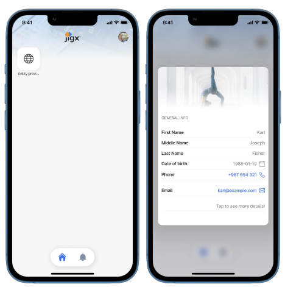
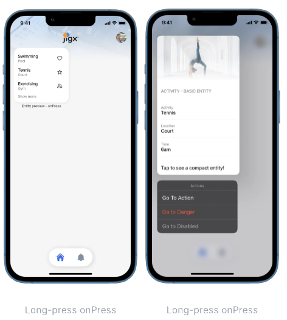
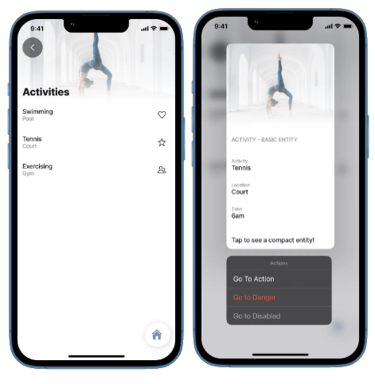
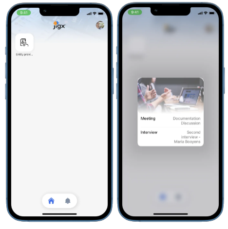
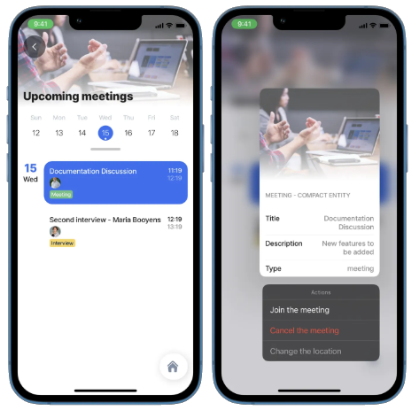

# Entity

The entity component allows the user to use entity (sections, field-rows and entity-fields) as the preview content.

### Long-press on a widget



This example displays a preview after long-pressing the widget See the full example on [GitHub](https://github.com/jigx-com/jigx-samples/blob/main/quickstart/jigx-samples/jigs/preview/entity/entity-longpress-widget.jigx).





<figure><figcaption></figcaption></figure>




```yaml
preview:
  isCompact: false
  children:
    - type: component.entity
      options:
        isCompact: true
        children:
          - type: component.section
            options:
              title: General info
              children:
                - type: component.field-row
                  options:
                    children: 
                      - type: component.entity-field
                        options:
                          label: First Name
                          value: Karl 
                          contentType: default
                      - type: component.entity-field
                        options:
                          label: Middle Name
                          value: Joseph
                          contentType: default
                      - type: component.entity-field
                        options:
                          label: Last Name
                          value: Fisher
                          contentType: default
                - type: component.entity-field
                  options:
                    label: Date of birth
                    value: 1988-01-19
                    rightIcon: calendar
                - type: component.entity-field
                  options:
                    label: Phone
                    value: +987 654 321
                    contentType: phone
                - type: component.entity-field
                  options:
                    label: Email
                    value: karl@example.com
                    contentType: email
                - type: component.entity-field
                  options:
                    label: ""
                    value: Tap to see more details!
  header: 
    type: component.jig-header
    options:
      height: small
      children: 
        type: component.image
        options:
          title: Activities
          source:
            uri: https://images.unsplash.com/photo-1603988363607-e1e4a66962c6?ixlib=rb-4.0.3&ixid=MnwxMjA3fDB8MHxzZWFyY2h8Njl8fHNwb3J0fGVufDB8fDB8fA%3D%3D&auto=format&fit=crop&w=900&q=60
```


### Long-press onPress action



<figure><figcaption></figcaption></figure>



<figure><figcaption></figcaption></figure>



This example displays a preview after long-pressing the list-item on the widget

This example displays a preview after long-pressing the list-item in the jig. It includes the entity component as well as the go-to actions.

As you can see in the code snippet, the original list doesn't include the preview. Our onPress action allows us to use the preview that is included in the detail jig.

See the full examples of [LongPress onPress](https://github.com/jigx-com/jigx-samples/blob/main/quickstart/jigx-samples/jigs/preview/entity/entity-longpress-onPress.jigx) and [entity-detail](https://github.com/jigx-com/jigx-samples/blob/main/quickstart/jigx-samples/jigs/preview/entity/entity-detail.jigx) in GitHub.



```yaml
title: Entity preview - onPress
type: jig.list
icon: world

header: 
  type: component.jig-header
  options:
    height: small
    children: 
      type: component.image
      options:
        title: Activities
        source:
          uri: https://images.unsplash.com/photo-1603988363607-e1e4a66962c6?ixlib=rb-4.0.3&ixid=MnwxMjA3fDB8MHxzZWFyY2h8Njl8fHNwb3J0fGVufDB8fDB8fA%3D%3D&auto=format&fit=crop&w=900&q=60

datasources:
  activities: 
    type: datasource.static
    options:
      data:
        - id: 1
          name: Swimming
          location: Pool
          previewDetail: 7pm
          image: love-it
        - id: 2
          name: Tennis
          location: Court
          previewDetail: 6am
          image: rating-star
        - id: 3
          name: Exercising
          location: Gym
          previewDetail: 5pm
          image: multiple-neutral-2
data: =@ctx.datasources.activities
item:
  type: component.list-item
  options:
    title: =@ctx.current.item.name
    subtitle: =@ctx.current.item.location  
    rightElement: 
      element: icon
      icon: =@ctx.current.item.image
    onPress: 
      type: action.go-to
      options:
        linkTo: entity-detail
        parameters:
          id: =@ctx.current.item.id
          name: =@ctx.current.item.name
          location: =@ctx.current.item.location
          previewDetail: =@ctx.current.item.previewDetail
```



```yaml
title: Activity detail
type: jig.default

header: 
  type: component.jig-header
  options:
    height: small
    children: 
      type: component.image
      options:
        title: =@ctx.jig.inputs.name
        source:
          uri: https://images.unsplash.com/photo-1603988363607-e1e4a66962c6?ixlib=rb-4.0.3&ixid=MnwxMjA3fDB8MHxzZWFyY2h8Njl8fHNwb3J0fGVufDB8fDB8fA%3D%3D&auto=format&fit=crop&w=900&q=60

children:
    - type: component.entity
      options:
        isCompact: true
        children:
          - type: component.section
            options:
              title: Activity - Compact entity
              children:
                - type: component.entity-field
                  options:
                    label: Activity
                    value: =@ctx.jig.inputs.name         
                - type: component.entity-field
                  options:
                    label: Location
                    value: =@ctx.jig.inputs.location
                - type: component.entity-field
                  options:
                    label: Time
                    value: =@ctx.jig.inputs.previewDetail
              
preview:
  isCompact: true
  actions:
   - children:
        - type: action.go-to
          options:
            title: Go To Action
            linkTo: placeholder
        - type: action.go-to
          options:
            title: Go to Danger
            linkTo: placeholder
            style:
              isDanger: true
        - type: action.go-to
          options:
            title: Go to Disabled
            linkTo: placeholder
            style:
              isDisabled: true

  children:
    - type: component.entity
      options:
        isCompact: false
        children:
          - type: component.section
            options:
              title: Activity - Basic entity
              children:
                - type: component.entity-field
                  options:
                    label: Activity
                    value: =@ctx.jig.inputs.name         
                - type: component.entity-field
                  options:
                    label: Location
                    value: =@ctx.jig.inputs.location
                - type: component.entity-field
                  options:
                    label: Time
                    value: =@ctx.jig.inputs.previewDetail
                - type: component.entity-field
                  options:
                    label: ""
                    value: Tap to see a compact entity!
                             
  header: 
    type: component.jig-header
    options:
      height: medium
      children: 
        type: component.image
        options:
          title: =@ctx.jig.inputs.name
          subtitle: =@ctx.jig.inputs.location
          source:
            uri: https://images.unsplash.com/photo-1603988363607-e1e4a66962c6?ixlib=rb-4.0.3&ixid=MnwxMjA3fDB8MHxzZWFyY2h8Njl8fHNwb3J0fGVufDB8fDB8fA%3D%3D&auto=format&fit=crop&w=900&q=60
```



### LongPress on Calendar jig

This example displays a preview after long-pressing the event in the Calendar jig (on the widget)

<figure><figcaption></figcaption></figure>


This example displays a preview after long-pressing the event in the Calendar jig (on the event)

<figure><figcaption></figcaption></figure>

See the full example of [entity longpress](https://github.com/jigx-com/jigx-samples/blob/main/quickstart/jigx-samples/jigs/preview/entity/entity-longpress-calendar.jigx) and [entity-calendar-detail](https://github.com/jigx-com/jigx-samples/blob/main/quickstart/jigx-samples/jigs/preview/entity/entity-calendar-detail.jigx) in GitHub.



```yaml
title: Entity preview - Calendar
type: jig.calendar
icon: career

inputs:
  title: 
    type: string
  description: 
    type: string
  type: 
    type: string
    
header: 
  type: component.jig-header
  options:
    height: small
    children: 
      type: component.image
      options:
        title: Upcoming meetings
        source:
          uri: https://images.unsplash.com/photo-1517245386807-bb43f82c33c4?ixlib=rb-4.0.3&ixid=MnwxMjA3fDB8MHxzZWFyY2h8Mnx8bWVldGluZ3xlbnwwfHwwfHw%3D&auto=format&fit=crop&w=900&q=60
datasources:
  calendar_data: 
    type: datasource.static
    options:
      data:
        - description: New features to be added
          id: 1
          title: Documentation Discussion
          type: meeting
          color: color2
          people: https://images.unsplash.com/photo-1548449112-96a38a643324?ixlib=rb-1.2.1&ixid=MnwxMjA3fDB8MHxwaG90by1wYWdlfHx8fGVufDB8fHx8&auto=format&fit=crop&w=774&q=80
        - description: Project manager position
          id: 2
          title: Second interview - Maria Booyens
          type: interview
          color: color3
          people: https://images.unsplash.com/photo-1573497019940-1c28c88b4f3e?ixlib=rb-1.2.1&ixid=MnwxMjA3fDB8MHxwaG90by1wYWdlfHx8fGVufDB8fHx8&auto=format&fit=crop&w=774&q=80
        
    
data: =@ctx.datasources.calendar_data  
item:
  type: component.event
  options:
    from:
      text: =$fromMillis($toMillis($now()) + ($number(@ctx.current.item.id)- 1) * 3600000)
      format:
        dateFormat: "l"
    to: =$fromMillis($toMillis($now()) + $number(@ctx.current.item.id) *
      3600000)
    title: =@ctx.current.item.title
    description: =@ctx.current.item.description
    tags: "=[{'title': @ctx.current.item.type, 'color': @ctx.current.item.color}]"
    people: "=[{'avatarUrl': @ctx.current.item.people}]"
    onPress: 
      type: action.go-to
      options:
        linkTo: entity-calendar-detail
        inputs:
          title: =@ctx.current.item.title
          description: =@ctx.current.item.description
          type: =@ctx.current.item.type
    onButtonPress: 
      type: action.go-to
      options:
        title: Go to detail
        linkTo: entity-calendar-detail
        inputs:
          title: =@ctx.current.item.title
          description: =@ctx.current.item.description
          type: =@ctx.current.item.type
    buttonTitle: Go to detail

preview:
  isCompact: true
  children:
    - type: component.entity
      options:
        isCompact: true
        children:
          - type: component.entity-field
            options:
              label: Meeting
              value: Documentation Discussion
          - type: component.entity-field
            options:
              label: Interview
              value: Second interview - Maria Booyens

  header: 
    type: component.jig-header
    options:
      height: medium
      children: 
        type: component.image
        options:
          title: Upcoming meetings
          source:
            uri: https://images.unsplash.com/photo-1517245386807-bb43f82c33c4?ixlib=rb-4.0.3&ixid=MnwxMjA3fDB8MHxzZWFyY2h8Mnx8bWVldGluZ3xlbnwwfHwwfHw%3D&auto=format&fit=crop&w=900&q=60
```



```yaml
title: Meeting detail
type: jig.default

header: 
  type: component.jig-header
  options:
    height: small
    children: 
      type: component.image
      options:
        title: Meeting detail
        source:
          uri: https://images.unsplash.com/photo-1517245386807-bb43f82c33c4?ixlib=rb-4.0.3&ixid=MnwxMjA3fDB8MHxzZWFyY2h8Mnx8bWVldGluZ3xlbnwwfHwwfHw%3D&auto=format&fit=crop&w=900&q=60

children:
    - type: component.entity
      options:
        isCompact: true
        children:
          - type: component.section
            options:
              title: Meeting - Compact entity
              children:
                - type: component.entity-field
                  options:
                    label: Title
                    value: =@ctx.jig.inputs.title   
                - type: component.entity-field
                  options:
                    label: Type
                    value: =@ctx.jig.inputs.type
                    rightIcon: conversation-chat-2
                - type: component.entity-field
                  options:
                    label: Description
                    value: =@ctx.jig.inputs.description   
            
preview:
  isCompact: true
  actions:
   - children:
        - type: action.go-to
          options:
            title: Join the meeting
            linkTo: placeholder
        - type: action.go-to
          options:
            title: Cancel the meeting
            linkTo: placeholder
            style:
              isDanger: true
        - type: action.go-to
          options:
            title: Change the location
            linkTo: placeholder
            style:
              isDisabled: true

  children:
    - type: component.entity
      options:
        isCompact: true
        children:
          - type: component.section
            options:
              title: Meeting - Compact entity
              children:
                - type: component.entity-field
                  options:
                    label: Title
                    value: =@ctx.jig.inputs.title  
                - type: component.entity-field
                  options:
                    label: Description
                    value: =@ctx.jig.inputs.description 
                - type: component.entity-field
                  options:
                    label: Type
                    value: =@ctx.jig.inputs.type
                              
  header: 
    type: component.jig-header
    options:
      height: medium
      children: 
        type: component.image
        options:
          title: Meeting detail
          source:
            uri: https://images.unsplash.com/photo-1517245386807-bb43f82c33c4?ixlib=rb-4.0.3&ixid=MnwxMjA3fDB8MHxzZWFyY2h8Mnx8bWVldGluZ3xlbnwwfHwwfHw%3D&auto=format&fit=crop&w=900&q=60
```


