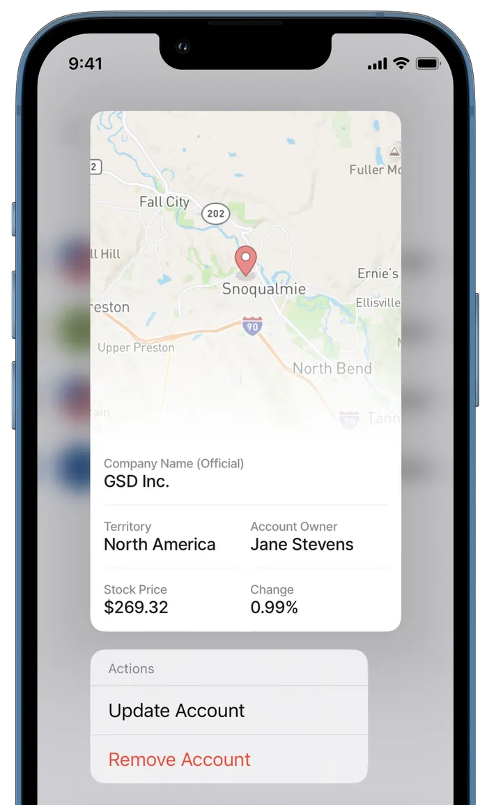

# Preview (iOS feature)


**Known Issue:** We recommend using alternatives while we improve the long-press experience.




Add a preview for the following [Components](../components/):

* [widgets](../Widgets/Widgets.md)
* [list-item](../Components/list/list-item.md)
* [event](../Components/event.md) The preview is triggered by _long-pressing_ the widget or item. The _long-press_ action can be used on:

1. Widgets
2. List-items on widget
3. onPress action on list-item or event.



<figure><figcaption>
Preview
</figcaption></figure>




**Content preview**

_**Applies to:** iOS devices only._

On **iOS**, you can access a **content preview** by long-pressing a control.\
Long-pressing a control (for example, a web-view or entity-field) opens a lightweight preview window, allowing you to quickly view detailed content without navigating away. Pressing deeper expands the preview, revealing the full context.


## Configuration options

<table><thead><tr><th width="130.8828125">Core structure</th><th></th></tr></thead><tbody><tr><td><code>actions</code></td><td>
These can be added to the preview:
<ul><li><a href="../Actions/action-list.md">action-list</a> </li><li><a href="../Actions/execute-entities.md">execute-entities</a> </li><li><a href="https://docs.jigx.com/examples/execute-entity">execute-entity</a> </li><li><a href="../Actions/go-to.md">go-to</a> </li><li><a href="../Actions/open-url.md">open-url</a> </li><li><a href="../../readme/actions/state-actions/reset-state.md">reset-state</a></li><li> <a href="../../readme/actions/state-actions/set-state.md">set-state</a></li><li> <a href="../../readme/actions/sync-actions/sync-entities.md">sync-entities</a> </li><li><a href="../Actions/confirm.md">confirm</a></li></ul></td></tr><tr><td><code>children</code></td><td>Two components available to use in a preview mode:</td></tr><tr><td><code>header</code></td><td>The is can be part of the displayed preview.</td></tr><tr><td><code>isCompact</code></td><td>When set to <code>true</code> the size of the preview will be adjusted to its content.</td></tr></tbody></table>


1. Currently issues could be experienced when displaying the header's `title` and `subtitle` in the preview.
2. Using the `action.go-to` within an action [action-list](../Actions/action-list.md) does not trigger the preview popup.

