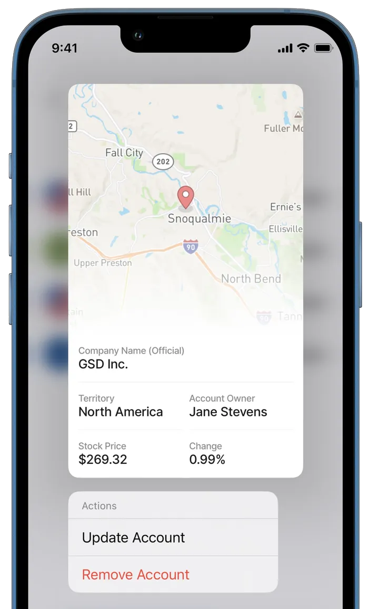

---
layout:
  width: wide
  title:
    visible: true
  description:
    visible: true
  tableOfContents:
    visible: true
  outline:
    visible: true
  pagination:
    visible: true
  metadata:
    visible: true
---

# Preview



Add a preview for the following [Components](../components/):

* [widgets](../Widgets/Widgets.md)
* [list-item](../Components/list/list-item.md)
* [event](../Components/event.md) The preview is triggered by _long-pressing_ the widget or item. The _long-press_ action can be used on:

1. Widgets
2. List-items on widget
3. onPress action on list-item or event.



<figure><figcaption>
Preview
</figcaption></figure>



## Configuration options

<table><thead><tr><th width="130.8828125">Core structure</th><th></th></tr></thead><tbody><tr><td><code>actions</code></td><td>These can be added to the preview: <a href="https://docs.jigx.com/examples/action-list">action-list</a> <a href="https://docs.jigx.com/examples/execute-entities">execute-entities</a> <a href="https://docs.jigx.com/examples/execute-entity">execute-entity</a> <a href="https://docs.jigx.com/examples/go-to">go-to</a> <a href="https://docs.jigx.com/examples/open-url">open-url</a> <a href="https://docs.jigx.com/examples/reset-state">reset-state</a> <a href="https://docs.jigx.com/examples/set-state">set-state</a> <a href="https://docs.jigx.com/examples/sync-entities">sync-entities</a> <a href="https://docs.jigx.com/examples/confirm">confirm</a></td></tr><tr><td><code>children</code></td><td>Two components available to use in a preview mode:</td></tr><tr><td><code>header</code></td><td>The is can be part of the displayed preview.</td></tr><tr><td><code>isCompact</code></td><td>When set to <code>true</code> the size of the preview will be adjusted to its content.</td></tr></tbody></table>


1. Currently issues could be experienced when displaying the header's `title` and `subtitle` in the preview.
2. Using the `action.go-to` within an action [action-list](broken-reference) does not trigger the preview popup.

