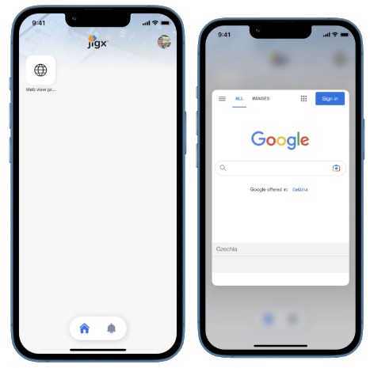
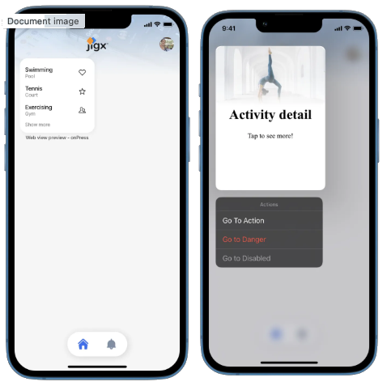
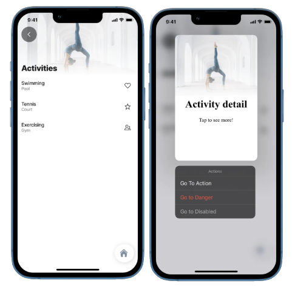

# Web-view

The web-view component allows the user to use an URL or pass raw HTML as the preview content.

## Examples and code snippets

### Long-press on a widget



This example displays a preview after long-pressing the widget.

See the full example on [GitHub](%22https:/github.com/jigx-com/jigx-samples/blob/main/quickstart/jigx-samples/jigs/preview/web-view/web-longpress-widget.jigx).



<figure><figcaption></figcaption></figure>





```yaml
preview:
  isCompact: false
  children:
    - type: component.web-view
      options:
        uri: https://www.google.com
        isTrackingTransparencyRequired: true
        height: 500
```



```yaml
children:
  - type: component.grid
    options: 
      children:
        - type: component.grid-item
          options:
            size: "1x1"
            children: 
              type: component.jig-widget
              options:
                jigId: long-press-on-widget
```



### Long-press - onPress action



<figure><figcaption></figcaption></figure>



<figure><figcaption></figcaption></figure>



This example displays a preview after long-pressing the list-item on the widget.

This example displays a preview after long-pressing the list-item in the jig. It includes the web-view component as well as the go-to actions.

As you can see in the code snippet, the original list doesn't include the preview. Our `onPress` action allows us to use the preview that is included in the detail jig.

See the full example of [web-longpress-onpress](https://github.com/jigx-com/jigx-samples/blob/main/quickstart/jigx-samples/jigs/preview/web-view/web-longpress-onPress.jigx) and [web-detail](https://github.com/jigx-com/jigx-samples/blob/main/quickstart/jigx-samples/jigs/preview/web-view/web-detail.jigx) on GitHub.



```yaml
title: Web view preview - onPress
type: jig.list
icon: world

header: 
  type: component.jig-header
  options:
    height: small
    children: 
      type: component.image
      options:
        title: Activities
        source:
          uri: https://images.unsplash.com/photo-1603988363607-e1e4a66962c6?ixlib=rb-4.0.3&ixid=MnwxMjA3fDB8MHxzZWFyY2h8Njl8fHNwb3J0fGVufDB8fDB8fA%3D%3D&auto=format&fit=crop&w=900&q=60

datasources:
  activities: 
    type: datasource.static
    options:
      data:
        - id: 1
          name: Swimming
          location: Pool
          previewDetail: 7pm
          image: love-it
        - id: 2
          name: Tennis
          location: Court
          previewDetail: 6am
          image: rating-star
        - id: 3
          name: Exercising
          location: Gym
          previewDetail: 5pm
          image: multiple-neutral-2
data: =@ctx.datasources.activities
item:
  type: component.list-item
  options:
    title: =@ctx.current.item.name
    subtitle: =@ctx.current.item.location  
    rightElement: 
      element: icon
      icon: =@ctx.current.item.image
    onPress: 
      type: action.go-to
      options:
        linkTo: web-detail
        parameters:
          id: =@ctx.current.item.id
          name: =@ctx.current.item.name
          location: =@ctx.current.item.location
          previewDetail: =@ctx.current.item.previewDetail
```



```yaml
title: Activity detail
type: jig.default

header: 
  type: component.jig-header
  options:
    height: small
    children: 
      type: component.image
      options:
        title: =@ctx.jig.inputs.name
        source:
          uri: https://images.unsplash.com/photo-1603988363607-e1e4a66962c6?ixlib=rb-4.0.3&ixid=MnwxMjA3fDB8MHxzZWFyY2h8Njl8fHNwb3J0fGVufDB8fDB8fA%3D%3D&auto=format&fit=crop&w=900&q=60

children:
    - type: component.entity
      options:
        isCompact: true
        children:
          - type: component.entity-field
            options:
              label: Activity
              value: =@ctx.jig.inputs.name
              
          - type: component.entity-field
            options:
              label: Location
              value: =@ctx.jig.inputs.location
          - type: component.entity-field
            options:
              label: Time
              value: =@ctx.jig.inputs.previewDetail
              
preview:
  isCompact: true
  actions:
   - children:
        - type: action.go-to
          options:
            title: Go To Action
            linkTo: placeholder
        - type: action.go-to
          options:
            title: Go to Danger
            linkTo: placeholder
            style:
              isDanger: true
        - type: action.go-to
          options:
            title: Go to Disabled
            linkTo: placeholder
            style:
              isDisabled: true


  children:
    - type: component.web-view
      options:
        isTrackingTransparencyRequired: true
        content: |
          <html>
              <head>
                <meta name="viewport" content="width=device-width, initial-scale=1">
              </head>
              <body style="margin: 0; text-align: center;">
                <h1 style="text-align: center;"> Activity detail</h1>
                <p style="text-align: center;">Tap to see more!</p>
              </body>
            </html>
          
  header: 
    type: component.jig-header
    options:
      height: medium
      children: 
        type: component.image
        options:
          title: =@ctx.jig.inputs.name
          subtitle: =@ctx.jig.inputs.location
          source:
            uri: https://images.unsplash.com/photo-1603988363607-e1e4a66962c6?ixlib=rb-4.0.3&ixid=MnwxMjA3fDB8MHxzZWFyY2h8Njl8fHNwb3J0fGVufDB8fDB8fA%3D%3D&auto=format&fit=crop&w=900&q=6
```


