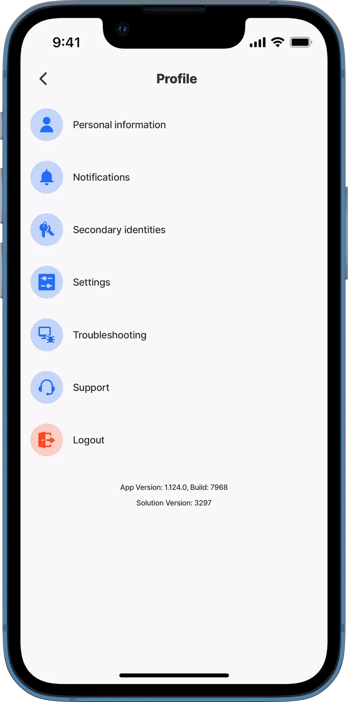
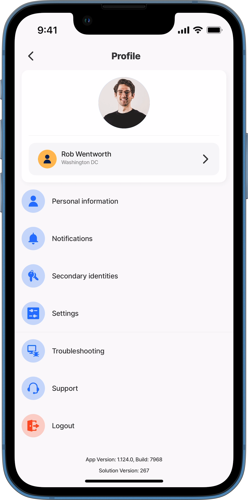
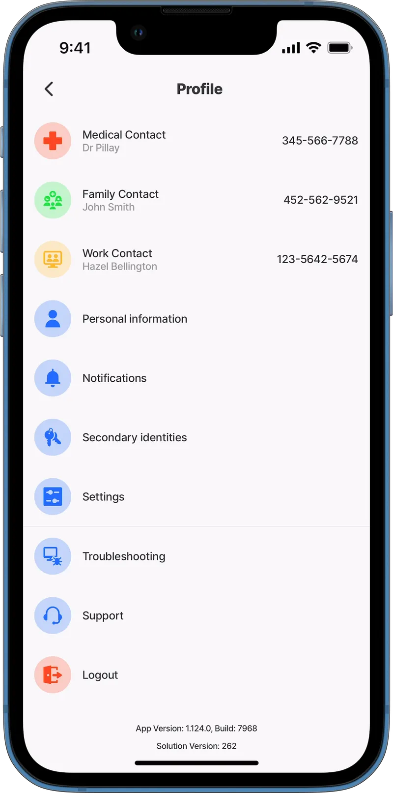
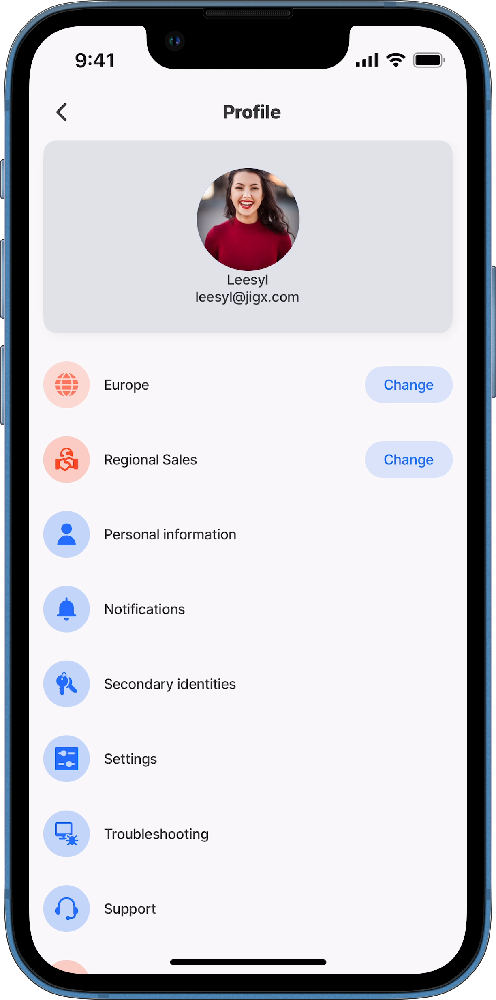

# User Profile



The Jigx **User Profile** is the in-app **Profile screen** for each logged-in user. It includes menu items like Personal information, Notifications, and Settings. You can customize what users see and add your own profile content.



<figure><figcaption><p>Default Profile screen</p></figcaption></figure>



**On this page**

* Default Profile screen menu options
* Update profile details with [`action.update-profile`](Actions/update-profile.md)
* Customize the Profile screen using `index.jigx` (`profile` property)

### Default Jigx Profile screen menu options

<table data-header-hidden><thead><tr><th width="202.0546875"></th><th></th></tr></thead><tbody><tr><td>Personal information</td><td>Includes the logged-in user's name, email, avatar, and the option to delete the user account.</td></tr><tr><td>Notifications</td><td>Displays all notifications sent to the user, with options to mark all as read and filter by All, Read, or Unread.</td></tr><tr><td>Secondary identities</td><td>Refers to additional authentication methods required beyond primary login credentials, such as OAuth. Users can connect, refresh, or remove an identity.</td></tr><tr><td>Settings</td><td>Includes app settings such as color theme (light/dark mode), language selection, and region changes, if applicable.</td></tr><tr><td>Troubleshooting</td><td>Provides logging settings to help debug and troubleshoot app issues.</td></tr><tr><td>Support</td><td>Lets users contact support with a question. This setting can be hidden via a flag in the build configuration.</td></tr><tr><td>Logout</td><td>Allows the currently logged-in user to log out of the app.</td></tr></tbody></table>

### Update profile details with action.update-profile

You can allow users to update specific profile information using [action.update-profile](Actions/update-profile.md).

You can configure this action in a jig in a few ways:

* An action button
* A header action link or icon
* An event handler, for example `onPress`

The following information can be updated when using the action:

* `firstName`
* `lastName`
* `displayName`
* `avatarUrl`



```yaml
# Add an action to a jig to create a button that updates the user's profile.
actions:
  - children:
      # Select the update-profile action and set the properties to update. 
      - type: action.update-profile
        options: 
          firstName: =@ctx.components.firstName.state.value
          lastName: =@ctx.components.lastName.state.value
          displayName: =@ctx.components.displayName.state.value
          avatarUrl: =@ctx.components.userAvatar.state.value
          style:
            # Style the button color to the defined branded secondary color. 
           isSecondary: true
           # Give the button a name.
          title: Update
```



```yaml
header:
  type: component.jig-header
  options:
    height: medium
    children:
      type: component.image
      options:
        source:
          uri: https://builder.jigx.com/assets/images/header.jpg
    # Add an action to the jig-header to provide a link for updating profile details.     
    actions:
     # Choose the update-profile action and set the properties to update. 
      - type: action.update-profile
        options: 
          title: User update
          firstName: =@ctx.components.firstName.state.value
          lastName: =@ctx.components.lastName.state.value
          displayName: =@ctx.components.displayName.state.value
          avatarUrl: =@ctx.components.userAvatar.state.value
```



```yaml
children:
  - type: component.list-item
    options:
      title: Contractor
      subtitle: Today's contractor on site
      # Add a button to the right of the field.
      rightElement: 
        element: button
        title: Update
        # Add the action to the onPress event on the button element,
        # that the user taps to update their profile details.
        onPress: 
          # Select the update-profile action & configure the properties to update. 
          type: action.update-profile
          options:
            firstName: =@ctx.components.firstName.state.value
            lastName: =@ctx.components.lastName.state.value
            displayName: =@ctx.components.displayName.state.value
            avatarUrl: =@ctx.components.userAvatar.state.value
```



### Customize and extend the Jigx Profile screen

You can extend the Profile screen by adding [components](components/) that display additional user information.

You do this by referencing one or more jigs in `index.jigx` under the `profile` property:

1. Define a jig containing the components you want to display on the Profile screen.
2. Set the `jigId` in the `profile` property within the index.jigx file.


You can create a jig as the first screen a new user sees when they log in to the app. Use it to capture their details. This updates the Profile screen. You can then add conditions so it does not appear again.


This is especially useful in scenarios where devices are shared among multiple employees, such as contractors or engineers.

<table><thead><tr><th width="279.625">Properties</th><th>Description</th></tr></thead><tbody><tr><td><code>Profile</code></td><td>Adding this property (and its values) to the <code>index.jigx</code> file inserts the referenced jigs into the header section of the Profile screen.</td></tr><tr><td><code>isPersonalInfoMenuItemVisible</code></td><td>Determines whether the Personal Information menu is hidden (<code>false</code>) or visible (<code>true</code>). The default is <code>true</code>. This menu opens a screen showing the user's name, email, and avatar. It also provides an option to delete the account. When you customize the Profile screen, you can integrate this information directly. This removes the need for a separate menu option.</td></tr><tr><td><code>jigId</code></td><td>Provides the <code>jigId</code> for the jigs displayed on the Profile screen.</td></tr></tbody></table>

### Considerations

* No additional padding is added to the jigs. This may affect the screen UI. Use properties like `background` or `padding` to keep content aligned. This is most noticeable with `list-item` components versus custom components.
* When combining custom and standard components, add `padding` and `margins` manually for consistent spacing and layout.

### Examples and code snippets

#### Extended Profile screen with hidden personal information menu



<figure><figcaption><p>Extended Profile</p></figcaption></figure>



In this example, the Profile screen is extended to display the user's **avatar** along with their details in an expander component. Additionally, the personal information menu option is hidden from the list.





```yaml
title: profile
type: jig.default
# Add the components to display in the profile screen.
children:
  # Configure the components in a card to create a container for the information.
  - type: component.card
    options:
      children:
        # Add the user's avatar.
        - type: component.avatar
          options:
            align: center
            size: large
            title: =@ctx.user.avatarUrl
            uri: https://images.unsplash.com/photo-1633332755192-727a05c4013d?w=500&auto=format&fit=crop&q=60&ixlib=rb-4.0.3&ixid=M3wxMjA3fDB8MHxzZWFyY2h8MTF8fG1hbiUyMGF2YXRhcnxlbnwwfHwwfHx8MA%3D%3D
        # Add the user's details in the expander component. 
        - type: component.expander
          options:
            header:
              centerElement: 
                type: component.titles
                options:
                  title: Rob Wentworth
                  subtitle: Washington DC
                  icon: person
                  iconColor: color7
                  align: left
            children:
              - type: component.entity
                options:
                  children:
                    - type: component.field-row
                      options:
                        children:
                          - type: component.entity-field
                            options:
                              label: Phone
                              value: "3249432812"
                          - type: component.entity-field
                            options:
                              label: Email
                              value: rob@first.com
                    - type: component.entity-field
                      options:
                        label: Address
                        value: 141 Harbor Dr Claymont, Delaware(DE), 19703
```



```yaml
name: jigx-demo-2025
title: jigx-demo-2025
category: analytics

tabs:
  home:
    label: Home 
    jigId: home-solution
    icon: home-apps-logo
  Work: 
    jigId: time-log
    icon: hourglass-alternate
# Configure display options for profile section.       
profile:
# Hide the personal information menu in the list.
  isPersonalInfoMenuItemVisible: false
  children:
    # Add the jig configured with the avatar & expander to display in the profile screen.
    - type: component.jig
      options:
        jigId: user-detail
```



#### Extended Profile screen with list



This example demonstrates how to add a `list` of emergency contacts to a jig, which is referenced in the index.jigx file to extend the Profile screen.



<figure><figcaption><p>Profile extended with list</p></figcaption></figure>





```yaml
title: Emergency contact list
type: jig.default
# Create a list of emergency contacts to show in the profile screen.         
children:
  - type: component.list
    options:
      data: =@ctx.datasources.emergency 
      item: 
        type: component.list-item
        options:
          title: =@ctx.current.item.category
          subtitle: =@ctx.current.item.name
          leftElement: 
            element: icon
            icon: =@ctx.current.item.icon
            isContained: true
            color: =@ctx.current.item.color
          rightElement: 
            element: value
            text: =@ctx.current.item.contact
```



```yaml
name: jigx-demo-2025
title: jigx-demo-2025
category: analytics

tabs:
  home:
    label: Home
    jigId: work-day
    icon: home-apps-logo
# Configure display options for profile section.       
profile:
  # Include the personal information menu in the list. 
  isPersonalInfoMenuItemVisible: true
  children:
    # Add the jig configured with the list to display in the profile screen.
    - type: component.jig
      options:
        jigId: emergency-list
```



```yaml
datasources:
  emergency: 
    type: datasource.static
    options:
      data:
        - id: 1
          category: Medical Contact
          name: Dr Pillay 
          details: Shellfish allergy 
          contact: 345-566-7788
          icon: medical-cross
          color: negative
        - id: 2
          category: Family Contact 
          name: John Smith 
          details: Husband 
          contact: 452-562-9521
          icon: family-add-new-member
          color: positive        
        - id: 3
          category: Work Contact 
          name: Hazel Bellington
          details: Manager
          contact: 123-5642-5674
          icon: work-from-home-computer-meeting
          color: warning   
```



#### Extended Profile screen using custom components (alpha)



<figure><figcaption><p>Custom Profile</p></figcaption></figure>



In this example, the Profile screen has been extended to display the user's `avatar`, name, and email address using a custom component to create the required UI layout. This custom component is placed within a `card` in the user-profile jig. A standard `list` component is configured to display the region and department.

The list component allows users to update their department and region by configuring a `rightElement` with an `onPress` event.





```yaml
# Configure a custom component to control the layout for the avatar and text.
# Add padding and alignment of item.
type: component.default
children:
  - type: component.view
    options:
      style:
        background:
          color: color14
        alignItems: center 
        padding: medium
      children:
        - type: component.avatar
          options:
            size: large
            title: Avatar
            uri: =@ctx.user.avatarUrl
        - type: component.text
          options:
            value: =@ctx.user.displayName
        - type: component.text
          options:
            value: =@ctx.user.email
```



```yaml
title: User details
type: jig.default

children:
# Add the components in a colored card. 
  - type: component.card
    options:
      color: color14
      children:
        # Use the custom component to display the user avatar and text.
        - type: component.custom-component
          componentId: user-data
  # Use a standard list component to add additional user information.  
  - type: component.list
          options:
            data: =@ctx.datasources.department   
            item: 
              type: component.list-item
              options:
                title: =@ctx.current.item.name
                # Add a left element for styling.
                leftElement: 
                  element: icon
                  icon: =@ctx.current.item.icon
                  isContained: true
                  color: =@ctx.current.item.color
                # Add a right element to execute an action for updating the details. 
                rightElement: 
                  element: button
                  title: Change
                  onPress: 
                    type: action.go-to
                    options:
                      linkTo: action-update-profile      
```



```yaml
name: jigx-demo-2025
title: jigx-demo-2025
category: analytics

tabs:
  home:
    label: Home 
    jigId: home-solution
    icon: home-apps-logo
  Work: 
    jigId: time-log
    icon: hourglass-alternate
# Configure display options for profile section.       
profile:
# Make the personal information menu visible in the list.
  isPersonalInfoMenuItemVisible: true
  children:
    # Add the jig with components and data for display in the profile screen.
    - type: component.jig
      options:
        jigId: user-profile
```



```yaml
datasources:
  department: 
    type: datasource.static
    options:
      data:
        - id: 1
          name: Europe
          icon: world
          color: color4
        - id: 2
          name: Regional Sales 
          icon: global-collaboration-handshake
          color: negative
```


