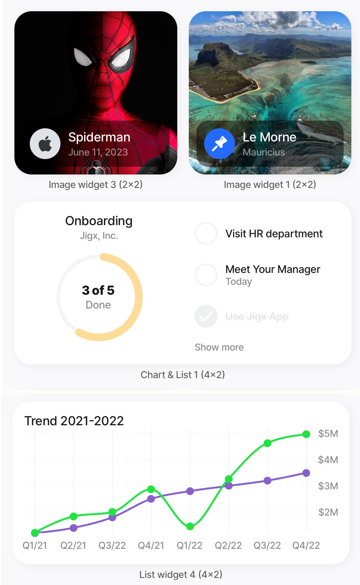

---
layout:
  width: wide
  title:
    visible: true
  description:
    visible: true
  tableOfContents:
    visible: true
  outline:
    visible: true
  pagination:
    visible: true
  metadata:
    visible: true
---

# Content widget components



<figure><figcaption>
Content widgets components
</figcaption></figure>



Extend the content surfaced on widgets further by using content widget components to overlay titles, group widgets into one and show trends. Add an `onPress` event to add an action directly on the widget, such as open a url.



<table><thead><tr><th width="147.6484375">Properties</th><th>Description</th></tr></thead><tbody><tr><td><a href="Content widget components/group.md">group</a></td><td>Combine widgets to display as one widget.</td></tr><tr><td><a href="Content widget components/titles.md">titles</a></td><td>Displays a title, subtitle, comment, or any type of text content on the surface of the widget.</td></tr><tr><td><a href="Content widget components/trend.md">trend</a></td><td>Display an increase/decrease over a period. The increment/decrement number can be formatted as a percentage, currency, or plain value.</td></tr><tr><td><a href="Content widget components/onPress.md">onPress</a></td><td>The onPress event adds an action directly on the widget. This is particularly helpful in scenarios where you do not want to open a jig to perform an action.</td></tr></tbody></table>
