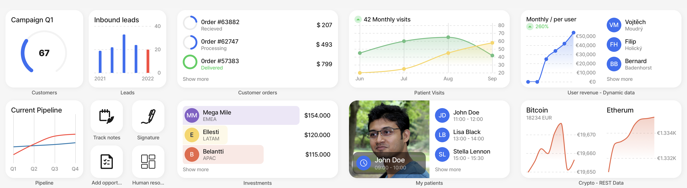

# Widgets

Refer to the [Widgets](https://docs.jigx.com/widgets) topic to understand how to use widgets on the Home Hub and in jigs, how to change the content and order of widgets. The topics in this section provide code examples for each widget content type.

<figure><figcaption>
Widget preview
</figcaption></figure>

<table><thead><tr><th width="164.78125">Widget content</th><th>Description</th></tr></thead><tbody><tr><td><a href="Content widget components.md">Widget content</a></td><td>Components that can be added to widgets, such as titles or grouping widgets into one widget.</td></tr><tr><td><a href="broken-reference">actions (buttons)</a></td><td>Configure a button with an action that executes.</td></tr><tr><td><a href="avatar.md">avatar</a></td><td>Display an avatar on the widget.</td></tr><tr><td><a href="chart.md">chart</a></td><td>Configure a bar, line or pie chart to display on the widget.</td></tr><tr><td><a href="https://docs.jigx.com/jigx-icons">icons</a></td><td>Choose an icon from thousands of available icons.</td></tr><tr><td><a href="image.md">image</a></td><td>Configure an image to display on the widget, consider the <code>size:</code> of the widget to ensure the image displays as expected , 1x1 is not suitable for most images.</td></tr><tr><td><a href="list.md">list</a></td><td>Display a list of data in the widget with additional left and right elements if required.</td></tr><tr><td><a href="location.md">location</a></td><td>Show a location in a map on the widget with markers.</td></tr><tr><td><a href="status.md">status</a></td><td>Configure a visual representation of a status, such as goal status, or sales quarterly status.</td></tr><tr><td><a href="value.md">value</a></td><td>Show values and amounts on the widget, such as sales targets or the number of orders to date.</td></tr></tbody></table>
