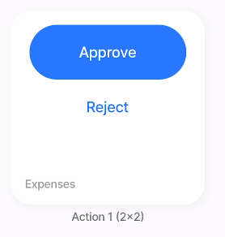
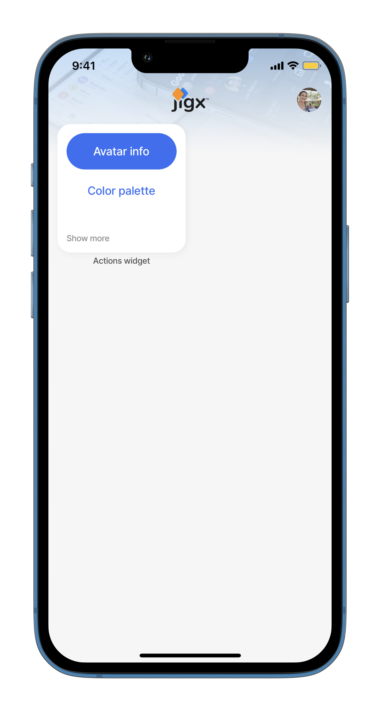

# actions (buttons)



This widget allows you to add primary and/or secondary actions (buttons) to a widget. This is a quick way for users to perform actions without needing to access a jig through the widget first.

* Any of the actions that are available in the [Actions](../Actions.md) section can be configured on the widget.
* This widget can be configured in a [group](<Content widget components/group.md>) widget, which allows you to group the actions with other widget types.



<figure><figcaption><p>Action widget</p></figcaption></figure>



## Configuration options

<table><thead><tr><th width="146.9140625">Core structure</th><th></th></tr></thead><tbody><tr><td><code>onPress</code></td><td>Configure the action to be executed when the action button is pressed.</td></tr><tr><td><code>title</code></td><td>Display the text content for the title.</td></tr></tbody></table>

<table><thead><tr><th width="152.109375">Other options</th><th></th></tr></thead><tbody><tr><td><code>footer</code></td><td>Add text to the footer of the widget.</td></tr><tr><td><code>footerAlign</code></td><td>Align the footer text to <code>left</code>, <code>right</code>, <code>center</code>.</td></tr><tr><td><code>placeholders</code></td><td>Specify a placeholder text to display if there is no data, for example - <code>title: No data to display</code>.</td></tr><tr><td><code>primary</code></td><td>Configure a <code>title</code> and onPress properties for a primary action button.</td></tr><tr><td><code>secondary</code></td><td>Configure a <code>title</code> and <code>onPress</code> properties for a secondary action button.</td></tr></tbody></table>

## Examples and code snippets

## Example of actions widget



<figure><figcaption><p>Actions widget</p></figcaption></figure>



Here is an example of the actions button on the widget level. When the primary button is pressed, an avatar is shown, and when the secondary button (white with blue text) is pressed, the color palette is shown.

**Examples**: See the complete example in [GitHub](https://github.com/jigx-com/jigx-samples/blob/main/quickstart/jigx-samples/jigs/widgets/action/actions.jigx).





```yaml
widgets:
  actions-2x2:
    type: widget.actions
    options:
      footer: Show more
      footerAlign: center
      primary:
        title: Avatar info
        onPress:
          type: action.go-to
          options:
            linkTo: avatar-field-example
      secondary:
        title: Color palette
        onPress:
          type: action.go-to
          options:
            linkTo: color-palete
```



```yaml
# Grid-item for the jig.
children:
  - type: component.grid-item
    options:
      size: "2x2"
      children: 
        type: component.jig-widget
        options:
          jigId: actions-widget
          widgetId: actions-2x2
```


