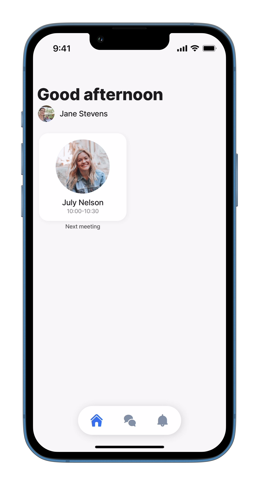

# avatar



The avatar widget can be used as a unique visual identifier, for example, to display a profile photo, company logo, initials, or flags. Additionally, text or a description can be added. The avatar can be used alone or combined with another widget inside a [widget/group](https://docs.jigx.com/examples/readme/widgets/content-widget-components/group).



<figure><figcaption><p>Avatar widgets</p></figcaption></figure>



## Configuration options

<table><thead><tr><th width="139.6328125">Core structure</th><th></th></tr></thead><tbody><tr><td><code>text</code></td><td>Display text content on the widget surface when the URI is empty, for example, initials.</td></tr></tbody></table>

<table><thead><tr><th width="138.93359375">Other options</th><th></th></tr></thead><tbody><tr><td><code>bottom</code></td><td>The component will be added to the bottom of the widget.</td></tr><tr><td><code>footer</code></td><td>Add text to the footer of the widget.</td></tr><tr><td><code>footerAlign</code></td><td>Align the footer text to <code>left</code>, <code>right</code>, <code>center</code>.</td></tr><tr><td><code>placeholders</code></td><td>Specify a placeholder text to display if there is no data, for example - <code>title: No data to display</code>.</td></tr><tr><td><code>top</code></td><td>The component will be added to the top of the widget.</td></tr><tr><td><code>uri</code></td><td><p>Provide the <code>uri</code> for the image. The following can be used:</p><ul><li>https//: <em>imagesource</em></li><li>image from a datasource referenced in an expression</li></ul></td></tr></tbody></table>

## Examples and code snippets

## Avatar widget example



<figure><figcaption><p>Avatar widget</p></figcaption></figure>



This is a simple example of using the avatar widget to show a quick overview of the next meeting.

**Examples**: See the complete example using static data in [GitHub](https://github.com/jigx-com/jigx-samples/blob/main/quickstart/jigx-samples/jigs/widgets/avatar/static-data/avatar-on-widget/avatar-on-widget.jigx). See the complete example using dynamic data in [GitHub](https://github.com/jigx-com/jigx-samples/blob/main/quickstart/jigx-samples/jigs/widgets/avatar/dynamic-data/avatar-on-widget/avatar-on-widget-dynamic.jigx).

**Datasources**: See the complete datasource for static data in [GitHub](https://github.com/jigx-com/jigx-samples/blob/main/quickstart/jigx-samples/datasources/examples/static-global.jigx). See the complete datasource for dynamic data in [GitHub](https://github.com/jigx-com/jigx-samples/blob/main/quickstart/jigx-samples/datasources/examples/dynamic-global.jigx).





```yaml
widgets:    
  avatar-widget:
    type: widget.avatar
    options:
      text: =$substring($substringBefore(@ctx.datasources.static-global.name, " "), 0, 1) & $substring($substringAfter(@ctx.datasources.static-global.name, " "), 0, 1)
      uri: =@ctx.datasources.static-global.picture
      bottom: 
        type: component.titles
        options:
          align: center
          title: =@ctx.datasources.static-global.name
          subtitle: =$fromMillis($toMillis(@ctx.datasources.static-global.date_from),'[H01]:[m01]') & '-' & $fromMillis($toMillis(@ctx.datasources.static-global.date_to),'[H01]:[m01]')
```



```yaml
widgets:    
  avatar-meeting:
    type: widget.avatar
    options:
      text: =$substring($substringBefore(@ctx.datasources.dynamic-global.name, " "), 0, 1) & $substring($substringAfter(@ctx.datasources.dynamic-global.name, " "), 0, 1)
      uri: =@ctx.datasources.dynamic-global.picture
      bottom: 
        type: component.titles
        options:
          align: center
          title: =@ctx.datasources.dynamic-global.name
          subtitle: =$fromMillis($toMillis(@ctx.datasources.dynamic-global.date-from),'[H01]:[m01]') & '-' & $fromMillis($toMillis(@ctx.datasources.dynamic-global.date-to),'[H01]:[m01]')

```



```yaml
# Grid-item for the static jig.
children:
  - type: component.grid-item
    options:
      size: "2x2"
      children: 
        type: component.jig-widget
        options:
          jigId: avatar-widget
          widgetId: avatar-widget
```



## Avatar widget with title



This is example shows the avatar widget using the `component.title` to add a name and icon to the widget.

**Examples**: See the complete example in [GitHub](https://github.com/jigx-com/jigx-samples/blob/main/quickstart/jigx-samples/jigs/widgets/2x2/avatar-2_2x2.jigx).



<figure><figcaption><p>Avatar widget with title</p></figcaption></figure>





```yaml
widgets:
  avatar2-2x2:
    type: widget.avatar
    options:
      text: MR
      uri: https://randomuser.me/api/portraits/men/20.jpg
      bottom:
        type: component.titles
        options:
          title: Marty Randolph
          subtitle: Product Design Lead
          align: center
          icon: calendar                  
```



```yaml
# Grid-item for the static jig.
children:
  - type: component.grid-item
    options:
      size: "2x2"
      children: 
        type: component.jig-widget
        options:
          jigId: avatar-2_2x2
          widgetId: avatar2-2x2
```



## Avatar widget/group with list



<figure><figcaption><p>Avatar in a group widget</p></figcaption></figure>



Here is the avatar widget associated with the list widget inside the group widget. The next patient is displayed as an avatar and the next three patients are on the list for a better overview.

**Examples**: See the complete example using static data in [GitHub](https://github.com/jigx-com/jigx-samples/blob/main/quickstart/jigx-samples/jigs/widgets/avatar/static-data/avatar-on-group-widget/avatar-on-group-widget.jigx) See the complete example using dynamic data in [GitHub](https://github.com/jigx-com/jigx-samples/blob/main/quickstart/jigx-samples/jigs/widgets/avatar/dynamic-data/avatar-on-group-widget/avatar-on-group-widget-dynamic.jigx)

**Datasources**: Full datasource for static data for [avatar widget](https://github.com/jigx-com/jigx-samples/blob/main/quickstart/jigx-samples/datasources/examples/static-global.jigx) and for the [list widget](https://github.com/jigx-com/jigx-samples/blob/main/quickstart/jigx-samples/datasources/examples/static-global-multiple.jigx) in GitHub. Full datasource for dynamic data for avatar [widget](https://github.com/jigx-com/jigx-samples/blob/main/quickstart/jigx-samples/datasources/employees/employees-dynamic.jigx) and for the [list widget](https://github.com/jigx-com/jigx-samples/blob/main/quickstart/jigx-samples/datasources/employees/employees-dynamic.jigx) in GitHub.





```yaml
widgets:
  patientStatic-4x2:
    type: widget.group
    options:
      children:
        - type: widget.avatar
          options:
            text: =$substring($substringBefore(@ctx.datasources.static-global.name, " "), 0, 1) & $substring($substringAfter(@ctx.datasources.static-global.name, " "), 0, 1)
            uri: =@ctx.datasources.static-global.picture
        - type: widget.list
          options:
            data: =@ctx.datasources.static-global-multiple
            item:
              type: component.list-item
              options:
                title: =@ctx.current.item.name
                subtitle: =$fromMillis($toMillis(@ctx.current.item.date_from),'[H01]:[m01]') & '-' & $fromMillis($toMillis(@ctx.current.item.date_to),'[H01]:[m01]')
                leftElement:
                  element: avatar
                  text: =$substring($substringBefore(@ctx.current.item.name, " "), 0, 1) & $substring($substringAfter(@ctx.current.item.name, " "), 0, 1)
                  uri: =@ctx.current.item.picture
```



```yaml
widgets:
  patientDD-4x2:
    type: widget.group
    options:
      children:
        - type: widget.avatar
          options:
            text: =$substring($substringBefore(@ctx.datasources.dynamic-global.name, " "), 0, 1) & $substring($substringAfter(@ctx.datasources.dynamic-global.name, " "), 0, 1)
            uri: =@ctx.datasources.dynamic-global.picture
        - type: widget.list
          options:
            data: =@ctx.datasources.employees-dynamic
            item:
              type: component.list-item
              options:
                title: =@ctx.current.item.firstname & ' ' & @ctx.current.item.lastname
                subtitle: =$fromMillis($toMillis(@ctx.current.item.date_from),'[H01]:[m01]') & '-' & $fromMillis($toMillis(@ctx.current.item.date_to),'[H01]:[m01]')
                leftElement:
                  element: avatar
                  text: =$substring(@ctx.current.item.firstname, 0, 1) & =$substring(@ctx.current.item.lastname, 0, 1)
                  uri: =@ctx.current.item.photo
```



```yaml
# Grid-item for the static jig.
children:
  - type: component.grid-item
    options:
      size: "2x2"
      children: 
        type: component.jig-widget
        options:
          jigId: avatar-group
          widgetId: patientStatic-4x2
```



## Avatar widget/group with title and list



In this example the avatar widget is combined with the list widget inside the group widget. The avatar widget has a `component.title` configured at the `top` to show a time and `bottom` to add a `title` and `subtitle` to the avatar widget.

**Examples**: See the complete example in [GitHub](https://github.com/jigx-com/jigx-samples/blob/main/quickstart/jigx-samples/jigs/widgets/4x4/combined-avatar-list-1_4x4.jigx).



<figure><figcaption><p>Avatar widget in group widget</p></figcaption></figure>





```yaml
widgets:
  combined-avatar-list1-4x4: 
    type: widget.group
    options:
      children:            
        - type: widget.avatar
          options:
            text: LS
            uri: https://i.pravatar.cc/400?img=59
            bottom:
              type: component.titles
              options:
                align: center
                title: Leo Siphron
                subtitle: Inter B

            top:
              type: component.titles
              options:
                icon: time-clock-circle
                iconColor: negative
                align: center
                title: 08:30 - 19:00
                subtitle: Today
                style:
                  isNegative: true
                
        - type: widget.list
          options:
            data: =@ctx.datasources.components
            item: 
              type: component.list-item
              options:
                title:  =@ctx.current.item.name
                subtitle: =@ctx.current.item.subtitle
                leftElement: 
                  element: avatar
                  text: =@ctx.current.item.avatar-text
                  uri: =@ctx.current.item.avatar-uri                
```



```yaml
datasources:
  components:
    type: datasource.static
    options:
      data:
        - name: John Smith
          subtitle: 09:00 - 10:00
          from: 01/10/2024 09:00
          to: 01/10/2022 10:00
          avatar-text: JS
          avatar-uri:  https://images.unsplash.com/photo-1645378999496-33c8c2afe38d?q=80&w=2970&auto=format&fit=crop&ixlib=rb-4.0.3&ixid=M3wxMjA3fDB8MHxwaG90by1wYWdlfHx8fGVufDB8fHx8fA%3D%3D   
        
        - name: Laurenz Amram
          subtitle: 12:30 - 14:00
          from: 01/10/2024 12:30
          to: 14:00
          avatar-text: LA
          avatar-uri: https://i.pravatar.cc/400?img=45
        
        - name: Ladislao Børge
          subtitle: 16:00 - 17:00
          from: 01/10/2024 16:00
          to: 01/10/2022 17:00
          avatar-text: LB
          avatar-uri: 
```



```yaml
# Grid-item for the jig.
children:
  - type: component.grid-item
    options:
      size: "2x2"
      children: 
        type: component.jig-widget
        options:
          jigId: combined-avatar-list-1_4x4
          widgetId: combined-avatar-list1-4x4
```


