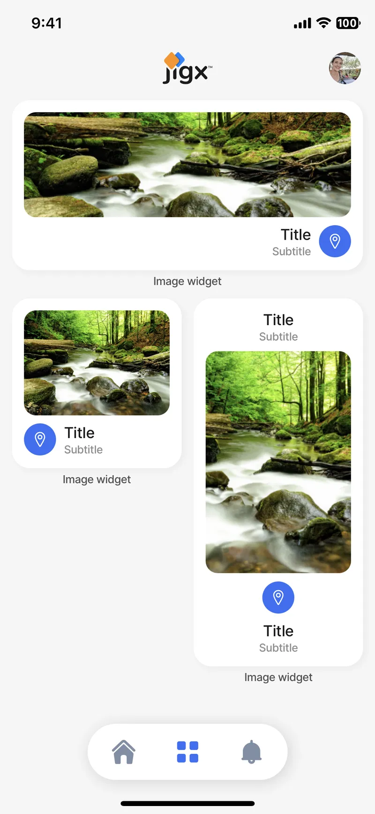
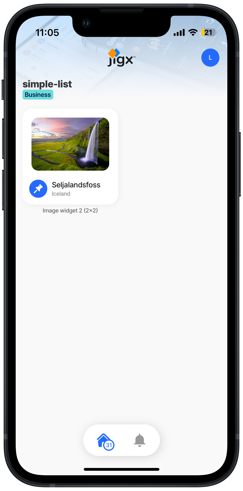
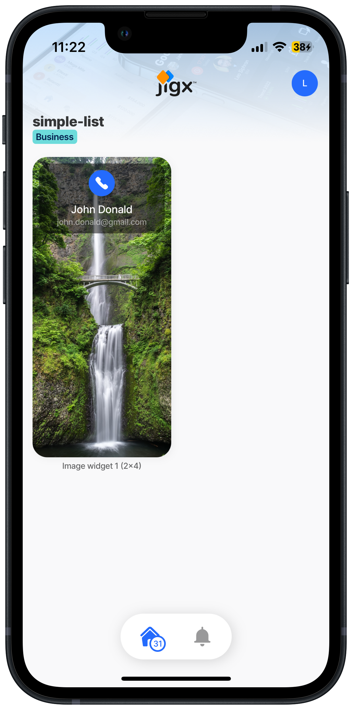
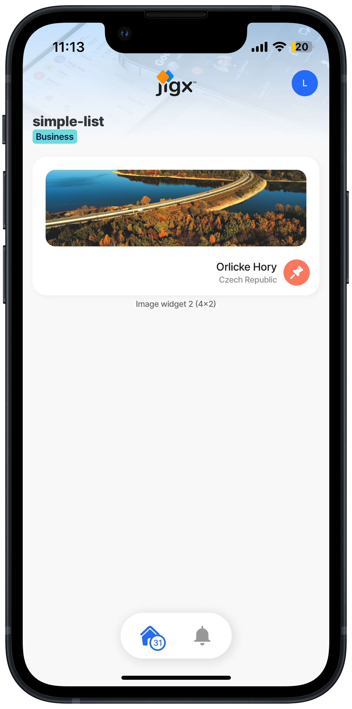
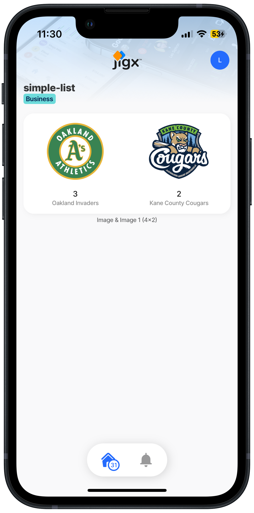
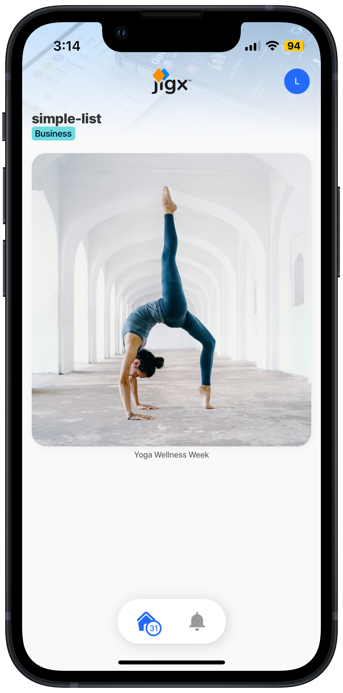

# image



The image widget is set up primarily for displaying an image on the Home Hub or jig.



<figure><figcaption><p>Image widgets with title component</p></figcaption></figure>




The images can be preloaded and cached using the asset folder's _images_ file. The images will be displayed even when you are offline. For more details, refer to [Assets](https://docs.jigx.com/assets).


## Configuration options

<table><thead><tr><th width="170.40625">Core structure</th><th></th></tr></thead><tbody><tr><td><code>source</code></td><td>For the URL of the image. The following can be used: - https//: <em>imagesource</em> - image from a datasource referenced in an expression The image source (either a remote URL or a local file resource).This property can contain several remote URLs, specified together with their <code>width</code> and <code>height</code> and <code>scale</code>.The native side will then choose the best uri to display based on the measured size of the image container. A <code>cache</code> property can be added to control how network requests interact with the local cache. Supported formats are png, jpg, jpeg, bmp, gif, webp (Android only), psd (iOS only).</td></tr></tbody></table>

<table><thead><tr><th width="175.44921875">Other options</th><th></th></tr></thead><tbody><tr><td><code>bottom</code></td><td>The component will be added to the bottom of the widget.</td></tr><tr><td><code>footer</code></td><td>Add text to the footer of the widget.</td></tr><tr><td><code>footerAlign</code></td><td>Align the footer text to <code>left</code>, <code>right</code>, <code>center</code>.</td></tr><tr><td><code>height</code></td><td>Change constraints of an image's height. Use a proper <code>resizeMode</code> to achieve the best results in all different device resolutions.</td></tr><tr><td><code>isContentOverlaid</code></td><td>Specify if the component and description should overlay the image or placed above/ below the image. Use <code>true</code> for overlay, <code>false</code> for above or below.</td></tr><tr><td><code>placeholders</code></td><td>Specify a placeholder text to display if there is no data, for example - <code>title: No data to display</code>.</td></tr><tr><td><code>resizeMode</code></td><td><p>Determines how to resize the image when the frame doesn't match the raw image dimensions.</p><ul><li><code>cover:</code> Scale the image uniformly (maintain the image's aspect ratio)so that both dimensions (width and height) of the image will be equal to or larger than the corresponding dimension of the view (minus padding).</li><li><code>contain:</code> Scale the image uniformly (maintain the image's aspect ratio) so that both dimensions (width and height) of the image will be equal to or less than the corresponding dimension of the view (minus padding).</li><li><code>stretch:</code> Scale width and height independently, This may change the aspect ratio of the source.</li><li><code>center:</code> Scale the image down so that it is completely visible, if bigger than the area of the view. The image will not be scaled up.</li></ul></td></tr><tr><td><code>top</code></td><td>The component will be added to the top of the widget.</td></tr></tbody></table>

## Examples and code snippets

## Image widget 2x2



<figure><figcaption><p>Image widget</p></figcaption></figure>



An `image` widget using 2x2 size with `component.titles` at the `bottom` to add a name of the image and an `icon`.

**Examples**: See the complete example using in [GitHub](https://github.com/jigx-com/jigx-samples/blob/main/quickstart/jigx-samples/jigs/widgets/2x2/image-2_2x2.jigx).





```yaml
widgets:
  image2-2x2:
    type: widget.image
    options:
      source:
        uri: https://images.unsplash.com/photo-1476610182048-b716b8518aae?ixlib=rb-4.0.3&ixid=MnwxMjA3fDB8MHxwaG90by1wYWdlfHx8fGVufDB8fHx8&auto=format&fit=crop&w=2159&q=80
      isContentOverlaid: false
      bottom:
        type: component.titles
        options:
          title: Seljalandsfoss
          subtitle: Iceland
          icon: pin
```



```yaml
# Grid-item for the jig.
children:
  - type: component.grid-item
    options:
      size: "2x2"
      children:
        type: component.jig-widget
        options:
          jigId: image-2_2x2
          widgetId: image2-2x2
```



## Image widget 2x4



An `image` widget using 2x4 size with `component.titles` at the `top` to add a name `title` and email `subtitle` and an `icon`.

**Example:** See the complete example in [GitHub](https://github.com/jigx-com/jigx-samples/blob/main/quickstart/jigx-samples/jigs/widgets/2x4/image-1_2x4.jigx).



<figure><figcaption><p>Image widget 2x4</p></figcaption></figure>





```yaml
widgets:
  image1-2x4:
    type: widget.image
    options:
      source:
        uri: https://images.unsplash.com/photo-1433086966358-54859d0ed716?ixlib=rb-4.0.3&ixid=MnwxMjA3fDB8MHxwaG90by1wYWdlfHx8fGVufDB8fHx8&auto=format&fit=crop&w=987&q=80
      isContentOverlaid: true
      top:
        type: component.titles
        options:
          title: John Donald
          subtitle: john.donald@gmail.com
          icon: phone
          align: center
```



```yaml
# Grid-item for the jig.
children:
  - type: component.grid-item
    options:
      size: "2x2"
      children:
        type: component.jig-widget
        options:
          jigId: image-1_2x4
          widgetId: image1-2x4
```



## Image widget 4x2



<figure><figcaption><p>Image widget 4x2</p></figcaption></figure>



An `image` widget using 4x2 size with `component.titles` at the `bottom` to add a location `title` and an `icon` on the right.

**Example:** See the complete example in [GitHub](https://github.com/jigx-com/jigx-samples/blob/main/quickstart/jigx-samples/jigs/widgets/4x2/image-2_4x2.jigx).





```yaml
widgets:
  image2-4x2:
    type: widget.image
    options:
      source:
        uri: https://images.unsplash.com/photo-1585848705732-e938bf971da6?ixlib=rb-4.0.3&ixid=M3wxMjA3fDB8MHxwaG90by1wYWdlfHx8fGVufDB8fHx8fA%3D%3D&auto=format&fit=crop&w=1546&q=80
      isContentOverlaid: false
      bottom:
        type: component.titles
        options:
          title: Orlicke Hory
          subtitle: Czech Republic
          icon: pin
          align: right
          iconColor: color4
```



```yaml
# Grid-item for the jig.
children:
  - type: component.grid-item
    options:
      size: "2x2"
      children:
        type: component.jig-widget
        options:
          jigId: image-2_4x2
          widgetId: image2-4x2
```



## Image widget in group widget 4x2



<figure><figcaption><p>Group image widget 4x2</p></figcaption></figure>



In this example two `image` widgets are combined into one `group` with the `component.title` at the `bottom` to show the score and team names.

**Example:** See the complete example in [GitHub](https://github.com/jigx-com/jigx-samples/blob/main/quickstart/jigx-samples/jigs/widgets/4x2/combined-image-image-1_4x2.jigx).





```yaml
widgets:
  combined-image1-4x2:
    type: widget.group
    options:
      children:
        - type: widget.image
          options:
            isContentOverlaid: false
            source:
              uri: https://seeklogo.com/images/O/oakland-athletics-logo-2BAC84D00D-seeklogo.com.png
            resizeMode: contain
            bottom:
              type: component.titles
              options:
                title: "3"
                subtitle: "Oakland Invaders"
                align: center
        - type: widget.image
          options:
            isContentOverlaid: false
            source:
              uri: https://seeklogo.com/images/K/kane-county-cougars-logo-47AAB515C1-seeklogo.com.png
            resizeMode: contain
            bottom:
              type: component.titles
              options:
                title: "2"
                subtitle: "Kane County Cougars"
                align: center
```



```yaml
# Grid-item for the jig.
children:
  - type: component.grid-item
    options:
      size: "2x2"
      children:
        type: component.jig-widget
        options:
          jigId: combined-image-image-1_4x2
          widgetId: combined-image1-4x2
```



## Image widget in group widget 4x4



The 4x4 `image` widget in this example is a simple widget with just an image shown. This is great when you want to combine the widget in another jig.



<figure><figcaption><p>Image widget 4x4</p></figcaption></figure>





```yaml
widgets:
  imageWidget4x4:
    type: widget.image
    options:
      source:
        uri: https://images.unsplash.com/photo-1603988363607-e1e4a66962c6?q=80&w=1740&auto=format&fit=crop&ixlib=rb-4.0.3&ixid=M3wxMjA3fDB8MHxwaG90by1wYWdlfHx8fGVufDB8fHx8fA%3D%3D
```



```yaml
# Grid-item for the jig.
children:
  - type: component.grid-item
    options:
      size: "2x2"
      children:
        type: component.jig-widget
        options:
          jigId: image-widget 4x4
          widgetId: imageWidget4x4
```


