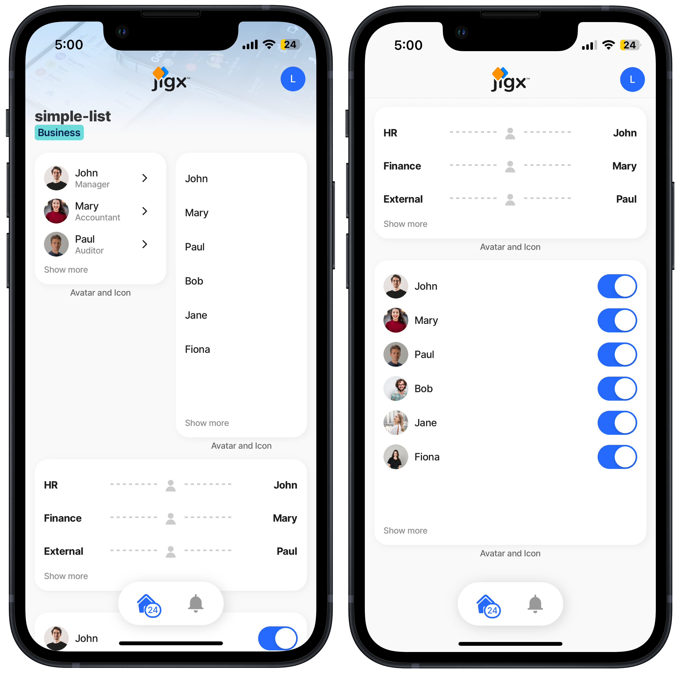

---
layout:
  width: wide
  title:
    visible: true
  description:
    visible: true
  tableOfContents:
    visible: true
  outline:
    visible: true
  pagination:
    visible: true
  metadata:
    visible: true
---

# list

Whenever a list jig is configured either in the [list](../Components/list/list.md) , or [list-item](../Components/list/list-item.md) component, the list is automatically populated on the surface of the widget without needing additional configuration. There is also the option to extend the list widget by using the `Extend List Widget` property, which reuses the list jig configuration and its data to extend or override some of the properties in the widget. The item data is called from `=@ctx.current.item.value`.

There are, instances when you want to create a list widget on a jig that is not a list jig, such as a `jig.default`. This is primarily where the list widget is used.

<figure><figcaption><p>List widgets</p></figcaption></figure>

## Configuration options

A list widget can be used on any type of jig, i.e. list, default, composite, calendar and document.

| **Core options** |                                                                                                                                                                      |
| ---------------- | -------------------------------------------------------------------------------------------------------------------------------------------------------------------- |
| `item`           | The `item` property includes the setup options of: [Product-item ](https://docs.jigx.com/examples/product-item)[List-item](https://docs.jigx.com/examples/list-item) |

| **Other options** |                                                                                                                                                                                                                                                                                                                                                                                                                                                                  |
| ----------------- | ---------------------------------------------------------------------------------------------------------------------------------------------------------------------------------------------------------------------------------------------------------------------------------------------------------------------------------------------------------------------------------------------------------------------------------------------------------------- |
| `badge`           | <p>Add a badge to the list widget to highlight critical information and capture the user's attention, ensuring key updates or notifications are easily noticeable within the app. The badge can be configured at the root level of the jig file:</p><ul><li>To display as a red dot using the <code>empty</code> value.</li><li>A red dot with a number using an expression to perform a count. For example, counting the number of tasks in the list.</li></ul> |
| `bottom`          | The component will be added to the bottom of the widget.                                                                                                                                                                                                                                                                                                                                                                                                         |
| `data`            | Provide the datasource for the list. For example: `data: =@ctx.datasources.tasklist`                                                                                                                                                                                                                                                                                                                                                                             |
| `footer`          | Add text to the footer of the widget.                                                                                                                                                                                                                                                                                                                                                                                                                            |
| `footerAlign`     | Align the footer text to `left`, `right`, `center`.                                                                                                                                                                                                                                                                                                                                                                                                              |
| `placeholders`    | Specify a placeholder text to display if there is no data, for example - `title: No data to display`.                                                                                                                                                                                                                                                                                                                                                            |
| `top`             | The component will be added to the top of the widget.                                                                                                                                                                                                                                                                                                                                                                                                            |

| **State Configuration**  | **Key**          | **Notes**                                                                                                                                                                        |
| ------------------------ | ---------------- | -------------------------------------------------------------------------------------------------------------------------------------------------------------------------------- |
| `=@ctx.current.state.`   | amount checked   | Applies to a list, list.item, product-item, and stage components. List's data is an array of records. The `=@ctx.current.state` is the state of the current object in the array. |
| `=@ctx.component.state.` | amount checked   | State is the variable of the component.                                                                                                                                          |
| `=@ctx.solution.state.`  | activeItemId now | Global state variable that can be used throughout the solution.                                                                                                                  |

## Configuration options for extended list widget

The `Extended List Widget` can only be used on a list jig . The purpose of using this widget is to customize what shows in the widget on the Home Hub rather than showing its automatic list display. The `Extended List Widget` must be configured with a size 2x2 or greater. Reuse the data in the list jig , for example, `=@ctx.datasources.users.title` or `=@ctx.current.item.value`.

| **Core options** |                                                                                                                                                                                                                                                                                                                                                                                                                                            |
| ---------------- | ------------------------------------------------------------------------------------------------------------------------------------------------------------------------------------------------------------------------------------------------------------------------------------------------------------------------------------------------------------------------------------------------------------------------------------------ |
| `item`           | <p>The <code>item</code> property includes the setup options of:</p><ul><li><a href="../Components/expander/expander.md">expander</a></li><li><a href="https://docs.jigx.com/examples/stage">Stage</a></li><li><a href="https://docs.jigx.com/examples/product-item">Product-item</a></li><li><a href="https://docs.jigx.com/examples/list-item">List-item</a></li><li><a href="../Components/charts/pie-chart.md">pie-chart</a></li></ul> |

## Examples and code snippets

## Automatic widget display because of list jig type (Simple)



<figure><figcaption><p>Automatic list widget</p></figcaption></figure>



When using a `jig.list` and any size widget larger than 1x1 the list will automatically be displayed without additional configurations. This is visible in this example.

In this example, the list on the widget is the same as the `jig.list` once the widget has been accessed.

**Examples**: See the complete example using static data in [GitHub](https://github.com/jigx-com/jigx-samples/blob/main/quickstart/jigx-samples/jigs/jigx-components/list-item/static-data/list-with-left-elements/list-with-left-checkbox-sd.jigx). See the complete example using dynamic data in [GitHub](list.md).

**Datasources**: See the complete datasource for static data in [GitHub](https://github.com/jigx-com/jigx-samples/blob/main/quickstart/jigx-samples/datasources/services/repair-services-static.jigx). See the complete datasource for dynamic data in [GitHub](https://github.com/jigx-com/jigx-samples/blob/main/quickstart/jigx-samples/datasources/services/cleaning-services-dynamic.jigx)





```yaml
data: =@ctx.datasources.repair-services-static
item:
  type: component.list-item
  options:
    title: =@ctx.current.item.service
    subtitle: =@ctx.current.item.description
```



```yaml
data: =@ctx.datasources.cleaning-services-dynamic
item:
  type: component.list-item
  options:
    title: =@ctx.current.item.service
    subtitle: =@ctx.current.item.area
```



```yaml
# Grid-item for the static jig.
children:
  - type: component.grid-item
    options:
      size: "2x2"
      children: 
        type: component.jig-widget
        options:
          jigId: list-widget
```



## Automatic widget display because of list jig type (UI elements)



<figure><figcaption></figcaption></figure>



When using a `jig.list` and any size widget larger than 1x1 the list will automatically be displayed without additional configurations.

In this example, the list on the widget is exactly the same as the `jig.list` once the widget has been accessed.

**Examples**: See the complete example using static data in [GitHub](https://github.com/jigx-com/jigx-samples/blob/main/quickstart/jigx-samples/jigs/components/list-item/static-data/list-with-left-elements/list-with-left-checkbox-sd.jigx). See the complete example using dynamic data in [GitHub](https://github.com/jigx-com/jigx-samples/blob/main/quickstart/jigx-samples/jigs/components/list-item/dynamic-data/list-with-left-elements/list-with-left-avatar-dd.jigx).

**Datasources**: See the complete datasource for static data in [GitHub](https://github.com/jigx-com/jigx-samples/blob/main/quickstart/jigx-samples/datasources/services/repair-services-static.jigx). See the complete datasource for dynamic data in [GitHub](https://github.com/jigx-com/jigx-samples/blob/main/quickstart/jigx-samples/datasources/services/cleaning-services-dynamic.jigx).





```yaml
data: =@ctx.datasources.repair-services-static
item:
  type: component.list-item
  options:
    title: =@ctx.current.item.service
    subtitle: =@ctx.current.item.description
    leftElement:
      element: checkbox
      initialValue: =(@ctx.current.item.materials) = true ? true :false
```



```yaml
data: =@ctx.datasources.cleaning-services-dynamic
item:
  type: component.list-item
  options:
    title: =@ctx.current.item.service
    subtitle: =@ctx.current.item.time & ' minutes for task completion'
    leftElement: 
      element: avatar
      text: $substring($substringBefore(@ctx.current.item.service, " "), 1, 1) & $substring($substringAfter(@ctx.current.item.service, " ") , 1, 1)
      uri: =@ctx.current.item.illustration
```



```yaml
# Grid-item for the static jig.
children:
  - type: component.grid-item
    options:
      size: "2x2"
      children: 
        type: component.jig-widget
        options:
          jigId: list-with-left-element
```



## List widget with stage component items



This example is for list items that have a left and right element and shows a start-and-end. An example of this is flight schedules, however, this can be used for many different use cases as you can choose a different icon. Here a slightly different setup is used to that in the actual list to show you the widget configuration.

**Examples**: See the complete example using static data in [GitHub](https://github.com/jigx-com/jigx-samples/blob/main/quickstart/jigx-samples/jigs/widgets/list/static-data/widget-list-stage-sd.jigx). See the complete example using dynamic data in [GitHub](https://github.com/jigx-com/jigx-samples/blob/main/quickstart/jigx-samples/jigs/widgets/list/dynamic-data/widget-list-stage-dd.jigx).

**Datasources**: See the complete datasource for static data in [GitHub](https://github.com/jigx-com/jigx-samples/blob/main/quickstart/jigx-samples/datasources/expanders%20and%20stages/flight-schedule-static.jigx). See the complete datasource for dynamic data in [GitHub](https://github.com/jigx-com/jigx-samples/blob/main/quickstart/jigx-samples/datasources/expanders%20and%20stages/flight-schedule-dynamic.jigx).



<figure><figcaption></figcaption></figure>





```yaml
widgets:
  stageStatic-2x2:
    type: widget.list
    options:
      data: =@ctx.datasources.flight-schedule-static
      item: 
        type: component.stage
        options:
          icon: plane-1
          right:
            title: =@ctx.current.item.toabrv
            subtitle: =@ctx.current.item.to
          left:
            title: =@ctx.current.item.fromabrv
            subtitle: =@ctx.current.item.from
```



```yaml
widgets:
  stageDD-2x2:
    type: widget.list
    options:
      data: =@ctx.datasources.flight-schedule-dynamic
      item: 
        type: component.stage
        options:
          icon: plane-2
          right:
            title: =@ctx.current.item.toabrv
            subtitle: =@ctx.current.item.to
          left:
            title: =@ctx.current.item.fromabrv
            subtitle: =@ctx.current.item.from
```



```yaml
# Grid-item for the static jig.
children:
  - type: component.grid-item
    options:
      size: "2x2"
      children: 
        type: component.jig-widget
        options:
          jigId: stage-list-widget
          widgetId: stageStatic-2x2
```



## List widget with product items



<figure><figcaption><p>2x2 product- item list widget</p></figcaption></figure>



This example shows product items with their images and respective prices.

**Examples**: See the complete example using static data in [GitHub](https://github.com/jigx-com/jigx-samples/blob/main/quickstart/jigx-samples/jigs/widgets/list/static-data/widget-list-product-item-sd.jigx) See the complete example using dynamic data in [GitHub](https://github.com/jigx-com/jigx-samples/blob/main/quickstart/jigx-samples/jigs/widgets/list/dynamic-data/widget-list-product-item-dd.jigx)

**Datasources**: See the complete datasource for static data in [GitHub](https://github.com/jigx-com/jigx-samples/blob/main/quickstart/jigx-samples/datasources/products/products.jigx). See the complete datasource for dynamic data in [GitHub](https://github.com/jigx-com/jigx-samples/blob/main/quickstart/jigx-samples/datasources/products/products-dynamic.jigx).





```yaml
widgets:
  productStatic-2x2:
    type: widget.list
    options:
      data: =@ctx.datasources.products
      item:
        type: component.product-item
        options:
          title: =@ctx.current.item.title
          image: 
            uri: =@ctx.current.item.uri
          price:
            value: =@ctx.current.item.price
            format:
              numberStyle: currency
```



```yaml
widgets:
  productDD-2x2:
    type: widget.list
    options:
      data: =@ctx.datasources.products-dynamic
      item:
        type: component.product-item
        options:
          title: =@ctx.current.item.title
          image: 
            uri: =@ctx.current.item.uri
          price:
            value: =@ctx.current.item.price
            format:
              numberStyle: currency
```



```yaml
# Grid-item for the static jig.
children:
  - type: component.grid-item
    options:
      size: "2x2"
      children: 
        type: component.jig-widget
        options:
          jigId: list-product-widget
          widgetId: productStatic-2x2
```



## List widget with list items



This example shows a basic `component.list-item` setup.

**Examples**: See the complete example using static data in [GitHub](https://github.com/jigx-com/jigx-samples/blob/main/quickstart/jigx-samples/jigs/widgets/list/static-data/widget-list-items-sd.jigx). See the complete example using dynamic data in [GitHub](https://github.com/jigx-com/jigx-samples/blob/main/quickstart/jigx-samples/jigs/widgets/list/dynamic-data/widget-list-items-dd.jigx).

**Datasources**: See the complete datasource for static data in [GitHub](https://github.com/jigx-com/jigx-samples/blob/main/quickstart/jigx-samples/datasources/events-and-calendars/calendar-data.jigx). See the complete datasource for dynamic data in [GitHub](https://github.com/jigx-com/jigx-samples/blob/main/quickstart/jigx-samples/datasources/events-and-calendars/calendar-data-dynamic.jigx%22)&#x20;



<figure><figcaption><p>2x2 list-item basic widget</p></figcaption></figure>





```yaml
widgets:
  listitemStatic-2x2:
    type: widget.list
    options:
      data: =@ctx.datasources.calendar-data
      item: 
        type: component.list-item
        options:
          title: =@ctx.current.item.title
          subtitle: =@ctx.current.item.location
```



```yaml
widgets:
  listitemDD-2x2:
    type: widget.list
    options:
      data: =@ctx.datasources.calendar-data-dynamic
      item: 
        type: component.list-item
        options:
          title: =@ctx.current.item.title
          subtitle: =@ctx.current.item.location
          label:
            title: =@ctx.current.item.title
          divider: solid
          leftElement: 
            element: avatar
            text: ''
            uri: =@ctx.current.item.avatar
```



```yaml
# Grid-item for the static jig.
children:
  - type: component.grid-item
    options:
      size: "2x2"
      children: 
        type: component.jig-widget
        options:
          jigId: list-items-widget
          widgetId: listitemStatic-2x2
```



## Extended list widget 2x4, 4x2, 4x4


{% column width="50%" %}
<figure><figcaption><p>Extended widgets</p></figcaption></figure>


{% column width="50%" %}
This example shows how the `Extend List Widget` reuses the data from a single `jig.list` to customize the widget's appearance. In the image above:

1. The first widget is the default `2x2` widget that is automatically displayed.
2. The second widget is a `2x4` using the `Extend List widget` to only show the `titles` in the list.
3. The third widget is a `4x2` using the `Extend List Widget` with a `component.stage` configuration.
4. The fourth widget is a `4x4` using the `Extend List Widget` to show a customized `leftElement` and `RightElement`.





```yaml
data: =@ctx.datasources.users
item:
  type: component.list-item
  options:
    divider: solid
    title: =@ctx.current.item.title
    subtitle: =@ctx.current.item.subtitle
    description: =@ctx.current.item.description
    leftElement:
      element: avatar
      text: =@ctx.current.item.avatar-text
      uri: =@ctx.current.item.avatar
    rightElement:
      element: icon
      icon: arrow-right

widgets:
 # "2x2" automatically populates a list on the widget without needing additional configurations 
  extend-2x4: 
    item: 
      type: component.list-item
      options:
        title: =@ctx.current.item.title
```



```yaml
data: =@ctx.datasources.users
item:
  type: component.list-item
  options:
    divider: solid
    title: =@ctx.current.item.title
    subtitle: =@ctx.current.item.subtitle
    description: =@ctx.current.item.description
    leftElement:
      element: avatar
      text: =@ctx.current.item.avatar-text
      uri: =@ctx.current.item.avatar
    rightElement:
      element: icon
      icon: arrow-right

widgets:
 # "2x2" automatically populates a list on the widget without needing additional configurations 
  extend-4x2: 
    item: 
      type: component.stage
      options:
        icon: person
        right:
          title: =@ctx.current.item.title
        left:
          title: =@ctx.current.item.description
```



```yaml
data: =@ctx.datasources.users
item:
  type: component.list-item
  options:
    divider: solid
    title: =@ctx.current.item.title
    subtitle: =@ctx.current.item.subtitle
    description: =@ctx.current.item.description
    leftElement:
      element: avatar
      text: =@ctx.current.item.avatar-text
      uri: =@ctx.current.item.avatar
    rightElement:
      element: icon
      icon: arrow-right

widgets: 
 # "2x2" automatically populates a list on the widget without needing additional configurations      
  extend-4x4: 
    item: 
      type: component.list-item
      options:
        title: =@ctx.current.item.title
        leftElement: 
          element: avatar
          text: =@ctx.current.item.avatar
          uri: =@ctx.current.item.avatar
        rightElement: 
          element: switch
          initialValue: " "
```





```yaml
datasources:
  users:
    type: datasource.static
    options:
      data:
        - title: John
          subtitle: Manager
          description: HR
          avatar-text: N/A
          avatar: https://images.unsplash.com/photo-1633332755192-727a05c4013d?ixlib=rb-4.0.3&ixid=MnwxMjA3fDB8MHxwaG90by1wYWdlfHx8fGVufDB8fHx8&auto=format&fit=crop&w=1480&q=80
        - title: Mary
          subtitle: Accountant
          description: Finance
          avatar-text: N/A
          avatar: https://images.unsplash.com/photo-1494790108377-be9c29b29330?ixlib=rb-4.0.3&ixid=MnwxMjA3fDB8MHxwaG90by1wYWdlfHx8fGVufDB8fHx8&auto=format&fit=crop&w=987&q=80
        - title: Paul
          subtitle: Auditor
          description: External
          avatar-text: N/A
          avatar: https://images.unsplash.com/photo-1570295999919-56ceb5ecca61?ixlib=rb-4.0.3&ixid=MnwxMjA3fDB8MHxwaG90by1wYWdlfHx8fGVufDB8fHx8&auto=format&fit=crop&w=1480&q=80
        - title: Bob
          subtitle: Accountant
          description: Finance
          avatar-text: N/A
          avatar: https://images.unsplash.com/photo-1568602471122-7832951cc4c5?ixlib=rb-4.0.3&ixid=M3wxMjA3fDB8MHxzZWFyY2h8OHx8bWVuJTIwYXZhdGFyc3xlbnwwfHwwfHx8MA%3D%3D&auto=format&fit=crop&w=500&q=60
        - title: Jane
          subtitle: HR specialist
          description: HR
          avatar-text: N/A
          avatar: https://images.unsplash.com/photo-1678346496584-e81410d1e697?ixlib=rb-4.0.3&ixid=M3wxMjA3fDB8MHx0b3BpYy1mZWVkfDE0fHRvd0paRnNrcEdnfHxlbnwwfHx8fHw%3D&auto=format&fit=crop&w=500&q=60
        - title: Fiona
          subtitle: Data capturer
          description: Finance
          avatar-text: N/A
          avatar: https://plus.unsplash.com/premium_photo-1690407617686-d449aa2aad3c?ixlib=rb-4.0.3&ixid=M3wxMjA3fDB8MHxzZWFyY2h8NXx8d29tYW4lMjBhdmF0YXJzfGVufDB8fDB8fHww&auto=format&fit=crop&w=500&q=60
     
```



```yaml
# Grid-item for the extend-2x4 jig.
children:
  - type: component.grid-item
    options:
      size: "2x4"
      children: 
        type: component.jig-widget
        options:
          jigId: extended-list-widget (2x4)
          widgetId: extend-2x4
```



## Group list widgets

See the following examples under groups:

* [Group with chart and list](<Content widget components/group.md#group-with-chart-and-list-size-4x4-split-horizontal>) (size: 4x4, split: horizontal)
* [Group with chart and list](<Content widget components/group.md#group-with-chart-and-list-size-4x4-split-vertical>) (size: 4x4, split: vertical)
* [Group with avatar and list](<Content widget components/group.md#group-with-avatar-and-list-size-4x2>) (size: 4x2)
* [Group with value and bar-chart](<Content widget components/group.md#group-with-value-and-bar-chart-size-2x4>) (size: 2x4)

## See also

* [State](list.md)
