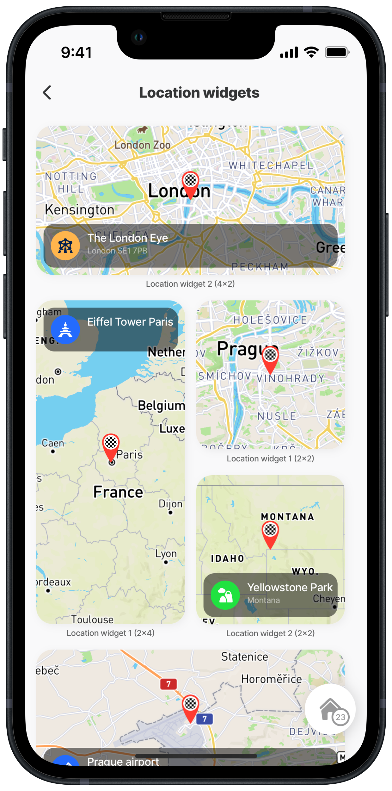
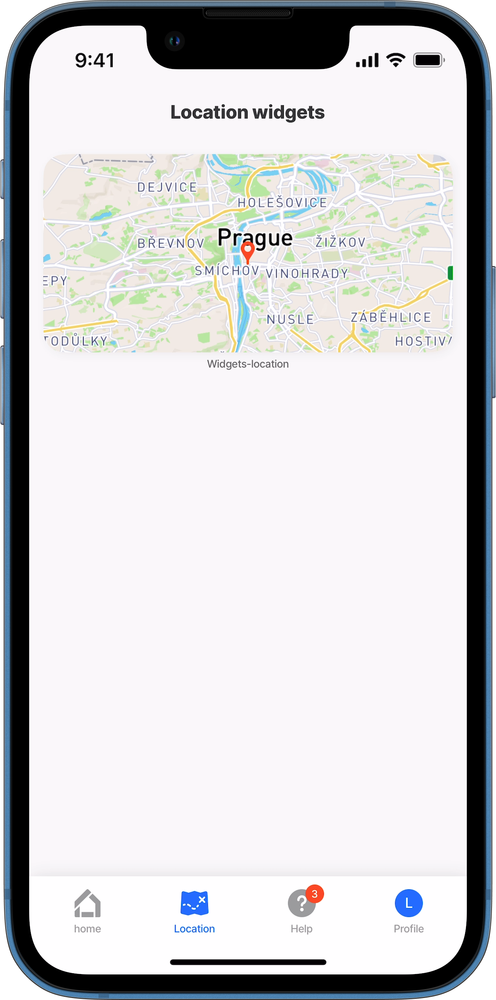
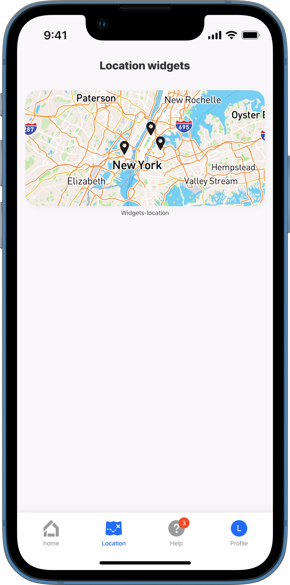
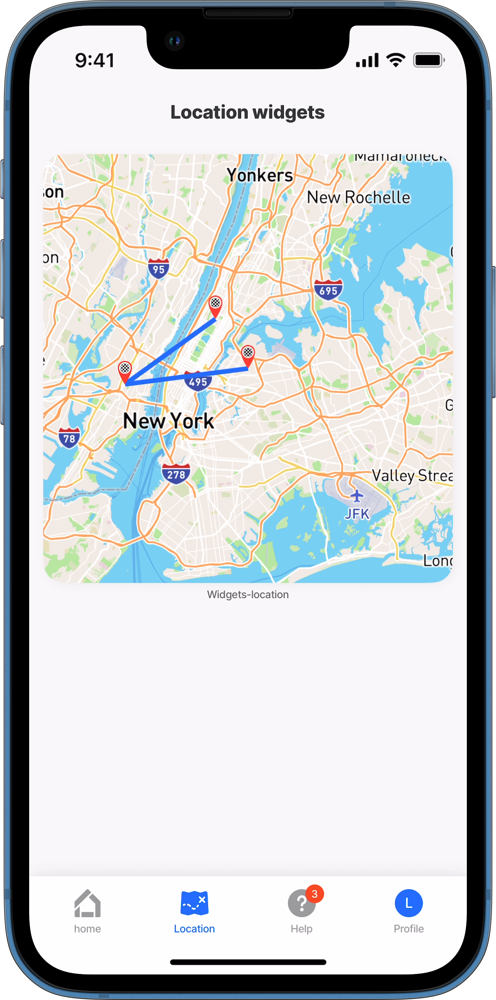
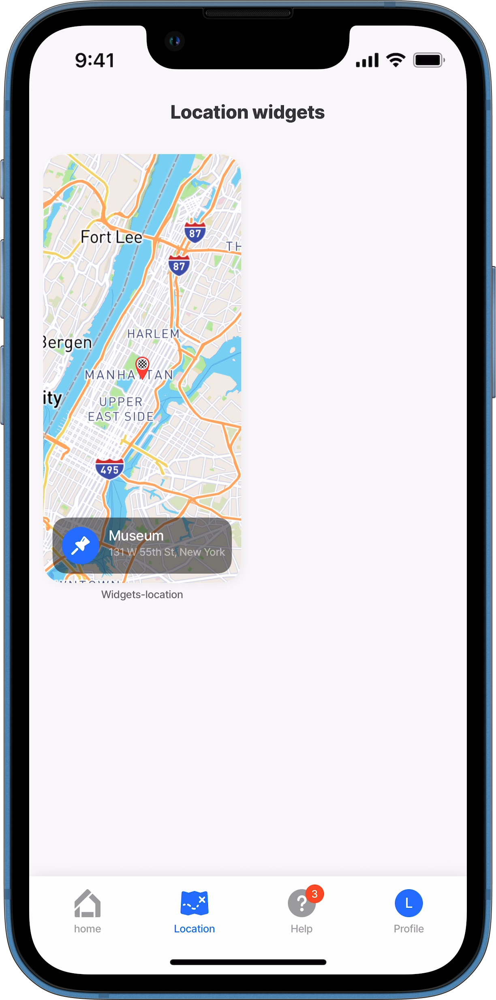

# location



The location widget displays a map or location on its surface. Configure it within a jig under the `widgets` property, then reference its name (`widgetId`) and define its `size` in a [grid-item](../Components/grid/grid-item.md) component.



<figure><figcaption><p>Location widgets</p></figcaption></figure>



## Configuration options

<table><thead><tr><th width="256.43359375">Core structure</th><th></th></tr></thead><tbody><tr><td><code>address</code></td><td><p>The actual address of the location. Valid formats are:</p><ul><li><strong>address string - city, street</strong>, e.g. <code>address: 20 W 34th St., New York, NY 10001, USA</code></li><li>In an <strong>expression calling a datasource</strong> <code>=@ctx.datasources.address.street &#x26; ',' &#x26; @ctx.datasources.address.city &#x26; ',' &#x26; @ctx.datasources.address.country</code></li><li><strong>latitude and longitude</strong>, e.g. <code>address: 40.759412, -73.912306</code></li></ul></td></tr><tr><td><code>is AnimationDisabled</code></td><td><code>true</code> or <code>false</code> to determine if map animation is disabled.</td></tr><tr><td><code>isFollowUserLocationEnabled</code></td><td>When enabled, the <code>viewPoint</code> will be centred on the user’s real-time location.</td></tr><tr><td><code>markers</code></td><td>Multiple markers can be configured to display on the map. There is a 10k limit for markers showing on the map. See <em>multi-markers</em> code example below. You can use an expression to provide the latitude and longitude points from a datasource. See <em>multi-datasource</em> code example below.</td></tr><tr><td><code>marker-item</code></td><td><code>anchorTo:</code> - Anchor the marker to a specific point, either <code>bottom-center</code> or <code>center</code> <code>radius</code> - Display a circle around the marker. In the radius you can configure the <code>color</code>, <code>unit</code> (Default is kilometres) <code>icon</code> - Choose an icon for the markers. You can style the icon <code>color</code>, <code>emphasis</code>, <code>type</code>, <code>shape</code> and <code>size</code>.</td></tr><tr><td><code>paths</code></td><td>Create one path from many points. The first point is the start destination, and the last is the end destination. There is a 10K limit for paths showing on the map. See <em>path-multi-points</em> code example below.</td></tr><tr><td><code>viewPoint</code></td><td>Controls the visible area of the map, defining what the user sees. It allows control over position, zoom and orientation. Options include: <code>centerPosition:</code> <code>middle</code> or <code>top</code></td></tr><tr><td><code>zoomLevel</code></td><td>Defines the initial zoom level of the map. Zooming in enlarges the view, revealing finer details, improving readability, and enhancing location precision.</td></tr></tbody></table>



```yaml
- type: component.location
    options:
      markers:
        data:
        - latitude: 40.759412
          longitude: -73.912306
        - latitude: 40.745368
          longitude: -74.057189
        - latitude: 40.76479429122513
          longitude: -73.97429291692742 
```



```yaml
markers:
   data: |
      =@ctx.datasources.jobs.{"lng": $number($.lng), "lat": $number($.lat)}
```



```yaml
 - type: component.location
    options:
      paths:
        data:
        - latitude: 40.759412
          longitude: -73.912306
        - latitude: 40.803495
          longitude: -73.950694
      address: =@ctx.datasources.location[0].address
```



<table><thead><tr><th width="162.90234375">Other options</th><th></th></tr></thead><tbody><tr><td><code>bottom</code></td><td>The component will be added to the bottom of the widget.</td></tr><tr><td><code>footer</code></td><td>Add text to the footer of the widget.</td></tr><tr><td><code>footerAlign</code></td><td>Align the footer text to <code>left</code>, <code>right</code>, <code>center</code>.</td></tr><tr><td><code>top</code></td><td>The component will be added to the top of the widget.</td></tr></tbody></table>

## Considerations

* Widgets are displayed on jigs in the [grid](../Components/grid/grid.md) component or [jig.grid](<../Jig Types/jig_grid.md>) by referencing the `widgetId` (Widget Name).
* The location widget can only be used on [grid-items](../Components/grid/grid-item.md) with widget sizes of 2x2, 2x4, 4x2, 4x4.

## Examples and code snippets

## location widget using address (4x2)



<figure><figcaption><p>Location widget with address</p></figcaption></figure>



This example demonstrates how to configure a `widget` within a `default` jig and display it on a `jig.grid` using a `4x2` layout. The widget focuses on showcasing a specific location based on the provided `address`.

**Examples**: See the complete example using static data in [GitHub](https://github.com/jigx-com/jigx-samples/blob/main/quickstart/jigx-samples/jigs/widgets/location/static-data/location-address/location-widget-address.jigx). See the complete example using dynamic data in [GitHub](https://github.com/jigx-com/jigx-samples/blob/main/quickstart/jigx-samples/jigs/widgets/location/dynamic-data/location-address/location-widget-address-dd.jigx).

**Datasources**: See the complete datasource for dynamic data in [GitHub](https://github.com/jigx-com/jigx-samples/blob/main/quickstart/jigx-samples/datasources/adhoc-components/location.jigx).





```yaml
widgets:
  # Provide name for the widget that will be used as the widgetId.
  widgetAddress:
    type: widget.location
    instanceId: address
    options:
      viewPoint:
        centerPosition: middle
        # Add the address of the location.
        address: Národní 135/14, 110 00 Praha
      # Add a pin to the exact address.  
      markers:
        # To add a pin to the exact location, configure a marker & icon.
        data: =@ctx.datasources.address[0]
        item:
          type: component.marker-item
          options:
            address: =@ctx.datasources.address[0].street
            children:
              type: component.icon
              options:
                # Specify the color of the icon.
                color: negative
                # Specify the type of icon.
                icon: pin-1-map 
```



```yaml
widgets:
  # Provide name for the widget that will be used as the widgetId.
  widgetAddress:
    type: widget.location
    instanceId: address
    options:
      viewPoint:
        centerPosition: middle
        # Add the address of the location using a datasource.
        address: |
                =@ctx.datasources.address[0].street 
                & ',' & @ctx.datasources.address[0].city
                & ',' & @ctx.datasources.address[0].country
      # To add a pin to the exact location, configure a marker & icon.
      markers:
        data: =@ctx.datasources.address[0]
        item:
          type: component.marker-item
          options:
            address: =@ctx.datasources.address[0].street
            children:
              type: component.icon
              options:
                # Specify the color of the icon.
                color: negative
                # Specify the type of icon.
                icon: pin-1-map  
```



```yaml
title: Location widgets
type: jig.grid

children:
  - type: component.grid-item
    options:
      # Specify the size of the widget.
      size: "4x2"
      children: 
        # Choose a jig.component in the grid-item. 
        type: component.jig-widget
        options:
          # Provide the name of the jig where the widget is configured.
          jigId: location-widgets
          # Specify the widgetId = Widget Name
          widgetId: widgetAddress
```



```yaml
datasources:
  address: 
    type: datasource.static
    options:
      data:
        - id: 1
          street: Národní 135/14
          city: 110 00 Praha
          country: Praha
        - id: 2
          street: 768 5th Ave
          city: New York
          country: US
```



```yaml
# Grid-item for the static jig.
children:
  - type: component.grid-item
    options:
      size: "4x2"
      children: 
        type: component.jig-widget
        options:
          jigId: location-widget
          widgetId: widgetAddress
```



## location widget with multiple markers (4x2)



<figure><figcaption><p>Location widget with multiple markers</p></figcaption></figure>



This example demonstrates how to configure a `widget` within a `default` jig and display it on a `jig.grid` using a `4x2` layout. The widget focuses on showcasing multiple `markers` based on the provided coordinates.

**Examples:**

See the complete example using static data in [GitHub](https://github.com/jigx-com/jigx-samples/blob/main/quickstart/jigx-samples/jigs/widgets/location/static-data/location-multiple-markers/location-widget-multiple-markers.jigx).





```yaml
widgets:
  # Provide name for the widget that will be used as the widgetId.
  widgetMarkers:
    type: widget.location
    options:
      viewPoint:
        centerPosition: middle
        # Add the address of the location using a datasource.
        address: |
          =@ctx.datasources.address[1].street 
          & ',' & @ctx.datasources.address[1].city
          & ',' & @ctx.datasources.address[1].country 
        # Adjust the zoomlevel to fit the location markers in the widget.  
        zoomLevel: 8
      # Specify the markers using latitude & longitude co-ordinates.  
      markers:
        data: =@ctx.datasources.points
```



```yaml
title: Location widgets
type: jig.grid

children:
  - type: component.grid-item
    options:
     # Specify the size of the widget.
      size: "4x2"
      children: 
        # Choose a jig.component in the grid-item.
        type: component.jig-widget
        options:
          # Provide the name of the jig where the widget is configured.
          jigId: location-widgets
          # Specify the widgetId = Widget Name.
          widgetId: widgetMarkers
```



```yaml
datasources:
  # First datasource for the adress.  
  address: 
    type: datasource.static
    options:
      data:
        - id: 1
          street: Národní 135/14
          city: 110 00 Praha
          country: Praha
        - id: 2
          street: 768 5th Ave
          city: New York
          country: US
  # Second datasource used for the markers        
  points:
    type: datasource.static
    options:
      data:
        - latitude: 40.759412
          longitude: -73.912306
        - latitude: 40.745368
          longitude: -74.057189 
        - latitude: 40.803495
          longitude: -73.950694 
```



```yaml
# Grid-item for the static jig.
children:
  - type: component.grid-item
    options:
      size: "4x2"
      children: 
        type: component.jig-widget
        options:
          jigId: multiple-markers 
          widgetId: widgetMarkers
```



## location widget displaying path (4x4)



<figure><figcaption><p>Location widget with path</p></figcaption></figure>



This example demonstrates how to configure a `widget` within a `default` jig and display it on a `jig.grid` using a `4x4` layout. The widget focuses on showcasing `paths` based on provided points that use coordinates.

**Examples**: See the complete example using static data in [GitHub](https://github.com/jigx-com/jigx-samples/blob/main/quickstart/jigx-samples/jigs/widgets/location/static-data/location-path/location-widget-path.jigx).





```yaml
widgets:
  # Provide name for the widget that will be used as the widgetId.
  widgetPath:
    type: widget.location
    options:
      viewPoint:
        centerPosition: middle
        # Add the address using coordinates.
        latitude: 40.759412
        longitude: -73.912306
        isAnimationEnabled: true
        zoomLevel: 9
      # Add icon markers for the addresses.
      markers:
        data: =@ctx.datasources.points
        item:
          type: component.marker-item
          options:
            anchorTo: bottom-center
            latitude: =@ctx.current.item.latitude
            longitude: =@ctx.current.item.longitude
            children:
              type: component.icon
              options: 
                # Specify the icon to be used as the marker.
                icon: end-marker  
      # Paths defined in a datasource in latitude and longitude.                 
      paths:
        data: =@ctx.datasources.points 
```



```yaml
title: Location widgets
type: jig.grid

children:
  - type: component.grid-item
    options:
      # Specify the size of the widget.
      size: "4x4"
      children: 
        # Choose a jig.component in the grid-item.
        type: component.jig-widget
        options:
          # Provide the name of the jig where the widget is configured.
          jigId: location-widgets
          # Specify the widgetId = Widget Name.
          widgetId: widgetPath
```



```yaml
datasources:
  points:
    type: datasource.static
    options:
      data:
        - latitude: 40.759412
          longitude: -73.912306
        - latitude: 40.745368
          longitude: -74.057189 
        - latitude: 40.803495
          longitude: -73.950694  
```



```yaml
# Grid-item for the static jig.
children:
  - type: component.grid-item
    options:
      size: "4x4"
      children: 
        type: component.jig-widget
        options:
          jigId: location-widget-path
          widgetId: widgetPath
```



## location widget with longitude and latitude (2x4)\\/col



This example demonstrates how to configure a `widget` within a `default` jig and display it on a `jig.grid` using a `2x4` layout with `longitude` and `latitude` coordinates. A `component.title` is configured to display the name and address of the location.



<figure><figcaption><p>Location widget with coordinates</p></figcaption></figure>





```yaml
widgets:
  # Provide name for the widget that will be used as the widgetId.
  widgetLatitude:
    type: widget.location
    options:
      # Configure a title to display on the widget with a left icon.
      bottom:
        type: component.titles
        options:
          title: Museum
          subtitle: 131 W 55th St, New York
          align: left
          icon: pin
      viewPoint:
        centerPosition: middle
        # Specify the address using latitude and longitude.
        latitude: =@ctx.datasources.appointments[2].latitude
        longitude: =@ctx.datasources.appointments[2].longitude
      # Add endpoint marker icon for the address.  
      markers:
        data: =@ctx.datasources.appointments[2]
        item:
          type: component.marker-item
          options:
            latitude: =@ctx.current.item.latitude
            longitude: =@ctx.current.item.longitude
            children:
              type: component.icon
              options:
                # Specify the color of the icon.
                color: negative
                # Specify the icon to be used as the marker.
                icon: =@ctx.datasources.appointments[2].icon 
```



```yaml
title: Location widgets
type: jig.grid

children:
  - type: component.grid-item
    options:
      # Specify the size of the widget.
      size: "2x4"
      children: 
        # Choose a jig.component in the grid-item.
        type: component.jig-widget
        options:
          # Provide the name of the jig where the widget is configured.
          jigId: location-widgets
          # Specify the widgetId = Widget Name.
          widgetId: widgetLatitude
```



```yaml
datasources:
  appointments:
    type: datasource.static
    options:
      data:
        - id: 1
          name: Empire State Building
          latitude: 40.748676182418976
          longitude: -73.98567513213604
          address: 20 W 34th St., New York, NY 10001, United States
          icon: home
        - id: 2
          name: Great Lawn Softball Field 6
          latitude: 40.782091612607864 
          longitude: -73.9655512166898
          address: 86th St Transverse, New York, NY 10024, United States
          icon: stadium-1-building         
        - id: 3
          name: Museum
          latitude: 40.7925  
          longitude: -73.9519
          address: 131 W 55th St, New York
          icon: end-marker  
```



```yaml
# Grid-item for the jig.
children:
  - type: component.grid-item
    options:
      size: "4x4"
      children: 
        type: component.jig-widget
        options:
          jigId: location-lat-long_2x4
          widgetId: widgetLatitude
```


