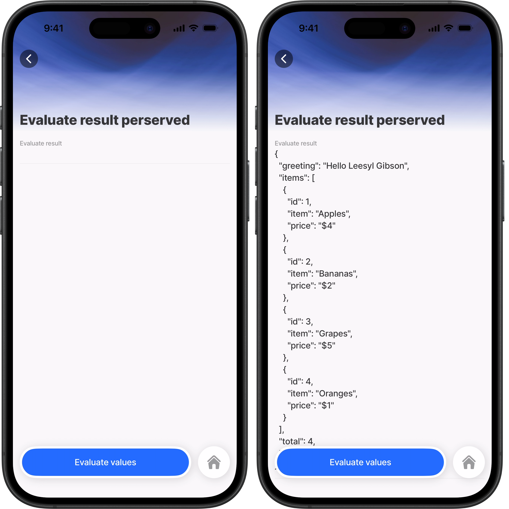

# evaluate

An action that evaluates any data structure. The `action.evaluate` action evaluates any value you pass into the `options.value` property. It supports objects, arrays, primitives, and nested combinations of all three.

Expressions are evaluated first. Any `TextLocale` or `TextWithFormat` values in the result are then resolved to strings. The final result is stored in `outputs.value` and keeps the original shape.

## Configuration options

Some properties are common to all actions, see [Common action properties](<../../docs/Actions/Common action properties.md>) for a list and their configuration options.

<table><thead><tr><th width="155.46875">Core structure</th><th>Description</th></tr></thead><tbody><tr><td><code>title</code></td><td>Provide a short title for the action button. You can use text or an expression.</td></tr><tr><td><code>instanceId</code></td><td>Give the action a unique identifier so you can reference the output later.</td></tr><tr><td><code>value</code></td><td>Provide any value to evaluate. This can be an object, array, primitive, expression, or nested combination. For example:<br><code>value: =@ctx.expressions.submissionTitle</code></td></tr></tbody></table>

<table><thead><tr><th width="161.6484375">Other options</th><th>Description</th></tr></thead><tbody><tr><td><code>icon</code></td><td>Specify an icon for <code>swipeable</code>, <code>secondary</code>, and <code>header</code> actions. Primary actions do not support icons.</td></tr><tr><td><code>isHidden</code></td><td>Set to <code>true</code> to hide the action button.</td></tr><tr><td><code>style</code></td><td>Style the action button. Common options include <code>isPrimary</code>, <code>isSecondary</code>, <code>isDanger</code>, and <code>isDisabled</code>.</td></tr></tbody></table>

<table><thead><tr><th width="319.3515625">Outputs</th><th width="75.75">Key</th><th>Notes</th></tr></thead><tbody><tr><td><code>=@ctx.actions.instanceId.outputs.</code></td><td><code>value</code></td><td>Returns the fully evaluated result. Objects and arrays keep their structure. <code>TextLocale</code> and <code>TextWithFormat</code> values are resolved to strings.</td></tr></tbody></table>

## Considerations

* The output key is `outputs.value.`
* The action evaluates nested expressions inside objects and arrays.
* Localized text and formatted text are resolved anywhere in the result tree.
* Use this action when another action needs resolved text or mixed evaluated data.
* This is useful before actions like [info-modal](../../docs/Actions/info-modal.md) and [generate-pdf](../../docs/Actions/generate-pdf.md).

## How it works

`action.evaluate` takes the structure in `options.value` and processes it in two steps:

1. It evaluates every expression in the structure.
2. It resolves any `TextLocale` and `TextWithFormat` values in the result.

The final data is stored in:

```yaml
=@ctx.actions.[instanceId].outputs.value
```

## Examples and code snippets

### Evaluate a nested structure



In this example, a single `action.evaluate` call builds a nested result that contains localized text, datasource values, formatted dates, numbers, and arrays. The output result is then used by an `info-modal`. and an `entity-field` to show specific values that have been evaluated.



<figure><figcaption><p>Action evaluate output results</p></figcaption></figure>






```yaml
title: Action evaluate
type: jig.default

header:
  type: component.jig-header
  options:
    height: medium
    children:
      type: component.image
      options:
        source:
          uri: https://images.unsplash.com/photo-1774893582522-c8e9c0aeaec9?q=80&w=2670&auto=format&fit=crop&ixlib=rb-4.1.0&ixid=M3wxMjA3fDB8MHxwaG90by1wYWdlfHx8fGVufDB8fHx8fA%3D%3D

# Actions section
actions:
  # Configuration for visible actions
  - numberOfVisibleActions: 2
    children:
      # Action list component
      - type: action.action-list
        options:
          # Whether actions are sequential
          isSequential: true
          # Title of the action list
          title: Evaluate
          actions:
            # Evaluate action
            - type: action.evaluate
              # Instance ID for referencing
              instanceId: evaluated
              options:
                value:
                  # Greeting with localization
                  greeting:
                    id: greeting-locale
                    defaultMessage: "Hello {name}"
                    values:
                      name: =@ctx.user.displayName
                  # Items from datasource
                  items: =@ctx.datasources.myData
                  # Formatted date
                  formattedDate:
                    text: "2020-01-08T14:18:30.518Z"
                    format:
                      dateFormat: ll
                  # Count expression
                  count: =($x := 42; $x)
                  # Expression that evaluates to an array of TextLocale objects
                  messages: '=[{"id": "msg-hello", "defaultMessage": "Hello World"}, {"id": "msg-date", "defaultMessage": "Created: {date}", "values": {"date": "2020-01-08"}}]'
            # Info modal action
            - type: action.info-modal
              options:
                modal:
                  # Title displaying from evaluated action output
                  title: =@ctx.actions.evaluated.outputs.value.greeting
                  # Button text
                  buttonText: ok

# Children components
children:
  # Entity component
  - type: component.entity
    options:
      children:
        # Entity field component
        - type: component.entity-field
          options:
            # Label for the field
            label: Evaluate result
            # Specific value from evaluated action output
            value: =@ctx.actions.evaluated.outputs.value.messages

```






```yaml
# Datasources section
datasources:
  # Static datasource named myData
  myData:
    type: datasource.static
    options:
      data:
        # Sample data array
        - id: 1
          item: fruit
          value: apple
```



You can access the results like this:

* `=@ctx.actions.evaluated.outputs.value.greeting` → `"Hello John"`
* `=@ctx.actions.evaluated.outputs.value.items` → array from the datasource
* `=@ctx.actions.evaluated.outputs.value.formattedDate` → `"Jan 8, 2020"`
* `=@ctx.actions.evaluated.outputs.value.count` → `42`

### Result shape is preserved



<figure><figcaption><p>Action evaluate - preserved result</p></figcaption></figure>



If you pass an object, you get an object back. If you pass an array, you get an array back. `action.evaluate` does not flatten or reshape the result.





```yaml
title: Evaluate result perserved
type: jig.default

header:
  type: component.jig-header
  options:
    height: small
    children:
      type: component.image
      options:
        source:
          uri: https://images.unsplash.com/photo-1708465034210-d0f1affc6aa4?q=80&w=2940&auto=format&fit=crop&ixlib=rb-4.1.0&ixid=M3wxMjA3fDB8MHxwaG90by1wYWdlfHx8fGVufDB8fHx8fA%3D%3D

children:
  - type: component.entity
    options:
      children:
        # Entity field component
        - type: component.entity-field
          options:
            # Label for the field
            label: Evaluate result
            # Specific value from evaluated action output
            value: =@ctx.actions.result.outputs.value

actions:
  - children:
      - type: action.action-list
        options:
          title: Evaluate values
          isSequential: true
          actions:
            # Evaluate action
            - type: action.evaluate
              # Instance ID for referencing
              instanceId: result
              options:
                value:
                  # Greeting with localization
                  greeting:
                    id: greeting-locale
                    defaultMessage: "Hello {name}"
                    values:
                      name: =@ctx.user.displayName
                  items: =@ctx.datasources.items
                  total: =($count(@ctx.datasources.items))
                  formattedDate:
                    text: "2020-01-08T14:18:30.518Z"
                    format:
                      dateFormat: ll

```



```yaml
datasources:
  items:
    type: datasource.static
    options:
      data:
        - id: 1
          item: Apples
          price: $4
        - id: 2
          item: Bananas
          price: $2
        - id: 3
          item: Grapes
          price: $5
        - id: 4
          item: Oranges
          price: $1
```



Example output access:

* `=@ctx.actions.result.outputs.value.greeting`
* `=@ctx.actions.result.outputs.value.items`
* `=@ctx.actions.result.outputs.value.total`
* `=@ctx.actions.result.outputs.value.formattedDate`
