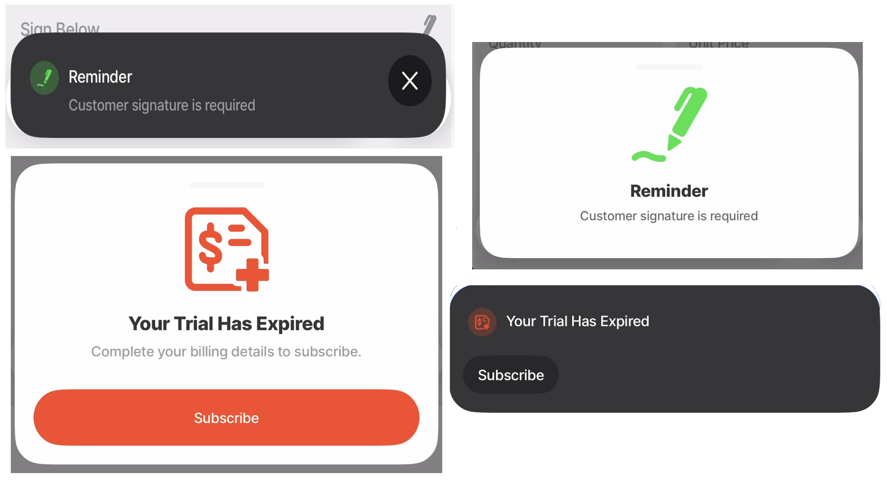
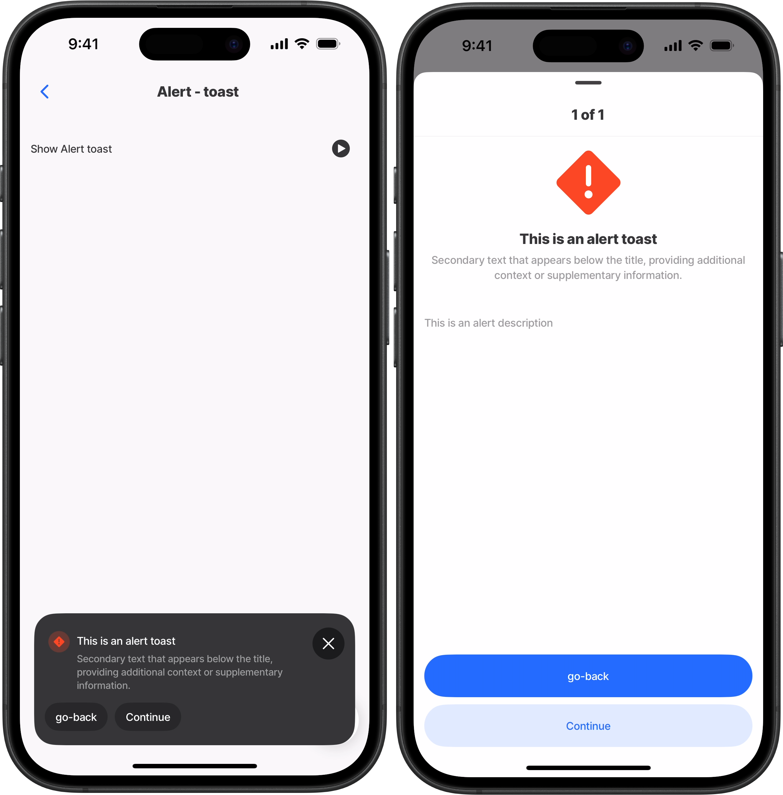
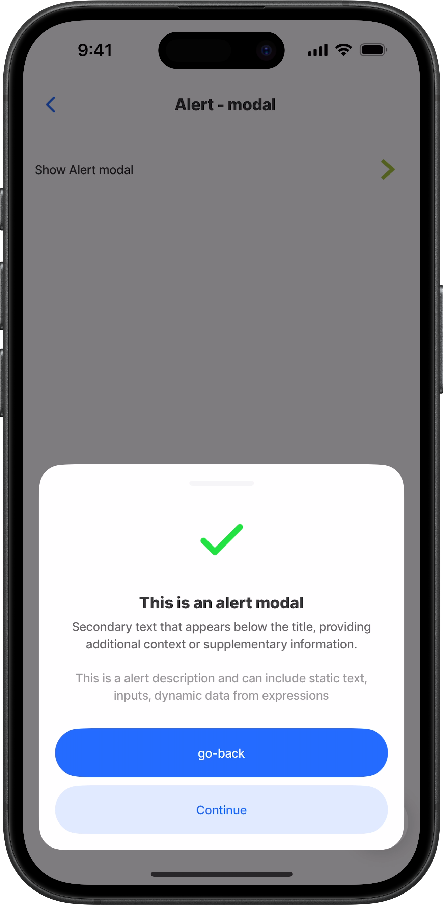
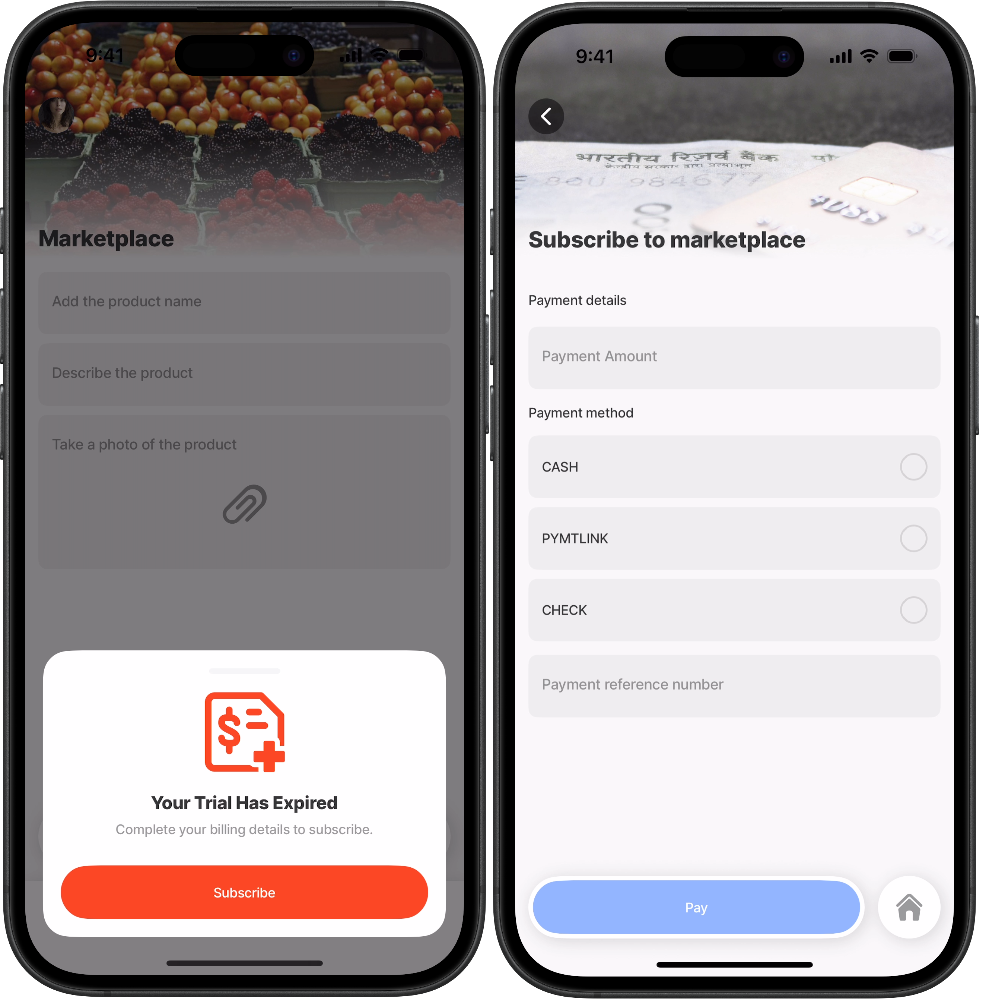
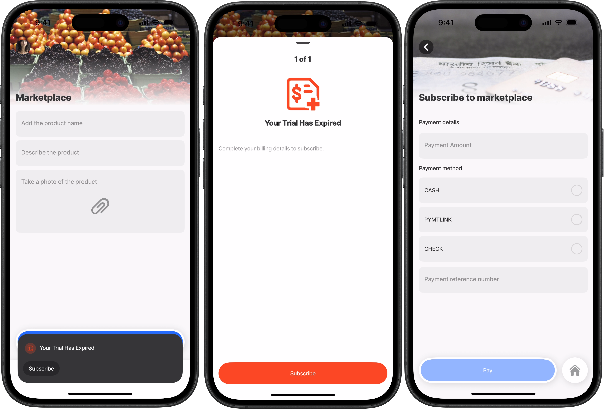
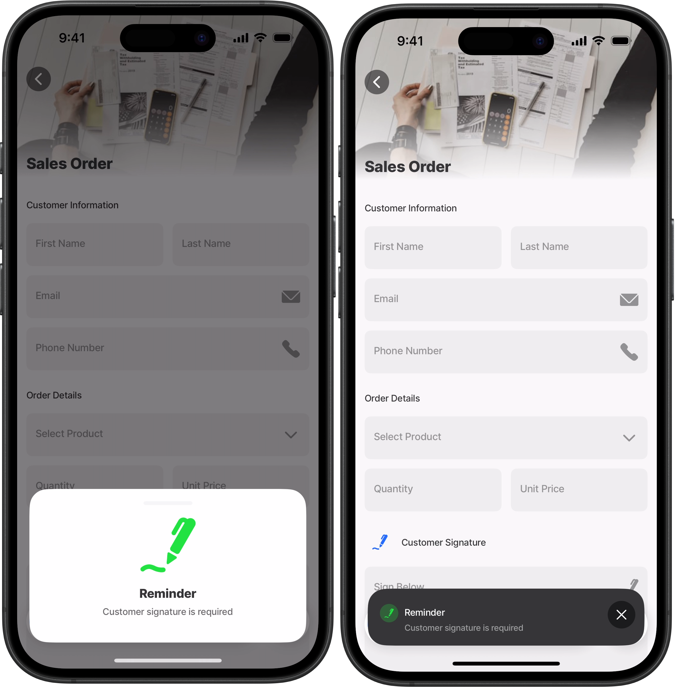
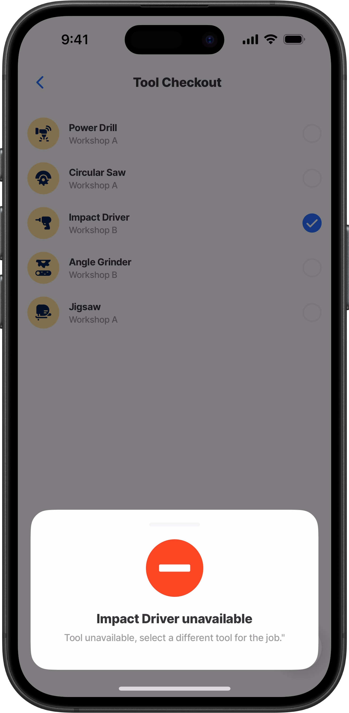
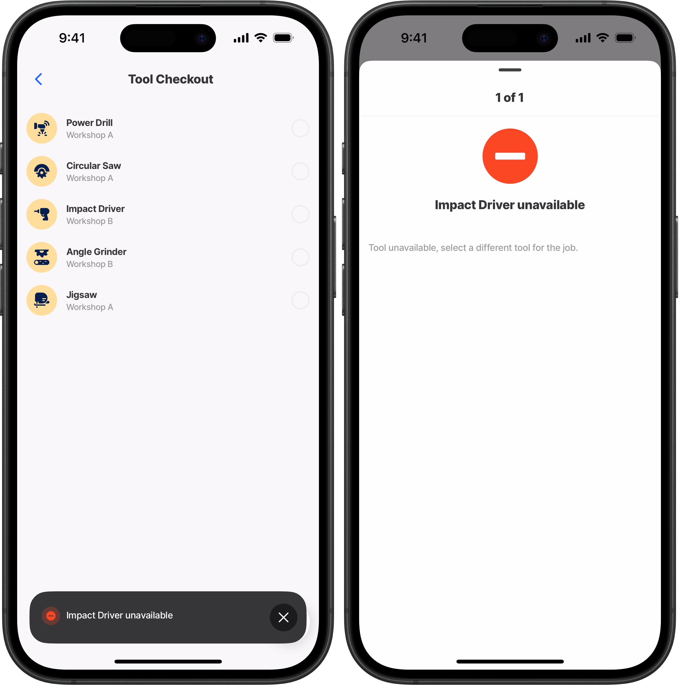
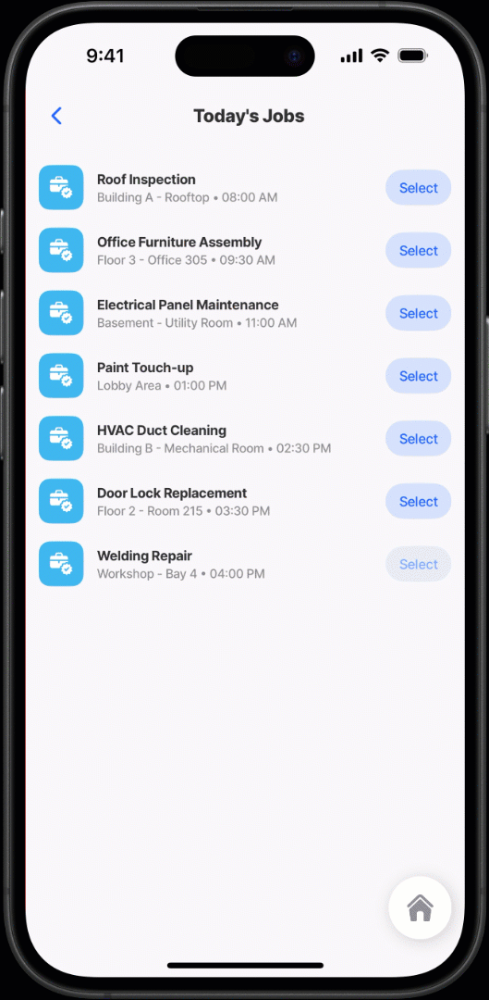
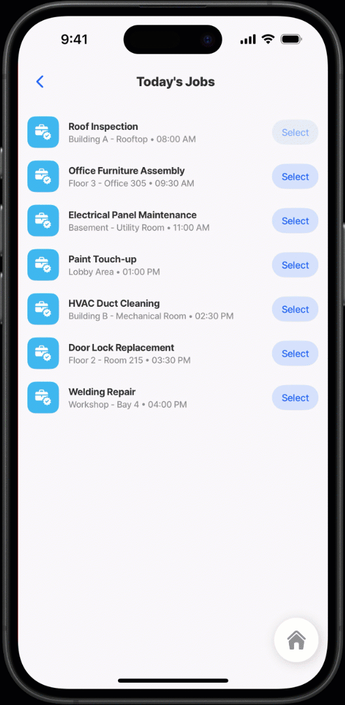

# show-alert

The `action.show-alert`  provides a way to notify users about important information in your app,  you can choose to show the alert as a **toast** for lightweight updates, or a **modal** for important messages. Alerts can be customized with styling, icons, and interactive elements, allowing you to tailor them to different scenarios.

The `action.show-alert` is considered a **background action**, meaning it can run automatically or silently without interrupting the current flow. Background actions typically occur behind the scenes, such as syncing data, saving changes, uploading files, or refreshing content.

In most cases, `show-alert` is **configured to run in response to an** [**event**](../../docs/Events/Events.md) such as `onPress`, `onFocus`, `onLoad`, or `onRefresh`.

The alert may not always be triggered directly by the user. Instead, it can be triggered automatically after another action completes. For example, when a user submits a form, the app might attempt to save the data in the background, and if that save fails, `action.show-alert` is triggered to notify the user of the error.

<figure><figcaption></figcaption></figure>

**Example use cases include:**

* **Error handling:** Display a retry prompt when a payment fails.
* **Login feedback:** Highlight invalid credentials or missing permissions.
* **Critical confirmations:** Require approval before deleting a record or submitting an expense.
* **Auto-dismiss** functionality for non-critical notifications.

## Configuration options

Some properties are common to all components, see [Common component properties](https://docs.jigx.com/examples/readme/actions/share) for a list and their configuration options.

<table><thead><tr><th width="140.36328125">Core Structure</th><th></th></tr></thead><tbody><tr><td><code>title</code></td><td>The main heading text displayed at the top of the alert. It should be concise and clearly state the purpose of the message.</td></tr><tr><td><code>presentAs</code></td><td><p>Specifies how the alert is presented to the user. Options include:</p><ul><li> <code>toast</code> (default):  For brief, lightweight notifications. </li><li><code>modal</code>: For important messages that require attention and may include additional information. Modal alerts are more disruptive since they block the UI and are typically used for critical information.</li></ul></td></tr></tbody></table>

<table><thead><tr><th width="139.98046875">Other options</th><th></th></tr></thead><tbody><tr><td><code>action</code></td><td>Interactive buttons or controls displayed within the alert let users respond or take specific actions. Use IntelliSense to see the list of available <a href="../../docs/Actions/">actions</a>.</td></tr><tr><td><code>description</code></td><td>The detailed message content that explains the alert’s purpose, provides instructions, or delivers additional information to the user.</td></tr><tr><td><code>dismiss</code></td><td><p>Configures how users can dismiss the alert. You can enable a gesture dismissal and set an automatic dismissal time.</p><ul><li><code>autoAfter</code> - specify the number of seconds after which the alert is automatically dismissed. Has no effect when <code>dismiss</code> is disabled.</li><li><code>isEnabled</code> - When set to <code>true</code> (default), allowing manual dismissal by swiping down. When set to <code>false</code>, the alert cannot be dismissed manually.</li></ul></td></tr><tr><td><code>group</code></td><td>Grouping allows you to manage multiple alerts under a shared identifier. This ensures that only one alert from a group is visible at a time, preventing alert overload and improving the user experience.<br><code>id</code> - Identifier for the alert group. Only one alert per group can be visible at a time. If a new alert with the same group ID is triggered while another is active, it will be skipped.</td></tr><tr><td><code>icon</code></td><td>The icon displayed alongside the alert content provides visual context and helps users recognize the alert’s type or purpose. The alert’s <code>style</code> property determines the icon color. If no style is set, the default <code>isWarning</code> style is applied.</td></tr><tr><td><code>style</code></td><td><p>Visual styling options let you set the tone of the alert:</p><ul><li><code>isPositive</code> (success/confirmation)</li><li><code>isNegative</code> (error) styling to convey the appropriate tone and urgency. </li><li><code>isWarning</code> (warning) styling is used by default.</li></ul></td></tr><tr><td><code>subtitle</code></td><td>Secondary text that appears below the <code>title</code>, providing additional context or supplementary information.</td></tr></tbody></table>

## Considerations

* The `action.show-alert` is only configurable in an [event](../../docs/Events/Events.md) such as `onPress` , `OnFocus`, `onLoad` or `onRefresh`.
* When the `show-alert` is shown as a toast, tap on the toast to view additional details configured in the `description` property.

## Examples and code snippets

### Show-alert as a toast



<figure><figcaption><p>Show alert as a toast</p></figcaption></figure>



This example demonstrates an alert configured to display as a `toast`. It uses a negative `style` and a custom `icon` that supports the context of the message. The toast shows the `title`, `subtitle`, `icon`, and available `actions` at a glance. When the user taps on the `toast`, the full alert is revealed, including the `description` field, which can be configured as either static text or dynamically populated using an expression.




```yaml
title: Alert - toast
type: jig.default

children:
  - type: component.list-item
    options:
      title: Show Alert toast
      rightElement:
        element: icon
        icon: arrow-button-circle-right
        # Configure the show-alert on the OnPress event.
        onPress:
          type: action.show-alert
          options:
            # Give the alert a title.
            title: This is an alert toast
            # Configure the type of alert to present on the screen.
            presentAs: toast
            # Add two actions buttons in the alert.
            actions:
              - type: action.go-back
                options:
                  title: go-back
              - type: action.go-to
                options:
                  title: Continue
                  linkTo: billing-form
                  # Style the second action button as secondary action.
                  style:
                    isSecondary: true
            # Add the details of the alert, which are displayed when the
            # toast alert is tapped.        
            description: This is an alert description
            # Select an icon in context with the alert.
            icon: alert
            # Style the alert depending on the severity  
            style:
              isNegative: true
            subtitle: Secondary text that appears below the title, providing additional context or supplementary information.
```


### Show-alert as a modal



<figure><figcaption><p>Show alert as a modal</p></figcaption></figure>



This example demonstrates an alert configured to display as a `modal`. It uses a positive `style` and a custom `icon` that supports the context of the message. The modal shows the `title`, `subtitle`, `description`,  `icon`, and available `actions` at a glance. The `description` field can be configured as either static text or dynamically populated using an expression.




```yaml
title: Alert - modal
type: jig.default

children:
  - type: component.list-item
    options:
      title: Show Alert modal
      rightElement:
        element: icon
        icon: arrow-button-right
        color: color10
        # Configure the show-alert on the OnPress event.
        onPress:
          type: action.show-alert
          options:
            # Give the alert a title.
            title: This is an alert modal
            subtitle: Secondary text that appears below the title, providing additional context or supplementary information.
            # Configure the type of alert to present on the screen.
            presentAs: modal
            # Add two actions buttons in the alert.
            actions:
              - type: action.go-back
                options:
                  title: go-back
              - type: action.go-to
                options:
                  title: Continue
                  linkTo: billing-form
                  # Style the second action button as secondary action.
                  style:
                    isSecondary: true
            # Add the details of the alert, which are displayed in the modal.         
            description: This is a alert description and can include static text, inputs, dynamic data from expressions
            # Select an icon in context with the alert.
            icon: check
            # Style the alert depending on the severity 
            style:
              isPositive: true
```


### Show-alert with actions&#x20;

This example demonstrates how to configure an alert that evaluates a user's app subscription status. If the subscription has expired, an alert is triggered on the `onLoad` event in the `index.jigx` file, displaying a message with an action button that prompts the user to provide billing information and subscribe. The alert leverages the `action.show-alert` , with a condition set through the `when` property, reading from a custom subscription variable managed in Jigx Management. Importantly, the alert cannot be dismissed as the `dismiss: isEnabled` is set to `false`, compelling the user to either subscribe or exit the app.

<figure><figcaption><p>Show alert with an action - modal</p></figcaption></figure>

<figure><figcaption><p>Show alert with an action - toast</p></figcaption></figure>



<pre class="language-yaml"><code class="lang-yaml">name: online-marketplace
title: online-marketplace
category: health
description: Collection of sellers
icon: farmers-market-kiosk
color: color2

onLoad:
  # Alert the user if their subscriotion has expired.
  type: action.show-alert
  # Evaluate if the user subscription has expired or not, 
  # using the custom variables in Jigx Management.
  when: =@ctx.solution.settings.custom.Subscription = "Expired"
  options:
    title: Your Trial Has Expired
    description: Complete your billing details to subscribe.
    # Modal presentation style (overlays the current screen).
    # Change it to a modal.
    presentAs: toast
    icon: bill-cross-money-paper
    # Disable the alert forces the user to take action either by subscribing,
    # or by closing the app
    dismiss:
      isEnabled: false
    # Visual styling to indicate this is a negative action.  
    style:
      isNegative: true
    # Add an action to the alert for the user to subscribe and continue.  
    actions:
      - type: action.go-to
        options:
           # Visual styling to indicate this is a required action. 
          style:
            isDanger: true
          title: Subscribe
          linkTo: billing-form
<strong>
</strong>tabs:
  Home:
    label: Home 
    jigId: products
    icon: home-apps-logo
  Shop:
    label: Shop online
    jigId: online-shop
    icon: farmers-market-kiosk
</code></pre>



```yaml
title: Subscribe to marketplace
type: jig.default

header:
  type: component.jig-header
  options:
    height: small
    children:
      type: component.image
      options:
        source:
          uri: https://cdn.pixabay.com/photo/2019/09/27/17/23/payment-4509004_1280.jpg

datasources:
  payment:
    type: datasource.static
    options:
      data:
        - id: 1
          method: CASH
          description: Cash Payment
        - id: 2
          method: PYMTLINK
          description: Payment Link
        - id: 3
          method: CHECK
          description: Check Payment

children:
  - type: component.form
    instanceId: payment-form
    options:
      isDiscardChangesAlertEnabled: false
      children:
        - type: component.section
          options:
            title: Payment details
            children:
              - type: component.text-field
                instanceId: pay-amount
                options:
                  label: Payment Amount
              - type: component.choice-field
                instanceId: pay-method
                options:
                  label: Payment method
                  data: =@ctx.datasources.payment
                  item:
                    type: component.choice-field-item
                    options:
                      title: =@ctx.current.item.method
                      value: =@ctx.current.item.description
              - type: component.number-field
                instanceId: pay-reference
                options:
                  label: Payment reference number
actions:
  - numberOfVisibleActions: 1
    children:
      - type: action.submit-form
        options:
          formId: payment-form
          provider: DATA_PROVIDER_LOCAL
          title: Pay
          entity: payments
          method: create

```



### Show-alert with styling onFocus



This example uses the `onFocus` event to notify (alert) the salesperson that the sales order requires the customer’s signature. The alert can be displayed as either a `toast` or a `modal` and is styled positively, as it serves as an informative reminder rather than an error.



<figure><figcaption></figcaption></figure>





```yaml
title: Sales Order
type: jig.default

onFocus:
  # Display an alert modal to remind the sales person to get a signature.
  type: action.show-alert
  options:
    # Alert title displays below the icon.
    title: Reminder
    # Modal presentation style (overlays the current screen).
    # Change it to a toast.
    presentAs: modal
    subtitle: Customer signature is required
    # Icon provides a visual engagement
    icon: signature
    # Visual styling to indicate this is a informative/positive action
    style:
      isPositive: true

header:
  type: component.jig-header
  options:
    height: small
    children:
      type: component.image
      options:
        source:
          uri: https://images.unsplash.com/photo-1554224155-6726b3ff858f?w=500&auto=format&fit=crop&q=60

children:
  - type: component.form
    instanceId: sales-order-form
    options:
      isDiscardChangesAlertEnabled: true
      children:
        - type: component.section
          options:
            title: Customer Information
            children:
              - type: component.field-row
                options:
                  children:
                    - type: component.text-field
                      instanceId: customerFirstName
                      options:
                        label: First Name
                        isRequired: true
                    - type: component.text-field
                      instanceId: customerLastName
                      options:
                        label: Last Name
                        isRequired: true
              - type: component.email-field
                instanceId: customerEmail
                options:
                  label: Email
                  icon: email
                  isRequired: true
              - type: component.number-field
                instanceId: customerPhone
                options:
                  label: Phone Number
                  icon: phone
                  keyboardType: number-pad

        - type: component.section
          options:
            title: Order Details
            children:
              - type: component.dropdown
                instanceId: product
                options:
                  label: Select Product
                  isRequired: true
                  data: =@ctx.datasources.products
                  item:
                    type: component.dropdown-item
                    options:
                      title: =@ctx.current.item.name
                      value: =@ctx.current.item.id
              - type: component.field-row
                options:
                  children:
                    - type: component.number-field
                      instanceId: quantity
                      options:
                        label: Quantity
                        isRequired: true
                        keyboardType: number-pad
                    - type: component.number-field
                      instanceId: unitPrice
                      options:
                        label: Unit Price
                        isRequired: true
                        keyboardType: decimal-pad 

        - type: component.section
          options:
            icon:
              name: signature
            title: Customer Signature
            children:
              - type: component.signature-field
                instanceId: customerSignature
                options:
                  label: Sign Below
                  helperText: Please provide your signature to authorize this order

actions:
  - children:
      - type: action.execute-entity
        options:
          title: Submit Order
          provider: DATA_PROVIDER_DYNAMIC
          entity: default/sales-orders
          method: create
          data:
            customerFirstName: =@ctx.components.customerFirstName.state.value
            customerLastName: =@ctx.components.customerLastName.state.value
            customerEmail: =@ctx.components.customerEmail.state.value
            customerPhone: =@ctx.components.customerPhone.state.value
            productId: =@ctx.components.product.state.value
            quantity: =@ctx.components.quantity.state.value
            unitPrice: =@ctx.components.unitPrice.state.value
            totalAmount: =@ctx.components.quantity.state.value * @ctx.components.unitPrice.state.value
            customerSignature: =@ctx.components.customerSignature.state.value
            createdAt: =@ctx.solution.state.now

```



```yaml
datasources:
  products:
    type: datasource.static
    options:
      data:
        - id: 1
          name: Product A
        - id: 2
          name: Product B
        - id: 3
          name: Product C
```



### Show-alert with icons and styling onChange

This example uses the `onChange` event to alert the worker that the selected tool is unavailable. The alert can be displayed as a toast or a modal and is styled negatively, with a clear icon to reinforce that the selection is not allowed. When shown as a toast, the worker can tap it to view additional details.


{% column width="41.66666666666667%" %}
<figure><figcaption><p>Alert shown as a modal</p></figcaption></figure>


{% column width="58.33333333333333%" %}
<figure><figcaption><p>Alert shown as a toast, tap for more details</p></figcaption></figure>





```yaml
title: Tool Checkout
type: jig.default

onRefresh:
  type: action.reset-state
  options:
    state: =@ctx.components.toolshed.state.value

onFocus:
  type: action.reset-state
  options:
    state: =@ctx.components.toolshed.state.value

children:
  - type: component.list
    instanceId: toolshed
    options:
      data: =@ctx.datasources.tools
      item:
        type: component.list-item
        options:
          title:
            text: =@ctx.current.item.name
            isBold: true
          subtitle:
            text: =@ctx.current.item.location
          leftElement:
            element: icon
            icon: =@ctx.current.item.icon
            shape: circle
            type: contained
            color: color3
          rightElement:
            element: checkbox
            initialValue: false
            onChange:
              type: action.show-alert
              when: =@ctx.current.item.available = false
              options:
                title: =@ctx.current.item.name & " unavailable"
                description: Tool unavailable, select a different tool for the job."
                presentAs: modal
                style:
                  isNegative: true
                icon: road-sign-no-entry
```



```yaml
datasources:
  tools:
    type: datasource.static
    options:
      data:
        - id: 1
          name: Power Drill
          location: Workshop A
          available: true
          icon: drill-robot-arm
        - id: 2
          name: Circular Saw
          location: Workshop A
          available: true
          icon: power-tools-circular-saw
        - id: 3
          name: Impact Driver
          location: Workshop B
          available: false
          icon: power-tools-drill
        - id: 4
          name: Angle Grinder
          location: Workshop B
          available: true
          icon: power-tools-wood-cutter-1
        - id: 5
          name: Jigsaw
          location: Workshop A
          available: true
          icon: power-tools-wood-cutter
```



### Show-alert with automatic dismissal

This example illustrates how to display a warning alert to workers when specific jobs require PPE (Personal Protective Equipment). Each job is listed with an icon and a "Select" button. Upon selection, if the job necessitates PPE, a non-blocking toast alert appears detailing the required PPE items, reinforcing the importance of safety compliance. The alert is styled with a warning indication and is configured to automatically dismiss after three seconds, ensuring that the alert is noticeable without interrupting the workflow.



<figure><figcaption><p>Dismiss alert after 3 seconds - Modal</p></figcaption></figure>



<figure><figcaption><p>Dismiss alert after 3 seconds - Toast</p></figcaption></figure>





```yaml
title: Today's Jobs
type: jig.default

children:
  - type: component.list
    options:
      data: =@ctx.datasources.todays-jobs
      item:
        type: component.list-item
        options:
          title:
            text: =@ctx.current.item.jobTitle
            isBold: true
          subtitle: =@ctx.current.item.location & ' • ' & @ctx.current.item.time
          leftElement:
            element: icon
            icon: job-responsibility-bag-check
            color: color9
            type: contained
            shape: rounded
          rightElement:
            element: button
            title: Select
            onPress:
              type: action.action-list
              options:
                isSequential: true
                actions:
                  # Trigger an alert message
                  - type: action.show-alert
                    # Only show if the current item requires PPE.
                    when: =@ctx.current.item.requiresPPE = true
                    options:
                      title: PPE required
                      description: ="Ensure you are wearing the correct PPE (Personal Protective Equipment) for this specific job. These include " & @ctx.current.item.ppeItems
                      # Display the alert as a toast (non-blocking banner-style alert)
                      # Change to modal if preferred.
                      presentAs: toast
                      # Automatically dismiss the toast after 3 seconds.
                      dismiss:
                        autoAfter: 3
                      style:
                       # Apply branding warning styling (usually yellow/orange).
                        isWarning: true
                      # Icon to visually reinforce the PPE requirement.
                      icon: hat-architect
                  - type: action.go-to
                    options:
                      linkTo: job-sheet
                      inputs:
                        job: =@ctx.current.item.jobTitle
                        location: =@ctx.current.item.location
                        time: =@ctx.current.item.time
                        PPE: =@ctx.current.item.requiresPPE
                        ppeItems: =@ctx.current.item.ppeItems
                        priority: =@ctx.current.item.priority
```



```yaml
datasources:
  todays-jobs:
    type: datasource.static
    options:
      data:
        - id: 1
          jobTitle: Roof Inspection
          location: Building A - Rooftop
          time: 08:00 AM
          requiresPPE: true
          ppeItems: Hard Hat, Safety Harness, Steel-Toe Boots
          priority: high
        - id: 2
          jobTitle: Office Furniture Assembly
          location: Floor 3 - Office 305
          time: 09:30 AM
          requiresPPE: false
          ppeItems: None
          priority: low
        - id: 3
          jobTitle: Electrical Panel Maintenance
          location: Basement - Utility Room
          time: 11:00 AM
          requiresPPE: true
          ppeItems: Insulated Gloves, Safety Glasses, Hard Hat
          priority: high
        - id: 4
          jobTitle: Paint Touch-up
          location: Lobby Area
          time: 01:00 PM
          requiresPPE: false
          ppeItems: None
          priority: medium
        - id: 5
          jobTitle: HVAC Duct Cleaning
          location: Building B - Mechanical Room
          time: 02:30 PM
          requiresPPE: true
          ppeItems: Respirator, Safety Goggles, Gloves
          priority: medium
        - id: 6
          jobTitle: Door Lock Replacement
          location: Floor 2 - Room 215
          time: 03:30 PM
          requiresPPE: false
          ppeItems: None
          priority: low
        - id: 7
          jobTitle: Welding Repair
          location: Workshop - Bay 4
          time: 04:00 PM
          requiresPPE: true
          ppeItems: Welding Helmet, Fire-Resistant Gloves, Apron
          priority: high
```



```yaml
title: Job Sheet
type: jig.default

inputs:
  job:
    type: string
    required: true
  location:
    type: string
  time:
    type: string
  PPE:
    type: boolean
  ppeItems:
    type: array
  priority:
    type: string

children:
  - type: component.section
    options:
      title: Job Information
      children:
        - type: component.entity
          options:
            children:
              - type: component.entity-field
                options:
                  label: Job Title
                  value: =@ctx.jig.inputs.job
              - type: component.entity-field
                options:
                  label: Location
                  value: =@ctx.jig.inputs.location

              - type: component.entity-field
                options:
                  label: Assigned To
                  value: =@ctx.user.displayName

              - type: component.entity-field
                options:
                  label: Scheduled Time
                  value: =@ctx.jig.inputs.time

              - type: component.entity-field
                options:
                  label: Priority
                  value: =@ctx.jig.inputs.priority

  - type: component.section
    options:
      title: Safety Requirements
      children:
        - type: component.entity
          options:
            children:
              - type: component.entity-field
                options:
                  label: PPE Required
                  value: =@ctx.jig.inputs.PPE

              - type: component.entity-field
                options:
                  label: Required PPE Items
                  value: =@ctx.jig.inputs.ppeItems

```



### Show-alert with group id












### Show-alert in a REST function
