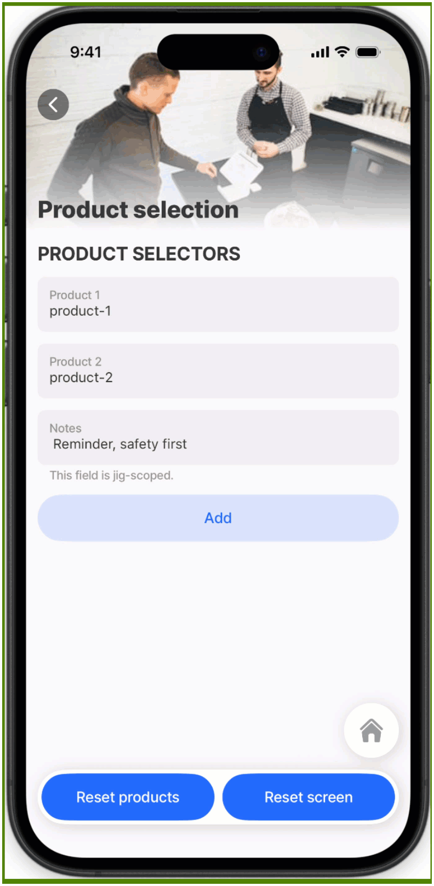

# component-state (set & reset)

Use actions to set or reset **component state**. Component state belongs to a specific component instance, such as a form, field, list, or picker. It lets you control UI behavior, preserve values, and reset component data when a screen or workflow starts over.

The `set-state` action updates a specific component state key by referencing its state path.\
The `reset-component-state` action resets component state. You can reset all component instances, or only selected `instanceIds`.

Refer to [state](https://docs.jigx.com/building-apps-with-jigx/logic/state) for more information on the available state options and how they work.

## Configuration options

A `set-state` or `reset-component-state` action can be configured in various ways, either by using an [event](../../../docs/Components/event.md) or an [action](../../../docs/Actions/) button to trigger the change:

* `onFocus` — executes the action when the screen gains focus.
* `onRefresh` — executes the action when the screen is refreshed.
* As the main [action](../../../docs/Actions/) on the jig, and when you press the action, the `set-state` or `reset-component-state` action will be executed.&#x20;



<table><thead><tr><th width="181.12109375">Set component state</th><th></th></tr></thead><tbody><tr><td><code>state</code></td><td>Reference the component state key you want to update, for example <code>=@ctx.components.notes.state.value</code>.</td></tr><tr><td><code>value</code></td><td>Provide the new value for the component state using an expression, text, input, or datasource value.</td></tr><tr><td><code>title</code></td><td>Provide the action button with a title, for example, Apply default value.</td></tr></tbody></table>

<table><thead><tr><th width="181.83984375">Reset component state</th><th></th></tr></thead><tbody><tr><td><code>instanceIds</code></td><td>Optional list of component <code>instanceId</code> values to reset. Omit this property to reset all components in the selected scope.</td></tr><tr><td><code>title</code></td><td>Provide the action button with a title, for example, Reset screen state.</td></tr></tbody></table>

<table><thead><tr><th width="181.953125">Other options</th><th></th></tr></thead><tbody><tr><td><code>icon</code></td><td>Select an <a href="https://docs.jigx.com/jigx-icons">icon</a> to display when the action is configured as the secondary button or in a header action.</td></tr><tr><td><code>isHidden</code></td><td><code>false</code> hides the action button, <code>true</code> shows the action button. The default setting is <code>true</code>.</td></tr><tr><td><code>style</code></td><td><code>isDanger</code> - Styles the action button in red or your brand's designated danger color. <br><code>isDisabled</code> - Displays the action button as greyed out. <br><code>isPrimary</code> - Styles the action button in blue or your brand's designated primary color. <code>isSecondary</code> - Sets the action as a secondary button, accessible via the ellipsis. The <code>icon</code> property can be used when the action button is displayed as a secondary button.</td></tr></tbody></table>


`reset-component-state` supports two reset patterns:

* Omit `instanceIds` to reset all component instances in the selected scope.
* Provide `instanceIds` to reset only selected components in that scope.


## How to configure component state



Add an `instanceId` to the component whose state you want to reference or reset.



Use `action.set-state` to update a specific component state key, such as `value`, `data`, or another supported state property.



Use `action.reset-component-state` to reset all components in a scope, or only selected `instanceIds`.



## Examples and code snippets



This example demonstrates how to  reset component state.

**Reset saved product selectors**\
This action uses `action.reset-component-state` with two `instanceIds`.&#x20;

**Reset screen components**\
This action uses `action.reset-component-state`. Because `instanceIds` is omitted, all components on the screen are reset.

This approach gives you granular reset behavior. You can reset one component, a selected group of components, or every component in the jig.



<figure><figcaption><p>Reset component state</p></figcaption></figure>





```yaml
title: Product selection
type: jig.default

header:
  type: component.jig-header
  options:
    height: small
    children:
      type: component.image
      options:
        source:
          uri: https://images.unsplash.com/photo-1556740749-887f6717d7e4?w=400&auto=format&fit=crop&q=60
# Define the jig states
state:
  note:
    initialValue: " Reminder, safety first "
  amount:
    initialValue: 1
 # Reset the component's state to their initial value
 onFocus:
  type: action.reset-component-state
  # Changes omitted = reset all
  options: {}
onRefresh:
  type: action.reset-component-state
  # Changes omitted = reset all
  options: {}   

children:
  - type: component.section
    options:
      title:
        text: Product selectors
        fontSize: medium
        isBold: true
        isSubtle: false
      children:
        # These selectors are solution-scoped.
        - type: component.text-field
          instanceId: product-1
          options:
            label: Product 1
            initialValue: =@ctx.solution.state.product1
        - type: component.text-field
          instanceId: product-2
          options:
            label: Product 2
            initialValue: =@ctx.solution.state.product2

        # This field uses the default jig scope.
        - type: component.text-field
          instanceId: notes
          options:
            label: Notes
            isMultiline: true
            helperText: This field is jig-scoped.
            value: =@ctx.jig.state.note
        - type: component.amount-control
          instanceId: amountID
          options:
            maximum: 5

actions:
  - numberOfVisibleActions: 2
    children:
      # Reset only selected components.
      - type: action.reset-component-state
        options:
          title: Reset saved products
          instanceIds:
            - product-1
            - product-2

      # Reset all components on this screen.
      - type: action.reset-component-state
        options:
          title: Reset All 
```



```yaml
datasources:
  products:
    type: datasource.static
    options:
      data:
        - id: 1
          name: Safety Boots
        - id: 2
          name: Hard Hat
        - id: 3
          name: Gloves
        - id: 4
          name: Safety Glasses
```



```yaml
name: jigx-demo
title: jigx-demo
category: health
# Set Solution states
state:
  product1:
    initialValue: "product-1"
  product2:
    initialValue: "product-2"
```



## Considerations

* `action.set-state` updates a specific component state path. Use the exact component state reference, for example `=@ctx.components.notes.state.value`.
* `instanceIds` is optional. Omit it to reset all component instances in the selected scope.
* For resetting solution state keys, use [solution-state (set & reset)](solution-state-set-and-reset.md).

## See also

* [jig-state (set & reset)](jig-state-set-and-reset.md)
* [solution-state (set & reset)](solution-state-set-and-reset.md)
* [reset-state](reset-state.md)
