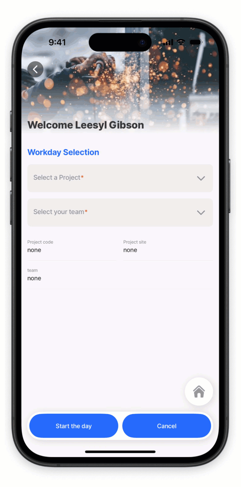

# solution-state (set & reset)

Use actions to set or reset the **solution states**. These global variables are defined in the index.jigx file and can be referenced throughout the solution across multiple screens. Proper management of solution states ensures consistent behavior, shared logic, and synchronized data across your entire solution.

* The `set-solution-state` action updates the global solution state, acting as a global variable accessible by multiple jigs and components.
* The `reset-solution-state` action resets selected solution state keys to their initial values. If `changes` is omitted, it resets all solution state keys.

Refer to [state](https://docs.jigx.com/building-apps-with-jigx/logic/state) for more information on the various state options and their respective functionality.

***

## **How to Configure a Solution State**

### Define the solution state variables



In your _index.jigx_ file, add the `states` property.



Define each variable by specifying its `key name` and `initialValue`.



Solution states act as global variables, accessible to all jigs within the solution.



### **Set the solution state**



Use the `set-solution-state` action to update one or more solution state variables.



You can trigger this action from any jig through an event (for example, `onPress`) or within a control’s `action` property.



When updated, the new values are instantly available to all jigs that reference the same state variable.



### **Reset the solution state**



Use the `reset-solution-state` action to restore one or more solution state variables to their defined `initialValues`.



This is often done during logout, data refresh, or when resetting a workflow that spans multiple screens.



The `changes` parameter is optional. Omit it to reset all solution state keys.



***

## **Configuration Options**

You can trigger `set-solution-state` or `reset-solution-state` actions in different ways, depending on when you want the state change to occur:

* `onFocus` - executes the action when the screen gains focus.
* `onRefresh` - executes the action when the screen is refreshed.
* `action` - assigns the action as the primary screen action (for example, a toolbar or button action). The `onPress` and `onChange` actions will be executed when you trigger these events.


`reset-solution-state` supports two patterns:

* Use `changes` to reset specific solution state keys.
* Omit `changes` to reset all solution state keys.




## Examples and code snippets

### Reset all solution state keys

Use this pattern when you want to clear the entire solution state and return every key to its configured `initialValue`.


```yaml
- type: action.reset-solution-state
  options: {} # changes omitted = reset all solution state keys
```




This example shows how to **set** and **reset** solution state variables.

**Setting Solution State**

In this jig, you’ll find three dropdown components where you select:

* Project
* Site
* Team

Each time you change a dropdown value, the corresponding **solution state variable** is updated automatically.\
These values persist as you navigate between jigs, allowing your selections to carry through to other parts of the app.

**Two Main Actions**

**1. Start Your Day**\
This action uses a `go-to` navigation to open the dashboard screen.\
On the dashboard, you’ll see the project, site, and team values you selected earlier — confirming that **solution state variables are global** and available anywhere in the solution, not just in the jig where they were set.

**2. Cancel**\
This action resets all solution state variables back to their initial value of `"none"`.\
The dropdowns also reset to clear your selections, giving you a clean slate to start over with new choices.

**Using Solution State in Actions**

On the dashboard, a **Submit Log** action demonstrates how solution state variables can be used in downstream processes.\
When triggered, it creates a record in the **Dynamic database**, using the `project`, `site`, and `team` values stored in your global solution state, showing how these variables can easily be referenced across multiple jigs and actions.



<figure><figcaption><p>Set &#x26; reset solution state</p></figcaption></figure>





```yaml
name: Global Inc
title: Global Inc
category: field-services

# Define solution state variables with initial values.
state:
  project:
    initialValue: "none"
  team:
    initialValue: "none"
  site:
    initialValue: "none"

tabs:
  dashboard:
    icon: layout-dashboard-1
    jigId: projects        
```



<pre class="language-yaml"><code class="lang-yaml"><strong>title: ="Welcome " &#x26; @ctx.user.displayName
</strong>type: jig.default

header:
  type: component.jig-header
  options:
    height: small
    children:
      type: component.image
      options:
        source:
          uri: https://images.unsplash.com/photo-1504917595217-d4dc5ebe6122?w=400&#x26;auto=format&#x26;fit=crop&#x26;q=60&#x26;ixlib=rb-4.1.0&#x26;ixid=M3wxMjA3fDB8MHxzZWFyY2h8MjB8fGNvbnN0cnVjdGlvbnxlbnwwfHwwfHx8MA%3D%3D

datasources:
  work-selection:
    type: datasource.static
    options:
      data:
        - id: 1
          project-code: PRJ001
          site: Harbour View Residences
          electrical: team-A
          plumbing: team-B
          icon: building-1-building
          color: color2
        - id: 2
          project-code: PRJ002
          site: Riverside Business Park
          electrical: team-A
          plumbing: team-B
          building: team-C
          icon: building-2-building
          color: color3
        - id: 3
          project-code: PRJ003 # solution state = project
          site: Cedar Grove Estate # solution state = site
          painting: team-D
          plumbing: team-B
          installation: team-E
          icon: building-building
          color: color2
        - id: 4
          project-code: PRJ004
          site: Northgate Infrastructure Upgrade
          painting: team-D
          landscape: team-F
          building: team-C
          icon: building-house-building
          color: color3
  work-teams:
    type: datasource.static
    options:
      data:
        - id: 1
          name: Electrical Team
          icon: light-bulb
          color: color4
        - id: 2
          name: Plumbing Team
          icon: water-protection-faucet
          color: color6
        - id: 3
          name: Building Team
          icon: equipment-cement-cart
          color: color4
        - id: 4
          name: Painting Team
          icon: construction-paint-building
          color: color6
        - id: 5
          name: Installation Team
          icon: door-left-hand-open-building
          color: color4
        - id: 6
          name: Landscape Team
          icon: outdoors-landscape-farming
          color: color6
children:
  - type: component.section
    options:
      title:
        text: Workday Selection
        fontSize: medium
        color: primary
        isSubtle: false
        isBold: true
        numberOfLines: 1
      children:
        # Use a dropdown to select the project.
        - type: component.dropdown
          instanceId: projectId
          options:
            label: Select a Project
            data: =@ctx.datasources.work-selection
            item:
              type: component.dropdown-item
              options:
                title: =@ctx.current.item.site
                value: =@ctx.current.item.site
                leftElement:
                  element: icon
                  icon: =@ctx.current.item.icon
                  color: =@ctx.current.item.color
            # Configure onChange to set solution state values for project and site.
            onChange:
              type: action.set-solution-state
              options:
                changes:
                  site: =@ctx.components.projectId.state.selected.site
                  project: =@ctx.components.projectId.state.selected.project-code
        # Use a dropdown to select the team.
        - type: component.dropdown
          instanceId: teamId
          options:
            label: Select your team
            data: =@ctx.datasources.work-teams
            item:
              type: component.dropdown-item
              options:
                title: =@ctx.current.item.name
                value: =@ctx.current.item.id
                leftElement:
                  element: icon
                  icon: =@ctx.current.item.icon
                  color: =@ctx.current.item.color
            # Configure onChange to set solution state values for team.
            onChange:
              type: action.set-solution-state
              options:
                changes:
                  team: =@ctx.components.teamId.state.selected.name

        - type: component.entity
          options:
            children:
              - type: component.field-row
                options:
                  children:
                    # Display the selected project, site and team from the solution state.
                    - type: component.entity-field
                      options:
                        label: Project code
                        value: =@ctx.solution.state.project
                    - type: component.entity-field
                      options:
                        label: Project site
                        value: =@ctx.solution.state.site
              - type: component.entity-field
                options:
                  label: team
                  value: =@ctx.solution.state.team

actions:
  - numberOfVisibleActions: 2
    children:
      # Go to the work dashboard when starting the day using the solution state values set in the dropdowns.
      - type: action.go-to
        options:
          linkTo: work-dashboard
          title: Start the day
      - type: action.action-list
        options:
          isSequential: true
          title: Cancel
          actions:
            # Reset all solution state values back to the initial values set in the index.jigx.
            - type: action.reset-solution-state
              options: {}
            # Reset the dropdown component states back to their initial values.
            - type: action.reset-state
              options:
                state: =@ctx.components.projectId.state.value
            - type: action.reset-state
              options:
                state: =@ctx.components.teamId.state.value
          
</code></pre>



```yaml
title: Today's Work Dashboard
type: jig.default

header:
  type: component.jig-header
  options:
    height: medium
    children:
      type: component.image
      options:
        source:
          uri: https://images.unsplash.com/photo-1533378890784-b2a5b0a59d40?w=400&auto=format&fit=crop&q=60&ixlib=rb-4.1.0&ixid=M3wxMjA3fDB8MHxzZWFyY2h8MTV8fGNvbnN0cnVjdGlvbnxlbnwwfHwwfHx8MA%3D%3D

children:
  - type: component.entity
    options:
      children:
        - type: component.field-row
          options:
            children:
              # Configure the entity-field to read and display the solution 
              # state project-code value.
              - type: component.entity-field
                options:
                  label: Project code
                  value: =@ctx.solution.state.project
              # Configure the entity-field to read and display the solution 
              # state site value.    
              - type: component.entity-field
                options:
                  label: Site
                  value: =@ctx.solution.state.site
        # Configure the entity-field to read and display the solution 
         # state team value.          
        - type: component.entity-field
          options:
            label: Team
            value: =@ctx.solution.state.team
  - type: component.section
    options:
      title:
        text: Log
        fontSize: medium
        isSubtle: false
        isBold: true
        numberOfLines: 1
      # Configure the action to submit the work log data to the 
      # work-logs entity in Dynamic, including uploading any images 
      # captured on site.  
      actions:
        - type: action.execute-entity
          options:
            title: Submit Log
            style:
              isPrimary: true
            provider: DATA_PROVIDER_DYNAMIC
            entity: default/work-logs
            method: create
            data:
              # Take note of how certain data is derived from the solution state,
              # and other from the component state.
              project-code: =@ctx.solution.state.project
              team: =@ctx.solution.state.team
              site: =@ctx.solution.state.site
              date: =@ctx.components.date.state.value
              time-log: =@ctx.components.time-log.state.value
              notes: =@ctx.components.notes.state.value
            # Upload images to Dynamic files.  
            file:
              localPath: =@ctx.components.images.state.value
            # Handle success alert after log submission to notify user that the log data has been submitted.  
            onSuccess:
              type: action.show-alert
              options:
                title: Work Log Submitted
                description: Your work log has been successfully submitted.
                presentAs: modal
                dismiss:
                  autoAfter: 3
                icon: check-circle
                style:
                  isPositive: true

      children:
        - type: component.date-picker
          instanceId: date
          options:
            initialValue: =$now()
            label: Select the day
        - type: component.duration-picker
          instanceId: time-log
          options:
            label: Log your hours
        - type: component.text-field
          instanceId: notes
          options:
            label: Enter work log notes here...
            isMultiline: true
            maxLength: 250
            icon: notes-add
        - type: component.media-field
          instanceId: images
          options:
            mediaType: image
            label: Capture site images
```


