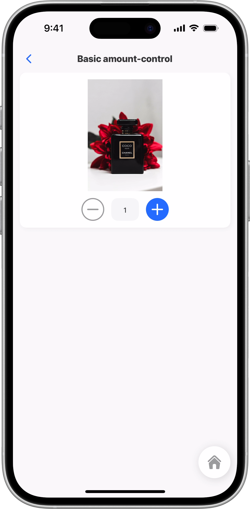
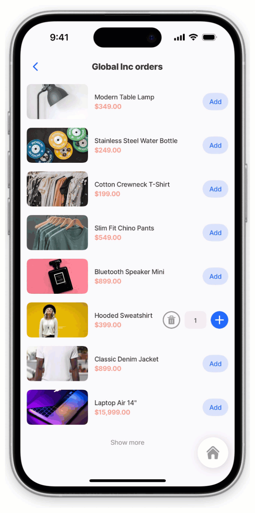

# amount-control



The amount-control provides a simple and intuitive way to adjust numeric values using plus and minus buttons. It’s ideal for shopping carts, quantity selectors, and any form where values need to increase or decrease in defined steps. The control supports configurable minimum and maximum values, custom step increments, and can also trigger a change or delete action when the value is changed giving you full flexibility for managing item quantities in your apps.



<figure><figcaption></figcaption></figure>



## Configuration options



<table><thead><tr><th width="153.59765625">Core structure</th><th></th></tr></thead><tbody><tr><td><code>instanceId</code></td><td>The <code>instanceId</code> is a unique identifier assigned to the amount-control component. It allows other parts of the app—such as functions, actions, or conditional logic to reference this specific component. By using the <code>instanceId</code>, you can programmatically control when the amount-control is shown or hidden, update its content dynamically, or trigger interactions tied to that particular instance. This ensures that each amount-control can be distinctly managed, even when multiple amount-controls are present on the same screen.</td></tr><tr><td><code>when</code></td><td>The <code>when</code> property controls the visibility of the component by evaluating a condition. When the condition resolves to <code>true</code>, the component is displayed; when it resolves to <code>false</code>, the component is hidden. This allows you to show or hide the component dynamically based on expressions, data values, or user interactions.</td></tr></tbody></table>

<table><thead><tr><th width="217.0859375">Other options</th><th></th></tr></thead><tbody><tr><td><code>initialValue</code></td><td>Initial value of amount-control, for example, 1.</td></tr><tr><td><code>isManualEditingEnabled</code></td><td>When <code>true</code>, the amount value can be typed with the keyboard (in addition to the +/- steppers). The typed value is clamped to the minimum/maximum. The default is <code>false</code>.</td></tr><tr><td><code>maximum</code></td><td>Limits the maximum number to be selected.</td></tr><tr><td><code>minimum</code></td><td> Limits the minimum number to be selected. Default is 0.</td></tr><tr><td><code>onChange</code></td><td>Configure the action that is triggered when value is changed.</td></tr><tr><td><code>onDelete</code></td><td>When this property is set, the trash symbol is displayed when the value is 1 or (min + 1).</td></tr><tr><td><code>step</code></td><td> Step for increment/decrement, for example, increments in 2 or 5. Default is 1. </td></tr><tr><td><code>style</code></td><td>Enable or disable the amount-control, useful if you have only one amount that can be ordered, and disable the ability to increase or decrease the amount.</td></tr></tbody></table>

<table><thead><tr><th width="209.26953125">State configuration</th><th width="152.046875">Key</th><th>Notes</th></tr></thead><tbody><tr><td>=@ctx.component.state.</td><td>value</td><td>Component state variable that can be used throughout the jig.</td></tr><tr><td>=@ctx.jig.state.</td><td>filter<br>searchText</td><td>Jig-level state that applies to the specific jig (screen) context, with available keys depending on the jig type (e.g., for list jigs: filter, searchText, etc.)</td></tr></tbody></table>

## Considerations

* Amount-control can be used as a standalone component or combined with other components, such as in a [form](../../docs/Components/form/form.md), [section](section.md), or [card](../../docs/Components/card.md).
* `OnDelete` is not configured by default, you must configured to include the delete (trash) icon.&#x20;
* If no `initialValue`  is specified an **Add** button displays, once tapped the amount control increase and decrease options display.

## Examples and code snippets

### Basic standalone amount-control



<figure><figcaption><p>Basic amount-control in a card</p></figcaption></figure>



This example shows a basic amount-control inside a card layout. The `card` contains a centered `image` and an `amount-control` component that lets the user adjust a quantity using plus and minus buttons. The control is configured with an i`nitialValue` of 1, a `minimum` of 0, a `maximum` of 5, and a `step` of 1 for each increment or decrement. This setup is ideal for simple quantity selection, such as choosing how many items to add to a cart.

**Examples:**

See the full example in [GitHub](https://github.com/jigx-com/jigx-samples/blob/main/quickstart/jigx-samples/jigs/jigx-components/amount-control/basic-amount-control.jigx).




```yaml
title: Basic amount-control
type: jig.default

children:
# Card component wraps the image and amount-control components.
  - type: component.card
    options:
      children:
       # Image resized to be contained inthe center of the card. 
        - type: component.image
          options:
            source:
              uri: https://images.unsplash.com/photo-1594035910387-fea47794261f?q=80&w=1287&auto=format&fit=crop&ixlib=rb-4.1.0&ixid=M3wxMjA3fDB8MHxwaG90by1wYWdlfHx8fGVufDB8fHx8fA%3D%3D
            resizeMode: contain
        # Amount- control with increase and decrease options for adjusting quantity    
        - type: component.amount-control
          options:
            # Starting quantity value when the control is first displayed.
            initialValue: 1
            # Minimum allowed value (0 allows reducing quantity to zero)
            minimum: 0
            # Maximum allowed value (limits selection to 5 units)
            maximum: 5
            # Increment/decrement value for each button press.
            step: 1
```


### Amount-control with onChange and OnDelete



In this example the `amount-control` is configured with an `onChange` and `OnDelete` event to record the order in the product-orders database. Each event triggers an `execute-entity` action with the corresponding `method`.&#x20;

**Examples:**

See the full example in [GitHub](https://github.com/jigx-com/jigx-samples/blob/main/quickstart/jigx-samples/jigs/jigx-components/amount-control/amount-control-onchange-ondelete.jigx).


* Tapping the plus or minus button is considered an `onChange` event.&#x20;
* The `onDelete`  event is shown with the trash can icon. &#x20;




<figure><figcaption><p>Amount-control with <br>onChange &#x26; onDelete</p></figcaption></figure>





```yaml
title: Global Inc orders
type: jig.default

children:
  - type: component.list
    instanceId: custom-orders
    options:
      data: =@ctx.datasources.store-items
      maximumItemsToRender: 8
      item:
        type: component.list-item
        options:
          title: =@ctx.current.item.name
          subtitle:
            text: =@ctx.current.item.price
            format:
              numberStyle: currency
              currency: USD
            fontSize: regular
            color: negative
            isBold: true
          # Left side element displays product image.  
          leftElement:
            element: image
            text: =@ctx.current.item.name
            uri: =@ctx.current.item.image_uri
          # Right side element provides quantity control.  
          rightElement:
            element: amount-control
            initialValue: 0
            minimum: 0
            maximum: 10
            step: 1
            # Handler for when quantity changes, 
            # either plus or minus executes as a onChange.
            onChange:
            # Execute entity action to save order.
              type: action.execute-entity
              options:
                provider: DATA_PROVIDER_DYNAMIC
                entity: default/product-orders
                data:
                  createdDateTime: =$now()
                  customerEmail: =@ctx.user.email
                  customerName: =@ctx.user.displayName
                  # Retrieve existing order ID if present.
                  id: =@ctx.datasources.orders[productId = @ctx.current.item.id].id
                  price: =@ctx.current.item.price
                  product: =@ctx.current.item.name
                  productId: =@ctx.current.item.id
                  quantity: =@ctx.current.state.amount
                  # Calculate total price based on quantity.
                  totalPrice: =@ctx.current.item.price * @ctx.current.state.amount
                # Save method to create or update order.  
                method: save
                # Success callback - show confirmation modal.
                onSuccess:
                  type: action.info-modal
                  # Only show modal when quantity is greater than 0.
                  when: =@ctx.current.state.amount > 0
                  options:
                    modal:
                      buttonText: OK
                      element:
                        color: positive
                        icon: check-circle-1
                        type: icon
                      title: Order Added
            # Handler for deleting an order.
            onDelete:
              type: action.execute-entity
              options:
                provider: DATA_PROVIDER_DYNAMIC
                entity: default/product-orders
                # Pass item ID for deletion.
                data:
                  id: =@ctx.current.item.id
                # Delete method removes the order.  
                method: delete
                # Success callback - show deletion confirmation.
                onSuccess:
                  type: action.info-modal
                  options:
                    modal:
                      buttonText: OK
                      element:
                        color: negative
                        icon: delete-2
                        type: icon
                      title: Order Deleted
```



```yaml
datasources:
  store-items:
    type: datasource.sqlite
    options:
      provider: DATA_PROVIDER_DYNAMIC
      entities:
        - default/marketplace
      query: |
        SELECT
        id,
        '$.category',
        '$.image_uri',
        '$.name',
        '$.price',
        '$.quantity',
        '$.tag',
        '$.discount'
        FROM [default/marketplace]
 
  orders:
    type: datasource.sqlite
    options:
      provider: DATA_PROVIDER_DYNAMIC
      entities:
        - default/product-orders
      query: |
        SELECT
          id, 
          '$.orderId',
          '$.productId',
          '$.product',
          '$.price',
          '$.totalPrice',
          '$.stock',
          '$.quantity',
          '$.customerName',
          '$.customerEmail',
          '$.createdDateTime'
        FROM [default/product-orders]       
```



### Standalone amount-control



<figure><figcaption><p>Standalone amount-control</p></figcaption></figure>



This example shows a standalone `amount-control` component used to adjust product quantities in an e-commerce interface. It allows you to increase or decrease the selected amount using simple plus and minus controls, making it ideal for shopping cart or product detail screens.

**Examples:**

See the full example in [GitHub](https://github.com/jigx-com/jigx-samples/blob/main/quickstart/jigx-samples/jigs/jigx-components/amount-control/amount-control-standalone.jigx).





```yaml
title: Global Tech Products
type: jig.default

header:
  type: component.jig-header
  options:
    height: small
    children:
      # Background image for the header
      type: component.image
      options:
        source:
          # URL of the technology products header image
          uri: https://images.unsplash.com/photo-1498049794561-7780e7231661?ixlib=rb-1.2.1&ixid=MnwxMjA3fDB8MHxzZWFyY2h8OXx8dGVjaG5vbG9neSUyMHByb2R1Y3RzfGVufDB8fDB8fA%3D%3D&auto=format&fit=crop&w=500&q=60
        # Main title text overlaid on the header image
        title: Product items
        # Subtitle text overlaid on the header image
        subtitle: List with product items

# Datasources configuration
datasources:
  # Product datasource - retrieves product data from SQLite database
  product:
    type: datasource.sqlite
    options:
      provider: DATA_PROVIDER_DYNAMIC
      # Specifies the database entity/table to query
      entities:
        - default/products
      
      # SQL query to retrieve product information
      query: |
        SELECT 
          id,                    
          '$.title',            
          '$.uri',               
          '$.tag',              
          '$.price',             
          '$.discount',         
          '$.quantity',          
          '$.category',          
          '$.productId',         
          '$.deal',              
          '$.precise-detail'     
        FROM [default/products]

children:
  # Product list component displaying all products in a two columns.
  - type: component.list
    # Unique identifier for this list instance (used by bottom sheet).
    instanceId: cartId
    options:
      # Datasource binding - connects to the product datasource.
      data: =@ctx.datasources.product
      # Displays products in a 2-column layout
      numberOfColumns: 2
      # Limits initial render to 8 items for performance optimization.
      maximumItemsToRender: 8
      # Configuration for each product card.
      item:
        # Product item component for displaying product details
        type: component.product-item
        options:
          # Card-style display with shadow and spacing
          type: card
          title: =@ctx.current.item.title
          image:
            uri: =@ctx.current.item.uri
            resizeMode: cover
          discount: =@ctx.current.item.discount
          price:
            value: =@ctx.current.item.price
            format:
              numberStyle: currency
          # Product tags/labels displayed on the card
          tags:
            - text: =@ctx.current.item.tag
              color: primary
            - text: =@ctx.current.item.deal
              color: warning
          
          # Action when product card is tapped
          onPress:
            type: action.go-to
            options:
              # Target jig to navigate to
              linkTo: product-details
              # Data passed to the product details screen
              inputs:
                productId: =@ctx.current.item.productId
                imageUri: =@ctx.current.item.uri
                title: =@ctx.current.item.title
                price: =@ctx.current.item.price
                discount: =@ctx.current.item.discount
                tag: =@ctx.current.item.tag
                precise-detail: =@ctx.current.item.precise-detail 
              # Opens as a modal bottom sheet instead of full page navigation
              isModal: true 
```



```yaml
title: Product details
type: jig.default
header:
  type: component.jig-header
  options:
    # Medium height for header area
    height: medium
    children:
      # Background image for the header
      type: component.image
      options:
        source:
          uri: https://builder.jigx.com/assets/images/header.jpg

# Input parameters passed to this jig from the calling screen
inputs:
  # Unique product identifier (required)
  productId:
    type: string
    required: true
  # Product image URL
  imageUri:
    type: string
  # Product name/title
  title:
    type: string
  # Product price value
  price:
    type: number
  # Discount amount or percentage
  discount:
    type: number
  # Product tag/label
  tag:
    type: string
  # Detailed product description
  precise-detail:
    type: string

# Main content area displaying product details
children:
  # Card container for the product image
  - type: component.card
    options:
      children:
        - type: component.image
          options:
            source:
              # Product image URL from inputs
              uri: =@ctx.jig.inputs.imageUri
            resizeMode: cover
            # Fixed height for consistent image display
            height: 250
  
  # List item displaying product details and price
  - type: component.list-item
    options:
      title:
        # Product name from inputs
        text: =@ctx.jig.inputs.title
        fontSize: medium
        color: color1
        isSubtle: false
        isBold: true
        numberOfLines: 1
        # Converts title to uppercase
        transform: uppercase
      # Product description configuration
      subtitle:
        text: =@ctx.jig.inputs.precise-detail
        fontSize: regular
        isSubtle: false
        isBold: false
        # Allows up to 4 lines of description text
        numberOfLines: 4   
      # Price display on the right side of the list item
      rightElement:
        element: text
        firstLine:
          text: =@ctx.jig.inputs.price
          # Formatting as currency
          format:
            numberStyle: currency
            currency: USD
          fontSize: regular
          color: negative
  
  # Amount control for selecting quantity
  - type: component.amount-control
    # Unique identifier for this control (referenced by summary)
    instanceId: cart-amount
    options:
      # Starting quantity when screen loads
      initialValue: 1
      # Minimum quantity (0 allows removing item)
      minimum: 0
      # Maximum quantity limit
      maximum: 10
      # Increment/decrement value per button press
      step: 1

# Summary section at the bottom showing cart total
summary:
  children:
    # Summary component displaying cart information
    type: component.summary
    # Unique identifier for the summary component
    instanceId: cartNo
    options:
      # Cart-style layout optimized for shopping display
      layout: cart
      # Gets the current quantity from the amount control
      value: =@ctx.components.cart-amount.state.value
      # Label displayed above the summary value
      title: Items in your cart

```


