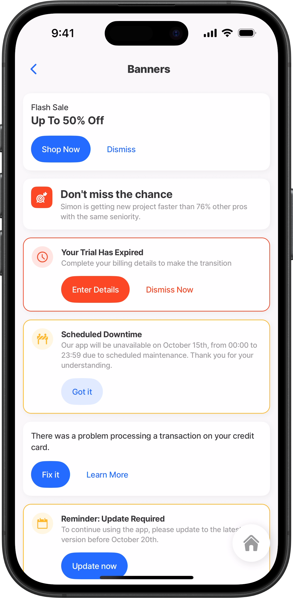
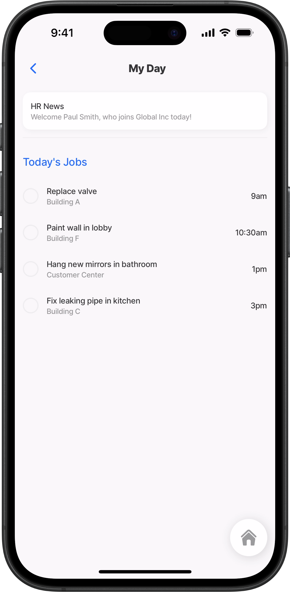
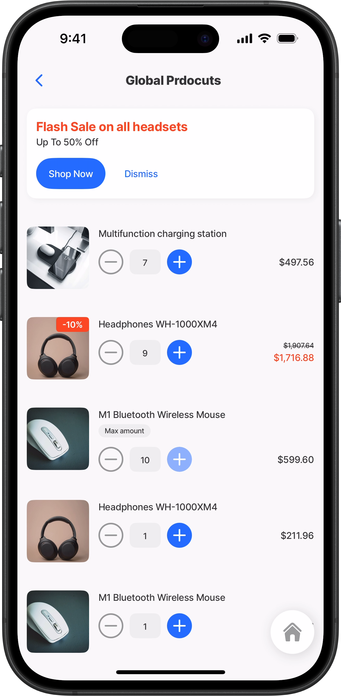
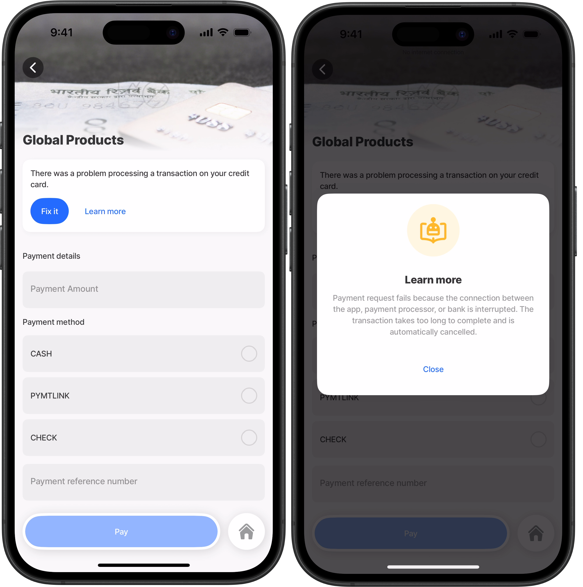
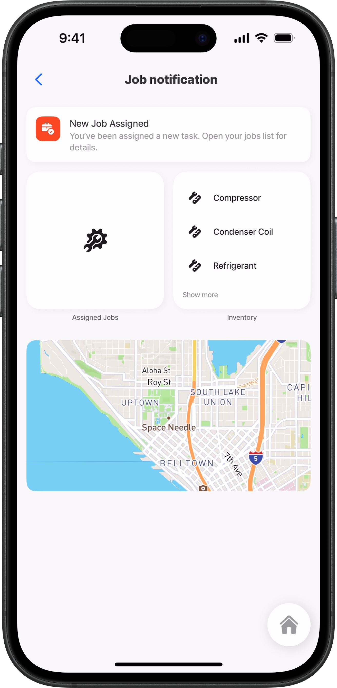
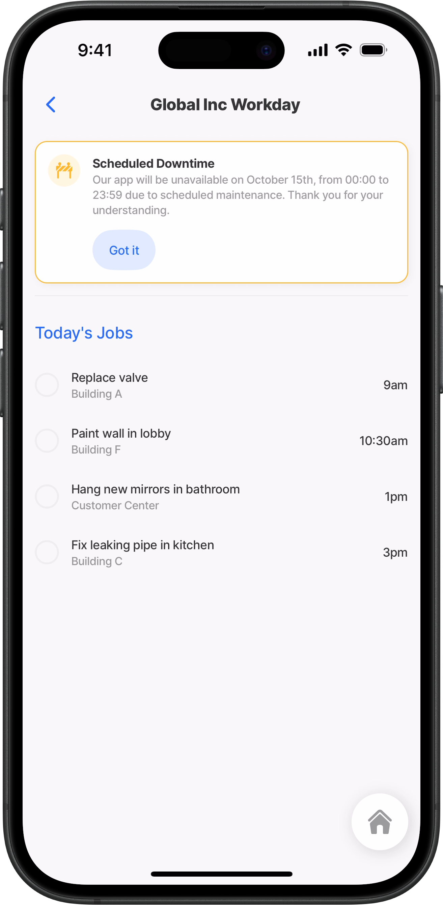
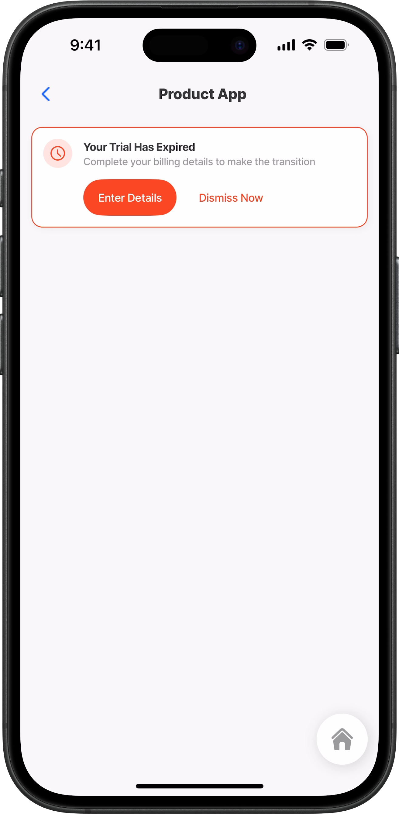

# banner



The **Banner component** provides a flexible way to deliver important messages directly within your mobile app. Designed to support icons, styled text, and action buttons, it can be customized to match your app’s look and feel. Use banners to highlight errors, warnings, or information, as well as to drive user action with clear calls to action. Whether alerting field workers to an issue, sharing status updates, or prompting the next step, banners ensure critical information is visible, actionable, and consistent with your design requirements.



<figure><figcaption><p>Banners</p></figcaption></figure>



## Configuration options

<table><thead><tr><th width="134.5390625">Core structure</th><th></th></tr></thead><tbody><tr><td><code>instanceId</code></td><td>The <code>instanceId</code> is a unique identifier assigned to the banner component. It allows other parts of the app—such as functions, actions, or conditional logic—to reference this specific banner. By using the <code>instanceId</code>, you can programmatically control when the banner is shown or hidden, update its content dynamically, or trigger interactions tied to that particular instance. This ensures that each banner can be distinctly managed, even when multiple banners are present on the same screen.</td></tr><tr><td><code>title</code></td><td>The <code>title</code> property defines the main text displayed in the banner. It supports multiple configuration options; you can provide a static string, bind it dynamically using an expression, or extend it with <code>line options</code> for advanced styling. With <code>line options</code>, you can control text appearance using properties such as <code>fontSize</code>, <code>isbold</code>, and <code>color</code>, as well as specify the <code>numberOfLines</code> to display. </td></tr><tr><td><code>when</code></td><td>The <code>when</code> property controls the visibility of a component by evaluating a condition. When the condition resolves to <code>true</code>, the component is displayed; when it resolves to <code>false</code>, the component is hidden. This allows you to show or hide any component dynamically based on expressions, data values, or user interactions.</td></tr></tbody></table>

<table><thead><tr><th width="141.02734375">Other options</th><th></th></tr></thead><tbody><tr><td><code>leftElement</code></td><td>The <code>leftElement</code> property lets you add an icon to the left side of the banner, providing a visual cue that reinforces the banner’s purpose—for example, signaling an error, warning, or informational message. The icon can be fully customized using styling options such as <code>type</code> (duotone, contained, or basic), <code>shape</code> (rounded, circle, or basic), and <code>color</code> to align with your app’s design. Additionally, you can make the icon interactive by configuring an <code>onPress</code> property to trigger an action when the icon is tapped.</td></tr><tr><td><code>style</code></td><td><p>The <code>styling</code> property defines the visual appearance of the banner based on the type and importance of the message. It provides preset styling options:</p><p><code>isPositive</code></p><p><code>isNegative</code></p><p><code>isWarning</code> </p><p>This helps communicate success, errors, or caution at a glance. By applying the appropriate style, you can ensure that users immediately recognize the context and urgency of the message being displayed. The selected style is applied to the banner's border, action buttons, and icon.</p></td></tr><tr><td><code>subtitle</code></td><td>The <code>subtitle</code> property defines the secondary text displayed beneath the banner’s title. It offers flexible configuration options; you can provide a static string, bind the value dynamically with an expression, or enhance it using <code>line options</code> for advanced styling. With <code>line options</code>, you can customize the text’s appearance using properties such as <code>fontSize</code>, <code>isBold</code>, and <code>color</code>, and control layout by specifying <code>numberOfLines</code>. </td></tr></tbody></table>

<table><thead><tr><th width="141.875">Actions</th><th></th></tr></thead><tbody><tr><td><code>actions</code></td><td>The <code>action</code> property defines what happens when the banner’s action button is tapped. You can configure it to trigger any supported app action—such as navigating to another screen, opening a URL, or updating data. Use IntelliSense to explore the full list of available actions.  </td></tr></tbody></table>

<table><thead><tr><th width="190.0078125">State configuration</th><th width="152.046875">Key</th><th>Notes</th></tr></thead><tbody><tr><td>=@ctx.solution.state.</td><td>status</td><td>Global state variable that can be used throughout the solution.</td></tr><tr><td>=@ctx.jig.state.</td><td>activeItem<br>filter<br>searchText</td><td>Jig-level state that applies to the specific jig (screen) context, with available keys depending on the jig type (e.g., for list jigs: activeItem, filter, searchText, etc.)</td></tr></tbody></table>

## Considerations

* The Banner component can be combined with other components (such as `section`) and actions (such as `showAlert`) to build a centralized place for highlighting news, updates, or errors.

## Examples and code snippets

### Basic banner



<figure><figcaption><p>Basic banner with title</p></figcaption></figure>



This example demonstrates the simplest use of the banner component, using only the core properties—`title` and `subtitle`, to display an HR message at the top of the screen welcoming a new staff member.





```yaml
title: My Day
type: jig.default

children:
  # Add a basic banner with title and subtitle
  - type: component.banner
    options:
      title: HR News
      subtitle: Welcome Paul Smith, who joins Global Inc today!
  - type: component.divider
  - type: component.section
    options:
      title:
        text: Today's Jobs
        fontSize: medium
        color: primary
      children:
        - type: component.list
          options:
            data: =@ctx.datasources.today
            maximumItemsToRender: 8
            item:
              type: component.list-item
              options:
                title: =@ctx.current.item.job
                subtitle: =@ctx.current.item.location
                rightElement:
                  element: value
                  text: =@ctx.current.item.time
                leftElement:
                  element: checkbox
                  value: false
```



```yaml
datasources:
  today:
    type: datasource.static
    options:
      data:
        - id: 1
          job: Replace valve
          time: 9am
          location: Building A
 
        - id: 2
          job: Paint wall in lobby
          time: 10:30am
          location: Building F

        - id: 3
          job: Hang new mirrors in bathroom
          time: 1pm
          location: Customer Center

        - id: 4
          job: Fix leaking pipe in kitchen
          time: 3pm
          location: Building C
```



### Banner with title and subtitle styling



<figure><figcaption><p>Banner text styled</p></figcaption></figure>



In this example, the banner’s title and subtitle are customized by adjusting the `fontSize`, applying `color`, and enabling `isBold` styling.&#x20;





```yaml
title: Global Prdocuts
type: jig.default

children:
  # Banner with actions and text styling.
  - type: component.banner
    options:
      title:
        # Style the title text by adding color, size and boldness.
        text: Flash Sale on all headsets
        fontSize: medium
        color: negative
        isBold: true
      # Style the subtitle text by adding size. 
      subtitle:
        text: Up To 50% Off
        fontSize: regular
        isSubtle: false
      # Configure the actions to display on the banner.  
      actions:
        - type: action.go-back
          options:
            title: Shop Now
        - type: action.go-back
          options:
            title: Dismiss
  # Product list with amount control.
  - type: component.list
    options:
      data: =@ctx.datasources.product
      maximumItemsToRender: 8
      item:
        type: component.product-item
        options:
          tag: =@ctx.current.state.amount =10 ? 'max amount':''
          title: =@ctx.current.item.title
          image:
            uri: =@ctx.current.item.uri
          discount: =@ctx.current.item.discount
          price:
            value: =@ctx.component.state.amount = 0 ? @ctx.current.item.price :(@ctx.component.state.amount * $number(@ctx.current.item.price))
            format:
              numberStyle: currency
          amountControl:
            initialValue: =$number(@ctx.current.item.quantity)
            maximum: 10
            onChange:
              type: action.execute-entity
              options:
                provider: DATA_PROVIDER_DYNAMIC
                entity: default/products
                method: update
                data:
                  id: =@ctx.current.item.id
                  quantity: =@ctx.current.state.amount

```



```yaml
datasources:
  product:
    type: datasource.sqlite
    options:
      provider: DATA_PROVIDER_DYNAMIC
      entities:
        - default/products
      query: |
        SELECT 
          id, 
          '$.title', 
          '$.uri',
          '$.tag', 
          '$.price',
          '$.discount', 
          '$.quantity',
          '$.category',
          '$.productId'
        FROM [default/products]
```



### Banner with actions



This example shows a banner using a `title` and `actions` to notify the user of a failed payment.



<figure><figcaption><p>Basic banner</p></figcaption></figure>





```yaml
title: Global Products
type: jig.default
header:
  type: component.jig-header
  options:
    height: small
    children:
      type: component.image
      options:
        source:
          uri: https://cdn.pixabay.com/photo/2019/09/27/17/23/payment-4509004_1280.jpg

children:
  # Basic banner with actions
  - type: component.banner
    options:
      # Title displays at the top of the banner.
      title:
        text: There was a problem processing a transaction on your credit card.
      actions:
        # Configure the required actions you want to appear on the banner
        - type: action.go-back
          options:
            title: Fix it
        - type: action.info-modal
          options:
            title: Learn more
            modal:
              title: Learn more
              buttonText: Close
              description: Payment request fails because the connection between the app, payment processor, or bank is interrupted. The transaction takes too long to complete and is automatically cancelled.
              element:
                type: icon
                icon: e-learning-ai-teacher-3
                color: warning
  - type: component.form
    instanceId: payment-form
    options:
      isDiscardChangesAlertEnabled: false
      children:
        - type: component.section
          options:
            title: Payment details
            children:
              - type: component.text-field
                instanceId: pay-amount
                options:
                  label: Payment Amount
              - type: component.choice-field
                instanceId: pay-method
                options:
                  label: Payment method
                  data: =@ctx.datasources.payment
                  item:
                    type: component.choice-field-item
                    options:
                      title: =@ctx.current.item.method
                      value: =@ctx.current.item.description
              - type: component.number-field
                instanceId: pay-reference
                options:
                  label: Payment reference number
actions:
  - numberOfVisibleActions: 1
    children:
      - type: action.submit-form
        options:
          formId: payment-form
          provider: DATA_PROVIDER_LOCAL
          title: Pay
          entity: payments
          method: create

```



```yaml
datasources:
  payment:
    type: datasource.static
    options:
      data:
        - id: 1
          method: CASH
          description: Cash Payment
        - id: 2
          method: PYMTLINK
          description: Payment Link
        - id: 3
          method: CHECK
          description: Check Payment
```



### Banner with icon



<figure><figcaption><p>Banner with icon</p></figcaption></figure>



In this example, a banner notifies you that new jobs have been assigned to you. It displays a colored `icon` and uses a contained `style` with rounded corners.





```yaml
title: Job notification
type: jig.default

children:
  - type: component.banner
    options:
      title: New Job Assigned
      subtitle: "You’ve been assigned a new task. Open your jobs list for details."
      leftElement:
        element: icon
        icon: job-responsibility-bag-check
        color: negative
        type: contained
        shape: rounded
  - type: component.grid
    options:
      children:
        - type: component.grid-item
          options:
            size: "2x2"
            children:
              type: component.jig-widget
              options:
                jigId: banner-jobs-assign
                title: Assigned Jobs
                icon: maintenance-wrench

        - type: component.grid-item
          options:
            size: "2x2"
            children:
              type: component.jig-widget
              options:
                jigId: inventory
                title: Inventory
                icon: list
  - type: component.location
    options:
      viewPoint:
        address: 400 Broad St, Seattle, WA 98109, USA
        centerPosition: middle
        zoomLevel: 12

```



```yaml
title: Inventory
description: Select the parts required for the job
type: jig.list

datasources:
  inventory:
    type: datasource.static
    options:
      data:
        - id: 1
          item: Compressor
        - id: 2
          item: Condenser Coil
        - id: 3
          item: Refrigerant
        - id: 4
          item: Expansion Valve
        - id: 5
          item: Fan Motor

data: =@ctx.datasources.inventory
item:
  type: component.list-item
  options:
    title: =@ctx.current.item.item
    leftElement:
      element: icon
      icon: tool-organizer-1
```



```yaml
title: Job Assignments
type: jig.default

header:
  type: component.jig-header
  options:
    height: medium
    children:
      type: component.image
      options:
        source:
          uri: https://unsplash.com/photos/man-in-black-jacket-and-yellow-hard-hat-standing-on-top-of-building-during-daytime-umD2Bj4FmMU

children:
  - type: component.section
    options:
      title: Job Assignments
      children:
        - type: component.list
          options:
            data: =@ctx.datasources.task-list
            maximumItemsToRender: 8
            item:
              type: component.list-item
              options:
                title: =@ctx.current.item.name
                subtitle: =@ctx.current.item.task-number
```



### Banner with styling, icon and an action



This example shows a maintenance announcement banner placed at the top of the Global Inc Workday screen. The banner clearly informs frontline users about scheduled downtime. It is styled with a warning border to enhance visibility and includes an action button that engages the user by allowing them to acknowledge the message.



<figure><figcaption><p>Styled banner with icon</p></figcaption></figure>





```yaml
title: Global Inc Workday
type: jig.default

children:
  - type: component.banner
    options:
      # Select the line options in intelliscene to style the title text.
      title:
        text: Scheduled Downtime
        fontSize: regular
        isBold: true
      # Add default text to the subtitle. 
      subtitle:
        text: Our app will be unavailable on October 15th, from 00:00 to 23:59 due to scheduled maintenance. Thank you for your understanding.
      # Add an icon to the left element that is customized with color,
      # shape and type.
      leftElement:
        element: icon
        icon: construction-sign-building
        type: duotone
        shape: circle
        color: warning
      # Add one action to go back to the previous screen, styled as a 
      # secondary button.  
      actions:
        - type: action.go-back
          options:
            title: Got it
            style:
              isSecondary: true
      # Add a colored border around the banner.        
      style:
        isWarning: true
  - type: component.divider
  - type: component.section
    options:
      title:
        text: Today's Jobs
        fontSize: medium
        color: primary
      children:
        - type: component.list
          options:
            data: =@ctx.datasources.today
            maximumItemsToRender: 8
            item:
              type: component.list-item
              options:
                title: =@ctx.current.item.job
                subtitle: =@ctx.current.item.location
                rightElement:
                  element: value
                  text: =@ctx.current.item.time
                leftElement:
                  element: checkbox
                  value: false

```



<pre class="language-yaml"><code class="lang-yaml"><strong>datasources:
</strong>  today:
    type: datasource.static
    options:
      data:
        - id: 1
          job: Replace valve
          time: 9am
          location: Building A

        - id: 2
          job: Paint wall in lobby
          time: 10:30am
          location: Building F

        - id: 3
          job: Hang new mirrors in bathroom
          time: 1pm
          location: Customer Center

        - id: 4
          job: Fix leaking pipe in kitchen
          time: 3pm
          location: Building C
</code></pre>



### Banner with styling



This example demonstrates a banner styled to grab the user’s attention, with an action button designed to encourage engagement.



<figure><figcaption><p>Banner with styling</p></figcaption></figure>




```yaml
title: Product App
type: jig.default

children:
  - type: component.banner
    options:
      title:
        text: Your Trial Has Expired
        fontSize: regular
        isBold: true
      subtitle:
        text: Complete your billing details to make the transition
      leftElement:
        element: icon
        icon: time-clock-circle-alternate
        type: duotone
        shape: circle
        color: negative
      actions:
        - type: action.go-back
          options:
            title: Enter Details
        - type: action.go-back
          options:
            title: Dismiss Now
      style:
        isNegative: true

```

